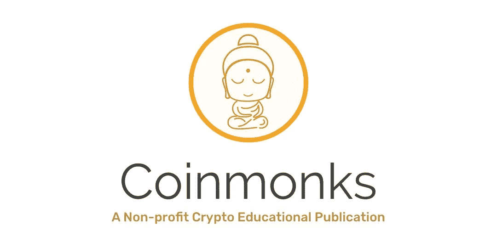

# k 与 Coq 作为语言验证框架(第 3 部分，共 3 部分)

> 原文：<https://medium.com/coinmonks/k-vs-coq-as-language-verification-frameworks-part-3-of-3-ea12e26be516?source=collection_archive---------6----------------------->

## 作者:穆萨布·阿尔图基和布兰登·摩尔

这是“作为语言验证框架的 K 与 Coq”系列文章的第三部分，也是最后一部分。在说明了如何定义语言的语法结构([第 1 部分](/@rv_inc/k-vs-coq-as-language-verification-frameworks-part-1-of-3-19ff603b4e91))以及如何在 K 和 Coq 中定义和测试其语义([第 2 部分](/@rv_inc/k-vs-coq-as-language-verification-frameworks-part-2-of-3-a98ce2592f65))之后，我们现在描述如何实现验证工作流中的第三步，即指定和验证正确性属性。我们使用相同的工作示例 SUM，并假设在前面的部分中描述了 IMP 和 SUM 的所有语言定义。

回想一下，我们想要验证的正确性属性是程序 SUM 确实计算了从 1 到 n 的值的总和，其中 n 是一个非负整数。为了便于参考，我们在此再次显示了计划总和:

*Our working example program SUM*

# 指定 SUM 的正确性

在验证属性之前，我们首先需要精确地指定属性声明的内容。

# K 中的属性规格

关于用 K 语言定义的程序的正确性属性可以被指定为形式为`p /\ c => p`的[可达性逻辑](http://fsl.cs.illinois.edu/index.php/Reachability_Logic_-_Supporting_Material)中的可达性规则，其中[中的`p`和`p'`模式匹配逻辑](http://www.matching-logic.org/index.php/Matching_Logic)和`c`作为附带条件。直观地说，断言陈述了满足`c`的`p`(一种配置)的实例沿着执行的某条路径(对于单路可达性)或所有路径(对于全路可达性)到达`p'`的实例(更精确的定义见[本文](http://fsl.cs.illinois.edu/index.php/Matching_mu-Logic))。请注意，相同的 K 构造，即 K 规则，统一用于定义语言语义和陈述可达性属性。

由于 IMP 是一种确定性语言(即任何 IMP 程序只能有一种可能的执行)，因此单向和全向可达性是一致的。

特别地，当指定`SUM`的正确性属性作为可达性规则`p /\ c => p`时:

*   `p`是指定`SUM`的初始配置的模式，其中`<k/>`单元具有要执行的整个程序总和，而`<state/>`单元为空。
*   `p'`是一种指定最终配置的模式，其中`<k/>`单元格为空(程序完成其执行)，而`<state/>`单元格将`n`映射为 0，将`sum`映射为值`(n + 1) n / 2`(即`sum`具有预期值)。
*   `c`是`n`初始值非负的条件。

在 K 中，使用 IMP 的 K 模型中定义的相同语法定义和语义结构来指定可达性规则。指定正确性属性的规则如下所示(`requires`子句指定了附带条件):

*The correctness property of SUM in K*

请注意，该规范是符号化的:程序变量`n`被赋予一个符号整数值`N`，它被规则约束为非负。该规则规定，当程序终止时(单元格是空计算)，状态将`sum`映射到根据变量`n`的初始值`N`给出的符号表达式的值。

虽然上面的规则定义了 K 中 SUM 的主要正确性属性，但是关于语言和/或程序的其他更具体的属性也可能需要被定义和证明为引理，然后才能开发主要属性的完整证明(这在演绎验证方法中是典型的)。

例如，对于 SUM，还需要指定(并证明)一个*循环不变量*，它指定 while 循环如何在循环的每次迭代中更新程序变量。我们将在下一节中进一步阐述验证过程，但是这里要记住的一点是，所有属性都被指定为 K 规则，在结构上类似于上面的规则。

# Coq 中的属性规格

为了对 Coq 中的 IMP 程序执行进行推理，我们首先需要将我们想要验证的属性的语句形式化为可达性属性。遵循通过联合归纳进行[程序验证的独立于语言的方法，我们将 IMP 程序属性定义为对形式为`(Pgm * Env)`的程序状态的可达性声明。特别地，使用这里定义为](https://link.springer.com/chapter/10.1007/978-3-319-89884-1_21)[的共归纳证明机制](https://github.com/runtimeverification/k-vs-coq-language-frameworks/blob/master/coq/proof_system.v)，可以将`SUM`的主要正确性属性定义为以下归纳命题(回想一下，引用的字符串`"n"`和`"sum"`是程序变量，而`n`是表示符号值的通用量化逻辑名称):

*The correctness property of SUM in Coq*

`Spec`是(独立于语言的)程序规范(可达性声明)的一般类型，在这里用 IMP 状态`Spec (Pgm * Env)`进行实例化。该规范规定，对于所有非负值`n`，由程序`SUM`和空环境`[]`组成的初始状态对达到一个状态，该状态将空程序`skip`作为其第一组件，并且在其第二组件中有一个环境，该环境将程序变量`"n"`映射为零，并将`"sum"`映射到表达式`((n + 1) * n)/2)`的值。

正如前面针对 K 所指出的，除了上面的主要正确性属性之外，可能还需要定义其他属性(在这种情况下，SUM 的循环不变量)。在 Coq 中，这些属性通常被指定为程序状态的归纳定义命题，或者在使用这里描述的共归纳程序验证方法的情况下被实例化的`Spec`命题。然而，与 K 中不同，Coq 中的规范更详细，需要指定和证明其他更小的属性，例如，包括环境操纵操作的正确性属性。接下来，我们将进一步阐述验证过程。

# 验证 SUM 的正确性

在语言验证框架中，演绎程序验证需要表明性质 S，如 SUM 的主要正确性性质，在逻辑上遵循给定的语言模型 L(IMP)和程序模型 P(SUM)，以及已经表明在 L 和 P 中成立的其他较小的中间性质

验证过程通常是手动的(因为它通常是不可判定的),并且需要大量的独创性，特别是对于复杂的语言和大型程序。然而，演绎验证的严格性可能是非常有益的，因为它在所有形式验证技术中提供了一些最高级别的保证。

接下来，我们将通过 SUM 示例描述 K 和 Coq 中的验证过程。

# K 中的验证

SUM 程序包括一个 while 循环，它更新程序变量`n`和`sum`。因此，为了能够证明程序的正确性属性，这涉及到变量`n`和`sum`，我们将需要指定并证明适当的循环不变量。我们可以在 K 中这样做，只需添加另一个规则，将循环不变量指定为可达性声明:

*The loop invariant in K*

该规则规定了这样的性质，假设`n`最初被映射到非负整数值`N`并且`sum`被映射到某个整数值`S`，SUM 的 while 循环到达一个配置，在该配置中，循环终止并且状态映射`n`到零，并且`sum`被从 1 到`N`的值的总和递增。

虽然演绎验证是众所周知的手工操作，通常需要相当大的人力，但 K 自动化了可达性逻辑的相当大的片段，这在实践中有助于减少过程中所需的手工操作。当验证一个属性时，K 采用语言的语义规范 L 和程序的规范 P，并将其视为(单向)可达性规则的系统，然后证明(或否定)该系统需要指定正确性属性 s 的可达性规则`p /\ c => p`。生成的 K 证明者使用语义进行符号执行，在内部推理模式，并使用外部 SMT 解算器( [Z3](https://github.com/Z3Prover/z3) )来检查生成的约束的可满足性。

特别是，对于 SUM，假设语言规范在 [imp.k](https://github.com/runtimeverification/k-vs-coq-language-frameworks/blob/master/k/imp.k) 中给出，首先使用`kompile`如下编译规范(更多编译器选项参见 [Makefile](https://github.com/runtimeverification/k-vs-coq-language-frameworks/blob/master/k/Makefile) ):

K 编译器为 IMP 生成 K 语言工具，包括 IMP 的 K 证明器。假设 sum 程序保存在文件 [sum.imp](https://github.com/runtimeverification/k-vs-coq-language-frameworks/blob/master/k/sum/sum100.imp) 中，定义属性(循环不变量和 SUM 正确性属性)的规则保存在文件 [sum-spec.k](https://github.com/runtimeverification/k-vs-coq-language-frameworks/blob/master/k/sum/sum-spec.k) 中，我们可以使用命令调用为 IMP on SUM 和属性生成的 K 证明器:

证明者自动验证循环不变量和 SUM 的正确性，并通过返回`#True`来表明这一点。

在[示例的存储库](https://github.com/runtimeverification/k-vs-coq-language-frameworks/tree/master/k)中，我们提供了一个 Make file 脚本，该脚本自动执行编译规范、运行 SUM 程序和验证其属性的步骤。为了感受一下`kprove`的验证效率，脚本还显示了完成任务所需的时间。在此目录中，运行命令:

运行验证任务(如果需要，在编译规范后)并显示验证属性所用的时间。在 VirtualBox 虚拟机上运行 Ubuntu 18.04.3 LTS 的 2.9GHz 英特尔酷睿 i9 MacBook Pro 上，执行`kprove`的验证任务需要大约 8 秒钟才能完成。

# Coq 中的验证

遵循在此[描述的](http://dx.doi.org/10.1007/978-3-319-89884-1_21)与语言无关的共归纳验证方法，程序被示为通过以下方式满足其规范:(1)使用定义语言语义的步骤关系，在该语言中程序被编写为符号执行引擎，以及(2)对源自语言中递归或迭代构造(例如 IMP 中的循环)的循环行为使用简单的共归纳推理。Coq 中指定的允许可达性逻辑证明策略的机制可以在[示例的知识库](https://github.com/runtimeverification/k-vs-coq-language-frameworks/blob/master/coq/proof_system.v)中找到。

对于上面的 K，要证明 SUM 的正确性性质，首先需要指定并展示循环不变量。为此，我们引入了另一个类型为`sum_spec`的构造函数:

*The loop invariant in Coq*

注意，`get x env`计算出 x 在`env`(如果定义了的话)中映射到的值，而`fst`和`snd`分别返回状态对的第一和第二部分。规范`sum_loop_claim`为 K 例子定义了与上述完全相同的循环不变量。

现在，为了验证 SUM 满足其由`sum_spec`给出的规范，即 SUM 的初始状态以`sum`的正确值发散或终止，我们用定义 IMP 的语义的步骤关系`step_p`来实例化一般的共归纳可靠性定理，并显示以下语句:

*The correctness lemma of SUM in Coq*

`sound`是关于可达性声明的一般命题。这个实例化的证明是基于一个广义共归纳定理，该定理使验证方法机械化，并且在这里[可用](https://github.com/runtimeverification/k-vs-coq-language-frameworks/blob/master/coq/imp.v#L268-L314)。

与 K 相比，在 Coq 中检查 SUM 的正确性属性的可达性声明的过程在同一台机器上花费了相似的时间(大约 8 秒)来完成。在[示例的存储库](https://github.com/runtimeverification/k-vs-coq-language-frameworks/tree/master/coq)中，我们提供了一个 Make 脚本，该脚本支持编译 Coq 规范并对检查证据的过程进行计时，该脚本可以通过以下命令调用:

# 摘要

Coq 和 K 都非常适合作为语言验证框架，我们在 [Runtime Verification](https://runtimeverification.com) 一直定期使用它们来提供我们的正式建模和验证服务。尽管我们的方法在 Coq 中实现了独立于语言的程序验证，并支持自动化，但我们认为 K 更适合于指定语言和验证程序的任务，主要原因如下:

*   k 从一开始就被设计来为语言提供一个定义框架，在这个框架中，一种语言的所有程序分析和验证工具都是直接从它在框架中的形式规范中派生出来的。因此，K 提供了几个 Coq 中没有的特性，它们是专门为形式化和分析语言而定制的，包括:
*   支持使用 BNF 的标准符号以及几个语法和语义注释来定义语言的语法结构，这些注释支持简洁而精确的定义(相对于 Coq 中的归纳式纯语法定义)。
*   支持从 BNF 规范自动生成语言解析器，因此程序的结构是由其文本定义的(与 Coq 中的语法程序编码不同)。
*   支持使用计算结构和延续、嵌套单元配置、模式匹配和配置抽象来定义复杂的操作行为(相对于 Coq 中的低级集合论外延)。
*   k 的规范是可执行的，因此一种语言的语法和语义的规范立即产生了该语言的解释器，用它可以模拟和测试程序。Coq 中的规范通常是不可执行的，尽管某种程度的证明自动化是可以实现的。
*   通过用变量重写模式，语言的规范也可以用作语言的符号执行引擎。结合其他高级技术(如统一、约束求解和共归纳推理)，符号引擎可用于验证可达性逻辑中的可达性声明。

另一方面，Coq 为建模任何数学领域和证明任意复杂的数学定理提供了一个非常通用的框架，但是除了类型理论和归纳结构的基本原则之外，它并不致力于任何特定的建模风格。这显然会产生一个更灵活的系统，但是作为一个语言验证框架，尤其是与 K 相比，当形式化一种语言和验证程序时，这种灵活性可能是很昂贵的(在努力和时间方面)。我们相信 K 作为一个语言验证框架取得了很好的平衡，在这个框架中，语言可以被有效地形式化建模和验证，同时保持高度的通用性和灵活性。值得一提的是，目前正在努力将 K 扩展为一个完全成熟的匹配逻辑的证明助手，它将提供与 Coq 相同的灵活性。

最后，我们注意到 Coq 和 K 都在积极开发中，并且在它们背后有相当大的社区(例如，参见项目的库，用于 Coq 和 Coq 的库)。此外，这个帖子系列中的许多亮点来自正式方法和程序验证的活跃研究领域。

*原载于 2019 年 12 月 12 日*[*https://runtimeverification.com*](https://runtimeverification.com/blog/k-vs-coq-as-language-verification-frameworks-part-3-of-3/)*。*

> [直接在您的收件箱中获得最佳软件交易](https://coincodecap.com/?utm_source=coinmonks)

