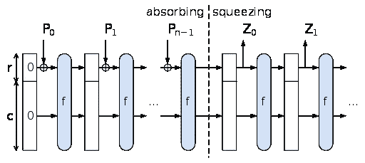

# 凯克函数

> 原文：<https://medium.com/coinmonks/keccak-function-5bbb6981bdce?source=collection_archive---------4----------------------->

SHA 是由 NSA 设计的一系列加密哈希函数，但 SHA-0、SHA-1 容易受到攻击，因此在 2007 年，NIST 宣布了一项确定 SHA-3 的竞赛。Keccak 团队是 2012 年比赛的获胜者。2014 年，NIST 在 keccak 提交中做了一些更改，并发布了 FIPS 202(联邦信息处理标准)，它在 2015 年成为官方的 SHA3。

除了加密哈希函数之外，Keccak 的其他用途还有身份验证、加密和伪随机数生成。以太坊也使用相同的 Keccak 算法，但它的协议使用的是该算法的一个版本。

Keccak 函数基于海绵函数。海绵函数基本上提供了一种概括散列函数的特殊方法。它是一个函数，其输入是可变长度的字符串，输出是基于固定长度排列的可变长度。海绵结构由一些术语组成。

Figure 1: Sponge Construction

这里，

r:rate {写入和读取的状态部分的大小}

b:比特块的宽度{由(5×5×w)计算，其中 w=pow(2，l)。这里我们取 l=6，这使得 b=1600}

c:容量= b-r {输入和输出未触及的状态部分的大小}

d:输出字符串的长度

n:输入字符串的长度

f:置换函数(吸收相)，态转换函数(压缩相)

z:位串(将组合形成长度为 d 的输出串)

z =海绵[f，pad，r](N，d)

s:由 b 位组成的状态，由 r 和 c 组成

## **获得输出的步骤**:

在吸收阶段:

1.  假设输入字符串为 n。使用填充函数填充输入，并将结果表示为 P。我们将输入填充到长度，其中 P 的长度为 n，其中 n = length(P)/r 以整数形式获得结果。

这里，填充函数是 10*1 模式，即类似于 1000…01，其中填充函数的长度可以从 0 到(r-1)变化。

2.现在把 P 分成 n 个连续的部分。将这些字符串表示为 P(0)，P(1)，…，P(N-1)。

3.现在我们将状态 S 初始化为一串 b '0 '位。在这种情况下，它将是 1600 位。

4.现在对于每个 P(i):

I .将 c 个“0”位加到 P(i)上，使 P(i)的最终长度为 b。

二。异或(P(i)，S)。

三。将块置换函数应用于步骤 II。结果是 S(新)。

进入挤压阶段:

5.初始化空字符串 z。

6.而长度(Z)

I .将 S 的前 r 位追加到 z。

二。如果 Z

7.截断 Z 到 d 位。

现在来看看置换块内部发生了什么。这里使用的函数是 SHA3 的 f= Keccak-f[1600]。它使用由 AND、NOT 和 XOR 运算组成的置换。状态是一个 5x5xw 位的数组，其中 w 定义为 w=power(2，l)。这里我们使用 l=6，因此 w=1600。所以，我们用 1600 位作为输入 s 的长度，设*a*[*I*[*j*[*k*]为输入的 bit(5*I*+*j*)×*w*+*k*。这个块置换函数使用 12+2l 轮五个步骤。这五步分别是*θ*(theta)*ρ*(rho)*π*(pi)*χ*(chi)*ι*(iota)。

## **结论**

对原始 Keccak 算法所做的改变包括填充改变，其允许未来的树散列模式以及当前的 SHAKE 输出在给定相同的安全参数和消息输入的情况下生成不同的摘要。

快乐学习:)