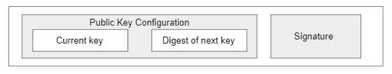

# KERI:关键事件接收基础设施

> 原文：<https://medium.com/coinmonks/keri-key-event-receipt-infrastructure-66776bb37e3a?source=collection_archive---------5----------------------->

## 自我主权认同的无壁架方法

## 介绍

在开始讨论 KERI 之前，我们需要先了解什么是自我主权认同(SSI ),以及它目前是如何实现的。这里有一篇很棒的文章[解释了](https://vishwasbanand.medium.com/in-depth-introduction-to-self-sovereign-identity-ssi-fc8904736f78) SSI。

KERI 为开发自我主权身份解决方案提供了一种无壁架的方法，这包括证明私钥和密钥轮换的所有权，而不依赖于任何分散的分类帐。在下面的部分中，我们将看到这是如何工作的。

无支架方法对于实现 SSI 与多个网络的互操作性这一重要目标非常有用。

这篇文章将是对 keri 的基本介绍，请访问 [keri.one](https://keri.one/) 深入了解 KERI。

## **分散标识符**

分散标识符(DID)用于唯一识别网络中的一方。传统的 SSI 系统利用身份注册表，该身份注册表将一方的 DID 与它们的公钥进行映射，因此可以使用来自注册表的公钥来验证用该方的私钥签名的任何有效载荷，该注册表是使用 DID 获取的，在这方面，注册表有助于验证特定方的私钥的所有权。

大多数 SSI 实现中的身份注册中心存储在分散的分类帐或区块链中，这样就没有任何一方可以篡改注册中心中的数据。

KERI 遵循一种使用自证明标识符的方法，该方法证明只有一个标识符与公钥相关联，而不需要使用分散的分类帐。KERI 通过依赖加密信任而不是区块链的一致算法来做到这一点。

熵用于首先生成由私钥和公钥组成的密钥对。私钥被安全地存储在该方，而公钥对于需要它的任何一方都是可用的。公钥用于导出标识符，这在公钥和标识符之间创建了加密绑定。

但是如果我们想要旋转我们的密钥，并且仍然想要使用相同的标识符，会发生什么呢？KERI 通过利用关键事件来解决这个问题。

## **关键事件**

关键事件是具有报头、配置信息和签名的数据结构。这些事件像哈希链一样链接在一起，这些链作为日志文件维护，注意哈希链是 KERI 与区块链唯一的相似之处，其他特征如共识、排序等。不是 KERI 的一部分。

有两种关键事件

1.  成立事件
2.  非建制事件

**成立事件**

建立事件确定控制机构，即控制标识符的私钥的当前所有者。这些进一步分为

1.  初始事件
2.  旋转事件

**盗梦事件**

一个初始事件是一个建立标识符的事件。一个初始事件的结构可以在下图中看到。

初始事件将由初始密钥(公钥)和签名组成。我们还可以添加一个预旋转步骤，除了初始密钥之外，我们还可以添加下一个密钥的摘要。这将防止攻击者在获得初始私钥的情况下用自己的密钥来旋转密钥。

每个标识符只能有一个初始事件。

**旋转事件**

轮换事件用于改变控制标识符的权威密钥。在标识符的生命周期中可以有多次轮换事件。

轮换事件将由当前密钥、下一个密钥的摘要(用于预轮换)和使用先前私钥的签名组成。

轮换事件将与先前的轮换事件和原始的初始事件形成散列链。

**非设立事件**

非机构事件捕获与其他方的交互。例如，假设您是一个向另一方颁发凭证的颁发者，并且您希望能够在另一方不采取任何进一步行动的情况下撤销这些凭证，那么您可能希望在一个交互事件中捕获有关凭证的信息，该事件将保存有关凭证状态的数据。

当验证器想要验证凭证的状态时，它可以检查您的事件日志文件(在下一节中有关于日志文件的更多信息)中关于凭证的交互事件，并知道它是否被撤销。

## **关键事件日志**

每当发生上述任何一个关键事件时，KERI 都会将一条经过数字签名的消息写入日志文件。日志文件本质上就像一个散列链。

因为每个事件都经过签名，所以它成为一个自我证明的日志。由于标识符是通过加密绑定与初始公钥联系在一起的，并且进一步的密钥轮换是用以前的私钥签名的，因此没有其他方可以伪造该日志文件。

日志文件可以与能够使用它来验证公钥所有权的任何一方共享。成对日志也是可能的，这意味着一方可以使用单独的日志甚至是每一方的单独标识符来与其他方进行交互，从而保护隐私。

验证器不需要每次都处理整个事件日志，因为它是一个散列链。验证器可以将状态保持到上次处理事件链的点，然后在验证新事件时从该状态开始。

下图是一个关键事件日志。

## **见证人**

如果我们希望日志文件是全局一致的(与成对日志的本地一致相反)，我们需要一种方法来确保同一事件日志在不同方之间共享，在这种情况下，我们使用见证。

见证人是网络中维护关键事件日志副本并签名的一方。因为它维护了事件日志的副本，所以网络上的任何一方都可以从见证方访问事件日志，并将其与他们试图验证其身份的一方的事件日志进行比较。如果日志不匹配，则他们不信任该方。

KERI 不要求有见证人，但它增加了额外的证据，证明你在控制你的公钥，没有欺骗。

见证不必是区块链或分布式分类帐，它甚至可以是简单的文件系统或分布式数据库。

KERI 的证人可以允许擦除，并且可以删除关键事件日志，而不会影响安全性。

## 进一步阅读

有很多对 KERI 有用的资源，下面是我用来帮助这篇文章的一些重要链接。

重要参考资料的链接。

 [## KERI 资源- Keri.one

### 编辑描述

keri.one](https://keri.one/keri-resources/) 

简单解释一下。[https://github . com/SmithSamuelM/Papers/blob/master/presentations/KERI _ for _ muggles . pdf](https://github.com/SmithSamuelM/Papers/blob/master/presentations/KERI_for_Muggles.pdf)

详细解释 KERI 的视频。