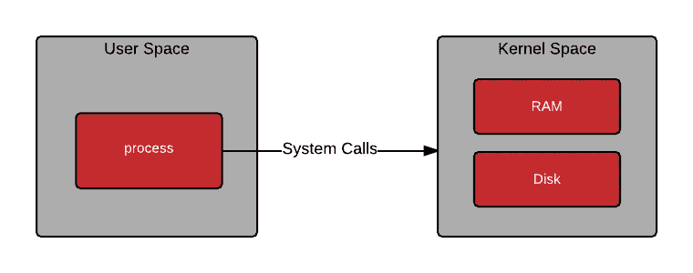

# 如何获取脚本的执行时间

> 原文：<https://medium.com/coinmonks/kernel-space-vs-user-space-how-to-get-the-execution-time-of-a-script-11c56290d8f4?source=collection_archive---------3----------------------->

> **内核空间与用户空间**


**CS Architecture**

几周前，我用 Raspberry Pi 3 model B 和 shell 脚本为一个[门监控器做了一个有趣的项目。我最近在 Pi 上连接了一个摄像头，并更新了脚本，以便在门打开时拍摄一张照片，并作为电子邮件通知的附件发送出去。](/coinmonks/raspberry-pi-3-model-b-shell-scripting-door-monitor-b44944f82d87)

我遇到的一个问题是脚本的执行时间从最初的几秒钟增加到了 17.58 秒。我能够识别并隔离脚本中每一行的执行时间。我开始意识到[***raspi still***](https://www.raspberrypi.org/documentation/usage/camera/raspicam/raspistill.md)命令用了 5。87 秒后执行。这导致完全无法捕捉开门的人的照片。

> **如何减少 raspistill 的执行时间**

终端上的一个简单的 *raspistill* 后跟“ *— help* ”标签提供了有关图像参数命令的更多信息:

```
pi@raspberrypi:~ $ raspistill --help Runs camera for specific time, and take JPG capture at end if requested usage: raspistill [options]  
Image parameter commands 
... -t, --timeout : Time (in ms) before takes picture and shuts down (if not specified, set to 5s)
```

通过在脚本上指定图片拍摄前的时间，我能够将 *raspistill* 的执行时间减少到几毫秒，如下所示:

# 如何有效地获取脚本的执行时间

在这个过程中，我学习了`time`命令，它用于获取另一个命令或脚本执行所需的时间:

```
time yourscript.sh   // get execution for a scripttime ls              // get execution time of ls command
```

其给出了以下结果:


Terminal screenshot of “time ls” command

现在，您可以注意到 time 命令提供了一个真实的用户和系统时间。理解用户空间和内核空间很重要。这些东西中的一个和另一个不一样。Real 是指实际经过的时间；用户和系统仅指进程使用的 CPU 时间*。*

> **真实、用户和系统处理时间统计**

*   **Real** 是挂钟时间——从通话开始到结束的时间。这是所有经过的时间，包括其他进程使用的时间片和进程被阻塞的时间(例如，如果它正在等待 I/O 完成)。
*   **User** 是花费在进程内 ***用户态*** 代码(内核外)*的 CPU 时间量。这只是执行进程所用的实际 CPU 时间。其他进程和进程被阻塞的时间不计入该数字。*
*   **Sys** 是在内核进程中花费的 CPU 时间。这意味着在内核中执行花费在系统调用*上的 CPU 时间，*与库代码相反，库代码仍然运行在用户空间中。像“用户”一样，这只是进程使用的 CPU 时间。下面简单介绍一下 ***内核模式*** (也称为‘supervisor’模式)和系统调用机制。

会告诉你你的进程实际使用了多少 CPU 时间。请注意，这是跨所有 CPU 的，因此如果该进程有多个线程(并且该进程运行在具有多个处理器的计算机上)，它可能会超过`Real`报告的挂钟时间(这通常会发生)。注意，在输出中，这些数字包括所有子进程(及其后代)的`User`和`Sys`时间，以及它们可能被收集的时间，例如被`wait(2)`或`waitpid(2)`收集的时间，尽管底层系统调用分别返回进程及其子进程的统计数据。

> **上报的统计数据来源`**time (1)**`**

**`time`报告的统计数据是从各种系统调用中收集的。**用户**和**系统**来自`[wait (2)](http://docs.oracle.com/cd/E23823_01/html/816-5168/wait-3c.html#scrolltoc)`或`[times (2)](http://linux.die.net/man/2/times)`，视具体系统而定。**实际**是根据从`[gettimeofday (2)](http://dell5.ma.utexas.edu/cgi-bin/man-cgi?gettimeofday+2)`调用中收集的开始和结束时间计算的。根据系统的版本，`time`还可以收集各种其他统计数据，例如上下文切换的次数。**

**在多处理器机器上，多线程进程或派生子进程的进程的运行时间可能小于总 CPU 时间，因为不同的线程或进程可能并行运行。此外，报告的时间统计数据来自不同的来源，因此为非常短的跑步任务记录的时间可能会出现舍入误差，如原始发帖者给出的示例所示。**

# ****内核与用户模式的简要介绍****

**在 Unix 或任何受保护的内存操作系统上，“内核”或“管理程序”模式指的是 CPU 可以运行的特权模式。某些可能影响安全性或稳定性的特权操作只能在 CPU 以这种模式运行时进行。这些操作对应用程序代码不可用。**

****

**这种动作的一个例子可能是操纵 [MMU](http://en.wikipedia.org/wiki/Memory_management_unit) 来获得对另一个进程的地址空间的访问。通常情况下，[用户模式](http://en.wikipedia.org/wiki/User_space)代码不能做到这一点(有充分的理由)，尽管它可以从内核请求[共享内存](http://en.wikipedia.org/wiki/Shared_memory)，其中的*可以被多个进程读取或写入。在这种情况下，共享内存是通过安全机制从内核显式请求的，为了使用它，两个进程都必须显式连接到共享内存。***

****

**特权模式通常被称为'**内核**模式，因为内核是由运行在这种模式下的 CPU 执行的。为了切换到内核模式，您必须发出一个特定的指令(通常称为 [*trap*](http://en.wikipedia.org/wiki/Trap_(computing)) )，该指令将 CPU 切换到内核模式*运行，并从跳转表中保存的特定位置运行代码。***

**出于安全原因，您不能切换到内核模式并执行任意代码——陷阱是通过一个地址表来管理的，除非 CPU 运行在管理模式下，否则不能写入该地址表。你用一个明确的陷阱号进行陷阱，地址在跳转表中查找；内核有有限数量的受控入口点。**

**C 库中的'**系统**'调用(尤其是手册页第 2 节中描述的那些)有一个用户模式组件，这是您实际上从 C 程序中调用的组件。在幕后，他们可能会向内核发出一个或多个系统调用来执行特定的服务，比如 I/O，但他们仍然有代码在*用户模式*下运行。**

**如果需要，也可以从任何*用户空间代码直接向 ***内核模式*** 发出陷阱，尽管您可能需要编写一段汇编语言来为调用正确设置寄存器。这里有一页描述了 Linux 内核提供的系统调用和设置寄存器的约定。***

> *****关于“系统”的更多信息*****

***有些事情你的代码不能在用户模式下完成——比如分配内存或访问硬件(硬盘、网络等)。).这些都在内核的监管下，只有它能做到。你做的一些操作(如`malloc`或`fread` / `fwrite`)会调用这些内核函数，这将算作“系统”时间。可惜并不是“*每次调用 malloc 都会计入'****sys****' time*”这么简单。***

> ***在 C 语言中，库函数 **malloc** 用于在堆上分配一块内存。程序通过一个指针访问这个内存块，这个指针由 malloc 返回。当不再需要内存时，指针被传递给 free，free 释放内存，这样它**可以**用于其他目的。***

***对`malloc`的调用将做一些自己的处理(仍然计入'**用户**时间)，然后在过程中的某个地方调用内核中的函数(计入'**系统**时间)。从内核调用返回后，在'**用户**'中会有更多的时间，然后`malloc`会返回到你的代码中。至于切换发生的时间，以及在内核模式下花费了多少时间...你不能说。这取决于库的实现。此外，其他看似无害的函数也可能在后台使用`malloc`之类的东西，这将再次在“sys”中占用一些时间。***

> ***这篇文章的一些内容是最初在 S [tack Overflow](https://stackoverflow.com/questions/556405/what-do-real-user-and-sys-mean-in-the-output-of-time1/556411#556411) 上发布的答案的组合***
> 
> ***如果你喜欢这篇文章，你可能也会喜欢“ [**如何构建物联网双向应用/用 Python 聊天**](/coinmonks/how-to-built-a-bidirectional-app-for-internet-of-thing-chat-with-python-fc926e605b0f) ”***
> 
> ***请给它几个掌声支持！***

> ***干杯！！！***