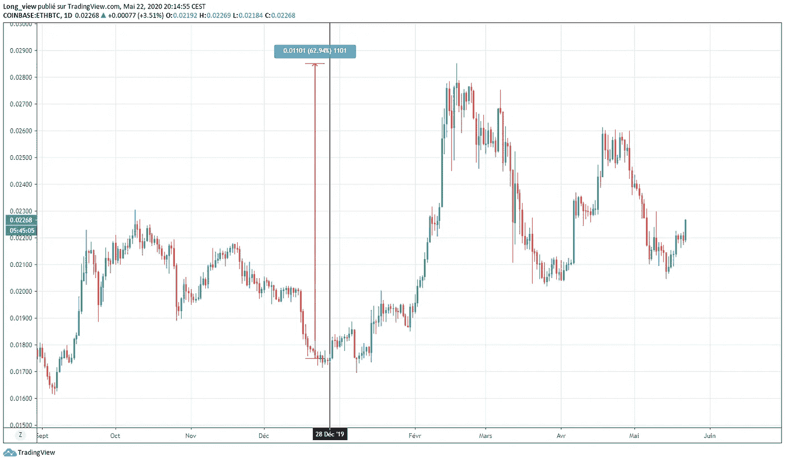

# 开始建立交易系统的关键要素

> 原文：<https://medium.com/coinmonks/key-elements-to-start-building-a-trading-system-37d4d1596ecd?source=collection_archive---------2----------------------->

这篇文章涵盖了我认为成为一个盈利的技术交易者所必需的基本要素。显然，这些是我的想法，我不对任何其他人的行为负责。
此处未给出系统。每个人都必须创造自己。

研究和思考我要说的一切，然后自己做决定。盲目行动是行不通的。应用没有完全理解的东西只能以错误执行告终，因为信心不足以平衡与投资相关的情绪。
尽管第一部分提到了这些，但好的资源是存在的。它们很稀有。

第一步是了解零售交易领域的教育状况。大多数教授的概念是不完整的或错误的。承认这一点以避免常见错误是至关重要的。你可能不赚钱，这有很多原因，教育是首要原因。
一旦这一问题得到解决，我们将投入风险管理，这是盈利的支柱。只有到那时，我们才会探索如何通过技术分析的视角来预测价格的变动。

# **一、教育**

这部分是否定的。这是故意的。零售交易的世界是一个雷区。意识到这一点的人比其他人更相信他们看到的任何东西，通常被称为“傻钱”

关于交易教育，有很多废话。在某些情况下是因为无能，但主要是因为无知的存在是为了被利用。某些实体和个人通过误导那些想学习复杂的交易工作的人来获利。它有两种主要形式:

*   他们“教”如何“交易”,为此需要付费。要求用知识和经验换取报酬没有错。他们送的不是这个。绝大多数的散户都赔钱了。这是一个事实，统计数据不会说谎，而且很容易获得。既然知道了这一点，为什么任何一个头脑正常的人会为了几千美元把一台赚钱机器送给网上的陌生人呢？我甚至没有讨论几百美元的课程……
    **随着时间的推移，一个已经被证明是盈利的系统，很容易从那些有钱但不知道如何让它增长的人那里收集资金**。没有必要出卖经验和泄露秘密。大多数“教育者”不知道如何交易，他们是利用交易炒作的营销人员。他们不需要他们的学生有结果，反正他们已经得到报酬了。至于声誉，如果你在这个领域已经呆了一段时间，你可能已经注意到人们是如何一次又一次地落入同样的陷阱，这些陷阱是由同样的人设置的。识别坏演员非常简单。他们提供了非常简单的概念，只需要简单的复制或者很少的工作。不需要动脑子，简单的复制粘贴。如果一切都这么简单，每个人都会在金融行业工作。
*   **许多经纪人** **与** **教育工作者关系密切，他们会教你一些看似不可利用的策略，实际上却是如此。**这让这些经纪人靠亏损的交易者赚大钱，这些交易者是教育者组建并带来的。他们可以获得精确的市场情绪数据。他们知道大多数交易者对特定模式的反应，因为这是教育者教的。这给了他们不同的赚钱选择。这是一个很长的话题，所以这里就不讨论了。这就是为什么有些教育工作者甚至懒得要钱。也许是小数目。他们已经得到了丰厚的报酬，他们可以戴上好人的面具。谁不喜欢好男人？
    注意:考虑到大多数硬币的流动性，对于加密来说尤其如此。大账户发出的信号是为了带来流动性。没有指名道姓，社交媒体上有一些演员在价格飙升后指向某些硬币，但随后却看到它暴跌。大玩家不能随意出仓。如果他们在市场上抛售，滑点会变得很难。在某些有影响力的人的帮助下，这不再是一个问题。

例:格雷格持有一只价值 500 万美元的股票。目前的价格是 10 美元，这是他出于任何原因想要出售的地方。
以这个价格设定的买单可以忽略不计，接近于零。9 美元的买盘总价值为 250 万美元，8 美元的买盘也是如此。如果 Greg market 卖出，他的一半头寸将在 9 美元崩溃，另一半在 8 美元崩溃，平均退出价格为 8.50 美元。因此，他赚了 4250 万美元，而不是预期的 5000 万美元。
**这就是他们吸引买家(或卖家)的原因。他们需要流动性。他们需要人高买(贪婪)，需要人低卖(恐惧)。**

即使大多数教导都是垃圾，你也不一定会找到完全垃圾的(咳…谐波模式…咳…)，它们只是没有完全教授概念，所以不能始终如一地工作。银行没有等待均线交叉来行动，他们有更深层次的策略，主要依靠基本面分析。教育家们知道，轻松对于人就像阳光对于虫子一样。理解某人为什么做或说某事以避免陷阱并尽可能站在市场的正确一边是至关重要的。尽管这比听起来要困难得多，但还是要放心。

因此，考虑到所涉及的内容，有两种选择。现在就辞职，不要再浪费时间了，这没什么丢人的。
做好努力工作的准备。

# **二。风险管理**

这就是成功交易者的特质。成为世界上最好的分析师不足以获得利润，甚至不能防止账户崩溃。
可能会有长时间的输赢。这就是我们管理风险的原因。我们的目标是随时准备好注入资金，而不是在几笔交易中倾家荡产。

**1)定义可接受的风险**。

风险永远无法消除。接受失败是赢得胜利的唯一途径。零风险意味着零交易或零头寸，如果不平仓，这些交易或头寸是有效的。风险伴随着贪婪和恐惧，这是交易者必须对抗的两股力量。因此，重要的是要确定一个交易账户可以损失多少百分比，而不会严重损害它和激起情绪。一般规则是整个账户的 1%。然而，它应该微调，以符合需求和个性。将交易账户的 10%以上置于风险之中，这不是管理风险，而是培养风险。

定义风险需要三个参数:

*   **胜率:**简单来说就是赢的交易数除以总交易数。要计算它，用总交易量除赢款。将结果乘以 100，以百分比表示。如果没有交易，显然无法计算。
    例子:在 13 笔交易中，有 5 笔是赢家。胜率= 5/13 = 0.3847 或 38.47%胜率。
    胜率越高，可接受的风险越大，反之亦然。
    新手交易者应该进行纸上交易来确定他们的胜率。交易样本越多，胜率越可靠。10 次交易是不够的。

***场景一*** :马克有 1000 美元，胜率很低，只有 10%。他每次交易都把账户的 10%投入风险。结局如何？10 次中有 9 次他输了 100 美元，总共输了 900 美元。马克感到困惑和痛苦。他认为，他退出交易是因为那些肮脏的市场操纵。

***场景二*** :汤姆金额相同，胜率相同。他每笔交易都将账户的 5%置于风险之中。10 次中有 9 次他输了 50 美元，总共输了 450 美元。虽然他的情况远不令人羡慕，但他比马克好多了。他还剩 550 美元，他需要账户余额的 82%的投资回报率才能达到收支平衡。

***场景三*** :凡妮莎金额和胜率相同。她每笔交易都将账户的 1 %置于风险之中。10 次中有 9 次她损失了 10 美元，结果损失了 90 美元。她还剩 910 美元。她只需要赚 10 %的利润就能达到收支平衡。虽然凡妮莎并不出色，但她会轻松战胜马克和汤姆，并最终成为一名成功的零售交易员。

这三个场景展示了可接受风险对交易账户的影响。
当然，没有人会像这三种情况一样输赢可预测。会有变化。概率反映了大量事件的现实，参见大数定律。一枚硬币有两面，所以如果抛硬币，正面和反面的次数应该一样多。如果这样做 10 次，没有什么能保证结果是 5 个正面和 5 个反面。

*   **风险回报比:**决定交易潜在盈利能力的比率。潜在回报除以交易带来的风险。如果能带来 10%利润的交易需要 2%的风险，那么*风险回报比*就是 5。有些人用它来定义目标。这是错误的，因为它意味着价格的未来去向是完全已知的。RRR 的有趣之处在于它与胜率的比较。胜率越高，对 RRR 的要求就越低。

**举例:**胡安有 20% *胜率*。他应该只选择高于 5 RR 的才有利可图。如果他每笔交易下注 100 美元，5 次中有 4 次他输了 100 美元，导致 400 美元的损失。如果他真的赢了，奖金至少是 500 美元。
如果他有 60% *，*的胜率，他会在 5 次 100 美元的赌博中输 2 次，结果是 200 美元的损失。所以只要有一个 2 的 RRR 就能让他在接下来的交易中达到 0.3 左右的盈亏平衡。

综上所述， *RRR* 相对于我们的*胜率*来说，很好的确定一笔交易是否可以接受。

**设置潜力:**欣赏不同的设置需要时间和经验。基本上，价格朝一个方向移动得越多，它持续的机会就越少。它可以有一个爆炸式的运行，一个接一个地粉碎关卡，但这不是规则。
谁低买/高卖，谁就能得到最好的潜在配置。奖励会比后面进来的人高。就像传销一样。
换句话说，**当价格反转时，出现高电位设置(HPS)** 。这是唯一一种在价格没有走出盘整时买入的情况，如果价格还没有走得太远的话。 **当价格已经移出第一或第二*买入区域*(更多细节在第三部分)并且正在*盘整*时，就会出现一个中等潜力形态(MPS)** 。 **当价格已经大幅波动且没有*整固*时，会出现低潜力设置(LPS)** 。

在评估设置时，重要的是要记住*基本面*推动市场。纯价格分析不是一门精确的科学。
正确利用这一概念的方法是根据确定的设置调整可接受的风险。LPS 带来较低的可接受风险，HPS 带来较高的可接受风险。

**例子**:格雷格定义他的可接受风险为 3%。如果他发现了一个 LPS，他会采用 1%来代替。如果是 HPS，他更愿意将自己的可接受风险重新定义为 5%。

***场景 1.1*** :马克带着 1000 美元的账户回来了，他决心这次要跑赢市场。他学到了更多的风险管理知识。他跳入有限合伙人制度，只是他不再拿整个账户的 10%冒险，而是 5%。
所以这次他输了，他只输了 450 美元，而不是最初的 900 美元。好多了。也就是说，他仍然下跌了 45%。

***场景 3.1*** :凡妮莎找到了 HPS。她决定用她整个账户 910 美元中剩余的 5%来冒险。交易成功，她获得 20%的利润，所以 182 美元。她的账户是 1092 美元，尽管她损失了很多，她还是上涨了 9.2%。恭喜你！

结束这一部分。胜率决定了可接受的比率。承认存在不同的设置可以让风险管理更加灵活。

2)位置尺寸。

一旦定义了可接受的风险，就可以计算头寸规模。为了简单起见，这里不考虑胜率。

要知道一笔交易应该投入多少资金，用可接受的风险除以进场和止损之间的距离，用百分比表示，用小数表示。然后将结果乘以账户余额:

**AB** = *账户余额*
**AB%** =用于交易的*账户余额*的百分比。以十进制形式表示(即 10%=0.1)。
**AR** = *可接受风险*
**DSL**= %从*分录*到*止损*的距离，以小数形式表示。

**使用完整账户= (AR/DSL)*AB**

**使用账户的分数=(AR/DSL)* AB %)*(AB * AB %)**

让我们看看不同的场景来说明这是如何工作的:

***场景 1*** :约翰的*止损*是有效的(意思是他的止损很可能是白做的)，比他的*进场价格*低 5%。两个选择:
-他把他的*账户余额的 100%投入到交易中，止损设置为-5%。
-他从自己的*账户余额*中取出一部分，用公式确定自己的*仓位大小*。相当简单。*

***情景二:*** 金的*止损*在距离她的*进场价格*-20%处有效。四倍于她愿意承担的风险。
公式= (0.05/0.2)*1000 = 250 美元。因此，如果她的 250 美元头寸被止损 20%，她就会损失 250–20% = 50 美元，也就是 1000 美元的 5%。

仍然使用相同的*可接受风险*参数，止损点为进场价格的-26%,资金为 125976 美元。
(0.05/0.26)* 125976 = 24226.15 $
如果交易失败导致 26%的损失，整个*账户余额*只损失 5%
24226.15 * 0.26 = 6298.8 $
125976 * 0.05 = 6 298.8‬$

这次使用*账户余额*的 10%,将*可接受风险*设置为 3%,同时将*止损*设置为*进场价格*的-12%。
持仓大小=(0.03/(0.12 * 0.1))*(125976 * 0.1)= 31494 $
如果交易失败导致 12%的损失，整个*账户余额*仅损失 3%:
31494 * 0.12 = 3779.28 $
125976 * 0.03 = 3779

***场景三*** :阿龙的*止损*从*进场价格*起-1%有效。他也有 1000 美元。
自*可接受风险* >距离*进场价格*至*止损*。这就造成了头寸规模大于账户余额的情况。这就是杠杆发挥作用的地方。

(0.05/0.01)*1000 = 5000 美元
5000*0.01=50 美元
1000*0.05=50 美元

请注意，使用相同的公式，但修改*可接受风险*:
(**2**/1)* 1000 = 2000 $
2000 * 0.01 = 20 $
1000 * 0.02 = 20 $
这是一个 2 倍杠杆头寸，而*可接受风险*仅为的 2%

*止损*可以根据需要放置在远处或近处。止损越远，越不容易被拿出来，风险越小，赢的越少，反之亦然。必须记住，接近进场价格的止损往往会被触发。无论如何，风险永远不会超过计划，这一点非常重要。

我建议不要在一笔交易中使用全部的账户余额，除非真的有很大的可能性。分馏的好处不可低估。如果有机会的话，剩下的弹药可以用来做其他交易。没有现金采取行动是不好的，会导致对现有头寸的错误决策。
在相对较短的一段时间内存在不确定性时，也可以通过做空来对冲当前交易。这被称为**市场中性策略**。
例如，如果获利似乎为时过早，但在价格上涨了一段相对较长的时间后，市场结构似乎正在发生变化。这至少适用于中期头寸(超过 2 周)。

# **三世。技术分析。**

TA 概述。我可能会在另一篇文章中更详细地介绍。这里的关键要点是，人人都知道，但只有少数人严格执行:低买高卖。这是作为一名成功的图表分析师所必须知道的全部知识。

*TA* = *技术分析*(分析一个资产的图表的不同工具)。
*FA* = *基本面分析*(是一种评估资产内在价值，分析未来可能影响其价格的因素的方法)。
*PA* = *价格动作* (TA 纯粹基于价格动作)。

*TA* 是一种工具，通过分析图表来预测多种潜在结果以制定交易计划，从而衡量市场。
用于*基本面分析师*其仅用于微调进场和出场。
**对于完全依赖 *TA* 的人，要知道那不是水晶球**，而是没文化的散户的盲文。
*技术面*不影响市场，*基本面*影响市场。那些获得 FA 的人无疑在市场的其余部分有很大的优势。
TA 使用过去的模式或水平来预测未来的价格，而 *FA* 使用现在的数据。几年前出现的泵可能与今天出现的泵没有相同的基本原理。相同的价格模式会导致截然不同的结果。在对你想要交易的资产进行评估时，记住这一点很重要。一个模式本身并不意味着什么。

FA 需要大量的工作、奉献和时间。这就是为什么 TA 在大多数散户中很受欢迎。虽然理解和成功使用 *TA* 也需要同样的因素，但是如果一个人创造了自己的**盈利系统，虽然要求不高，但仍然是值得的。抄袭别人是不行的。**

*PA* 代表我的*技术分析*系统的 95%。我很少使用指示器，当我使用时，我使用它们的方式与通常所教的完全不同。稍后我可能会详述这一点。

为什么 *PA* ？不是什么派生出来的，是真本事。主要重点是尽可能低买，尽可能高卖。如何用指标做到这一点？理论上这似乎是可能的。指标来源于价格，当价格低时，价格也低，或者至少是买入的好时机。对吗？让我们来看一个非常流行的指标，RSI。

Copper chart on the Weekly time frame using RSI

RSI 处于默认设置。
在 50 水平画一条中线。50 岁到 35 岁是可以接受的购买范围，35 岁以下是理想的购买范围。相反，50 到 65 是可接受的销售范围，65 以上是理想的销售范围。这就是 RSI 的基本工作原理，当然还有更多规则，但我们在这里不详细讨论 RSI。
查看(RSI 上的)点 A 和 B，很明显两者都很低。看看它们与图中的哪些部分相关，B 点可以说是低的吗？事实上，这相当高。为了这个例子，让我们比较一下我们是否在完美的底部买了每个点，在完美的顶部卖了。

Point A ROI: 276% — Point B ROI: 33%

差别很大。点 A 的 RSI 比点 B 深得多，因此它可能可以证明 ROI 的差异，但 2016 年的 RSI 低点使这一论点无效。低点几乎和 B 点在同一水平，但一个没有盈利，另一个有更重要的回报。当时，价格在经历了自 2011 年以来的长期下跌趋势后开始巩固。语境不同。当使用一个指标时，很容易找到每一个不同价格反应的原因。然而，如果 X 或 Y 被看到并被考虑在内，不断地寻找借口来证明一个人如何以有利可图的方式使用他最喜欢的指标，这是没有系统的。这是最好的赔钱方式。

我相信指标有优点，但主要是针对算法，这些算法在非常精确的设置下使用许多不同指标的组合，提供独特的信号。换句话说，需要非常非常努力的工作。没有什么能保证基于指标的系统不会在某个时候失效。有很多不确定性。RSI 被用作一个例子，但它适用于所有指标，当只有一件事需要考虑时，它们对价格行为都有自己的解释，那就是价格水平。低还是高？

现在，看一下同样的铜图，但去掉了任何指标。包括体积。

The same reasoning as RSI but applied directly to price.

彩色矩形代表聪明的投资者买入(绿色)和卖出(红色)的区域。
所画的线是范围的中点。既不是支持也不是抵抗。它的唯一目的是确定买卖区域。
为什么这么做？如果 2013 年无论出于什么原因看涨铜，采取长期买入的立场是不可能的，因为这一策略的系统要求没有得到满足。2016 年，这种情况发生了变化。
如果在多年的下跌趋势之后，一个人出于任何原因看跌铜，并想做空它，如果他在 2018 年之前(价格回到中值以上之前)这样做，他将使某人变得更富有。如果他有耐心，某个时候会给出一个不错的入场价。
这不是精确的科学。并不是因为价格进入了其中一个区域，冲进去才是正确的做法。当心自动决策。这只是让熊市或牛市中的任何一种情况更有可能有一个成功的结果。

这适用于所有时间范围。让我们放大到每日的时间框架，看看 2016 年的盘整。

Zone to create range between vertical lines. Edit: The line on the right should have been at last previous high.

这里也有同样的结构。每次价格进入买入区时，都有很好的机会做多(或做空获利)，反之，卖出区有很好的机会做空(或做多获利)。止损/清算很少发生，但必须正确管理风险。全押和/或高杠杆是暴露于恐惧和恐惧背后的滑坡的最佳方式。

因此，了解这一点，从高到低的时间框架细化出场和进场是必不可少的。从 2016 年开始的盘整以大幅反弹回到卖出区域而告终。多个时间框架的组合有助于创建一个短期和长期价格可能走向的路线图。

价格在 2016 年停止了下跌趋势，然后被推高并拒绝到一个看跌盘整的区域(2015 年)，没有再回到低点，以盘整结束。这是最乐观的。如果聪明的投资者预期价格会继续下跌，他们就不会在这次拒绝后买入，价格会继续下跌。除此之外，自那以来，它一直在印刷更高的低点。根本没有迹象表明价格想要下降。
**但更重要的是**，看涨盘整是在长期(因此更相关)买入区域。这意味着如果发生逆转，价格可能会高于 2016 年的范围。去哪里？单独跟 *TA* 就很难说了。基本面推动市场。学习这些基本面的聪明的受过教育的投资者知道在哪里卖出。有了 TA*不可能确切知道。因此，必须谨慎行事，逐级采取价格行动。*

这种方法的目标是坚持现实(价格)和战略。聪明的投资者知道何时买入或卖出，因为他们已经做了充分的研究。他们不只是在图表上画线。我们只知道他们低买高卖。因此，通过这种模式，我们尽可能地坚持他们。
这个概念由你来定制。这只是骨干。

我建议你现在做的是在图表上，应用这个概念，调整它，玩弄管理，看看你如何从中获利。和所有新系统一样，强烈建议进行纸上交易，否则情绪会妨碍交易。

**四。心态**

大多数人不注重心态。大错特错。学习交易和制定游戏计划是重要的步骤，但这还不够。你也需要组织自己。当我们把钱放在桌子上时，你永远不会更像你自己。这既有好的一面，也有不好的一面。在投资方面，情绪尤其强大。有两种力量指导着几乎所有的交易者。恐惧和贪婪。他们唯一的目的就是带我们去撞墙。风险管理和良好的技术分析系统会吸收这些情绪，丝毫不会影响我们。为了让这些工作，需要一个正确的心态。
简单来说，

低买高卖，其他的都不重要。
以尽可能冷酷的方式应用贸易计划。别人怎么想或怎么说并不重要，因为听取他们的意见必然会改变这个计划。学习和适应没有错，但不是在交易过程中。

**没有赌博(快速致富)，只有一致性。** 禁止走马观花。一次损失就能毁掉几个月的辛苦工作。获利时，利润可以相对快速地积累起来。做花哨的交易并不重要。只有一致的结果才重要。

**学习交易。** 既赢又输。总有办法增加利润/减少损失。这是提高创造力的唯一途径，有助于看到别人看不到的东西。
一个系统只有好才能工作。只有经过多次研究和测试，才有可能拥有一个。
为此，记录交易日志至关重要。

甚至天空也不是极限。
看到的或学到的，不要照搬照抄。玩弄它，微调它。去没人去的地方。从众心理在人类中根深蒂固。少数人赢是因为多数人输了。

# **遗言**

最终，你会找到自己的路，也许会成为一名精明的投资者。这就是我和 TA 单独相处成功的原因。我仍然会做糟糕的交易，犯愚蠢的错误，但这不再是规则了。学习永不停止。

以下是这种方法有效性的几个例子:

02/18/2020

The black line (02/18/2020) represents the date of the above tweet. EURUSD made a 6.54% return by the 9th of March.

12/28/2019

The black line (12/28/2019) represents the date of the above tweet. ETHBTC made a 62.94% return by the 18th of February.

不需要更多的扩展，你已经明白了。已经有不少内容了。我可能会在另一篇文章中讨论我如何使用指标以及不同的多空策略。如果您发现有什么不清楚的地方，或者有任何问题或要求，请不要犹豫，通过 twitter 与我联系。

ETH 中的 Tips 高度赞赏:0x 840 a4 c 83 F3 b 61 a 457 f 0 b 04 da 7 a3 EEC 364 ce 868 EB

> [在您的收件箱中直接获得最佳软件交易](https://coincodecap.com/?utm_source=coinmonks)

