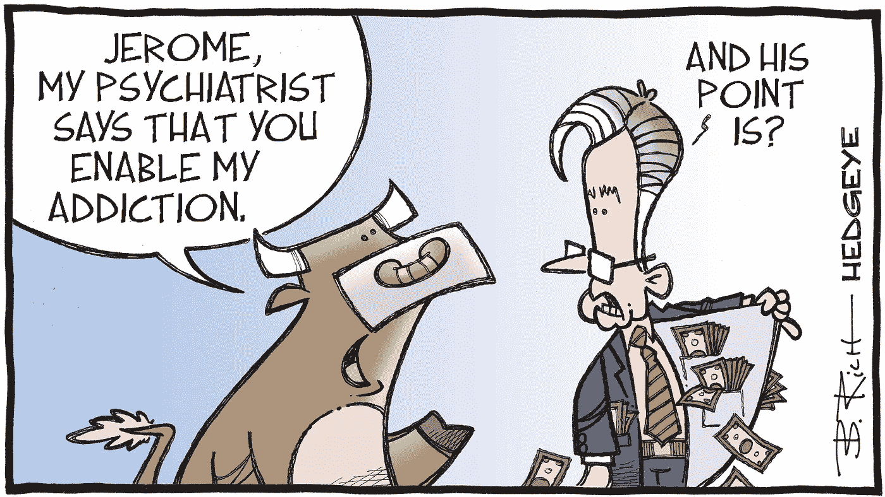
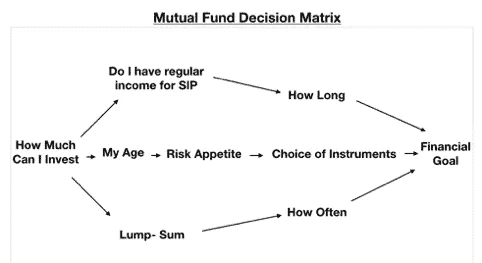

# 像专业人士一样创建自己的共同基金投资组合的关键问题

> 原文：<https://medium.com/coinmonks/key-questions-for-creating-own-mutual-fund-portfolio-like-a-professional-4f0983e3153e?source=collection_archive---------1----------------------->

嘿，伙计们，我确信所有博客的老读者从过去的五个星期以来一直在急切地等待这篇文章……理所当然地，在这么多的辛勤工作之后，如果我们不能将我们的知识实际用于创造财富和获得财务独立，那还有什么意义。在我们着手创建自己的 MF 投资组合之前，先简单回顾一下。到目前为止，在这一系列所谓的共同基金中，我们发现了市场上所有符合 MF 条件的金融产品，这些产品包括**股票**、**债务**、**混合**、**解决方案**和**其他**基金。所有这些基金的根本区别在于投资工具和投资时间。市场上 90%以上的产品投资于股票、债券或这两者的组合。其余少数投资于其他资产类别，如大宗商品、衍生品、ETF 和其他专业管理的基金。然后，我们还看到了各种选择，并讨论了增长与股息、定期与直接、SIP 与一次性付款和 ELSS 的优点。

现在，让我们暂停一下，按某种顺序组织所有这些信息，以决定所有工具、产品和方案中哪一个适合作为原因，以及为什么适合。要做到这一点，我们需要对以下问题有清晰或至少一些提示-

1.  **我为什么投资？它是否与某种目的或未雨绸缪/创造财富的储蓄有关？**这个问题需要提前想好。简而言之，它告诉你，你对投资的期望是什么。例如，如果我想做一套钢铁侠套装，可能要花一亿卢比。如果我每月投资 1000 卢比，每年复利 12%，我什么时候能指望这笔钱足够开始建造我的钢铁侠套装。你投资和期望的理由绝对是独一无二的，比如攒钱买一栋梦想中的房子，为自己或孩子的教育提供资金，或者只是积累足够的财富，以便退休后追寻自己的梦想，追寻自己的人生使命。
2.  **我的投资窗口是什么？**这个问题和上一个问题将回答你是否能够在你设想的时间段内实现你的投资目标。如果没有，这也会告诉你还需要投资多少，以及需要多长时间才能达到目标。对许多人来说，这可能仅仅意味着，如果他们继续投资直到他们的职业生涯结束，他们在职业生涯结束时会有多少钱。
3.  我的年龄和预计就业期限是多少？这与上一个问题有些关联，可能有助于您决定投资窗口。尽管大多数投资 MFs 的人都是有固定工作的已婚人士，但仍有很大一部分人可能尚未开始职业生涯，或者可能已经退休，但仍希望投资自己的储蓄，以实现最佳增长。对于许多初学者来说，这也将有助于决定风险偏好，从而选择投资工具。
4.  **我是有一笔钱可以马上投资，还是会从我每月的储蓄中拿出来投资？**这当然意味着选择一次总付方案或选择 SIP 路线。但是如果我没有固定的收入或储蓄来源呢？不用说，必须进行多次一次性支付，这使得跟踪和预测未来可能的回报变得有点棘手。我在这里的观点是，没有两个人会有相同的财务状况，因此，没有一个解决方案可以适合所有人。

**专业建议**——如果你没有固定的收入来源或者不能保证每个月有一定的收入，不要担心。在每月收入周期结束时，无论你存了多少钱，都要进行投资。请记住**超过 500 卢比或其倍数的任何金额都可以投资于良好的小额信贷**。也可以根据每月的预计储蓄来订阅 SIP，如果您在任何特定月份没有足够的资金，SIP 将仅在该月被拒绝。**任何次数的 SIP 违约都绝对不会受到处罚**。

**5。其他考虑因素，如节税** —对于许多受薪个人，在希望增加投资或为自己、配偶、受抚养子女或父母支付健康保险时，可能需要根据第 80C 或 80D 节进行税务规划。对于这两种需求，ELSS 可能是一个有吸引力的选择，在 80 岁以下，可以获得 15 万卢比的退税，同样，在 80 岁以下，ELSS 相关的健康保险可以寻求 25，000 卢比的退税，对于自己和年迈的父母额外 50，000 卢比。这需要在规划投资和税务规划时加以考虑。

这是基本的五个问题，了解你自己、你的财务目标以及你的风险偏好。让我试着做一个流程图，让它更清晰

我经常看到有人问，他们应该将工资的百分之几用于投资，我总是坚持认为永远不会有单一的解决方案，因为这取决于你的收入和支出。人们也引用复利的概念，因此，人们应该尽早开始，应该投资更多吗？我再次建议，你必须投资，不管你的年龄如何，不管你能做什么，不要给今天增加负担，也不要为明天失眠。正如我的分析所暗示的…… **你今天的收入以及你今天的储蓄潜力肯定会随着时间的推移而增加，在几乎所有情况下**无论你是自雇人士还是有一个众所周知的**nu akri**。因此，有一个更大的机会**无论你现在在一年内存多少钱……你都有可能在未来的一个月内完成**。

我会推荐给大家的是财务纪律和谨慎。如果你必须花钱……但是为什么要过度花钱呢？？？？？？？仅仅因为你的账户里有钱并不意味着它需要被消费。但与此同时，如果有真正的需求，不要为了更富裕的明天而畏缩不前。在我看来，投资最重要的一点是，**如果你有任何不急需的钱，不管多少钱或多长时间，都应该立即投资于适当的工具，让它发挥作用，以赚取更多的钱**。同样，如果你遇到一些财务困难或一些不可预见的费用，不要再想套现你的投资了，因为你还存了些什么。这里最关键的一点是常识，或者在这种情况下是金融常识。如果你的投资只提供 12%到 14%的回报，如果你以 16%到 18%的利率获得个人贷款，你就在赔钱。类似地，我经常遇到拖欠信用卡的人，最终支付高达 35%的罚息……而他们的投资只增长了 14%。因此，无论你有多忙，你都必须考虑所有的选择，最终……根据真实的数字做决定。

我知道…..我知道……你一直在等待创建自己的投资组合，但现在还看不到。但是伙计们，正如我在每个问题下提到的，不同的人会有不同的需求、能力、时间范围和风险偏好。因此，在一周内花些时间现实地分析这些问题，以弄清楚你的投资组合。我打算创建 3 个模型投资组合，基于投资者的年龄，因此，通过各种资产类别投资的时间范围和风险偏好。我将在接下来的几周报道这些模型投资组合……所以请留意它们，在那之前祝你投资愉快。

伙计们，请随意**与你所有的朋友和联系人**分享帖子，如果你喜欢这些内容，请点击左下角的“喜欢”按钮来表达你的赞赏**。如果您最近才加入，也请点击页面右上角的**关注**按钮。**

> 加入 Coinmonks [电报频道](https://t.me/coincodecap)和 [Youtube 频道](https://www.youtube.com/c/coinmonks/videos)了解加密交易和投资

## 另外，阅读

*   [加拿大最好的加密交易机器人](https://blog.coincodecap.com/5-best-crypto-trading-bots-in-canada) | [赌注加密](https://blog.coincodecap.com/staking-crypto)
*   [如何在印度购买比特币？](/coinmonks/buy-bitcoin-in-india-feb50ddfef94) | [瓦济克斯审查](/coinmonks/wazirx-review-5c811b074f5b)
*   [最佳网上赌场](https://blog.coincodecap.com/best-online-casinos) | [硬件钱包](/coinmonks/hardware-wallets-dfa1211730c6)
*   如何在 WazirX 上购买柴犬(SHIB)硬币？
*   [比特币主根](https://blog.coincodecap.com/bitcoin-taproot) | [排名前 6 的比特币信用卡](/coinmonks/bitcoin-credit-card-bc8ab6f377c6)
*   [最佳免费加密信号](https://blog.coincodecap.com/free-crypto-signals) | [YoBit 评论](/coinmonks/yobit-review-175464162c62) | [Bitbns 评论](/coinmonks/bitbns-review-38256a07e161)
*   [有哪些交易信号？](https://blog.coincodecap.com/trading-signal) | [Bitstamp vs 比特币基地](https://blog.coincodecap.com/bitstamp-coinbase) | [买索拉纳](https://blog.coincodecap.com/buy-solana)
*   [ProfitFarmers 点评](https://blog.coincodecap.com/profitfarmers-review) | [如何使用 Cornix 交易机器人](https://blog.coincodecap.com/cornix-trading-bot)
*   [MXC 交易所评论](/coinmonks/mxc-exchange-review-3af0ec1cba8c) | [Pionex vs 币安](https://blog.coincodecap.com/pionex-vs-binance) | [Pionex 套利机器人](https://blog.coincodecap.com/pionex-arbitrage-bot)
*   [我的密码交易经验](/coinmonks/my-experience-with-crypto-copy-trading-d6feb2ce3ac5) | [比特币基地评论](/coinmonks/coinbase-review-6ef4e0f56064)
*   [CoinFLEX 评论](https://blog.coincodecap.com/coinflex-review) | [AEX 交易所评论](https://blog.coincodecap.com/aex-exchange-review) | [UPbit 评论](https://blog.coincodecap.com/upbit-review)
*   [AscendEx 保证金交易](https://blog.coincodecap.com/ascendex-margin-trading) | [Bitfinex 赌注](https://blog.coincodecap.com/bitfinex-staking) | [bitFlyer 点评](https://blog.coincodecap.com/bitflyer-review)
*   [麻雀交换评论](https://blog.coincodecap.com/sparrow-exchange-review) | [纳什交换评论](https://blog.coincodecap.com/nash-exchange-review)
*   [支持卡审核](https://blog.coincodecap.com/uphold-card-review) | [信任钱包 vs 元掩码](https://blog.coincodecap.com/trust-wallet-vs-metamask)