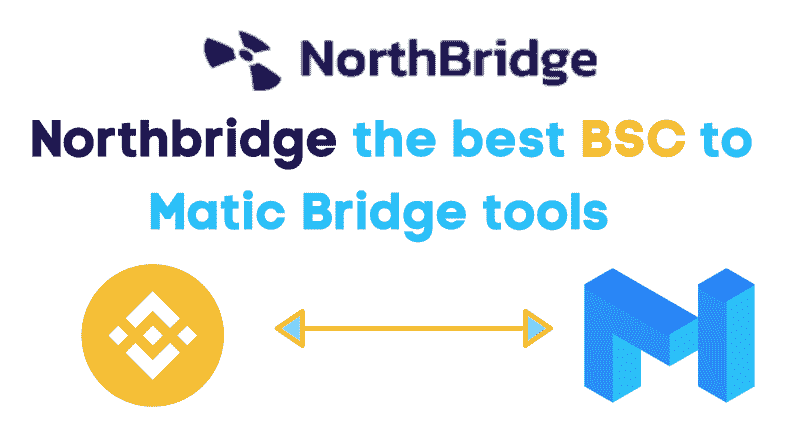
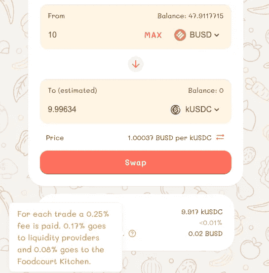
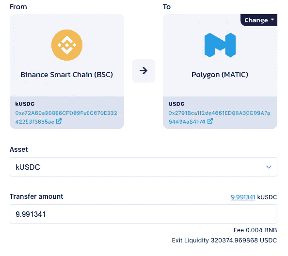
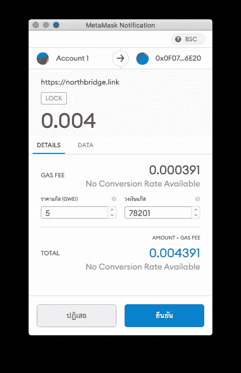
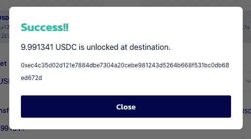
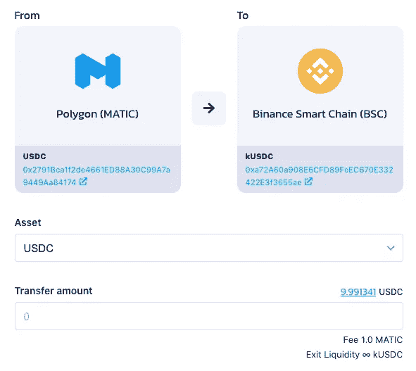
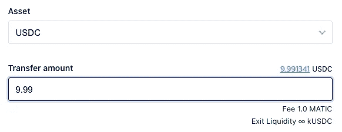
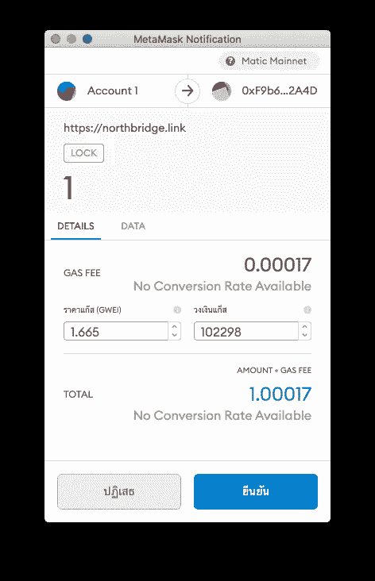
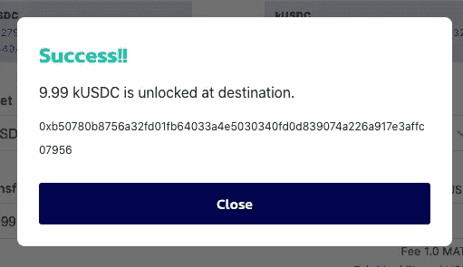
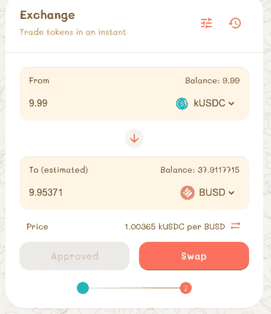

# 最好的 BSC 到多边形(MATIC)桥接工具

> 原文：<https://medium.com/coinmonks/killswitch-northbridge-the-best-bsc-to-polygon-matic-bridge-tools-63c0825f9249?source=collection_archive---------0----------------------->

[NorthBridge](http://northbridge.link/) 是跨链桥接工具，帮助您通过区块链网络发送令牌。它支持币安智能链、多边形(MATIC)和 BITKUB。KillSwitch 团队也是 [SCB10X 黑客马拉松](https://techsauce.co/pr-news/scb-10x-bangkok-blockathon-2021-killswitch)的获胜者。

为什么它是最好的？在其他桥上，你将面临的普遍问题是流动性耗尽。在北桥，他们通过创建一个产量农场来解决这个问题，这样其他农民就可以帮助提供流动性并获得一部分互换费。

在本文中，我们将回顾如何将资金从币安智能链(BSC)转移到多边形网络(USDC)。这个工具目前支持马蒂奇和 USDC 令牌。

# 从 BSC 到多边形的桥梁(USDC)

为了开始将资金从币安智能链转移到 Polygon，我们需要首先在[美食广场](https://exchange.foodcourt.finance/#/swap)将我们的代币交换给 KUSDC。因此，我们需要进入 Foodcourt 平台，如下图所示:

交换完成后，我们需要回到北桥主页。

现在，在北桥平台的主屏幕上，我们需要知道的唯一重要数字是退出流动性。令牌数足以构成一座桥梁，从 BSC 走向 Polygon Matic。这是我们将用于将 kUSDC 移动到 Polygon (USDC)的跨链桥，如下图所示:

在这里，您需要点击**批准**按钮，以便允许北桥使用我们的令牌。这还会将**批准**按钮更改为**转移**按钮，如下图所示:

现在，我们需要单击“Transfer”按钮，这将引导我们进入以下元掩码窗口:

在这里，我们需要点击**‘确认’**按钮支付 BSC 交易费用，以发送 kUSDC 代币。

然后，在等待一段时间后，我们将获得如下截图所示的传输成功屏幕:

# 从多边形(MATIC)到 BSC 的桥

现在，我们的下一步是尝试将令牌从 Polygon (MATIC)桥接到币安智能链。

我们的第一步是将 Metamask 上的桥接网络从 BSC 更改为 Polygon (MATIC ),如下图所示:

每笔交易的交易费为 1 Matic。我们还需要选择 USDC 作为资产。

现在，让我们试着把所有 USDC 人送回 BSC。因此，我们需要输入转账金额 9.99，如下图所示:

接下来，我们需要遵循与之前相同的方法。我们需要像以前一样点击批准和转移。这里，元掩码将向交易添加费用，并显示一个摘要，如下面的对话框截图所示:

和以前一样，我们需要点击确认并等待片刻，直到弹出成功对话框，如下图所示:

因此，令牌将作为 kUSDC 桥接。现在，我们可以换成其他令牌，如 BUSD，如下图所示:

这篇文章旨在提供将 BSC 连接到 Polygon Matic 的分步说明。这些步骤包括在 FoodCourt 平台上将令牌交换为 kUSDC 令牌，然后将 BSC 桥接到 Polygon，以将 kUSDC 令牌传输到 Polygon Matic。然后，还显示了涉及类似过程的反向桥接。

## 警告

当心低流动性问题，但您可以在 [Kururu.finance](http://Kururu.finance) 上订购替代方法

> 加入 Coinmonks [电报频道](https://t.me/coincodecap)和 [Youtube 频道](https://www.youtube.com/c/coinmonks/videos)获取每日[加密新闻](http://coincodecap.com/)

## 另外，阅读

*   [复制交易](/coinmonks/top-10-crypto-copy-trading-platforms-for-beginners-d0c37c7d698c) | [加密税务软件](/coinmonks/crypto-tax-software-ed4b4810e338)
*   [网格交易](https://coincodecap.com/grid-trading) | [加密硬件钱包](/coinmonks/the-best-cryptocurrency-hardware-wallets-of-2020-e28b1c124069)
*   [密码电报信号](http://Top 4 Telegram Channels for Crypto Traders) | [密码交易机器人](/coinmonks/crypto-trading-bot-c2ffce8acb2a)
*   [最佳加密交易所](/coinmonks/crypto-exchange-dd2f9d6f3769) | [最佳加密交易所](/coinmonks/bitcoin-exchange-in-india-7f1fe79715c9)
*   开发人员的最佳加密 API
*   [最佳期货交易信号](https://coincodecap.com/futures-trading-signals) | [流动性交易所评论](https://coincodecap.com/liquid-exchange-review)
*   [用于 Huobi 的加密交易信号](https://coincodecap.com/huobi-crypto-trading-signals) | [Swapzone 审查](/coinmonks/swapzone-review-crypto-exchange-data-aggregator-e0ad78e55ed7)
*   [最佳加密交易机器人](/coinmonks/crypto-trading-bot-c2ffce8acb2a) | [购买索拉纳](https://coincodecap.com/buy-solana) | [矩阵导出评论](https://coincodecap.com/matrixport-review)
*   [Coldcard 评论](https://coincodecap.com/coldcard-review) | [BOXtradEX 评论](https://coincodecap.com/boxtradex-review)|[uni swap 指南](https://coincodecap.com/uniswap)
*   [比特币基地评论](/coinmonks/coinbase-review-6ef4e0f56064) | [德里比特评论](/coinmonks/deribit-review-options-fees-apis-and-testnet-2ca16c4bbdb2) | [FTX 评论](/coinmonks/ftx-crypto-exchange-review-53664ac1198f)
*   [Coinmetro 评论](https://coincodecap.com/coinmetro-review) | [VirgoCX 评论](https://coincodecap.com/virgocx-review)
*   最佳[密码借贷平台](/coinmonks/top-5-crypto-lending-platforms-in-2020-that-you-need-to-know-a1b675cec3fa)
*   [免费加密信号](/coinmonks/free-crypto-signals-48b25e61a8da) |加密交易机器人
*   杠杆代币的终极指南