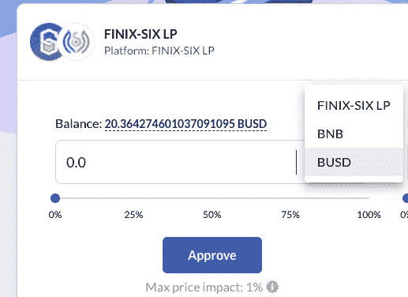
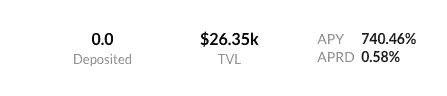
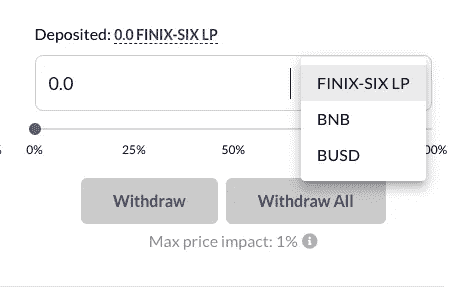
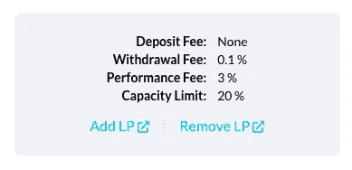
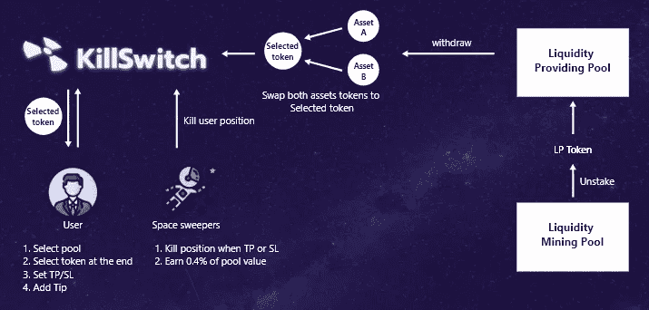

# KillSwitch，高风险收益农民的救星

> 原文：<https://medium.com/coinmonks/killswitch-the-saviour-for-high-risk-yield-farmer-51530190035d?source=collection_archive---------4----------------------->

[KillSwitch](https://app.killswitch.finance/) 是三月份组织的 SCB 10x 黑客马拉松的获胜者。这个项目意向的主要目的是帮助 HRYF(高风险产量农民)快速退出高风险农场。经过 4 个月的不懈开发和压力测试，他们发布了第一个版本。

KillSwitch 是一款智能和复杂的产量农业聚合器，为币安智能链产量农民提供高度的安全性和便利性。

突出显示功能是一键功能。只需点击一下，用户就可以取消持股，从他们的基金中提取流动性头寸，并立即出售他们的高风险硬币。

在本帖中，我们将探索 KillSwitch 第一个版本中最突出的特性。

# 一键赌注

时间是世界上最宝贵的东西。KillSwitch 仅使用您的 BNB 或 BUSD 来转换为 LP 令牌并立即启动服务器场，有助于节省时间。为了更清楚地说明这一点，下面的截图显示了该平台只需点击一下就能提供的内容:

# 自动复合

KillSwitch 还提供自动复合功能。它在你的资产上创建了一个自动复利机制，以显示你的收入被重新堆叠以赚取更多。这使你自动成为再投资者。

# 杀死位置

嗯，这是帮助高风险产量农民(HRYF)的主要特征。只需点击一下，您就可以启动拆分交易，并将 LP 令牌转回 BNB 或 BUSD。

# 费用

不需要押金。提款费最低为 0.1%，绩效费为 3%，如下图所示:

# 未来:止盈止损

Killswitch 的下一个版本将增加名为**的关键功能，止盈止损**。有了这个令人敬畏的功能，你可以成为一个空间清道夫，这将使你获得回报，杀死用户位置:

# 结论

这篇文章的主要目的是强调 KillSwitch 平台的一些关键特性和即将推出的令人惊叹的特性。这篇文章只提供了实际情况的概述。您可以查看他们的文档以了解其他细节。

# 资源

[文献](https://killswitchofficial.gitbook.io/killswitch/)
[电报官方](https://t.me/killswitchofficial)