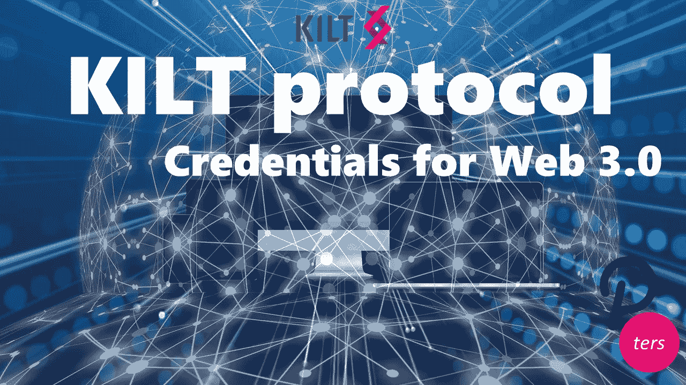
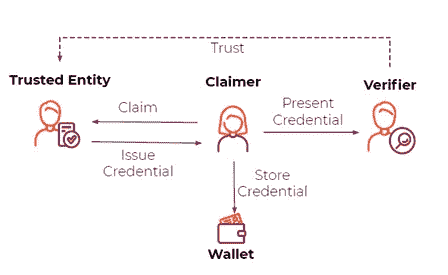
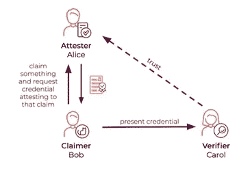
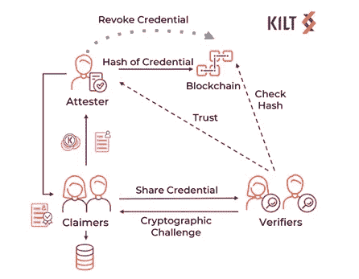

# KILT 协议:Web 3.0 的分散凭证

> 原文：<https://medium.com/coinmonks/kilt-protocol-decentralized-credentials-for-web-3-0-969d5efde6e?source=collection_archive---------1----------------------->

KILT 是一个匿名和分散的协议，用于管理敏感数据(比如你的在线身份)，我们可以用它来向其他实体证明自己。该协议建立在底层平台上，因此 KILT 将允许 Polkadot 上的所有 parachains 及其用户安全地管理他们的个人数据和凭证，他们可以匿名地将这些数据和凭证交给第三方。

Kilt protocol 是寻求保护个人数据免受任何恶意行为的项目之一(也是目前唯一一个想成为 parachain 的项目)。它允许最终用户对自己做出任何声明，让可信实体对其进行验证，并将其提供给任何第三方。由于受信任的实体可以付费发布验证，KILT 的目标是在建立信任的基础上支持新的商业模式。例如，想象一下，一个公证人在当今世界扮演着各种文件的核对者的角色 KILT 协议将扮演同样的角色，但以分散和独立的形式。

# Web 2.0 与 Web 3.0 的对比

在当前的 Web 2.0 环境中，数字身份和相关数据(如社交网络上的密码或个人资料)由脸书或谷歌等几家大公司管理。这些巨头收集、存储并出售所有从用户流向他们的数据。当今互联网的现实是，人们将他们的身份委托给互联网公司，互联网公司可以以任何方式使用他们的身份，用户完全失去了对其数据的控制。

这就是为什么 Gavin Wood(Polkadot 的创始人和以太坊的创始人之一)提出了 Web 3.0 倡议——努力重建互联网，以便用户重新获得对数据、匿名、安全的控制，并最终摆脱几家大公司的束缚，这些公司现在几乎控制了整个互联网。

这项工作的逻辑部分是提出一个解决方案，允许用户管理他们的身份、密码和其他敏感数据。这就是 KILT 协议发挥作用的原因，如果它成为 Polkadot parachain，将为 Polkadot 及其生态系统带来这样一种解决方案——这种解决方案对于连接旧的中央集权世界(匿名只是一种幻想)和使用分散技术的新世界尤为必要。

Credentials claim in the traditional Web 2.0 way

但是这个想法不仅仅是区块链或者 DeFi。我们在现实世界中每天遇到的各种凭据和证书又如何呢？比如汽车牌照，大学学位证书，课程证书，或者注册商标？这些证书现在由第三方、可信的认证机构、权威机构或专业公司颁发。我们今天唯一的选择是集中式解决方案，通常不提供任何匿名性，他们保持对用户数据的访问，并且他们的安全性通常很差。

KILT 协议创建了 3 个数字角色，即声明者、验证者和证明者。这些角色的可信度基于加密技术，因此它们的可靠性是数学上可验证的。

KILT 协议标准化了数字证书所需的数据结构(cType —证书类型),并允许所有三方(声明者、可信实体和验证者)之间的保密通信。验证者可以使用加密方法容易但秘密地识别声明者。

# 资格证书

Credentials example

这些凭证会是什么？让我们看一个例子。Bob 想向 Carol 展示他持有健康和安全证书，但是 Carol 不相信 Bob 真的持有该证书。因此 Bob 需要一个 Bob 和 Carol 都信任的中介(证明者)的数字签名。这个证明者是签署请求的 Alice，然后 Bob 可以将它展示给 Carol。

然而，Bob 不需要用给定的证书直接证明他自己——存在证书上可能注明的他的私人数据泄露的风险。卡罗尔甚至不能轻易跟踪或跟随鲍勃，因为她了解的唯一信息是她所需要的。那就是鲍勃有这样一个证书的事实。因此，Bob 的个人数据对 Carol 保持匿名和隐藏。

This is how the KILT protocol works and handles credentials

# **苏格兰裙硬币**

KILT 将拥有自己的令牌，这些令牌将被用作协议所提供服务的费用。这些服务通常是对申请人的认证，或者是向中间人支付费用，以安排验证人和申请人之间的匿名通信。

总硬币供应量将为 10 亿代币。

40%的 KILT 代币将在网络上线前以私下出售的形式分发。

随着时间的推移，将保留 60%的 KILT 令牌作为对验证者的奖励。

# **基尔特协议背后的团队**

KILT 协议的当前开发者是来自德国 BOTLabs 的区块链公司，由 Ingo Rübe、德国出版商休伯特布尔达媒体和瑞士出版商荣格共同拥有。

KILT 项目已经收到了 Web3 基金会的两笔拨款，第一笔集中在底层匿名证书的开发上，第二笔帮助创建 Polimec，Polimec 是 Polkadot 生态系统内项目的资助机制。

# **Polimec** (Polkadot 流动性机制)

让我们多谈谈政治。这是一个准备中的机制，将为进入 Polkadot 生态系统的项目带来流动性。大多数项目在开始前都需要投入大量的开发资源，因此他们正在寻找吸引投资者资金的方法。

最常用的解决方案是在以太坊上发行一个 ERC 20 代币，这种代币很容易转让，然后可以在各种交易所交易。然而，这种模式有两个主要缺点——首先，以太坊的天然气价格开始变得相当高，其次，运行令牌的智能合约可能存在安全漏洞。

这就是 Polimec 在 Polkadot 中充当副线程的原因(请参见我们的文章[什么是 Polkadot？](https://polkadotters.medium.com/what-is-polkadot-85d4af1b2fe7))并将只服务于 3 个简单的目的

发行新代币，

移动代币(执行交易)，

将 Polimec 创建的令牌迁移到 mainnet(启动并运行时)。

所有这些都不需要支付昂贵的天然气费用，也不需要启动自己的智能合同。这一举措将成为 Polkadot 的重要组成部分，因为它将允许项目以廉价和安全的方式选择投资。

# **结论**

KILT 是一个创建和操作数字、可验证和可撤销的敏感数据的平台。KILT 利用区块链技术为个人和机构寻找中立的数据存储和检索权威。所有这些都是加密的，因此是保密和安全的。

Kilt 有意保护用户的隐私，因此数据主权总是在所有者的控制之下。然而，这种信任也可以货币化，因此，基尔特创造了无数新的商业机会。

**KILT 是日益增长的对自主(同时也是可验证的)数据的需求和互操作性之间缺失的技术链接，互操作性是去中心化互联网的重要组成部分，用户在其中重新获得对其数据的控制。欢迎来到 Web 3.0 的世界。！**

*来源:*[*https://www.kilt.io/*](https://www.kilt.io/)

***敬请关注关于 Polkadot 生态系统项目的进一步信息，在我们的*** [***推特频道 Polkadotters***](https://twitter.com/Polkadotters1)***以及在我们的*** [***脸书 Polkadot 集团非官方！***](https://www.facebook.com/groups/993729051100217)

## 另外，阅读

*   最好的[密码交易机器人](/coinmonks/crypto-trading-bot-c2ffce8acb2a)
*   [Deribit 审查](/coinmonks/deribit-review-options-fees-apis-and-testnet-2ca16c4bbdb2) |选项、费用、API 和 Testnet
*   [FTX 密码交易所评论](/coinmonks/ftx-crypto-exchange-review-53664ac1198f)
*   [逐位交换审查](/coinmonks/bybit-exchange-review-dbd570019b71)
*   最好的比特币[硬件钱包](/coinmonks/the-best-cryptocurrency-hardware-wallets-of-2020-e28b1c124069?source=friends_link&sk=324dd9ff8556ab578d71e7ad7658ad7c)
*   [密码本交易平台](/coinmonks/top-10-crypto-copy-trading-platforms-for-beginners-d0c37c7d698c)
*   最好的[加密税务软件](/coinmonks/best-crypto-tax-tool-for-my-money-72d4b430816b)
*   [最佳加密交易平台](/coinmonks/the-best-crypto-trading-platforms-in-2020-the-definitive-guide-updated-c72f8b874555)
*   最佳[加密借贷平台](/coinmonks/top-5-crypto-lending-platforms-in-2020-that-you-need-to-know-a1b675cec3fa)
*   [莱杰纳米 S vs 特雷佐 one vs 特雷佐 T vs 莱杰纳米 X](https://blog.coincodecap.com/ledger-nano-s-vs-trezor-one-ledger-nano-x-trezor-t)
*   [block fi vs Celsius](/coinmonks/blockfi-vs-celsius-vs-hodlnaut-8a1cc8c26630)vs Hodlnaut
*   [bits gap review](/coinmonks/bitsgap-review-a-crypto-trading-bot-that-makes-easy-money-a5d88a336df2)——一个轻松赚钱的加密交易机器人
*   为专业人士设计的加密交易机器人
*   [PrimeXBT 审查](/coinmonks/primexbt-review-88e0815be858) |杠杆交易、费用和交易
*   哈森在线评论享受九折优惠
*   [埃利帕尔泰坦评论](/coinmonks/ellipal-titan-review-85e9071dd029)
*   [赛克斯石评论](https://blog.coincodecap.com/secux-stone-hardware-wallet-review)
*   [BlockFi 评论](/coinmonks/blockfi-review-53096053c097) |赚取高达 8.6%的加密利息
*   [面向开发人员的最佳加密 API](/coinmonks/best-crypto-apis-for-developers-5efe3a597a9f)
*   [最佳区块链分析工具](https://bitquery.io/blog/best-blockchain-analysis-tools-and-software)
*   [加密套利](/coinmonks/crypto-arbitrage-guide-how-to-make-money-as-a-beginner-62bfe5c868f6)指南:新手如何赚钱
*   顶级[比特币节点](https://blog.coincodecap.com/bitcoin-node-solutions)提供商
*   最佳[加密制图工具](/coinmonks/what-are-the-best-charting-platforms-for-cryptocurrency-trading-85aade584d80)
*   了解比特币的[最佳书籍有哪些？](/coinmonks/what-are-the-best-books-to-learn-bitcoin-409aeb9aff4b)

> [在您的收件箱中直接获得最佳软件交易](/coinmonks/newsletters/coinmonks)

