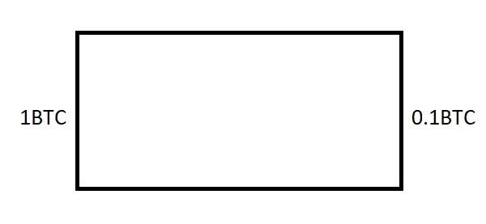
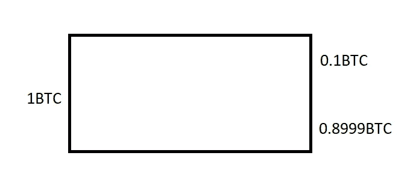
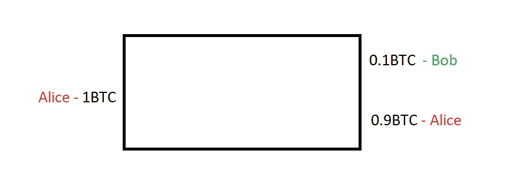
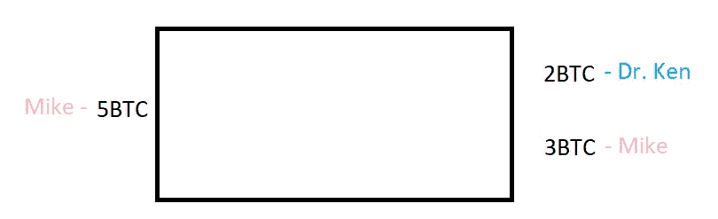
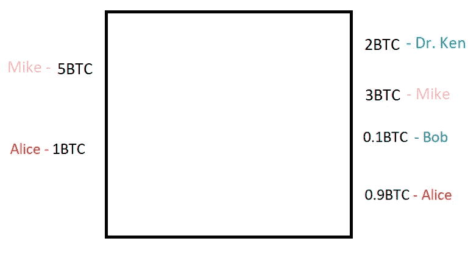
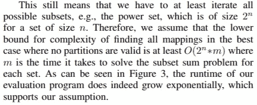
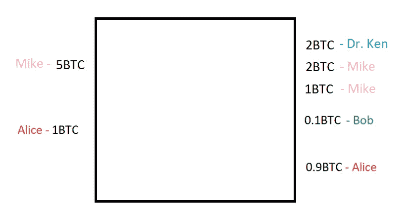

# 背包混合

> 原文：<https://medium.com/coinmonks/knapsack-mixing-6a5b1ac95c33?source=collection_archive---------1----------------------->

我想简单介绍一下 [2017 年的一篇论文](https://www.comsys.rwth-aachen.de/fileadmin/papers/2017/2017-maurer-trustcom-coinjoin.pdf)，背包混合的想法，因为我认为这个概念有点迷失，没有得到适当的探索。

# 正常交易

我是爱丽丝，很久以前，聪给了我 1 BTC，所以我有一枚价值 1 BTC 的硬币。
昨天我花了 0.1 BTC 从鲍勃那里买了一些羊驼毛袜子。所以我创建了一个比特币交易，看起来像这样:



0.9BTC 去哪了？原来是我傻，不小心把它当矿工费交了，因为 1BTC 输入币和 0.1BTC 输出币的差价就是矿工费。但是你不会像我一样愚蠢，你会把 0.8999BTC 作为输出硬币添加到交易中。由您控制的输出，以便您以后可以使用。如果我看着比特币区块链，我很快意识到没有人像我一样愚蠢，因此，这是一个正常的比特币交易的样子:



然而，我想简化这个模型，不关心矿工费用。这将使后面讨论背包混合更容易:



# 简单的 CoinJoin 事务

原来我们可以把事务合并在一起。以肯·赫特博士和迈克·奥克斯莫尔之间的交易为例:



并将它们与 Alice 和 Bob 的事务连接在一起:



问题是，如果我们解决这个 coinjoin 上的子集和问题，那么我们可以找到所有可能的子事务:

```
Sub mappings:
5,1 -> 2,3,0.1,0.9
5 -> 2,3 | 1 -> 0.1,0.9
```

## 快速切线

在没有任何进一步的启发和假设的情况下，计算复杂性使得很难对大型朴素共联接进行去匿名化，因为用于解决子集和问题的最著名算法的复杂性是指数级的。该论文甚至提供了下限估计:



# GCD 混合

我们可以混合输出的最大公约数，即 0.1BTC。在这种情况下，输出如下所示:

```
0.1 (Bob), 0.1(Alice), 0.1(Alice), 0.1(Alice), 0.1(Alice), 0.1(Alice), 0.1(Alice), 0.1(Alice), 0.1(Alice), 0.1(Alice), 0.1(Dr.Ken), 0.1(Dr.Ken), 0.1(Dr.Ken), 0.1(Dr.Ken), 0.1(Dr.Ken), 0.1(Dr.Ken), 0.1(Dr.Ken), 0.1(Dr.Ken), 0.1(Dr.Ken), 0.1(Dr.Ken), 0.1(Dr.Ken), 0.1(Dr.Ken), 0.1(Dr.Ken), 0.1(Dr.Ken), 0.1(Dr.Ken), 0.1(Dr.Ken), 0.1(Dr.Ken), 0.1(Dr.Ken), 0.1(Dr.Ken), 0.1(Dr.Ken), 0.1(Mike), 0.1(Mike), 0.1(Mike), 0.1(Mike), 0.1(Mike), 0.1(Mike), 0.1(Mike), 0.1(Mike), 0.1(Mike), 0.1(Mike), 0.1(Mike), 0.1(Mike), 0.1(Mike), 0.1(Mike), 0.1(Mike), 0.1(Mike), 0.1(Mike), 0.1(Mike), 0.1(Mike), 0.1(Mike), 0.1(Mike), 0.1(Mike), 0.1(Mike), 0.1(Mike), 0.1(Mike), 0.1(Mike), 0.1(Mike), 0.1(Mike), 0.1(Mike), 0.1(Mike)
```

虽然看到对该交易的分析很有趣，但不幸的是，由于解决该交易的子集和问题所涉及的计算复杂性，我的软件无法生成该分析。但是我们知道它会产生很多有效的子集和。这是否意味着 GCD 混合比简单的 coinjoins 好得多？

不会，因为真正重要的不是子集和的数量，而是断了多少个输入-输入，输入-输出，输出-输出的链接。本文提供了一个计算这些值的模型。对我们来说，让我们转到更容易分析的 coinjoin。

# 临时混合

如果 Mike 把他的 3BTC 输出改为 0.9BTC 和 2.1BTC 会怎么样？

```
Sub mappings:
5,1 -> 2,0.1,0.9,0.9,2.1
5 -> 2,0.9,2.1 | 1 -> 0.1,0.9
5 -> 2,0.9,2.1 | 1 -> 0.1,0.9
```

我们有 3 个子映射。越来越好了。
注意，虽然看起来像是重复的`5 -> 2,0.9,2.1 | 1 -> 0.1,0.9`行，但事实并非如此，因为有两个不同的`0.9BTC`硬币，这只是我不想通过引入硬币标识符来丑化我的软件输出。

# 背包混合

背包混合的思想是取输入之间的差:`5-1=4`并实现包含在更大的输出集合上，即`2btc and 3btc`输出。



```
Sub mappings:
5,1 -> 2,2,1,0.1,0.9
5 -> 2,2,0.1,0.9 | 1 -> 1
5 -> 2,2,1 | 1 -> 0.1,0.9
```

背包混合以一个额外输出为代价多创建了一个子映射，就像我们的特别混合一样。然而，正如我们在 GCD 混合过程中所指出的，子映射的数量并不是 coinjoin 的最终分数，而是输入-输入、输入-输出和输出-输出链接才是最重要的。

## 输入-输入、输入-输出和输出-输出链接

```
NAIVE COINJOINSub mappings:
5,1 -> 2,3,0.1,0.9
5 -> 2,3 | 1 -> 0.1,0.9Input match probabilities:
5 - inputs: 1(0.5) | outputs: 2(1) 3(1) 0.1(0.5) 0.9(0.5)
1 - inputs: 5(0.5) | outputs: 2(0.5) 3(0.5) 0.1(1) 0.9(1)Output match probabilities:
2 - inputs: 3(1) 0.1(0.5) 0.9(0.5) | outputs: 5(1) 1(0.5)
3 - inputs: 2(1) 0.1(0.5) 0.9(0.5) | outputs: 5(1) 1(0.5)
0.1 - inputs: 2(0.5) 3(0.5) 0.9(1) | outputs: 5(0.5) 1(1)
0.9 - inputs: 2(0.5) 3(0.5) 0.1(1) | outputs: 5(0.5) 1(1)
```

在简单的 coinjoin 中，`5BTC`输入有`1(=100%)`的概率匹配输出`2BTC`和`3BTC`，因为两个子映射都将`5BTC`输入映射到`2BTC`和`3BTC`输出。
它有`0.5(=50%)`的概率匹配`0.1BTC`输出，因为 2 个子映射中有 1 个子映射将`5BTC`输入映射到`0.1BTC`输出。

虽然背包文件在这里主要停留在它的评估上，但是我想引入一个 CoinJoin 歧义度量:`CJA`来代替能够相互比较混合。本交易的`CJA`为`(5BTC*1BTC)/0.5 + (5BTC*2BTC)/1 + (5BTC*3BTC)/1 + ... = 102`

让我们将其与我们的自组织算法和背包算法进行比较:

```
CJA(naive)=102
CJA(ad-hoc)=116
CJA(knapsack)=115
```

令我惊讶的是，我得到了比背包更好的特别混合 CoinJoin 歧义分数。但是，不要让这阻碍我们前进。为了完整起见，下面是对所讨论的 3 种混合的完整分析:

```
NAIVESub mappings:
 5,1 -> 2,3,0.1,0.9
 5 -> 2,3 | 1 -> 0.1,0.9Input match probabilities:
 5 - inputs: 1(0.5) | outputs: 2(1) 3(1) 0.1(0.5) 0.9(0.5)
 1 - inputs: 5(0.5) | outputs: 2(0.5) 3(0.5) 0.1(1) 0.9(1)Output match probabilities:
 2 - inputs: 3(1) 0.1(0.5) 0.9(0.5) | outputs: 5(1) 1(0.5)
 3 - inputs: 2(1) 0.1(0.5) 0.9(0.5) | outputs: 5(1) 1(0.5)
 0.1 - inputs: 2(0.5) 3(0.5) 0.9(1) | outputs: 5(0.5) 1(1)
 0.9 - inputs: 2(0.5) 3(0.5) 0.1(1) | outputs: 5(0.5) 1(1)CoinJoin Ambiguity Score: 102AD-HOCSub mappings:
 5,1 -> 2,0.1,0.9,0.9,2.1
 5 -> 2,0.9,2.1 | 1 -> 0.1,0.9
 5 -> 2,0.9,2.1 | 1 -> 0.1,0.9Input match probabilities:
 5 - inputs: 1(0.33) | outputs: 2(1) 0.1(0.33) 0.9(0.67) 0.9(0.67) 2.1(1)
 1 - inputs: 5(0.33) | outputs: 2(0.33) 0.1(1) 0.9(0.67) 0.9(0.67) 2.1(0.33)Output match probabilities:
 2 - inputs: 0.1(0.33) 0.9(0.67) 0.9(0.67) 2.1(1) | outputs: 5(1) 1(0.33)
 0.1 - inputs: 2(0.33) 0.9(0.67) 0.9(0.67) 2.1(0.33) | outputs: 5(0.33) 1(1)
 0.9 - inputs: 2(0.67) 0.1(0.67) 0.9(0.33) 2.1(0.67) | outputs: 5(0.67) 1(0.67)
 0.9 - inputs: 2(0.67) 0.1(0.67) 0.9(0.33) 2.1(0.67) | outputs: 5(0.67) 1(0.67)
 2.1 - inputs: 2(1) 0.1(0.33) 0.9(0.67) 0.9(0.67) | outputs: 5(1) 1(0.33)CoinJoin Ambiguity Score: 116KNAPSACKSub mappings:
 5,1 -> 2,2,1,0.1,0.9
 5 -> 2,2,0.1,0.9 | 1 -> 1
 5 -> 2,2,1 | 1 -> 0.1,0.9Input match probabilities:
 5 - inputs: 1(0.33) | outputs: 2(1) 2(1) 1(0.67) 0.1(0.67) 0.9(0.67)
 1 - inputs: 5(0.33) | outputs: 2(0.33) 2(0.33) 1(0.67) 0.1(0.67) 0.9(0.67)Output match probabilities:
 2 - inputs: 2(1) 1(0.67) 0.1(0.67) 0.9(0.67) | outputs: 5(1) 1(0.33)
 2 - inputs: 2(1) 1(0.67) 0.1(0.67) 0.9(0.67) | outputs: 5(1) 1(0.33)
 1 - inputs: 2(0.67) 2(0.67) 0.1(0.33) 0.9(0.33) | outputs: 5(0.67) 1(0.67)
 0.1 - inputs: 2(0.67) 2(0.67) 1(0.33) 0.9(1) | outputs: 5(0.67) 1(0.67)
 0.9 - inputs: 2(0.67) 2(0.67) 1(0.33) 0.1(1) | outputs: 5(0.67) 1(0.67)CoinJoin Ambiguity Score: 115
```

## 共结合效率

请注意，CoinJoin 歧义分数不考虑所使用的块空间。为了真正地相互比较 coinjoins，我们需要考虑到这一点。然而，我们不关心我的特别混合和背包混合之间的比较，因为它们创建了相同数量的输出。

## 拆分活动输出

请注意，有时我们想要分离活动输出，这在实践中是困难的。我可以为自己生成多个更改地址，但不能为接收方生成多个地址。给我想寄给的人。有一些技术，如秘密地址和支付代码，但由于它们之间的权衡，它们没有被采用。

## 非导出映射

注意，在每个分析中，都有一个没有子事务的映射。这是我们在区块链看到的交易。这是 coinjoin。为了在朴素 coinjoin 和其他混合之间创建更精确的比较，该映射应该被排除为无效的，并且不应该被加权到输入-输入、输入-输出、输出-输出链接概率矩阵中，当然也不应该被加权到派生的度量中，如 CoinJoin 歧义分数。

## 协调

构造 coinjoins 的一个问题是如何以不可信的方式协调它们。coin shuffle/chau mian coin join/tumble bit/Xim/etc…工作是因为有相等的输出。虽然我不认为这是一项不可能的工作，但我们现在还不能进行这项研究，因为首先我们必须找出混合的最有效的块空间算法，然后在此基础上实现一个不可信的方案。

## 其他混合技术

背包论文提供了另一种改进的背包混合技术，它将给出一个迄今为止最好的`126` CJA 分数:

```
Sub mappings:
5,1 -> 1,1,3,0.1,0.9
5 -> 1,3,0.1,0.9 | 1 -> 1
5 -> 1,1,3 | 1 -> 0.1,0.9
5 -> 1,3,0.1,0.9 | 1 -> 1Input match probabilities:
5 - inputs: 1(0.25) | outputs: 1(0.75) 1(0.75) 3(1) 0.1(0.75) 0.9(0.75)
1 - inputs: 5(0.25) | outputs: 1(0.5) 1(0.5) 3(0.25) 0.1(0.5) 0.9(0.5)Output match probabilities:
1 - inputs: 1(0.5) 3(0.75) 0.1(0.5) 0.9(0.5) | outputs: 5(0.75) 1(0.5)
1 - inputs: 1(0.5) 3(0.75) 0.1(0.5) 0.9(0.5) | outputs: 5(0.75) 1(0.5)
3 - inputs: 1(0.75) 1(0.75) 0.1(0.75) 0.9(0.75) | outputs: 5(1) 1(0.25)
0.1 - inputs: 1(0.5) 1(0.5) 3(0.75) 0.9(1) | outputs: 5(0.75) 1(0.5)
0.9 - inputs: 1(0.5) 1(0.5) 3(0.75) 0.1(1) | outputs: 5(0.75) 1(0.5)CoinJoin Ambiguity Score: 126
```

菲利克斯，论文的作者之一[和我们分享了混音技术的另一个改进](https://www.youtube.com/watch?v=XDCQI7hrB58&list=PLPwc75tPMdsgTYlu9dJZlosCm0s7WmIpF)，我还没有深入研究。现在，我只是在这里链接存储库:【https://gitlab.com/maufl/cja/ 

# CoinJoin 分析工具

我用来生成上述分析的软件是我编写的一个小型 CoinJoin 分析工具:

[](https://github.com/nopara73/CoinJoinAnalysis) [## nopara73/CoinJoinAnalysis

### 分析 CoinJoin 事务。在 GitHub 上创建一个帐户，为 nopara73/CoinJoinAnalysis 的开发做出贡献。

github.com](https://github.com/nopara73/CoinJoinAnalysis) 

# 更新

CoinJoin 歧义分数计算不正确，因为当我们检查两个硬币之间的距离时，我们想要两个硬币的总和，而不是它们的乘积，因为这里的相关度量是彼此分离的硬币的总量。考虑到这一点，分数是这样变化的:

```
NAIVE
 CoinJoin Ambiguity Score: 120
AD-HOC
 CoinJoin Ambiguity Score: 162
KNAPSACK
 CoinJoin Ambiguity Score: 148
KNAPSACK 2
 CoinJoin Ambiguity Score: 161
```

如您所见，CJA 现在成了 ad-hoc 算法中的最高值。

> [直接在您的收件箱中获得最佳软件交易](https://coincodecap.com/?utm_source=coinmonks)

[](https://coincodecap.com/?utm_source=coinmonks)[](https://coincodecap.com)