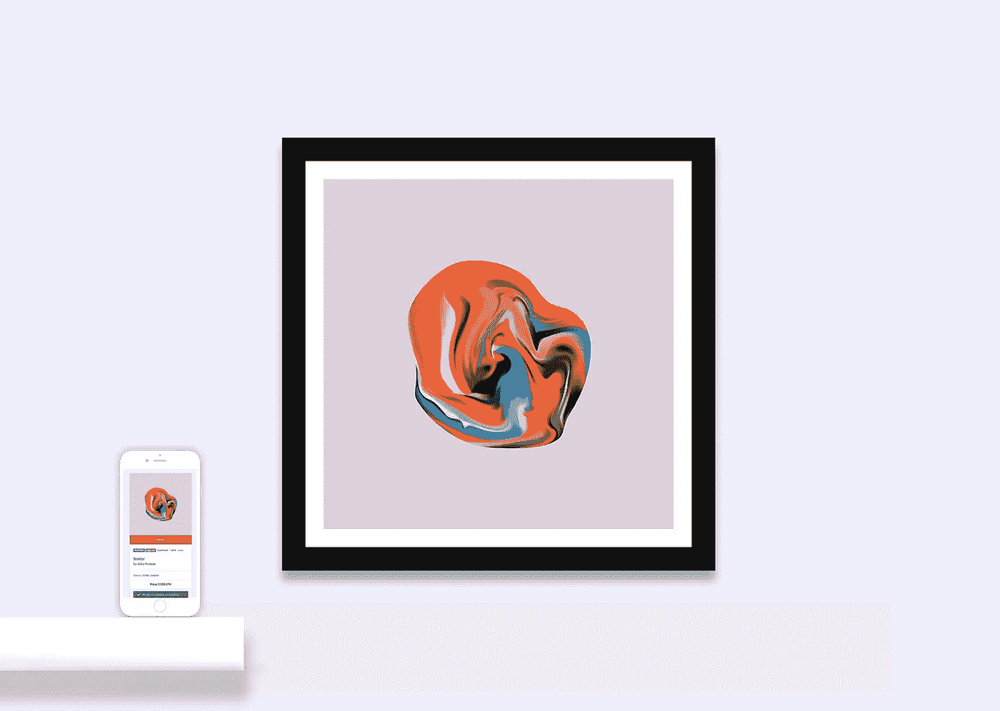
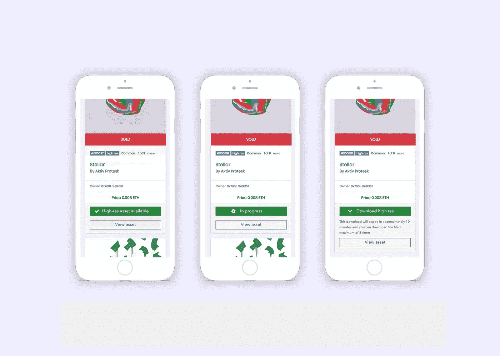
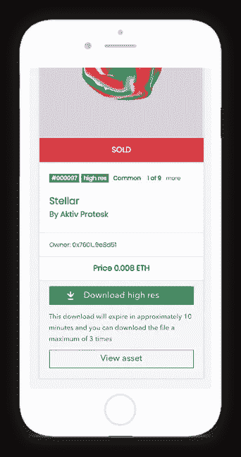
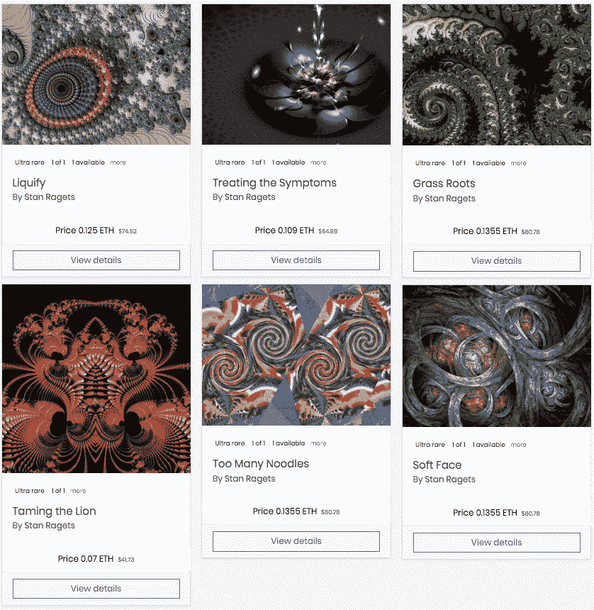

# KnownOrigin —我们能增强数字资产所有权吗？

> 原文：<https://medium.com/coinmonks/knownorigin-can-we-enhance-digital-asset-ownership-d40967a16528?source=collection_archive---------16----------------------->

NFT’s to the wall — [http://KnownOrigin.io/](http://knownorigin.io/)

在[之前的一篇文章](/knownorigin/knownorigin-io-from-alpha-to-beta-7d5057107d9d)中，我们提到了一些我们要回答的创始问题，包括所有权、出处和真实性等话题。我们相信，这些创始问题可以通过以太坊等公共区块链和基于 [ERC-721](http://erc721.org/) 的不可替代令牌智能合约来解决。然而，当谈到我们的目标和需要在[知识论坛](http://knownorigin.io/)上回答的问题时，这并不是故事的结尾。

在从想法到原型，再到将合同部署到 main-net 的过程中，我们一直希望做更多工作，在技术区块链空间与艺术、所有权和非区块链空间之间架起桥梁。

由此产生了允许用户下载特定艺术品的高分辨率数字版本的想法。我们喜欢区块链上的所有权证明，但也相信一些人仍然喜欢在他们的墙上挂漂亮的东西。

我们计划只允许艺术家同意的下载，并自然地限制数字资产所有者(购买后)。这也不会使版权和许可失效，但与常规的艺术品购买一样，用户仍然必须遵守法律。

我们提出以下问题:

> “我们能否通过允许区块链支持的资产的高分辨率下载来进一步增强数字资产所有权？”

这提出了一些有趣的观点，首先，我们如何能够以一种安全和可信的方式允许这一点，理想地利用区块链技术为我们所用？其次，这会对资产所有权产生什么影响？最后，这是一件事情吗，人们期望或想要这样吗？在做出结论之前，让我们深入研究每个问题。

UX for the high-res download feature at [http://KnownOrigin.io/](http://knownorigin.io/)

## 我们如何着手允许可信的高分辨率数字资产下载？

为此，我们可以利用以太坊的力量和一个奇妙的功能，我们预计它将在生态系统中变得非常重要，这就是可验证的离线数字签名。这意味着我们可以使用固有的公钥-私钥加密来验证消息的发送者就是他们所说的那个人。然后我们可以检查 [KnownOrigin](http://knownorigin.io/) [智能契约](https://etherscan.io/address/0xdde2d979e8d39bb8416eafcfc1758f3cab2c9c72)来验证这个人是否拥有被请求下载的资产。

我们不需要知道用户的私有密钥，只需要知道公共以太坊地址和签名数据，只有**用户可以使用[元掩码](https://metamask.io/)或任何其他支持 web3 的浏览器(如[信任钱包](https://trustwalletapp.com/))在本地签名这些数据。**

邮件的签名者必须是数字资产的当前所有者，否则我们将拒绝该请求，并且不提供高分辨率下载。最后，这一点的美妙之处在于，这些交易对于最终用户来说是*离线*和*免费*的，而且是安全的和加密签名的。

除此之外，我们还研究了在下载前添加数字指纹和在图像中嵌入元数据，但不幸的是，目前还没有真正的*故障保护*方法来保护图像在某人的笔记本电脑或手机上的安全。伟大的是*真实所有权*和*出处*将在公共以太坊区块链上的智能合约内维护。

要了解更多关于数字签名的信息，请查看由[丹·埃蒙斯](https://medium.com/u/779475e5c71d?source=post_page-----d40967a16528--------------------------------)在 [coinmonks](https://medium.com/coinmonks) 上发表的这篇精彩文章

[https://medium . com/coin monks/white paper-and-demo-UX-for-authenticated-verified-ERC 20-payments-using-meta mask-and-ethsigutil-7a 146 afcd 65 e](/coinmonks/whitepaper-and-demo-ux-for-authenticated-verified-erc20-payments-using-metamask-and-ethsigutil-7a146afcd65e)

## 允许数字资产的高分辨率下载会有什么影响？

这是一个*未知的*，我们相信我们是第一个提供这个的*。我们希望从 KnownOrigin 购买数字资产的人能够享受拥有一件可收藏的、稀有的、美丽的数字艺术品的乐趣，他们不仅可以收集、数字化展示或转售，还可以将它转化为更实际的东西。*

例如，你可能想把它打印出来放在墙上，打印在杯子或 t 恤上。人们正在设想收藏品的创新服务，比如 C[ryptoGoods.co](https://www.cryptogoods.co/)可以让你的 cryptokitty 印在帽衫上，为什么不把你令人惊叹的数码艺术品挂在墙上呢。有一天，我们可以设想一个为不可替代资产提供服务的完整生态系统。

有些人说这可能会鼓励欺诈，但我们相信不会是这样的。网上有数百万张《蒙娜丽莎》的复制品，但只有一张原件，很难复制真正的版本。有了数字资产，你可以利用区块链技术来验证一件数字艺术品的*所有权*和*原创性*。有人可以将高分辨率版本发送给朋友或在海盗湾上列出，但这并不意味着数字资产的来源已经丢失，因为他们没有通过 ERC-721 资产的所有权。此外，采取这些行动可能不符合原始资产持有者的最佳利益——他们为什么要冒险让自己的资产贬值呢？

Sample of a verified high-res download link

## 允许高分辨率下载的需求是什么？

这也很难讲，我们已经与几个社区成员、加密和区块链领域内外的各种人谈过，大多数人似乎都喜欢这个想法，称这将“*完成这个循环”*，并允许他们“T10 对任何数字资产做更多的事情”。

从根本上说，就像太空中正在发生的许多事情一样，这是一个将要检验的实验和假设。当我们启用此功能时，它将针对 [KnownOrigin](http://knownorigin.io/) 市场上的少量精选商品。有了这个，我们就可以衡量这种功能的使用情况，并让社区和艺术家参与反馈。

## 最后的想法…

区块链支持的数字资产作为一个整体是一个新兴的技术和产业，在 [KnownOrigin](http://knownorigin.io/) 我们认为其目前的形式只是第一阶段。

我们将在未来几个月继续创新和发布产品，希望这将增强蓬勃发展的生态系统。全新的概念和解决方案将会实现，我们的目标是通过测试一些疯狂的想法并将其变为现实，成为这一旅程的一部分。

我们发现，进行小规模的迭代改进并测试具体的想法和解决方案是我们工作的最佳方式，特别是在涉及区块链技术等发展如此迅速且不等人的技术时。一旦此功能被启用并投入使用，我们将报告其成功和使用情况。

如果你对增加这个功能有任何想法或反馈，请直接在我们的[电报](https://t.me/knownorigin_io)频道上说出来。

一旦该功能上线，我们将深入研究它是如何整合在一起的。

Samples from artists Stan Ragets — [https://KnownOrigin.io/artists/STR](https://knownorigin.io/artists/STR)

发现、购买和收集一些世界上最受尊敬的艺术家、插画家和创意从业者的数字作品。

**有独创性。买原装的。**

请访问 [KnownOrigin.io](http://knownorigin.io/) ，加入 [telegram](https://t.me/knownorigin_io) 频道，并在 twitter [@knownorigin_io](https://twitter.com/knownorigin_io) 上关注市场，了解我们的最新进展

要了解更多关于 [BlockRocket.tech](http://blockrocket.tech/) 的信息，请关注 [@BlockRocketTech](https://twitter.com/BlockRocketTech) 或我们的社区群 [Blockchain Manchester](http://www.blockchainmanchester.co.uk/) ，地址为[@区块链 _ 曼茨](https://twitter.com/blockchain_manc)。

如果你喜欢这篇文章，请给我们一点爱，给我们一个或十个掌声！