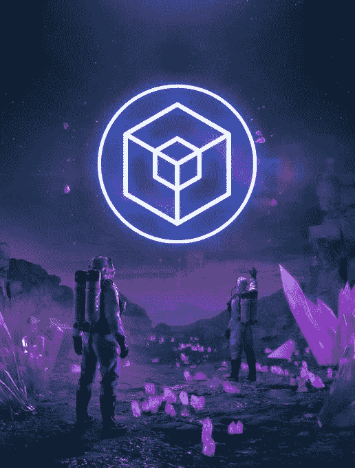
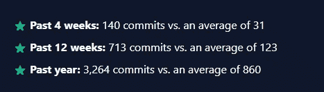
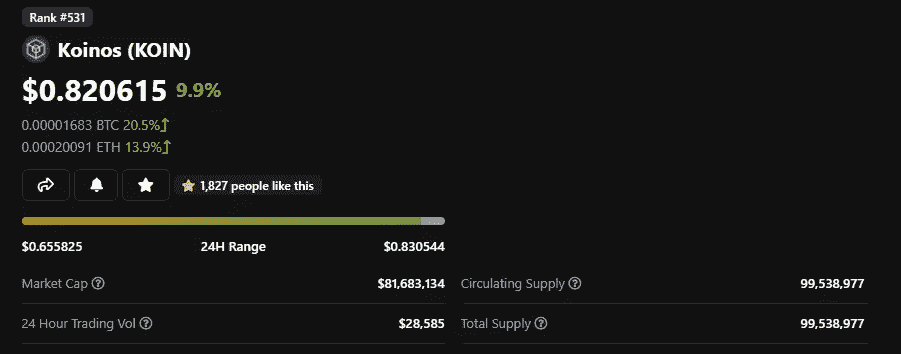
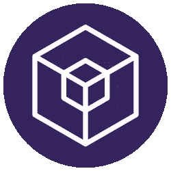

# 科伊诺斯

> 原文：<https://medium.com/coinmonks/koinos-edc280209a67?source=collection_archive---------1----------------------->

## 小盘宝石评论

## 分散的第一层解决方案

*免责声明:本人不是理财顾问，采取任何行动风险自担*

K oinos 是由 Koinos 集团创建的第一层工作验证模块化区块链，其目标是让所有人都能使用区块链技术。此外，这种技术有助于推出其他高性能、免费的区块链，类似于 Polkadot 和 Cosmos。该项目由经验丰富的开发商创建，旨在改善区块链的公众体验，其理念围绕权力下放和方便公众使用。区块链还包括最新技术，旨在通过 WASM 实现无叉升级和通用语言支持。Koinos 区块链号正在 V2 进行测试，主要目标是 2022 年在 Q2 发射。

> 让所有人都能使用区块链技术的目标

Koin 是 Koinos 上的本地令牌。Koin 预开采开始于 2020 年末，没有 ICO。公众中任何有 CPU 的人都可以进行预挖掘。采矿算法确保参与者不必与 GPU 采矿设备或 ASICs 竞争。1 亿枚中的 9850 万枚已被开采并在流通。

> *Koinos 的属性*

*   D *去中心化*
*   *对用户和开发者免费*
*   *易于升级*
*   *利用现代区块链技术*
*   *开发者友好型*

Koinos 的设计是对开发者友好的，并且易于集成到现有的基础设施中。Koinos 永远不需要分叉。它实现了 WASM，这被许多人认为是下一代区块链中一个重要的开发工具。WASM 允许用各种语言设计 dApps。

> Koinos 永远不需要分叉

Adam Levine

Koinos 由以前在一个名为 Steem 的项目工作的开发者设计，由亚当·莱文领导，他也是该项目的发言人。Steem 以前是一个分散的内容网络，[在 2020 年遭到 TRON 的恶意收购，导致 Steem 的社区分叉成一个名为 Hive 的替代网络。我有一部分愿意相信开发人员预见到了这一点，并以此为灵感创造了 Koinos，但这纯粹是猜测。](https://cryptobriefing.com/what-are-steem-hive-comparison-both-decentralized-content-blockchains/)

在解决天然气及其遗留问题创新方案中，科伊诺斯集团提出了一种独特的方法。每个锦鲤携带一个再生元素名为法力。与用原生代币支付汽油费不同，它们是用法力支付的。花费的唯一价值是法力再生所需要的时间就像魔兽世界上的生命条一样，团队从那里获得了命名的灵感。用户将只需要有液体 Koin 来与网络交互。应用程序将有能力支付法力的成本，这可以为区块链的用户创造一个独特的体验。这个小细节可以帮助 Koinos 达到无缝采用的新水平。

> *令牌属性:*

*   *所有代币都是预先开采的，没有为大投资者、团队等保留代币..*
*   *锦鲤有法力(能量/数值)*
*   法力会随着时间而再生。
*   与区块链的互动是以法力支付的。
*   *1 亿最大供应量*

Developer Commits For Koinos vis Coinrank.app

将注意力吸引到连锁可能是一个挑战，Koinos Twitter 只有 3300 名粉丝。随着 mainnet 的推出和团队目标的转变，这种情况可能会发生变化。Koinos 上的大部分信息都是技术性很强的，不面向公众。

[Koinos 市值 7800 万](https://www.coingecko.com/en/coins/koinos)交易量小(2021 年 12 月 4 日 25 万)。价格走势看起来很健康，价格目前在 0.70 美分附近找到了阻力。在 11 月 V2 测试网启动之前，它有一个强劲的上升期。代币的分配情况良好，2.38%的代币分配在顶级钱包中，共有 2923 名持有者。这降低了大量令牌转储的可能性。另一个好消息是，Koinos 没有受到 2021 年 12 月 2 日大规模市场抛售的强烈影响。具有讽刺意味的是，他们的令牌只能在 Uniswap 上获得。投资者将不得不支付高昂的以太坊气费来获得 Koin。如果 Koin 在一些集中的交易所上市，预计会有很大的购买压力。

赞成的意见

*   99.5%的代币在流通
*   易于升级的适应性技术
*   真正去中心化
*   WASM
*   “第 0 层”属性
*   大量分发代币
*   7800 万美元的小市值
*   强队

*关注点:*

*   *达到 Koin (ERC-20)的天然气成本*
*   *unis WAP 流动性低*
*   *相当不知名的项目*
*   *大承诺补*
*   *没有大的投资来源*
*   *高风险/高回报*

我个人喜欢 Koinos 的每个内在方面，小市值是一大优势。这些担忧是任何早期项目所固有的。

Koinos 的目标是成为一个真正的免费、分散、智能合同的区块链。如果 mainnet 在未来没有重大缺陷的情况下上线，那就要小心了！因此，我将在长期内将美元成本平均化到 Koinos，希望连锁店成为主流。如果 Koinos 是一个成功的项目，它将有助于恢复区块链技术的过程中，一些最初的 Satoshi 启发的理想。

> 记住，在投资任何硬币或代币之前，一定要做好自己的研究。

我希望你喜欢这篇文章，如果有任何差异，随时联系我在 cryptotradergabi@gmail.com。我的目标是写出尽可能准确的信息。

***如果你喜欢这篇时事通讯，并且认为它值 20 satoshis(0.01 美分)，请点击下面的按钮，支持我的写作。(最多 50 次！)***

感谢阅读 fam。

*参考文献:*

[*https://hackernoon . com/the-koinos-区块链-白皮书-演进框架-模块化-可升级性-治理-333t3w2p*](https://hackernoon.com/the-koinos-blockchain-whitepaper-evolving-framework-with-modular-upgradeability-and-governance-333t3w2p)

[*白皮书链接*](https://koinos.io/koin-whitepaper/)

[*https://medium.com/koinos-group/koinos-faqs-147c6a844ed9*](/koinos-group/koinos-faqs-147c6a844ed9)