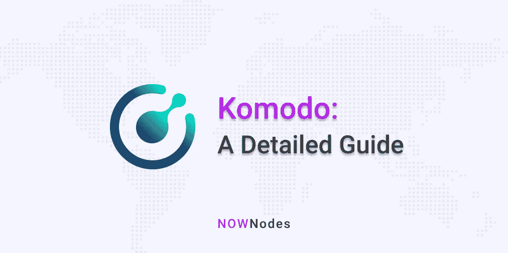

# 科莫多:详细指南

> 原文：<https://medium.com/coinmonks/komodo-a-detailed-guide-694c4e77c79a?source=collection_archive---------4----------------------->

最初发表于 [NOWNodes 博客。](https://nownodes.io/blog/komodo-a-detailed-guide)

Komodo 平台成立于 2016 年 9 月，旨在为加密货币安全和匿名协议带来新标准。总部位于马耳他 San Gwann 的 Komodo 平台利用 Zcash 零知识证明帮助其用户进行 100%不可追踪的交易。这些交易受到比特币的 Petahash 工作证明机制的保护。

# 科莫多独有的区块链平台

科莫多提供的区块链平台是开放和可组合的。这些完全可组合的解决方案基于多链设计。事实证明，这对个人开发者、成长中的初创公司以及相对较大的企业都是有益的。这些实体可以利用可组合性的这个方面来创建定制的区块链，它能够托管应用程序、软件和任何其他类型的基于区块链的解决方案。

科莫多区块链的可组合性提供了各种各样的组件，这些组件可以在需要时被激活，并可以以不同的组合和配置使用，从而满足特定用例的特定需求。

尽管该平台于 2016 年推出，但其开发始于 2014 年。最初的开发过程是从比特币和 ZCash 经过测试的技术范式中得到启示的。通过提供与区块链相关的定制设施，科莫多使项目能够建立一个完全可定制和独立的 Antara 智能链，通过平台同步与科莫多的多链生态系统保持连接。智能链受到比特币级别的安全保护。Antara 为科莫多提供了区块链工具包。该套件中的不同开发工具使用户能够构建高级业务逻辑。该功能由 Komodo 的链上本地应用程序支持补充。

Komodo 的多链设计允许许多主权智能链项目在同一生态系统中共存，每个项目都有自己的共识、网络和硬币。然而，这些独立的链能够利用 Komodo Core 的平台同步技术进行价值和逻辑的跨链转移。

Antara 智能链随着时间和技术的进步不断更新。所有这些智能链都是面向未来的，这些智能链的用户在它们发布时会不断收到免费更新。新的功能也被频繁地添加到基础科莫多技术堆栈中，以保持技术的动态性。

开发者、初创企业、企业自己搭建独立的智能链来满足需求，感觉到了就可以自由放大规模。Antara 智能链允许他们通过将多个智能链整合到一个逻辑链的范围内来按需扩展。不仅增加了链条的数量，而且 Antara 智能链条技术还能提升链条的功能。人们可以向他们的链中引入一些新的特性和选项，包括神谕、令牌、不可信的价格馈送、稳定的内容等。

除了支持项目创建定制的独立智能链，Komodo 还帮助企业和个人用户开发一系列必要的白标产品，包括多硬币钱包、原子交换 DEX、定制块浏览器和托管基础设施解决方案。

在接下来的部分，我们将详细了解科莫多的这些产品。

# 原子互换指数和多货币钱包

Komodo 提供的 AtomicDEX 将高度安全的钱包与非托管的分散式交易所结合在一起。用户可以利用这种组合来存储他们的资产，并在点对点的基础上进行交易，而不必放弃对他们资金的控制权。

多货币钱包有助于经常使用密码的用户摆脱存放不同类型硬币所需的大量不同钱包。人们可以方便地将他们的 BTC、ETH 和十几种类型的硬币以安全和非保管的方式存储在测试版本的钱包中。虽然目前的测试版钱包允许十几种类型，但最终推出的钱包将能够存储数百种不同类型的加密硬币。

另一方面，原子互换 DEX 提供的最大便利是，它允许用户交易任何硬币，而不必首先通过交易所。因为人们不必通过交易所进行交易，所以没有放弃对他们资金的控制。Atomic Swap DEX 被称为迄今为止业界最先进的移动优先原子交换协议。

**科莫多原子互换 DEX 的优势**

Komodo 推出的下一代分散交易所(DEX)技术解决了数字资产交易中的许多遗留问题。

尽管区块链技术以分散化为基础，但区块链的交易仍然在很大程度上依赖于集中的交易所服务。但是，这些 CEX 服务有其局限性和缺点。

*   集中式交易所缺乏安全性。据估计，仅在 2018 年，所有集中交易所因黑客和网络攻击者而损失的数字资产就高达 10 亿美元。这成为用户严重关注的问题，因为他们需要在通过集中交易进行交易之前放弃对其资金的控制。
*   事实证明，通过集中交易平台进行交易的成本高于平均水平。用户不仅需要支付交易金额的 0.33%交易费，还需要支付取款和重新获得资金控制权的费用。
*   集中交易也无法提供良好的交易对范围。大多数 CEX 服务对于大多数硬币和代币具有一个或两个交易对。

由科摩多提供的 AtomicDEX 解决了这些问题。它为其用户提供了最高标准的安全协议，这些用户在任何情况下都不必通过与交易所共享其私钥来放弃对其资金的控制。Komodo DEX 服务还向用户提供了一大堆无限制的交易对，用户可以直接交换任何资产。与任何集中的交易服务相比，DEX 的费用也要低得多。在 AtomicSwapDEX 中，做市商不需要支付任何费用，而接受者只需要支付 0.15%的费用

**科莫多:Tokenomics**

科摩多的本地代币是 KMD 代币。KMD 代币的总供应量固定在 2 亿代币的上限。在这 2 亿枚比特币中，有 1 亿枚已经过预埋，通过 ICO 或“首次代币发售”方式发行。在进入 ICO 的 1 亿个科摩多代币中，90%可供参与 ICO 的投资者使用。剩下的 10%被预留用于平台的未来开发。除了 1 亿个 KMD 代币之外，另外的 1 亿个代币由科莫多通过其工作证明一致性机制分解。

在一个地址中持有超过 10 个 KMD 代币的科摩多用户有资格获得 5%的奖励。

为了了解科莫多的交易潜力，2017 年 12 月 22 日，科莫多的价格达到了历史最高的 12.23 美元，交易量超过 12 亿美元。

**最新科摩多更新**

*   科摩多平台于 2020 年 10 月 31 日完成首次成功的压力测试。在这次压力测试中，共有 2000 名交易员试图通过 AtomicDEX 执行掉期交易。这次测试为科莫多的开发者提供了大量有价值的数据，让他们能够测试 Market Maker 2 的准确性。Market Maker 2 是科莫多基于 Libtorrent 的一种高度复杂的订单匹配技术。
*   这次对 Market Maker 2 的更新将使科摩多比以前的版本更有用。它为 DEX 提供了一整套经过战斗考验的免费 DHT 引导服务器和一个庞大的 DHT 对等网络。它还有助于纠正和升级网络地址转换以及与路由相关的异常。在 Market Maker 2 中使用 Libtorrent 使 AtomicDEX 有资格在切换 IPs 时进行操作。当用户是移动用户并且可能使用不同的 Wi-Fi 路由器、蜂窝塔等时，这变得特别有用。

作为下一代 DEX 技术的提供商，Komodo 平台已经成为区块链技术发展的主要推动力。凭借由 Antara 框架、延迟验证工作机制、原子交换和平台同步功能组成的强大基础，Komodo 有望在未来的日子里继续成为区块链世界的创新和思想领袖。

## 另外，阅读

*   [了解以太坊和 Web3](https://blog.coincodecap.com/go/learn)
*   [密码交易机器人](/coinmonks/crypto-trading-bot-c2ffce8acb2a)
*   最好的比特币[硬件钱包](/coinmonks/the-best-cryptocurrency-hardware-wallets-of-2020-e28b1c124069?source=friends_link&sk=324dd9ff8556ab578d71e7ad7658ad7c)
*   [密码本交易平台](/coinmonks/top-10-crypto-copy-trading-platforms-for-beginners-d0c37c7d698c)
*   最佳 [monero 钱包](https://blog.coincodecap.com/best-monero-wallets)
*   最好的[加密税务软件](/coinmonks/best-crypto-tax-tool-for-my-money-72d4b430816b)
*   [最佳加密交易平台](/coinmonks/the-best-crypto-trading-platforms-in-2020-the-definitive-guide-updated-c72f8b874555)
*   最佳[加密贷款平台](/coinmonks/top-5-crypto-lending-platforms-in-2020-that-you-need-to-know-a1b675cec3fa)
*   [最佳区块链分析工具](https://bitquery.io/blog/best-blockchain-analysis-tools-and-software)
*   [加密套利](/coinmonks/crypto-arbitrage-guide-how-to-make-money-as-a-beginner-62bfe5c868f6)指南:新手如何赚钱
*   最佳加密制图工具
*   了解比特币的[最佳书籍有哪些？](/coinmonks/what-are-the-best-books-to-learn-bitcoin-409aeb9aff4b)

> [直接在您的收件箱中获得最佳软件交易](/coinmonks/newsletters/coinmonks)

