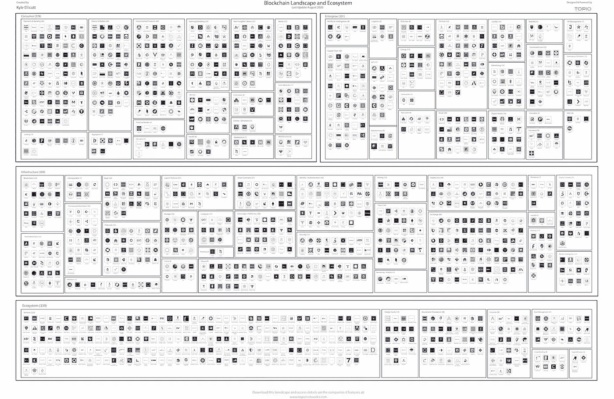
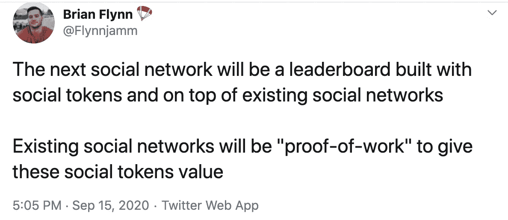
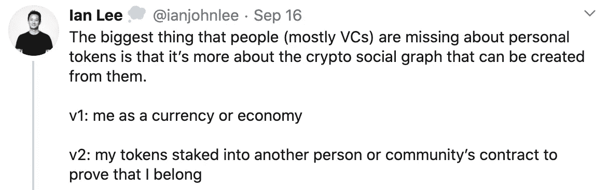
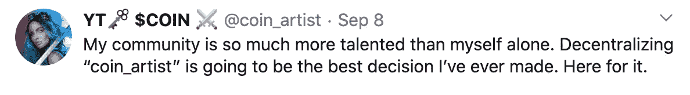
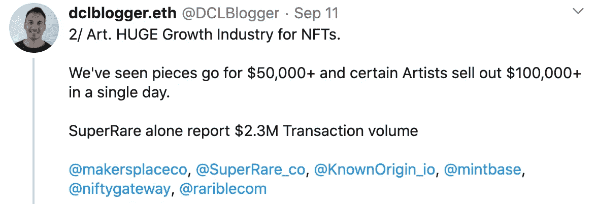
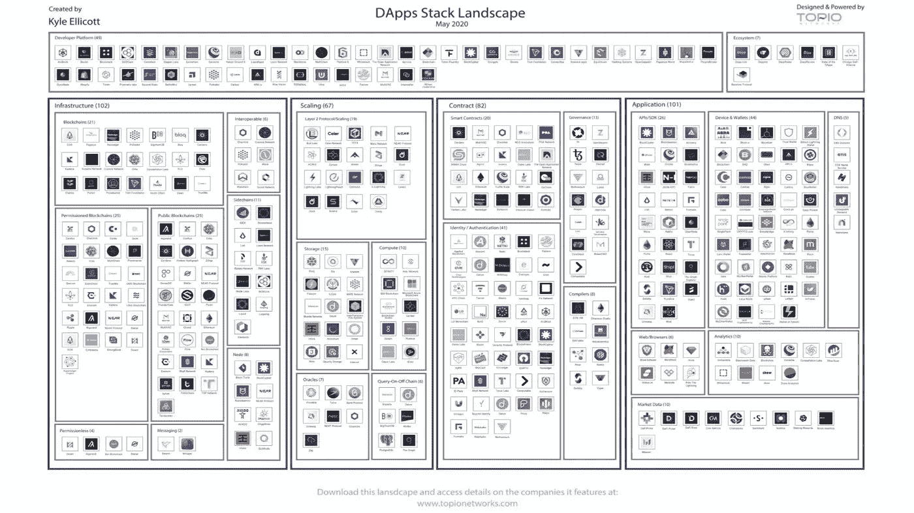

# 北海巨妖成为美国第一家加密银行/万事达卡，支持 CBDCs /苹果击退 DApps /社交令牌、NFT 和以太网 2.0 的崛起

> 原文：<https://medium.com/coinmonks/kraken-becomes-first-us-crypto-bank-mastercard-enabling-cbdcs-apple-pushing-back-on-dapps-b90670e36d28?source=collection_archive---------2----------------------->

Photo by [Tim Mossholder](https://unsplash.com/@timmossholder?utm_source=unsplash&utm_medium=referral&utm_content=creditCopyText) on [Unsplash](https://unsplash.com/s/photos/neon-sign?utm_source=unsplash&utm_medium=referral&utm_content=creditCopyText)

*2020 年 9 月 18 日*

*在短暂的休息和发布大量新研究(见下文)后，我又回到了我们定期安排的节目中！本周有很多内容要讨论，我们知道这个行业从不休息，所以让我们开始吧。*

****怀俄明州*** *授予密码交易所* ***【北海巨妖】*** *在该州创建密码银行(* ***【北海巨妖金融】*** *)的许可证，使其成为美国第一家创建银行的密码交易所。布鲁克林篮网队控球后卫* ***斯宾塞·丁翁迪*** *宣布* ***卡拉西*** *，简称“创造者银河”，这是一个区块链支持的平台，用于新一代有影响力的人&创造者之间的社区互动，将于今年秋天推出。* ***万事达卡*** *发布新平台，为各国央行提供虚拟测试环境，模拟央行数字货币的发行、分配、兑换和日常使用(****CBD cs****)。* ***法国巴黎银行*** *证券公司现在用数字资产为 ASX、香港交易所创建 DLT 应用程序。* ***苹果*** *被控反以太坊* ***DApps 的反竞争行为。币安****&****桑坦德*** *双双推出新的+1 亿美元投资基金专注于投资未来金融。我们来看看* ***【元宇宙】*** *从经济学到新资助方式再到* ***社会/个人代币*******数字艺术*** *卖北六位数到****NFTs****。特纳体育* *推出了一个区块链支持的游戏社区，用户可以在其中创建、训练、甚至交易数字运动员，称为 Blockletes。我坐下来与* ***约瑟夫·卢宾*******ConsenSys****获取最新* ***以太坊 2.0*** *更新，DeFi，&****ConsenSys 法定人数*** ***CB Insights****收购****block data****打造出区块链数据产品。此外，还有大量关于行业研究、发布、DApps、oracles 等更多内容！尽情享受吧！！****

## **🏦北海巨妖将成为美国第一家加密银行。这就是为什么它很重要**

**怀俄明州授予北海巨妖加密交易所在该州创建加密银行的许可证，该银行暂定名为**北海巨妖金融**。这使得北海巨妖成为第一家创建银行的美国加密交易所。具体来说，这是一个“特殊目的存管机构”，这意味着北海巨妖可以托管数字资产，运营支付系统，并允许客户在菲亚特和加密之间轻松切换。北海巨妖金融公司的客户目前仅限于美国居民，不包括纽约人。一旦银行推出加密货币，他们可以用加密货币支付账单和领取工资，还可以在银行持有加密货币……[阅读更多](https://decrypt.co/42077/kraken-first-us-crypto-bank-heres-why-matters) — [解密](https://medium.com/u/2de7a312127a?source=post_page-----b90670e36d28--------------------------------)**

***相关:*🏦[*怀俄明州银行监管机构窃听链分析提升加密追踪力度*](https://www.coindesk.com/wyoming-chainalysis)**

## **🏀布鲁克林网络公司的斯宾塞·丁翁迪正在为有影响力的人推出一款基于区块链的应用程序 Calaxy**

****

**Source: [Forbes](https://www.forbes.com/sites/shlomosprung/2020/09/15/spencer-dinwiddie-creating-blockchain-based-influencer-monetization-platform-calaxy-nba-brooklyn-nets/#643a1022652f), Spencer Dinwiddie**

**布鲁克林篮网队的控球后卫斯宾塞·丁翁迪在三月份推出了一个区块链支持的数字代币，这只是一个更雄心勃勃的计划的开始，该计划利用区块链推出一个围绕新一代影响者和创造者 T21 的社区参与平台。丁威迪和他的团队已经创建了 [**Calaxy**](https://calaxy.com/) ，这是“creator galaxy”的缩写，一款预计在 10 月下旬上线的移动应用。在该应用程序上，创作者和影响者将能够出售与数字合同公司[chain link](https://medium.com/u/87d28920d977?source=post_page-----b90670e36d28--------------------------------)……[阅读更多](https://www.theblockcrypto.com/linked/72226/mastercard-crypto-card-wirex)整合的数字区块链支持的代币**

***相关:*🏌️ [*特纳推出区块链支持的新游戏平台*](https://sporttechie.com/turner-launches-new-blockchain-backed-gaming-platform)**

## **⛓️ [以太坊 2.0 即将到来，不太可能加快企业 DeFi 的采用](https://cointelegraph.com/news/ethereum-2-0-is-coming-unlikely-to-speed-up-enterprise-defi-adoption)**

**Source: [Baseline Protocol](https://youtu.be/tJOBpnnYe_U)**

**以太坊 2.0 今年即将到来，虽然企业不会立即使用它，但 DeFi 的兴起将在组织中发挥重要作用。虽然围绕确切发布日期的猜测仍然存在，但软件公司 [ConsenSys](https://medium.com/u/6c7078bf7b01?source=post_page-----b90670e36d28--------------------------------) 的联合创始人和创始人 [Joseph Lubin](https://medium.com/u/6a370863659c?source=post_page-----b90670e36d28--------------------------------) 在最近的一次采访中透露，以太坊 2.0 确实会很快到来:“以太坊 2.0 即将到来。我们现在正处于我们认为的最终测试阶段。在不同团队构建的许多以太坊 2.0 客户端中，我们在 testnet 上有许多流畅的操作。”… [阅读更多信息](https://www.coindesk.com/mastercard-releases-platform-enabling-central-banks-to-test-digital-currencies)——[雷切尔·沃尔森](https://medium.com/u/56cedbf92c62?source=post_page-----b90670e36d28--------------------------------)**

# **🚨 📝区块链行业状况:2020 年第三季度**

****

**Source: [Topio Networks](https://s3.amazonaws.com/spoke-profiles-prod-assets/uploads/9312f9408ba3ef581b818c797cc7137d829d8a04/original/Blockchain_26th_Aug.pdf)**

**我们正在向完全数字化的经济转型，2020 年区块链行业的活动比以往任何时候都更能证明这一点。现在 w/**1100+公司**大楼& **资金(300 亿+美元！将构成这种新经济的基础设施层。[详细分类](https://s3.amazonaws.com/spoke-profiles-prod-assets/uploads/6b002da229bbc3453d3e903499d5671567703fb6/original/Q3_2020_Update_Blockchain_Landscape.pdf)现已发布，包括对前景的[深入概述](https://youtu.be/eE6XZ1RVblA)，新类别&商业模式、机会领域、新兴类别、用例，以及对 2020 年剩余时间到 2021 年的展望。****

## **💳[万事达卡发布平台，使中央银行能够测试数字货币](https://www.coindesk.com/mastercard-releases-platform-enabling-central-banks-to-test-digital-currencies)**

**支付巨头万事达卡发布了一个平台，允许央行测试央行数字货币( **CBDCs** )。MasterCard 推出的虚拟测试环境可以模拟银行和金融服务提供商以及购买日常商品和服务的最终消费者之间的 CBDCs 发行、分配和交换。新协议将有助于金融机构理解基于商品的发展中国家的可行性，并允许它们探索新的使用案例，包括在地方或区域一级发行。他们可以进一步评估与支付卡等现有支付平台的兼容性……[了解更多](https://www.coindesk.com/mastercard-releases-platform-enabling-central-banks-to-test-digital-currencies)**

***相关:*💸[*未来的金融是分散的*](https://synthesis.substack.com/p/the-future-of-finance-is-decentralized)*——*[*伊恩·李*](https://medium.com/u/4a736934e1b7?source=post_page-----b90670e36d28--------------------------------)**

# **👀社交代币的兴起& NFTs 繁荣🖼️:**

**在这些每周的帖子中，我想提醒大家注意你需要关注的更广泛的区块链领域中的类别。它始于分散化应用(DApps)和金融(DeFi)，然后是 CBDCs 和中国的区块链努力，以及过去几个月的许多其他努力。现在是时候展示开始对我们未来的数字自我产生重大影响的两个领域了——**社交/个人代币**&**NTFs/数字收藏品&艺术**。**

**2020 年，社交令牌运动不仅仅在这里开始，因为正在进行的努力已经向我们展示了我们与社区互动和互动的未来——无论规模、地理位置或平台如何(去中心化！).当与更个性化的令牌相结合时，我们开始见证一种范式的转变，不仅是持续的收入流，而且是由我们的数字自我驱动的我们个人(并不遥远)微观经济的不断扩大的机会。对许多人来说，这似乎是一个遥远的概念，而事实上我们比你想象的要近得多。在接下来的几个月里，我们将会报道这个早晨，在此之前，请看看下面类别中的一些伟大的专家和声音。**

**引用 [Dapper Labs](https://medium.com/u/6544777e30d2?source=post_page-----b90670e36d28--------------------------------) 的 [Roham Gharegozlou](https://medium.com/u/57907c0bb0a6?source=post_page-----b90670e36d28--------------------------------) 的话，“这不再是关于‘品牌’的问题:这是关于社区”——[Twitter](https://twitter.com/rohamg/status/1306986654494670848)。**

**下周…**NTFs/数字收藏品&艺术**以及它们之间的关系。**

****

**Source: [Brian Flynn, Twitter](https://twitter.com/Flynnjamm/status/1306021448901894144?s=20)**

****

**Source: [Ian Lee, Twitter](https://twitter.com/ianjohnlee/status/1306378164470296578?s=20)**

****

**Source: [Coin Artist, Twitter](https://twitter.com/coin_artist/status/1303519556384616448)**

**📖[社会标志:硬币的 E-Den 辛迪加的崛起](https://www.delphidigital.io/reports/social-tokens-the-rise-of-the-coins-e-den-syndicate/)——[Piers Kicks](https://medium.com/u/d6dc85d0fb13?source=post_page-----b90670e36d28--------------------------------)**

**📖[硬币和社交代币的兴起](https://www.playtoearn.online/2020/09/09/coin-and-the-rise-of-social-tokens/)**

****

**Source: [dclblogger.eth, Twitter](https://twitter.com/DCLBlogger/status/1304420103614726144)**

**📖[虚拟世界的战争:透视元宇宙经济](https://messari.io/article/war-of-the-virtual-worlds-a-look-into-the-metaverse-economies)——[梅森·尼斯特伦](https://medium.com/u/77cd1f84b592?source=post_page-----b90670e36d28--------------------------------)，[梅萨里](https://medium.com/u/7cf93d3c3400?source=post_page-----b90670e36d28--------------------------------)**

**💸[非技术基金的新筹资方法和市场](https://andrewsteinwold.substack.com/p/new-funding-methods-and-markets-for) — [Andrew Steinwold](https://medium.com/u/4b901dfcf67?source=post_page-----b90670e36d28--------------------------------)**

**📖 [DeFi x NFTs = NFTfi](https://tokentuesdays.substack.com/p/defi-x-nfts-nftfi) — [库珀·特利](https://medium.com/u/af8b40222d18?source=post_page-----b90670e36d28--------------------------------)**

**📖[介绍:The care bears NFTs，待售优质资产](/sandbox-game/introducing-the-carebears-nfts-premium-assets-for-sale-eec0d330489c) — [沙盒](https://medium.com/u/22d1079b43b4?source=post_page-----b90670e36d28--------------------------------)**

**🎨[著名密码艺术家帕克发布数字艺术作品集](https://decrypt.co/42151/famous-crypto-artist-pak-to-release-collection-of-digital-art)——[解密](https://medium.com/u/2de7a312127a?source=post_page-----b90670e36d28--------------------------------)**

# **本周的更多内容:**

**💸[币安的新平台将用 1 亿美元的资金连接 CeFi 和 DeFi】](https://www.coindesk.com/binances-cefi-and-defi-100-million-fund)**

**💸桑坦德银行成立了价值 4 亿美元的金融科技风险投资部门，现名为 Mouro Capital**

**💸 [CB Insights 收购 BLOCKDATA 以构建区块链数据产品](https://www.coindesk.com/cb-insights-blockdata-acquisition)**

**📖[企业需要第三方让 Oracles 工作](https://www.coindesk.com/enterprises-third-parties-oracles)——[保罗·布罗迪](https://medium.com/u/275d4a02c655?source=post_page-----b90670e36d28--------------------------------)**

**📖[毕马威、德勤、EY 和普华永道关于区块链和加密的计划](https://decrypt.co/40865/inside-kmpg-deloitte-ey-and-pwcs-plans-for-blockchain-and-crypto)**

**📖[比特币基地和 Circle 将 Algorand 区块链加入快速增长的数字美元“稳定币”市场](https://www.forbes.com/sites/jasonbrett/2020/09/14/coinbase-and-circle-adds-algorand-blockchain-to-fast-growing-digital-dollar-stablecoin-market)**

**📖[法国巴黎银行证券公司利用数字资产为 ASX、香港交易所创建 DLT 应用](https://www.ledgerinsights.com/bnp-paribas-dlt-asx-hkex-digital-asset-daml-blockchain/)**

**📖孟加拉国将首次开通区块链汇款服务**

**📖[三星有了和艾，有望超越 6G](https://techwireasia.com/2020/09/samsung-looks-to-6g-and-beyond-with-blockchain-and-ai/)**

**📖 [VeChain 为包括麦当劳在内的中国食品安全集团提供区块链技术](https://www.coindesk.com/vechain-blockchain-china-food-safety-alliance-mcdonalds-ibm)**

# **分散式应用程序手表**

## **📖[比特币基地首席执行官指责苹果对以太坊 Dapps 的反竞争行为](https://www.trustnodes.com/2020/09/12/coinbase-ceo-accuses-apple-of-anti-competitive-behavior-against-ethereum-dapps)**

**布莱恩·阿姆斯壮，比特币基地的联合创始人兼首席执行官，指控苹果公司对以太坊 **DApps** 的反竞争行为。阿姆斯特朗说:问题就在这里。苹果告诉我们，我们不能在我们的 iOS 应用程序中添加以下功能:(1)使用加密货币赚钱的能力，以及(2)访问分散金融应用程序(有时称为 DeFi 应用程序或 DApps)的能力。我们已经尝试通过常规渠道与苹果讨论此事，我直接向领导层请求对话，但我们似乎陷入了死胡同……[阅读更多信息](https://www.coindesk.com/everything-you-need-to-know-about-ethereum-2-0)**

## **📖Chainlink 与 E & Y 和微软支持的 Baseline 的集成会让以太坊企业版做好准备吗？**

**基准协议[背后的团队](https://www.baseline-protocol.org/)——由 EY、微软、ConsenSys 和其他使用区块链公共以太坊的公司开创的以企业为中心的区块链项目——已经宣布支持与分散式 oracle 提供商 Chainlink 的集成。该公告对 baseline protocol 和 Chainlink 来说都是一个重要的里程碑，因为它们都试图进入企业采用公共区块链… [阅读更多信息](https://www.forbes.com/sites/benjessel/2020/09/14/will-chainlinks-integration-with-ey-and-microsoft-backed-baseline-make-ethereum-enterprise-ready/#4852fc205e4c)**

## **📖 [Q2 高风险 Dapps 生态系统报告](https://dappradar.com/blog/q2-high-risk-dapps-ecosystem-report)**

**根据 Q2 高风险 DApps 生态系统报告，TRON 占所有协议中高风险类别日常活动的 94%。DappRadar 从一开始就表现出高风险的 DApps 类别。在 [DappRadar](https://medium.com/u/b355b203c3dd?source=post_page-----b90670e36d28--------------------------------) 上列出的超过 900 个 DApps 属于高风险类别，使其成为仅次于赌博的第二大热门类别。基本上高风险的 DApps 是高收益的投资项目，承诺高投资回报，但这些通常是不可持续的……[阅读更多](https://dappradar.com/blog/q2-high-risk-dapps-ecosystem-report)**

**🚀 [Avalanche Mainnet 将于 9 月 21 日发布](/avalabs/ready-for-liftoff-avalanche-mainnet-set-to-launch-on-september-21-66a1def8d3b3) — [艾娃实验室](https://medium.com/u/f7c9f4ea738f?source=post_page-----b90670e36d28--------------------------------)**

**💸[币安用 BUSD Stablecoin 支持流量区块链](https://news.bitcoin.com/binance-supporting-flow-blockchain-with-busd-stablecoin/) — [流量](https://medium.com/u/22ac47d15ea7?source=post_page-----b90670e36d28--------------------------------)**

# **📺知识滴#VCTV:**

**本周，我与投资者坐在一起，谈论了在 VCTV 发生的区块链和金融科技领域的最新活动和投资。尽情享受吧！**

# **🎙️研究:2020 年 DApps 现状:**

****

**Source: [Topio Networks](https://www.topionetworks.com/markets/dapps-stack-landscape-5de8d07eb9abe453e04203f8)**

***现已提供，免费是我最新研究的去中心化应用或*[***【DApp】【栈】景观图***](https://s3.amazonaws.com/spoke-profiles-prod-assets/uploads/a069e1e1e798c975d4eca968c72f4ac1352d62a4/original/DApps_Stack_Landscape_Q2_2020.pdf?utm_source=Social%20Media&utm_medium=LinkedIn&utm_campaign=Topio%20-%20Dapps%20Landscape%20update&utm_content=S3%20Link)**—Q2 2020 版。这张地图提供了新兴 DApps 行业的全面概述和分类，突出显示了在构建下一代应用程序中发挥重要作用的 400 多家全球公司。作为奖励，我包括了一些生态系统玩家和团体，当你准备发布你的应用时，你需要熟悉它们。如果这是你看到的第一个版本，那就把它当作你进一步理解不仅仅是这个行业，而且是构建一个完全或部分去中心化的应用程序所需的所有核心技术的指导性路线图(DApp)。****

**📣*想要了解区块链、DApps、DeFi 和 FinTech 行业的所有头条新闻、投资、深度研究和最新动态吗？* [***订阅***](https://www.topionetworks.com/newsletters) *并关注我的* [***推特***](https://twitter.com/kyleellicott) *获取每周更新和更多！***

## **另外，阅读**

*   **最好的[密码交易机器人](/coinmonks/crypto-trading-bot-c2ffce8acb2a)**
*   **[密码本交易平台](/coinmonks/top-10-crypto-copy-trading-platforms-for-beginners-d0c37c7d698c)**
*   **最好的[加密税务软件](/coinmonks/best-crypto-tax-tool-for-my-money-72d4b430816b)**
*   **[最佳加密交易平台](/coinmonks/the-best-crypto-trading-platforms-in-2020-the-definitive-guide-updated-c72f8b874555)**
*   **最佳[密码借贷平台](/coinmonks/top-5-crypto-lending-platforms-in-2020-that-you-need-to-know-a1b675cec3fa)**
*   **[最佳区块链分析工具](https://bitquery.io/blog/best-blockchain-analysis-tools-and-software)**
*   **[加密套利](/coinmonks/crypto-arbitrage-guide-how-to-make-money-as-a-beginner-62bfe5c868f6)指南:新手如何赚钱**
*   **最佳[加密制图工具](/coinmonks/what-are-the-best-charting-platforms-for-cryptocurrency-trading-85aade584d80)**
*   **[莱杰 vs 特雷佐](/coinmonks/ledger-vs-trezor-best-hardware-wallet-to-secure-cryptocurrency-22c7a3fd391e)**
*   **了解比特币的[最佳书籍有哪些？](/coinmonks/what-are-the-best-books-to-learn-bitcoin-409aeb9aff4b)**
*   **[3 商业评论](/coinmonks/3commas-review-an-excellent-crypto-trading-bot-2020-1313a58bec92)**
*   **[AAX 交易所评论](/coinmonks/aax-exchange-review-2021-67c5ea09330c) |推荐代码、交易费用、利弊**
*   **[Deribit 审查](/coinmonks/deribit-review-options-fees-apis-and-testnet-2ca16c4bbdb2) |选项、费用、API 和 Testnet**
*   **[FTX 密码交易所评论](/coinmonks/ftx-crypto-exchange-review-53664ac1198f)**
*   **[n 零审核](/coinmonks/ngrave-zero-review-c465cf8307fc)**
*   **[Bybit 交换审查](/coinmonks/bybit-exchange-review-dbd570019b71)**
*   **[3Commas vs Cryptohopper](/coinmonks/cryptohopper-vs-3commas-vs-shrimpy-a2c16095b8fe)**
*   **最好的比特币[硬件钱包](/coinmonks/the-best-cryptocurrency-hardware-wallets-of-2020-e28b1c124069?source=friends_link&sk=324dd9ff8556ab578d71e7ad7658ad7c)**
*   **最佳 [monero 钱包](https://blog.coincodecap.com/best-monero-wallets)**
*   **[莱杰纳米 s vs x](https://blog.coincodecap.com/ledger-nano-s-vs-x)**
*   **[bits gap vs 3 commas vs quad ency](https://blog.coincodecap.com/bitsgap-3commas-quadency)**
*   **[莱杰纳米 S vs 特雷佐 one vs 特雷佐 T vs 莱杰纳米 X](https://blog.coincodecap.com/ledger-nano-s-vs-trezor-one-ledger-nano-x-trezor-t)**
*   **[block fi vs Celsius](/coinmonks/blockfi-vs-celsius-vs-hodlnaut-8a1cc8c26630)vs Hodlnaut**
*   **Bitsgap 评论——一个轻松赚钱的加密交易机器人**
*   **为专业人士设计的加密交易机器人**
*   **[PrimeXBT 审查](/coinmonks/primexbt-review-88e0815be858) |杠杆交易、费用和交易**
*   **[埃利帕尔泰坦评论](/coinmonks/ellipal-titan-review-85e9071dd029)**
*   **[赛克斯·斯通评论](https://blog.coincodecap.com/secux-stone-hardware-wallet-review)**
*   **[区块链评论](/coinmonks/blockfi-review-53096053c097) |从您的密码中赚取高达 8.6%的利息**