# 北海巨妖评论——美国最佳加密交易所？

> 原文：<https://medium.com/coinmonks/kraken-review-6165fc1056ac?source=collection_archive---------8----------------------->

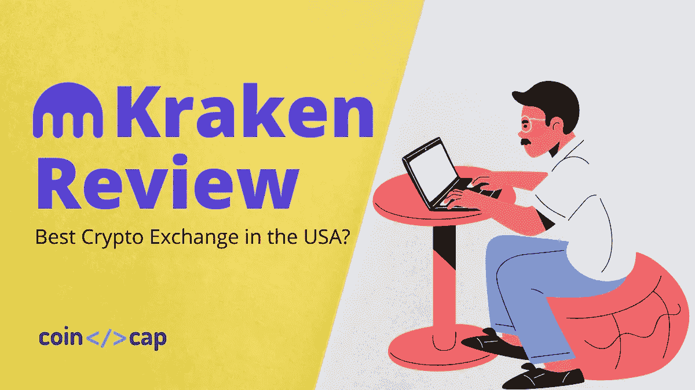

在本文中，我们将回顾自 2011 年以来一直存在的最佳交易平台之一**。**

# **摘要**

*   **他们的交易费用相当合理，并且随着用户增加 30 天交易量而降低。**
*   **他们提供 24/7 客户支持服务，例如与专业人士实时聊天，以解决您的咨询问题。**
*   **北海巨妖有三个层面的核查进程。**
*   **北海巨妖也有专门的常见问题部分。**
*   **它支持[保证金交易](https://coincodecap.com/bitcoin-margin-trading-exchange)将您的交易量提高 5 倍。**
*   **其他功能包括杠杆高达 50 倍的期货交易、柜台交易、堆叠和密码观察。**
*   **大约有 60 多种密码货币可供选择。**
*   **该交换平台面向美国居民，不包括两个地区:华盛顿和纽约。**

# **什么是北海巨妖交易所？**

**[北海巨妖](https://r.kraken.com/e44GD1)从 2011 年开始就是一个基于旧金山的[密码货币交换平台](https://coincodecap.com/crypto-exchange)。此外，它是由[杰西·鲍威尔](https://www.linkedin.com/in/jessepowell)创建的最古老和最大的交易平台之一。凭借其交互式和用户友好的界面，您可以使用 60 多种可用的密码货币兑换法定货币，包括美元、加拿大元、欧元和英镑。**

**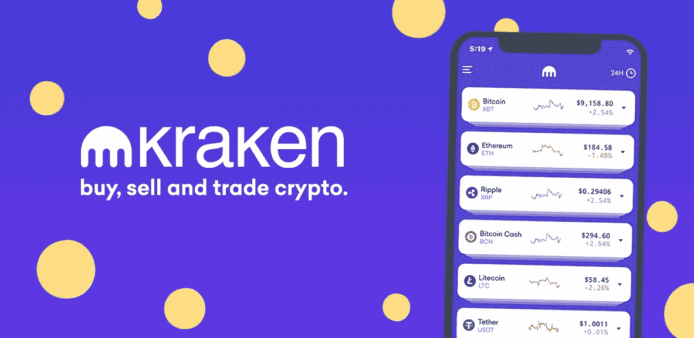**

**然而，华盛顿州和纽约州的居民不能参加北海巨妖的服务。然而，它提供了许多功能，包括令人印象深刻的 24/7 支持、场外交易台、[保证金交易、期货](https://coincodecap.com/margin-trading)、指数、[买入](https://coincodecap.com/staking-crypto)、以及账户管理选项。**

# **如何创建北海巨妖外汇账户？**

*   **要创建关于北海巨妖的账户，首先，访问[北海巨妖](https://r.kraken.com/e44GD1)的官方网站。然后，点击右上角北海巨妖主页上的“创建帐户”。**
*   **填写有效的详细信息，然后单击创建帐户。**
*   **您将收到一封验证电子邮件。单击给定的链接进行验证，或输入代码并完成注册过程。**

**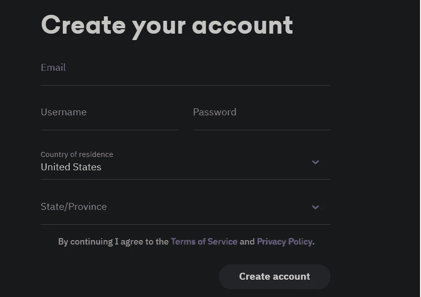**

# **在北海巨妖交易？**

**要在[北海巨妖](https://r.kraken.com/e44GD1)上开始交易，你必须首先创建你的账户，验证它，并存入资金开始交易。此外，您可以查看以上部分，了解创建您的帐户的步骤。请注意，没有验证，您不能存款。**

# **怎么验证你的账号？**

**北海巨妖有五个级别的验证，初级，快速，中级，亲个人，亲企业。但是，根据您的地理区域和帐户类型，级别会有所不同。例如，如果你是非美国居民，并且有一个个人[**账户**](https://r.kraken.com/e44GD1)**，你将只有三个级别:初级、中级和个人级。此外，根据您的验证级别，您将获得不同的优势。****

## ****北海巨妖 1 级验证****

****一级或初级验证将为您提供无限的加密货币存款，此外，您每天还可以提取大约 5000 美元。此外，您将能够使用包括购买、出售或兑换加密货币、[保证金交易](https://coincodecap.com/margin-trading)和赌注在内的功能。但是，您将无法进行银行转账。****

*   ****首先，点击右上角的用户名，然后点击“获得验证”新的一页将会打开。在“starter”部分，单击“Verify”****
*   ****其次，填写详细信息，并点击“继续”****
*   ****最后，通常需要 1-2 分钟才能通过验证，这一级别的验证过程是自动进行的。****

****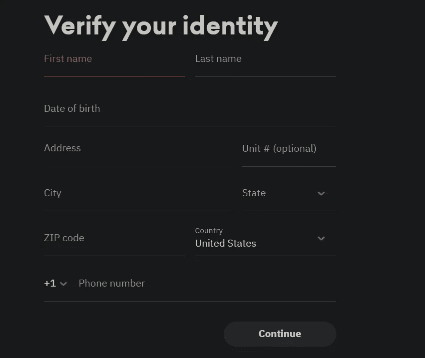****

## ****北海巨妖二级验证(中级)****

****要在 [**北海巨妖**](https://r.kraken.com/e44GD1) 上完成该过程，点击“中间”部分的“验证”。在这种情况下，你必须验证你的身份。根据你的职业，需要上传的文件也不同。因此，为了避免您的验证延迟，请上传符合要求标准的有效文档。参照[北海巨妖支架](https://support.kraken.com/hc/en-us/articles/360000672203-Required-documents-for-Tier-3-verification)检查所有要求。****

****完成后，你将可以每天用 10 万美元进行银行转账。您的提款限额也将从每天 5k 美元增加到 500K 美元。此外，用户将能够使用除 OTC 柜台以外的所有功能。通常需要 4-5 分钟来验证。****

## ****北海巨妖三级认证****

****根据北海巨妖 3 级验证，你必须提供你的财务信息，你将能够存款，取款和银行转账没有任何限制。此外，您将能够使用所有的功能。在开始专业级认证之前，必须完成中级认证。但是，验证过程需要几天时间才能完成。****

****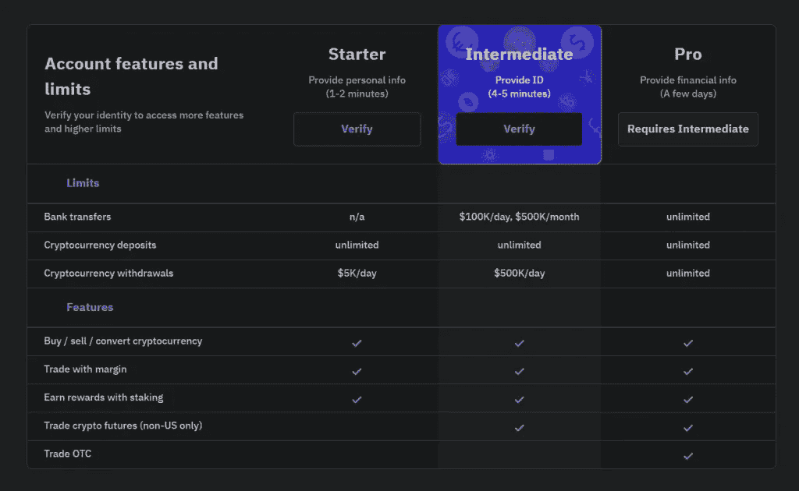****

# ****如何在北海巨妖存款？****

****要在 [**【北海巨妖】**](https://r.kraken.com/e44GD1) 开始交易，你需要存入法定货币或加密货币。以下是为您的帐户注资的步骤:****

*   ****首先，如果你用的是笔记本电脑，点击顶部菜单中的“资金”。****
*   ****其次，如果您使用的是手机，请点击导航栏底部的操作图标，然后选择“存款”****
*   ****第三，你可以使用搜索栏找到你喜欢的法定货币/加密货币，或者点击“显示所有资产”选项。****
*   ****现在，选择其中任何一个并点击“存款”****
*   ****然后，您可以从下拉菜单中选择任何一个资金提供者。****
*   ****最后，按照北海巨妖存款页面上的说明完成交易。****

****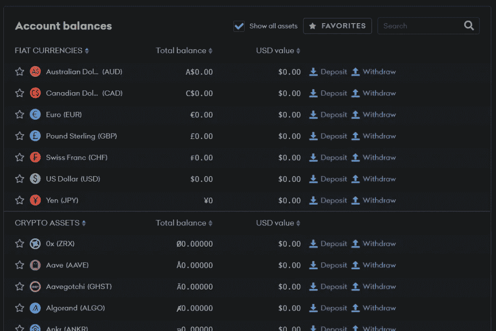****

# ****北海巨妖评论:费用结构****

******北海巨妖**费用合理且有竞争力。****

## ****北海巨妖专业费****

****在北海巨妖，每月交易额低于 5 万美元的用户必须支付 0.16%的做市商费用和 0.26%的收款人费用。这个数额随着用户交易量的增加而不断减少。最高交易量为 1，000，000 美元+的用户无需支付任何做市商费用，收取者费用低至 0.10%。****

****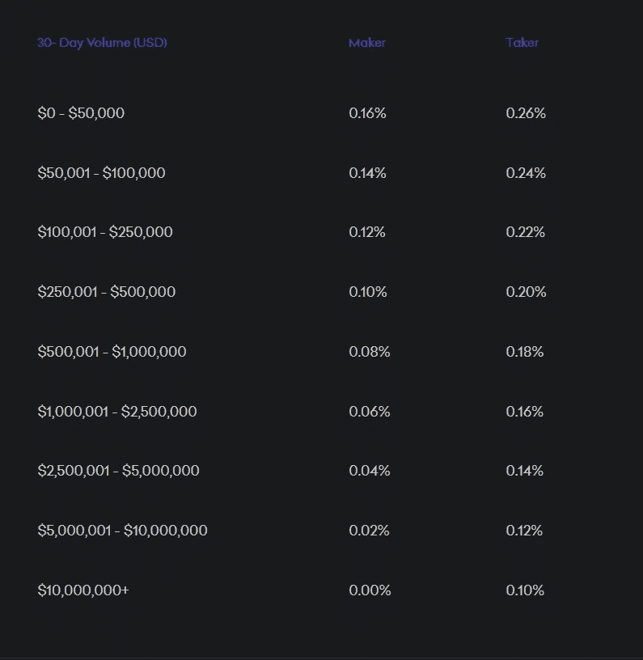****

## ****期货交易费****

****还是那句话，费用取决于用户每月的交易量。对于北海巨妖期货，交易量低于 10 万美元的用户为 0.0200%的做市商费用和 0.0500%的收单商费用。****

****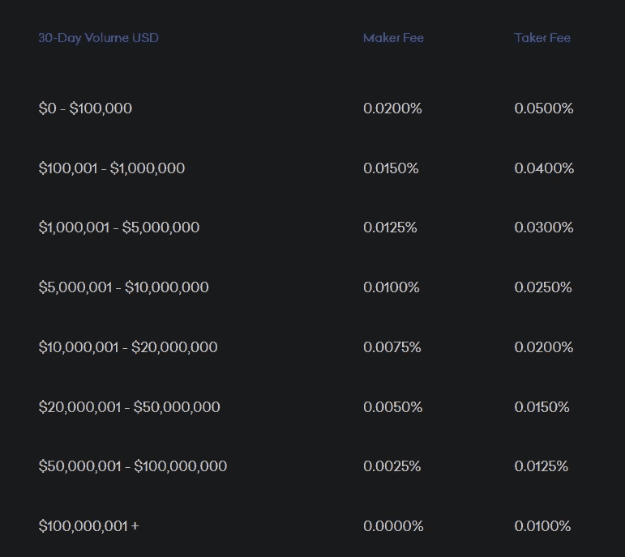****

## ****北海巨妖提款费****

****北海巨妖的退市费与大多数交易所相当。他们通常对 BTC 收取 0.0005 英镑的取款费，对以太坊收取 0.005 英镑左右的取款费。这些硬币明显更便宜。除此之外，硬币，包括系绳，有 5.0 USDT 和 0.05 for 的高提现费。要查看完整的退出费用列表，请访问[北海巨妖支持](https://support.kraken.com/hc/en-us/articles/360000767986-Cryptocurrency-withdrawal-fees-and-minimums)。****

# ****北海巨妖评论:存款方法****

****用户可以将 cryptos 或 Fiat 作为资金存入他们的账户。北海巨妖允许其用户拥有无限量的加密存款，甚至对没有做过 KYC 的交易者也是如此。然而，提款是有限的。这个平台接受它所支持的加密货币。****

****另一方面，为了进行固定存款，用户必须完成他们的 KYC 直到中级水平。[北海巨妖](https://r.kraken.com/e44GD1)支持加元、日元、英镑、美元、瑞士法郎、澳元和欧元。****

****北海巨妖没有任何信用卡设施。因此，存款的唯一方式是通过银行或电汇。支持的方法包括 SEPA(针对欧盟居民)、SWIFT(针对全球)、FedWire(针对美国居民)和 SIC(针对列支敦士登和瑞士)。****

# ****北海巨妖评论:特写****

****除了交易，购买和出售密码和菲亚特，**为用户提供了一些额外的功能。******

## ******北海巨妖期货******

******北海巨妖期货允许其用户以高达**50 倍的杠杆**交易顶级加密货币。这个特性对于初学者来说相当复杂，因此只推荐给有经验的客户。与直接交易资产相比，交易期货几乎没有什么优势:******

*   ****北海巨妖期货交易的手续费对做市商来说低至 0.0200%，对收单商来说低至 0.05%。****
*   ****它允许用户从价格的增减中获益。****
*   ****期货为用户提供了财务杠杆。****

****目前，有五种密码可用于北海巨妖期货:莱特币、比特币现金、[比特币](https://coincodecap.com/a-candid-explanation-of-bitcoin)、以太和 XRP 波纹。期货交易的利润将立即结算并可用。****

****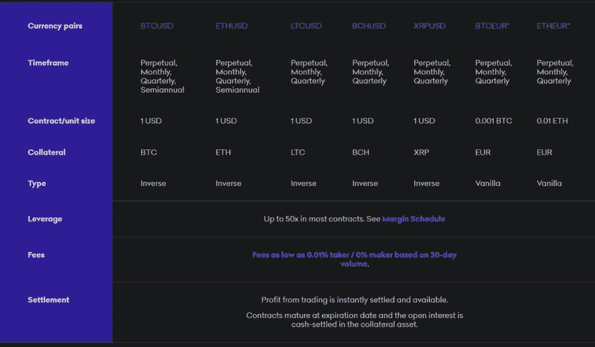****

## ****北海巨妖保证金交易****

****[北海巨妖](https://r.kraken.com/e44GD1)允许其用户以高达 5 倍的利润进行交易。这意味着你可以在这个交易平台上完成一笔交易，只需要五分之一的必要抵押品，其余部分由北海巨妖作为杠杆。这将帮助你增加潜在的交易利润。这并不意味着不会有任何损失。更高的利润总是伴随着更高的风险。****

****任何经过验证的用户都可以使用保证金交易，目前支持 16 种加密货币，包括:****

*   ****比特币(BTC)、****
*   ****以太坊(ETH)，****
*   ****系绳(USDT)，****
*   ****比特币现金(BCH)、****
*   ****泰佐斯(XTZ)，****
*   ****莱特币，****
*   ****卡尔达诺(阿达)，****
*   ****EOSIO (EOS)，****
*   ****破折号(Dash)，****
*   ****创(TRX)、****
*   ****莫内罗(XMR)，****
*   ****以太坊经典(ETC)，****
*   ****占卜者，****
*   ****瑞波(XRP)、****
*   ****链环(link)，****
*   ****美元硬币(USDC)。****

****请注意，与其他交易相比，保证金交易的风险更大。因此，您应该仅在具备投资方面的高级知识时使用此功能。要了解更多，请阅读我们关于保证金交易的文章。****

# ****北海巨妖评论:加密手表****

****Cryptowatch 是一个高级交易终端，它分析并提供 4，000 个市场的实时数据，[实时加密图表](https://cryptotrader.tax/blog/the-best-charting-tools-for-crypto-traders)，并为一个地方的大约 25 个加密货币交易所提供交易服务。有了这个，你可以看到不同交易所的市场动态以及你的投资组合。用户必须创建一个单独的账户才能使用 [Cryptowatch](https://cryptowat.ch/account/create) 。****

## ****加密手表的优势****

****这些好处是你不需要购买额外服务就能得到的。****

*   ****从一个终端(也可在手机上使用)在多个交易所免费交易。****
*   ****您可以在您的投资组合页面上查看您的订单、头寸和交易历史。****
*   ****用户可以在 Trollbox 中与其他交易者聊天。****
*   ****用户可以使用流行的工具和指标来分析图表，如移动平均线、MACD、RSI 和布林线。****
*   ****你可以在你的图表上设置你的价格、技术分析提示和交易量。****

****付费版的 Cryptowatch 提供了额外的服务，比如将市场数据导入 Google Sheets、[自动化订单](https://blog.coincodecap.com/best-crypto-trading-bots)和提醒等。****

# ****北海巨妖评论:场外交易****

****北海巨妖**的柜台交易(OTC)对于那些希望在不通过加密交易所进行大额交易的客户来说是理想的选择。通过这种方式，客户将与北海巨妖交易商直接互动，并执行具体的交易价格和细节。北海巨妖为高净值用户提供更高的流动性和私人但个性化的服务。******

## ******OTC 柜台的好处******

*   ******它支持北海巨妖提供的所有可用的加密货币。******
*   ******这项服务是免费的。******
*   ******无论订单大小，它都会报出接近即期汇率的有竞争力的价格。******
*   ******用户将获得高超的一对一服务。******
*   ******你将获得由该部门的高技能成员提供的专业市场洞察力。******

# ******北海巨妖评论:赌注******

******北海巨妖的赌注服务鼓励用户把钱留在平台上。有了这个功能，你可以购买资产，随着时间的推移，你将获得回报。你可以把它和你的储蓄账户进行比较。你可以投资十种不同的加密货币。******

# ******北海巨妖评论:移动应用******

******北海巨妖有三款面向安卓和 iOS 用户的官方手机应用。******

## ******北海巨妖应用程序******

******这款 [**北海巨妖**](https://blog.coincodecap.com/go/kraken) 的应用拥有令人惊艳的动感设计。这是初学者友好的，并作出购买和出售加密迅速。有了它，您可以:******

*   ****在北海巨妖加密交易平台上创建一个帐户。****
*   ****完成您的验证过程。****
*   ****可以随时用您的支付卡或 ACH 网上银行存款或购物。****
*   ****立即出售或撤回。****
*   ****保存你最喜欢的加密货币。****
*   ****用信用卡和借记卡完成交易。这里请注意，购买目前只提供欧元。前往[北海巨妖支持](https://support.kraken.com/hc/en-us/articles/360048212832)了解完整要求。****
*   ****阅读博客上的文章。****
*   ****隐藏你的余额。****
*   ****设置您的双因素身份验证。****
*   ****管理批准的设备。****

****此应用程序适用于除克里米亚、古巴、伊朗、日本、朝鲜和叙利亚以外的所有国家和地区。下载 [**安卓**](https://play.google.com/store/apps/details?id=com.kraken.invest.app) 和 [**iOS**](https://apps.apple.com/us/app/id1481947260) 版本手机的 app。****

****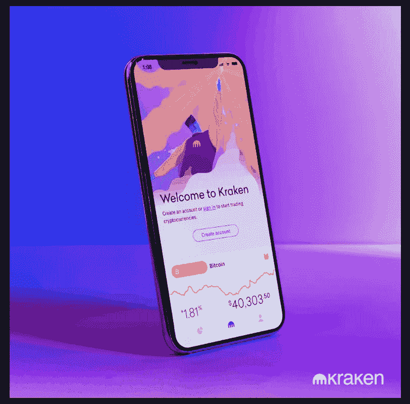****

## ****北海巨妖专业****

****[**北海巨妖** pro](https://r.kraken.com/e44GD1) 于 2019 年发布，供北海巨妖所有用户随时随地进行交易。使用该应用程序，用户可以:****

*   ****用 5X 杠杆做保证金交易。****
*   ****查看他们的堆叠和交易组合余额。****
*   ****获得专业的交易经验。****
*   ****采取利润订单类型，可以与市场交易，限制和止损。****
*   ****查看烛台价格图表。****

****你可以在安卓手机和 iOS 手机上下载该应用。你应该知道，北海巨妖专业连接与您的北海巨妖帐户使用 API 密钥，而不是使用用户名和密码。****

## ****北海巨妖期货****

****北海巨妖期货是北海巨妖的另一个官方应用。这样，用户可以:****

*   ****获得北海巨妖期货服务的无缝接入。****
*   ****获得高达 50 倍的利用率。****
*   ****交易的订单类型包括市价、限价、止损、止损限额、止盈、止盈限额、支架、触发进场和触发进场限额。****
*   ****把资金从他们的北海巨妖账户转到北海巨妖期货。****
*   ****从你的北海巨妖账户转到北海巨妖期货。****
*   ****使用个人支持和教育内容。****

****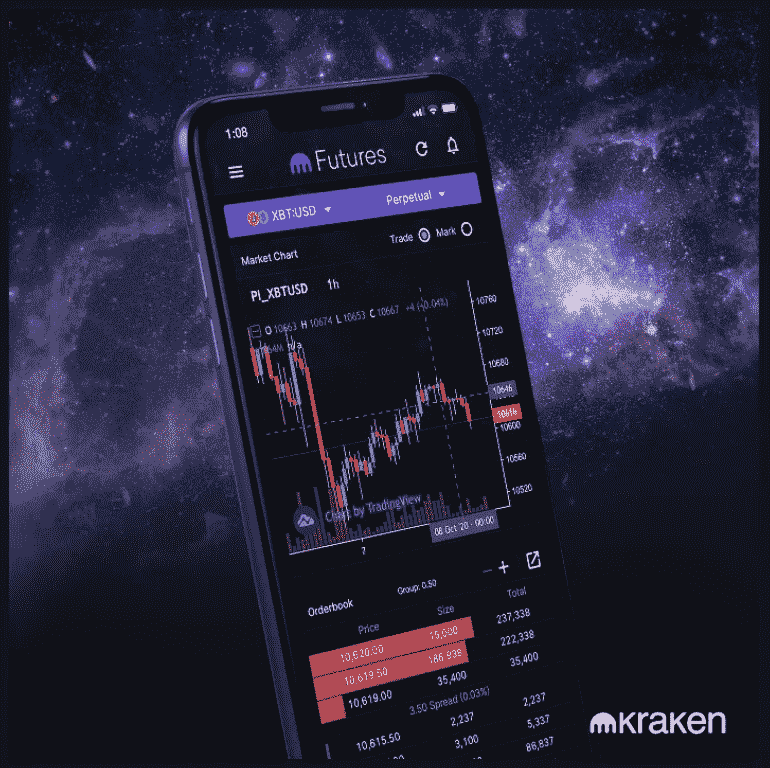****

****适用于 [Android 4.4](https://play.google.com/store/apps/details?id=com.krakenfutures) 及以上和 [iOS 10](https://apps.apple.com/app/kraken-futures/id1475904904) 及以上。此外，请注意，北海巨妖期货应用程序使用移动令牌连接您的北海巨妖帐户。在下载应用程序之前，请从[北海巨妖支持](https://support.kraken.com/hc/en-us/articles/360023786632)处检查您的资格标准。****

## ****如何生成移动令牌？****

*   ****登录您的[北海巨妖账户](https://r.kraken.com/e44GD1)，点击您的个人资料。****
*   ****点击设置->会话->移动令牌->请求新的移动令牌。****
*   ****将为移动令牌生成一个新的 Q.R .代码，有效期仅为 2 分钟。****
*   ****打开您的北海巨妖期货应用程序，点击登录，然后点击“下一步”****
*   ****扫描 Q.R .代码，您将收到一个六位数字的确认码。****
*   ****输入六位数，然后单击“保存”按钮。****
*   ****等待成功消息，您就可以开始使用它了。****

# ****如何使用北海巨妖 API 连接北海巨妖 Pro？****

****按照以下说明将北海巨妖专业版与您的帐户连接****

*   ****登录你的 [**北海巨妖账户**](https://r.kraken.com/e44GD1) ，点击右上角你的名字。****
*   ****点击安全-> API ->添加密钥。****
*   ****编辑两个部分，“密钥描述”和“密钥权限”****
*   ****在密钥描述中，输入您将记住的名称，并授予查询资金、查询分类帐条目、查询未结订单和交易、查询已结订单和交易、修改订单和取消/关闭订单的权限。****
*   ****点击“生成密钥”****
*   ****现在，打开你的北海巨妖应用，扫描 Q.R .代码。****
*   ****扫描后，点击“保存”，你就可以开始交易了。****

# ****北海巨妖评论:客户支持****

****北海巨妖的客户支持确实令人印象深刻。如果用户不知何故感到不满意，他们可以随时[联系支持](https://support.kraken.com/hc/en-us)并提交请求。此外，对于紧急情况，实时聊天也是全天候可用的。****

****这种实时聊天的最大好处是，它不仅仅是一个虚拟助理(人工智能)回复，而且你还可以直接连接到一个实时专家。通过实时聊天，大约需要 5-10 分钟的时间才能为您分配支持。用户也可以通过电子邮件 Id 与他们联系，但北海巨妖支持号码不可用。****

# ****北海巨妖评论:安全****

******北海巨妖一直是最古老、最安全、从未被黑客攻击过的交易平台之一。他们声称，用户的存款和资金被保存在离线、有空隙、地理上分散的冷库中。用户数据的个人信息也通过系统和数据级别的加密得到保护。******

******用户自己的账户受到各种可用的**北海巨妖安全特性**的保护。安全功能，如 2FA(双因素认证)，电子邮件提款确认，全球设置时间锁，PGP 签名和加密的电子邮件，以及其他一些功能。你可以访问他们网站的“[安全](https://www.kraken.com/en-us/features/security/)”部分来了解更多信息。******

****在流动性安全方面，北海巨妖保持充分的储备，以避免任何银行挤兑的可能性。****

# ****北海巨妖评论:利弊****

## ****赞成的意见****

*   ****交易费用低。****
*   ****高度关注安全性。****
*   ****高效的全天候客户支持和实时聊天选项。****
*   ****具有较高的流动性。****
*   ****像[赌注](https://blog.coincodecap.com/staking-crypto)、场外交易台、期货交易、[保证金交易](https://blog.coincodecap.com/margin-trading)和加密手表等功能都是可用的。****
*   ****三个不同用途的移动应用程序。****
*   ****用户友好的有吸引力的界面。****

## ****骗局****

*   ****不适合初学者。****
*   ****账户资金流程低。****
*   ****没有税收支持。****

# ****北海巨妖评论:结论****

****总的来说，我们可以说 [**北海巨妖**](https://r.kraken.com/e44GD1) 是最好的加密交换平台之一。这个平台自 2011 年就已经存在，这意味着它提供的服务肯定是用户的首选。通过精英安全措施和大量加密和法定货币，用户可以交易、购买、出售和入股。****

****在三个可用的应用程序中，最新的“北海巨妖”是一个初学者友好的应用程序，具有额外的功能。随着它的前进，北海巨妖无疑将继续发展并为其用户提供最好的服务。****

# ****常见问题****

******北海巨妖有加盟计划吗？******

****是的，北海巨妖提供行业领先的加盟计划。他们的支出是从客户那里收取的交易费用的 20%。您可以从[北海巨妖支持](https://support.kraken.com/hc/en-us/articles/360027545252-Kraken-Affiliate-program)处查看需求。另外，你必须填写这张[表格](https://app.impact.com/campaign-promo-signup/Kraken.brand?execution=e1s1)才能成为北海巨妖的会员。****

******美国居民可以交易北海巨妖期货吗？******

****北海巨妖期货不适用于美国，包括其他一些地区，如阿富汗、阿尔及利亚、孟加拉国、伊拉克、日本、英国、苏丹等。你可以在这里找到受限国家的列表[。](https://support.kraken.com/hc/en-us/articles/360023786632-Kraken-Futures-eligibility-and-availability)****

****北海巨妖安全吗？****

****[北海巨妖](https://r.kraken.com/e44GD1)自 2011 年存在以来从未被黑过。他们高度关注安全性，it 部门使用冷存储来存储用户的资产。而且，它是最可靠、最值得信赖的交流平台之一。****

****谁拥有北海巨妖交易所？****

****总部位于加州的机构经纪公司 pay ward Inc .拥有北海巨妖。他们的首席执行官(Payward Inc .)也是北海巨妖的创始人杰西·鲍威尔。****

*******披露:关联链接包含*******

> ****加入 Coinmonks [电报频道](https://t.me/coincodecap)和 [Youtube 频道](https://www.youtube.com/c/coinmonks/videos)了解加密交易和投资****

## ****另外，阅读****

*   ****[5 款最佳免费加密货币制图工具](https://coincodecap.com/crypto-charting-tools)****
*   ****[最佳比特币保证金交易](/coinmonks/bitcoin-margin-trading-exchange-bcbfcbf7b8e3) | [萝莉点评](/coinmonks/lolli-review-e6ddc7895ad8) | [比特币保证金交易](https://coincodecap.com/bityard-margin-trading)****
*   ****[创造并出售你的第一个 NFT](https://coincodecap.com/create-nft) | [密码交易机器人](https://coincodecap.com/best-crypto-trading-bots)****
*   ****[如何在 CoinDCX 上购买柴犬(SHIB)币？](https://coincodecap.com/buy-shiba-coindcx)****
*   ****[CBET 点评](https://coincodecap.com/cbet-casino-review) | [库币 vs 比特币基地](https://coincodecap.com/kucoin-vs-coinbase) | [拜比特 vs 比特币基地](https://coincodecap.com/bybit-vs-coinbase)****
*   ****[折叠 App 回顾](https://coincodecap.com/fold-app-review) | [本地比特币回顾](/coinmonks/localbitcoins-review-6cc001c6ed56) | [Bybit vs 币安](https://coincodecap.com/bybit-binance-moonxbt)****
*   ****[加密保证金交易交易所](/coinmonks/crypto-margin-trading-exchanges-428b1f7ad108) | [赚取比特币](/coinmonks/earn-bitcoin-6e8bd3c592d9) | [Mudrex 投资](https://coincodecap.com/mudrex-invest-review-the-best-way-to-invest-in-crypto)****
*   ****[WazirX vs coin dcx vs bit bns](/coinmonks/wazirx-vs-coindcx-vs-bitbns-149f4f19a2f1)|[block fi vs coin loan vs Nexo](/coinmonks/blockfi-vs-coinloan-vs-nexo-cb624635230d)****
*   ****[比斯勒评论](https://coincodecap.com/bitsler-review)|[WazirX vs coin switch vs coin dcx](https://coincodecap.com/wazirx-vs-coinswitch-vs-coindcx)****
*   ****[7 大副本交易平台](https://coincodecap.com/copy-trading-platforms) | [BuyCoins 点评](https://coincodecap.com/buycoins-review)****
*   ****[XT.COM 评论](https://coincodecap.com/profittradingapp-for-binance) | [币安评论](https://coincodecap.com/xt-com-review)****
*   ****[SmithBot 评论](https://coincodecap.com/smithbot-review) | [4 款最佳免费开源交易机器人](https://coincodecap.com/free-open-source-trading-bots)****
*   ****[杠杆代币](/coinmonks/leveraged-token-3f5257808b22) | [最佳密码交易所](/coinmonks/crypto-exchange-dd2f9d6f3769) | [Paxful 点评](/coinmonks/paxful-review-4daf2354ab70)****
*   ****[加密套利](/coinmonks/crypto-arbitrage-guide-how-to-make-money-as-a-beginner-62bfe5c868f6)指南| [如何做空比特币](/coinmonks/how-to-short-bitcoin-568a2d0b4ae5)****