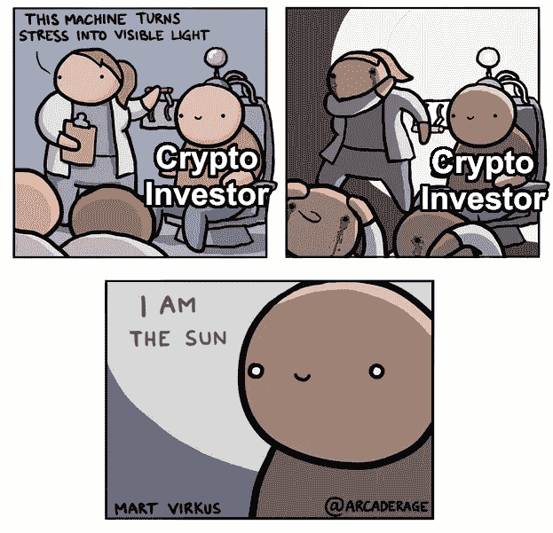
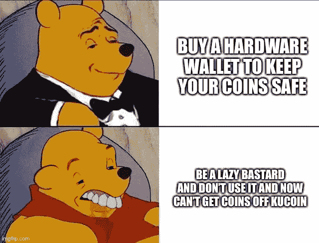
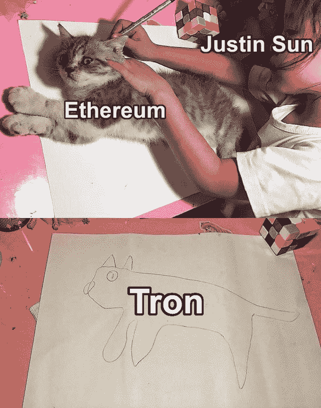
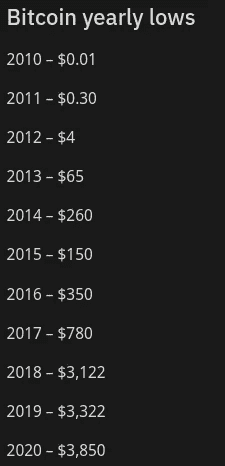

# Kucoin 黑客窃取了超过 2 亿美元，Filecoin 准备推出其 Mainnet

> 原文：<https://medium.com/coinmonks/kucoin-hacker-stole-more-than-200-million-filecoin-ready-to-launch-its-mainnet-fa5f7ab97879?source=collection_archive---------1----------------------->

## Justin Sun 利用他的员工，#很少有加密影响者试图欺骗他们的追随者

过去的周末，Kucoin 的钱包向几个未知地址发送了大量交易。很快，crypto twitter 注意到了这些活动，几个小时后，Kucoin [证实了](https://www.kucoin.com/news/en-kucoin-security-incident-update)north 损失了 2 亿美元。

Kucoin 敦促阻止和无效的黑客令牌。不久之后，猎户座协议[更新了](https://www.kucoin.com/news/en-orn-has-completed-the-token-swap-trading-opening-soon)智能合同，使价值 850 万美元的被盗代币作废， [Covesting 冻结了价值 52 万美元的被盗代币](https://twitter.com/covesting/status/1310103008152350725)，而 [KardiaChain 宣布价值 900 万美元的代币](https://www.kucoin.com/news/en-kai-has-completed-the-token-swap)无效。其他一些协议也遵循和无效被黑客攻击的令牌。

不要把你的资金留在交易所，买一个好的硬件钱包来保护你的加密资产。

## 试试 [Quadency](https://blog.coincodecap.com/go/quadency)

寻找易于使用的一体化加密交易解决方案？

试试 [Quadency](https://blog.coincodecap.com/go/quadency) ，这是一个为交易者构建的交易终端，用于自动化他们的加密交易。阅读我们的[季度回顾](https://blog.coincodecap.com/quadency-review-a-crypto-trading-automation-platform)。

## 最新消息📰

*   KuCoin 黑客攻击了超过 200 万美元的 T21
*   贾斯汀·孙，“中国的特朗普”和他如何剥削他的员工
*   硬币[按下](https://filecoin.io/blog/mainnet-ignition/)主网点火&升空
*   双子座现在[支持“屏蔽”提款以增加隐私](https://www.theblockcrypto.com/linked/79098/gemini-supports-shielded-zcash-withdrawals)
*   美国证券交易委员会、OCC 首次发布[针对稳定债券的监管澄清](https://www.coindesk.com/occ-banks-can-hold-some-stablecoin-reserves)
*   比特币基地钱包用户[成为新安卓恶意软件的目标](https://cointelegraph.com/news/coinbase-wallet-users-targeted-by-new-android-malware)
*   一名前雇员[讲述了织机网络关闭传奇的全部故事](https://www.kickstarter.com/projects/328862817/zombie-battleground-the-new-generation-of-ccg-tcg/posts/2906929)
*   稳定的货币市值[超过](https://www.coindesk.com/stablecoins-asset-value-20-billion)200 亿美元
*   一个仍在开发中的 NFT 游戏生态系统 Eminence Finance 被一名[黑客利用，该黑客在交易者匆忙收购 EMN 后窃取了 1500 万美元](https://thedailychain.com/hacker-steals-15mln-from-unlaunched-defi-project-returns-8mln)——这是一种象征性的奖励稳定币，其内在价值为零。
*   Tezos [基金会](https://tezos.foundation/reports/)半年度报告
*   俄国黑名单币安
*   主要国家的密码法规
*   OpenBazaar [需要你的支持](/@therealopenbazaar/openbazaar-needs-your-support-75fe7e117ad1)

> *买一个* [***硬件钱包***](/coinmonks/the-best-cryptocurrency-hardware-wallets-of-2020-e28b1c124069) *保护你的加密货币。*

[Source](https://www.reddit.com/r/CryptoCurrency/comments/j0blh5/laugh_at_my_pain_everyone/)

## 好的读物📑

*   2020 年 DeFi 的[腐败](/@crypto_angel/the-corruption-of-defi-in-2020-bbcdadccf201)
*   [实际上是谁](https://bitquery.io/blog/who-is-actually-using-ethereum)在使用以太坊？
*   闪贷:[如何在 15 秒内成为](https://ice09.github.io/how-to-become-a-millionaire-for-15-seconds/)百万富翁
*   NFT & Crypto 的[高端](https://messari.io/article/nft-s-crypto-s-high-end-art-market)艺术品市场
*   Citadel 的 [Sharpe](https://research.parsec.finance/posts/amm-tradeoff) 是 Uniswap 的机会
*   戴现在有 60%的集中资产支持着，这意味着什么？
*   逃离黑暗的森林
*   每个农民都应该知道的税收技巧
*   证券交易委员会是否会对[Uni Tokens](https://www.ar.ca/blog/are-uni-tokens-subject-to-securities-enforcement-action-by-the-sec)采取证券执法行动？
*   关于“在 Tezos 股权证明中针对恶意重组为[辩护”](https://blog.nomadic-labs.com/on-defending-against-malicious-reorgs-in-tezos-proof-of-stake.html)
*   Blocknative 引入了一个[内存池浏览器](https://blog.blocknative.com/blog/explorer)
*   分析一个[广义抢先运行](/zengo/into-the-monsters-eye-analyzing-a-generalized-front-running-arbitrage-bot-attack-a4754145de0e)套利机器人攻击
*   如何大嚼鲸鱼大餐中的泡菜
*   可贷资金的 DeFi 协议:利率、流动性和市场效率
*   ENS 2020 的[状态](/the-ethereum-name-service/state-of-the-ens-2020-cd8afa19f59d)
*   Tezos 的技术发展
*   深入 Tezos : Cryptonomic 的新网络仪表板潜望镜！
*   标准即将彻底改变支付方式
*   以太坊 [L2 解决方案乐观](/@optimismPBC/light-at-the-end-of-the-tunnel-c390a05bbcb8) testnet 推广计划
*   自动化[治理](/gauntlet-networks/automated-governance-defis-scientific-evolution-feea0284fa99) : DeFi 的科学进化
*   没有什么[可以阻止比特币](/in-bitcoin-we-trust/nothing-can-stop-bitcoin-not-even-a-generalized-shutdown-of-the-internet-at-a-global-level-692d05e7dbb3)，甚至全球范围内的互联网全面关闭也不行

[Source](https://www.reddit.com/r/ethtrader/comments/iz8ahk/next_generation_blockchain/)

## 开发商

*   吃饭[区块链数据](https://bitquery.io/blog/blockchain-graphql)使用 GraphQL 勺子
*   轨道:loop ring 和 DXdao 的一款 L2 新产品，可以实现即时&无气体以太坊传输
*   展开[汇总](https://www.lakshmansankar.com/#/fast-pipes-smart-vms):快速管道和智能虚拟机
*   [堆栈](https://soliditydeveloper.com/stacktoodeep)过深
*   [Vyper.fun](/coinmonks/vyper-fun-learn-vyper-by-building-a-pokemon-game-7b8c981c9b42) :通过构建一个口袋妖怪游戏来学习 Vyper
*   如何为你的以太坊 DApp 设置哨兵和传呼机
*   使用[块菌和 nestj](https://github.com/ikhvost/truffle-nest-box)建造以太坊
*   如何[使用 Builder 和 Solidity 创建时间锁定功能](/cryptexglobal/how-to-create-time-locked-functions-523424def80)
*   介绍[投票服务](https://blog.vocdoni.io/introducing-voting-as-a-service/)
*   KMS 上的泰佐斯
*   TezEdge 沙箱:一个完全离线的 Tezos 链模拟器，揭示了协议和存储之间的所有交互
*   如何[支付比特币](https://www.pierrerochard.com/how-to-pay-for-bitcoin-code-reviews/)进行代码审核
*   如何在您的 Dapp 中使用 [xDai](https://soliditydeveloper.com/xdai)

[Source](https://www.reddit.com/r/CryptoCurrency/comments/j0p3z5/be_you_own_bank/)

## 多方面的

*   [气现](https://www.gasnow.org/)
*   该死的[脆弱的](https://www.damnvulnerabledefi.xyz/) DeFi
*   [比特币 vs 银行](https://www.youtube.com/watch?v=Sl8L8lrpWGg&feature=emb_logo) —数据可视化

## 黑客马拉松和会议👷

*   [EthOnline 黑客马拉松](https://www.ethonline.org/) ( **申请截止日期 9 月 23 日**)
*   破解 Rambow-Near 协议
*   [开世界峰会](https://www.onflow.org/open-world-summit)乘流区块链
*   神奇的[密码会议](https://btcm.co/reserve-currencies-1/) VR
*   [**hack atom V**](https://hackatomv.devpost.com/)**，**虚拟黑客马拉松
*   诚实[秘密](https://underhanded.soliditylang.org/)竞赛

## 播客💽

*   马修·雷辛如何面对道袭击案中的嫌疑人
*   [世界上第一个](https://www.whatbitcoindid.com/podcast/the-worlds-first-crypto-bank)密码银行

## 加密交易和折扣🔖

*   BlockFi 为注册和存款提供 250 美元的 USDC 奖金
*   全新 [Trezor 钱夹套](https://shop.trezor.io/?offer_id=10&aff_id=5199)有多种颜色可选
*   *试用*[*Hypertrader*](https://hypertrader.app/?utm_soruce=coinmonks)*并使用优惠券****COINCODECAP****获得****15%****折扣*
*   使用[此链接](https://webapp.coinrule.io/coupon/coinmonks-7-25-3-e2bf6c60e795407381edf98d1a174ac2?fp_ref=coincodecap)在 [Coinrule](https://webapp.coinrule.io/coupon/coinmonks-7-25-3-e2bf6c60e795407381edf98d1a174ac2?fp_ref=coincodecap) 上获得 7 天免费试用和前 3 个月 25%的折扣
*   *试用* [*哈森在线*](https://www.haasonline.com/?ref=11087) *并使用优惠券****COINCODECAP****获得****10%****折扣👏*

## 产品评论📙

*   神童评论——赚大钱的社交密码交易
*   [eToro vs Shrimpy](https://blog.coincodecap.com/etoro-vs-shrimpy)
*   [哈森在线评论](https://blog.coincodecap.com/haasonline-review)—2020 年最佳交易机器人(10%优惠券)
*   4 种简单的赚钱方法
*   Hodl 的最佳方式是从你的比特币中赚取利息
*   [Botsfolio 评论](https://blog.coincodecap.com/botsfolio-review-automate-crypto-investment) —让您的加密投资自动化的简单方法
*   你需要知道的 2020 年前 5 大[加密贷款平台](https://blog.coincodecap.com/top-5-crypto-lending-platforms)
*   [2020 年最佳加密交易机器人](/coinmonks/whats-the-best-crypto-trading-bot-in-2020-top-8-bitcoin-trading-bot-c16adeb13317)
*   [2020 年最佳密码交易平台](/coinmonks/the-best-crypto-trading-platforms-in-2020-the-definitive-guide-updated-c72f8b874555)

想让我们展示你的产品吗？请通过 [Twitter @coinmonks](https://twitter.com/coinmonks) 联系我们

## 照片说明了一切📷

[Source](https://www.reddit.com/r/Bitcoin/comments/j065na/bitcoin_yearly_lows/)

## 乔布斯

*   Bitquery 正在招聘 [Ruby 开发者](https://angel.co/company/bitquery/jobs)

## 在 Coinmonks 上发布

如果你喜欢在 crypto/区块链空间上写教育文章，并且想在 Coinmonks 出版物上发表。只需发邮件给我***【gaurav@coincodecap.com】****或者 DM 我**[***推特***](https://twitter.com/coinmonks)*

> **“如果你喜欢读* [*造反派*](https://medium.com/coinmonks)*[*你也可以捐我们*](/coinmonks/monks-need-your-help-7440418d67ec) *。***

****