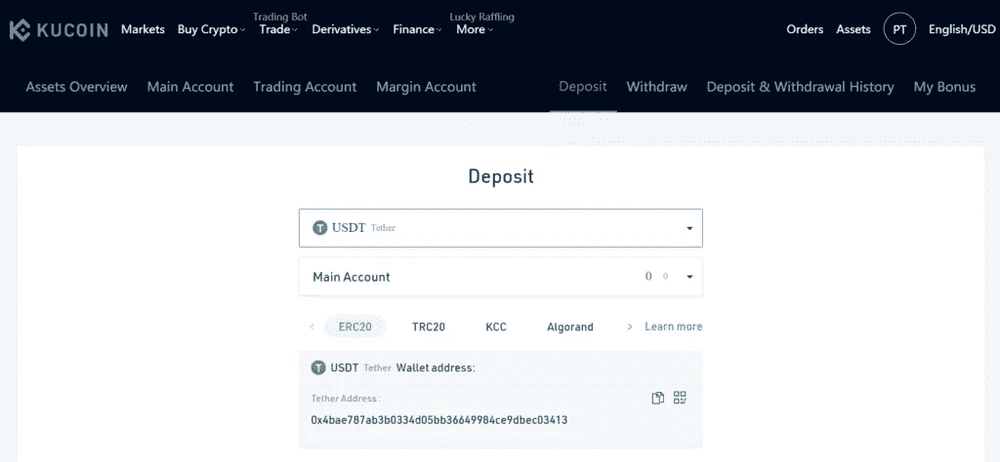

# 这是币安的最佳选择吗？

> 原文：<https://medium.com/coinmonks/kucoin-review-bb5e3071f0e?source=collection_archive---------0----------------------->

KuCoin 是一个易于使用、安全可靠的加密交换工具。KuCoin 交易所具有各种功能，如期货交易、保证金交易、交易机器人、KuCoin 借贷等。因此，在这篇 KuCoin 评论中，我们将深入探讨它的所有特性；虽然下面先来总结一下文章！

# 总结(TL；博士)

如今，四分之一的加密用户使用 KuCoin。数百万人信任[库币交易所](https://www.kucoin.com/ucenter/signup?rcode=rJ45SVB)平台，因为它提供了一系列令人印象深刻的加密服务，如交易、菲亚特 onramp、被动收入、加密众筹等。

*   它拥有来自 200 个国家的大约 500 万用户。
*   它有 200 多种加密货币和 400 多个市场。
*   它允许用户通过借出或通过其 Pool-X 下注来[获得密码](https://coincodecap.com/crypto-lending)
*   这个平台属于市场上收费最低的平台。
*   他们有他们的硬币库币股份(KCS)代币。
*   该平台提供 24/7 全天候客户服务支持。这是另一个令人印象深刻的好处。
*   它允许你匿名交易。但是，通过验证您的帐户，您将能够使用和享受更多功能。
*   该平台在台式电脑、Android 和 iOS 上运行良好。

KuCoin exchange 是专门的加密到加密，支持集成到其“购买加密”服务中的法定支付方法。Simplex、Banxa 和 OTC 交易台现在可以在 Kucoin 上使用。

# 什么是 KuCoin？

KuCoin 是一个安全易用的[加密货币交易平台](/coinmonks/crypto-exchange-dd2f9d6f3769)，供全球受众交易加密资产。此外，该平台位于塞舌尔，创始成员在运营蚂蚁金服和 iBox PAY 等项目方面经验丰富。

库币通常被称为“人民交易所”该平台提供各种功能，如交易机器人、保证金交易、期货交易、贷款等。此外，根据该平台，全球有四分之一的霍德尔人使用 KuCoin

库币有它的加密货币，库币股份(KSC)。如果您持有 KSC 硬币，您将获得可观的交易费折扣，并赚取更多的密码。此外，根据 [CoinMarketCap](https://coinmarketcap.com/rankings/exchanges/) 的数据，KuCoin 是世界十大加密交易所之一。

# 库币评论:核心功能

我们之前告诉过你 [**KuCoin**](https://www.kucoin.com/ucenter/signup?rcode=rJ45SVB) 的高级特性，现在我们来谈谈这个平台的其他各个部分。如果你仍然不知道 KuCoin 是否是正确的选择，那么看看 KuCoin 的一些核心特性，让你的问题得到澄清。

*   **用户友好的互动平台**——ku coin 的界面具有现代设计，交易者可以在其中享受稳健交易的乐趣。这个功能会让你的交易更加愉快。
*   **高效引擎** —每秒可处理百万次事务(TPS)。
*   **高级图表**——你可以在 Kucoin 上寻找令人兴奋的高级图表，更深入地了解你的交易策略。KuCoin 使用有指标的图表，帮助你做出决定。

*   **订单类型:** Kucoin 提供限价单、事后单、止损单、市价单和冰山单。
*   **非托管交易:**[**ku coin**](https://www.kucoin.com/ucenter/signup?rcode=rJ45SVB)与阿尔温合作，现在支持交易者直接从钱包中选择非托管交易，以提升其加密安全性。如果你选择非托管交易，交易平台不会托管你的钱。在 Kucoin 上，作为交易者，你将对你的资金拥有完全的所有权和责任。

正如正确的说法，“不是你的钥匙，不是你的密码”。

[**KuCoin**](https://www.kucoin.com/ucenter/signup?rcode=rJ45SVB) 让你下载一个私钥文件或者助记短语。为了保护您的硬币，阿尔温使用区块链本身作为托管代理，不委托第三方机构。

# 库币保证金交易

融资融券交易功能直到 2019 年 11 月才推出。利用该功能，投资者和交易者可以在 Kucoin 上使用其他用户的资金，以获得更高的资金额。这使得他们能够利用头寸。在 Kucoin 保证金交易中，有 15 种加密货币可用，如 KCS、瑞士法郎和 BTC。

您可以使用这项交易服务进行短期和长期交易。记住，通过使用借来的资金，个人可以增加他们的利润。同时，与最初的投资相比，他们也会遭受巨大的损失。Kucoin 有 35 个交易对，杠杆高达**10 倍**。

# 库币期货交易

[**库币**](https://www.kucoin.com/ucenter/signup?rcode=rJ45SVB)2019 年 7 月正式推出期货交易。之前叫 KuMEX，另一个名字叫合约交易。通过这项服务，用户可以买卖金融资产的未来标准化合约。根据这项服务，买方在未来特定的价格和指定的时间(交割日期)购买资产。相比之下，卖方必须在特定的价格和时间交付资产。

一般来说，你可以用高达 100 倍的杠杆交易保证金合约。这意味着一个用户可以交易价值高达 10，000 美元的合约，而他的账户中只有 100 美元。Kucoin 期货交易有两个不同的版本:一个是针对新手的(lite 模式)，另一个是针对有经验的交易者的(Pro 模式)。

Lite 界面允许用户交易 USDT 保证金比特币和以太坊合约。另一方面，Pro 界面允许用户在以下合同之间切换:

*   USDT-边缘:ETC 和 BTC 永久。
*   BTC-保证金:BTC 永久，BTC 季度 0925 和 1225。

# 库币场外交易柜台

2019 年 7 月， [**KuCoin**](https://www.kucoin.com/ucenter/signup?rcode=rJ45SVB) 正式上线 OTC 交易台，即场外交易台。在这项服务下，交易者可以以特定的价格进行大宗交易，而不会引起密码价格的任何波动。它允许用户直接购买 USDT、BTC，以及其他使用加元、IDR、越南盾和 CNY 的加密货币。KYC 强制开始场外交易。

# 库币交易机器人

kuCoin 交易机器人只能通过该平台的移动应用程序访问。目前，交易机器人一般包括两种交易技术。第一种是 [DCA](https://coincodecap.com/dca) ，第二种是传统[网格](https://coincodecap.com/grid-trading)。传统的网格可以用来在给定的价格范围内低买高卖。另一方面，平均成本是一种定期投资的策略。要了解更多信息，请阅读[如何使用 KuCoin Bot？](https://coincodecap.com/kucoin-bot)

[Try the KuCoin Bot](https://blog.coincodecap.com/go/kucoin)

# 库币贷款及其风险

KuCoin 借贷平台允许客户将加密货币以一定的利率借给其他用户。贷方必须详细填写贷款金额和日利率。KuCoin 借贷风险巨大，但也伴随着丰厚的回报，如 UPTO USDT 12% ~ 300%的年化回报率。

# KuCoin 怎么用？

在知道如何在 KuCoin 上购买**、**之前，你必须知道如何在 KuCoin 上入门。别担心，如果你打算做小额交易，验证是可选的，所以开始很简单。然而，为了获得更多的利益，你可能需要验证你的身份。你只需要一个电子邮件 ID 和一份身份证明文件。库币评论:支持的国家和语言

## 第一步:启动网站

进入 [**KuCoin**](https://www.kucoin.com/ucenter/signup?rcode=rJ45SVB) 网站，立即将页面加入书签。这是因为可能会有同时打开的钓鱼网站。确保您检查了安全可信网站的 URL。

## 第二步:注册

输入您的电子邮件地址，并选择一个可靠的密码开始 KuCoin 登录过程。请留意您的电子邮件地址，以接收确认链接。

## 步骤 3:认证和验证

添加双因素身份验证可以为您的帐户增强额外的安全性。要实现这一点，你必须找到设置标签，并寻找“谷歌两步”。不过，如果你是新用户，你会先安装谷歌认证器应用。因此，您将完成创建帐户所需的正式安全检查。您可以通过上传所需的身份文件获得一个验证帐户，您的 KYC 将很快获得批准。

## 第四步:存款

要查看现有的交易对，请查看市场概览屏幕，其中包括新的、稀有的和流行的硬币。 [**KuCoin**](https://www.kucoin.com/ucenter/signup?rcode=rJ45SVB) 布局简洁。因此，你可以很容易地找到所有的标签和类别。

如果您还没有选择或决定硬币，您可以点击顶部主菜单“资产”部分下的“存款”。在这里，你会发现一个硬币的清单，你可以存款。此外，现货交易选项让你看到硬币的图表和你的订单。如果您已经决定了硬币部分，请单击“存款”选项，从列表中选择硬币或搜索硬币。然后选择一个账户，添加地址和金额粘贴在提现平台上。

Deposit Funds in KuCoin

# Kucoin 模拟交易账户

加密货币交易势不可挡，但当你了解金融市场的运作时，它会变得更加有利可图。此外，它需要价格运动的知识以及大量的实践。因此，Kucoin 模拟交易账户可以帮助初学者制定有效的交易策略。这使得用户能够了解市场。

# 如何在 KuCoin 上购买 Crypto？

开门见山，让我们告诉你如何在 [**KuCoin**](https://www.kucoin.com/ucenter/signup?rcode=rJ45SVB) 开始你的交易之旅。

*   首先，你应该为你的账户提供资金。
*   如果是，您可以点击屏幕顶部的“市场”选项。您可以在页面右上角的搜索栏中搜索您想要的硬币。Kucoin 将显示您希望购买的货币的可用交易对列表。Kucoin 有 300 多个不同的交易对。
*   点击与所存硬币匹配的交易对。它会把你带到主交易屏幕，在订单列表的右边，你会发现一个购买框。
*   现在你所要做的就是输入你想要购买的硬币数量，点击最佳价格按钮，然后点击绿色的购买框，完成交易。就这么简单。

# 库币交易密码

为了在执行交易时提高安全性，该平台引入了 KuCoin 交易密码。六位数的 KuCoin 交易密码主要用于取款、交易和 API 创建。此外，KuCoin 交易密码不是 2FA，因此您必须单独启用它。您可以通过访问 KuCoin 应用程序上的“设置>安全>交易密码”来启用此功能。

# 库币费

[**KuCoin**](https://www.kucoin.com/ucenter/signup?rcode=rJ45SVB) 拥有如此多用户的一个主要原因是，它提供的费用是其他 altcoin 交易所中最低的。**库币交易费**简单明了，所以用户觉得很容易理解。

# 库币现货交易费

这里，在库币现货交易中，每笔交易都有 0.1%的固定费用，低于全球行业平均水平。用户 30 天的交易量和持有的 Kucoin 股票决定了现货交易费用的减少。基于上述因素，您还可以获得其他交易费用折扣。

机构投资者计划的参与者也可以获得可观的交易费折扣。

[Get Fees Discount using KCS](https://blog.coincodecap.com/go/kucoin)

# 库币期货交易费

[**库币**](https://www.kucoin.com/ucenter/signup?rcode=rJ45SVB) 期货的美元/USDT 贷款利率是可调的，因为相对融资利率可以是正的，也可以是负的。期货融资每 8 小时后进行一次。以下是 Kucoin 未来交易费用的详细列表:

KuCoin Futures Trading Fees

# KuCoin 取款费

**库币提现费是密码行业最低的**。每当用户从 BTC 取款时，它都会收取 0.0004 BTC 的手续费。这个费用低于行业水平，这是另一个用户为什么数百万人更喜欢它。提现费用取决于该平台上可用的不同加密货币。你可以点击查看[。](https://www.kucoin.com/vip/level?rcode=rJ45SVB)

# 库币存款费

**KuCoin 存款**费用为零。这意味着它不会向用户收取一分钱的相关交易费用。

# 库币评论:购买限额

您每 24 小时最多可以提取 2 BTC，无需验证，购买限额为 1400 美元。验证您的帐户会将您的提款限额提高到每 24 小时 100 BTC，并且 [**库币**](https://www.kucoin.com/ucenter/signup?rcode=rJ45SVB) 会产生 1400 USDT 法定到加密交易限额。此外，一份经过验证的机构报告显示，您的提款限额为每 24 小时 500 BTC，交易限额为 70，000 USDT。

# 库币杠杆代币

KuCoin 杠杆代币是伴随着杠杆特征的代币，由基金经理管理。它旨在通过交易杠杆化的象征性股票，为交易者带来特定倍数的基础资产利润。例如，如果标的资产是 BTC，当其价格上涨 1%时，BTC3L 的净值将上涨 3%，而 BTC3S 的净值将下跌 3%。

# 库币杠杆代币的优势

1.  无论相应的硬币/代币价格如何变化，永远不会出现清算。
2.  交易 KuCoin 杠杆代币的投资者不需要支付保证金或借入资金来尝试保证金交易以获取更多利润。
3.  购买 KuCoin 杠杆代币的看跌方式和在现货市场交易完全一样。投资者只能在二级市场购买或出售这些代币(或在一级市场认购或赎回，但不建议新用户使用)。

# 库币评论:流动性

流动性是指一项资产或证券在不影响其当前市场价格的情况下可以转换为现金的程度。

# 什么是加密货币流动性？

流动性是在加密交易所交易的代币/硬币的数量。KuCoin 交易平台为代币发行者和流动性挖掘者提供优惠。

如果你是代币发行商，并在 KuCoin 上列出了你的代币，它将为你提供一种具有成本效益和数据驱动的方法，从而提高你的代币的流动性。您可以利用订单簿深度提高流动性，并通过代币交易效率实现价格发现。当更多的交易者积极做市时，价格发现过程有效。

额外的交易所整合为流动性矿工提供了许多挖掘场地，当可用的总奖励池增加时，您可以获得更多奖励。

# 库币评论:支持的加密货币

根据 [CoinMarketCap](https://coinmarketcap.com/exchanges/kucoin/) ，KuCoin 拥有约 200 种加密货币的 400 多个市场，如 BTC、瑞士联邦理工学院、MXR、DAG、BCH EOS、LTC。此外，你还可以得到像 DADI，KCS，OMG 等代币。

截至 2021 年 2 月 23 日，您可以通过 Simplex、Banxa 和 OTC 平台在 KuCoin 上购买添加了 22 种法定货币的加密。支持的法定货币包括欧元、英镑、卢布、CNY、澳元、韩元、日元、泰利、越南盾、印度卢比、加拿大元、ZAR、新西兰元、HUF、冰岛国内货币、波兰兹罗提、SEK、瑞士法郎、CZK、DKK、挪威克朗。

# 库币评论:支持的国家和语言

[**KuCoin**](https://www.kucoin.com/ucenter/signup?rcode=rJ45SVB) 的全球触角简直让人惊叹。KuCoin 支持英国、美国、加拿大、澳大利亚、新加坡、印度、日本等国家。你可以购买硬币的顶级法定货币有美元、欧元、CNY、英镑、加拿大元、澳大利亚元等等。

提供 17 种语言，包括英语、俄语、荷兰语、葡萄牙语、中文(简体和繁体)、德语、法语、越南语、西班牙语、意大利语、土耳其语、马来语、韩语、印度尼西亚语、印地语和泰语。12 种不同的语言和 30 多种法定货币的价格。

# 库币评论:客户支持

[**KuCoin**](https://www.kucoin.com/ucenter/signup?rcode=rJ45SVB) 的客户支持完全专注于并了解您的交易问题。如果需要，他们会立即采取行动。全天候提供帮助。您还可以获得 FAQ 部分和实时聊天功能来解决您的问题。

在本文的后面，我们更详细地讨论了 KuCoin 的结构良好的创建者和接受者费用、高流动性和安全性。

# 库币的历史和背景

2011 年，KuCoin 的创始团队已经开始试验[区块链技术](https://coincodecap.com/what-is-blockchain-a-simple-guide-for-dummies)，并于 2013 年开始技术开发。这导致了 2017 年中期无缝库币的形成。

# 库币股份

一个从 2017 年 8 月 13 日持续到 2017 年 9 月 1 日的 ICO，为 KuCoin 募集资金。

在此期间，KuCoin 发行了其本地 KuCoin 股票(KCS)代币。用户使用这些代币获得特别优惠、交易折扣和兑换利润。KuCoin 在 BTC 通过成功的大众销售筹集了近 2000 万美元(当时)和 1 亿 KCS。单一 KCS 的 ICO 价格是 0.000055 BTC。

目前，该公司的总部设在塞舌尔，据报道在全球雇用了 300 多名员工。

[Get KCS](https://blog.coincodecap.com/go/kucoin)

# 库科恩 API

来库币 API，平台提供量化交易策略、交易费用优惠、无息贷款、沙盒交易比赛等广泛服务。给它的用户。要了解更多关于 KuCoin API 的信息，你可以[点击这里](https://www.kucoin.com/api?lang=en_US)。

# 酷币 P2P

2020 年 2 月，该交易所推出了即时交易服务。不仅如此，KuCoin 还通过其带有银行卡选项的“购买加密”显著增加了支持加密购买的法定货币数量。2020 年 6 月 24 日，KuCoin 宣布其 P2P 加密市场支持使用 PayPal 和其他方便的法定支付方式进行购买和销售。

团队在不断改进，定期添加新功能，这将有助于你在库币交易所。

# 隐私和安全:kuCoin 安全吗？

是的，KuCoin 是一个安全合法的加密交易所，因为它提供银行级的资产安全，以确保所有交易和账户持有人的最安全的环境。

它使用各种安全措施，如小额取款钱包。它可以在取款发生时保护您的安全，动态[多因素认证](https://en.wikipedia.org/wiki/Multi-factor_authentication)，行业级多层加密，以及专门的内部风险控制部门来确保您的资金安全。KuCoin 团队定期检查各小组是否按照严格的安全标准进行日常数据操作。

截至目前，Kucoin 拥有超过 600 万注册用户。它通过检查您的交易的安全性并投入大量资源来添加新的安全功能，不断赢得许多其他人的信任。

## 什么是 KuCoin Hack？

据链上数据公司[chain analysis](https://blog.chainalysis.com/reports/kucoin-hack-2020-defi-uniswap)称，2020 年 9 月 25 日，黑客在一次最大的密码交易黑客攻击中窃取了超过 2 . 75 亿美元。下图显示了黑客如何使用分散协议来清洗被盗资产。

KuCoin Hack Stolen funds Graph

然而，该平台已经从过去的错误中吸取了教训，并提高了安全级别。截至 2021 年 9 月 27 日，KuCoin 是最大的交易所之一。然而，如果你是一个高交易量的交易者，那么你更喜欢使用硬件钱包，而不是把你的资金存放在集中的交易所。

# KuCoin 利弊

虽然 KuCoin 拥有几个有价值的功能，但它也有一些缺点。这里是一个总结表，以便更好地理解。

# 库科恩评论:结论

KuCoin 凭借其先进的 API，成功地使交易变得愉快、透明和互动。它有大约 456 个交易对可供选择，目前在“[顶级加密货币交易所中排名第六。](/coinmonks/crypto-exchange-dd2f9d6f3769)

它是业内一个相对年轻的交流平台，正在经历显著的增长。它目前为大约 600 万用户提供服务，这告诉我们这个平台的可靠性。

在这篇博客中，我们几乎涵盖了所有内容。从 KuCoin 的流动性到安全性再到交易，可能一切都被触动了。这篇博客中提到的核心特性将帮助你在使用 KuCoin 时做出深思熟虑的决定。

Kucoin 具有独特的功能，无疑是独一无二的。因此，很快，看到 KuCoin 在加密行业处于领先地位就不足为奇了。

# 常见问题

KuCoin 的总部在哪里？库币位于哪里？

KuCoin 是一家位于塞舌尔的加密货币交易所。

有必要进行库科恩 KYC 验证吗？

是的，我们强烈建议所有 KuCoin 用户完成 KYC 验证。KYC 认证账户还可以享受更高的每日提款限额。KYC 还可以减少洗钱、欺诈、恐怖融资和其他恶意活动。但是是的，你仍然可以在没有验证账户的情况下进行小额交易。没有 KYC，您一天最多可以提取 2 BTC。

我们能在 KuCoin 上用法定货币购买密码吗？

是的，KuCoin 支持 22 种不同的法定货币购买硬币。

**你能用 KuCoin 上的信用卡吗？**

KuCoin 与 Banxa 合作，使当前和新的 KuCoin 用户能够使用 Visa/MasterCard、Apple Pay 和 10 种其他支付选项购买加密货币。

**我能信任 KuCoin 吗？KuCoin 安全合法吗？**

就交易费用而言，KuCoin 是费用最低的交易所之一。库币最大的竞争对手是币安，因为两家交易所的竞争策略相似。他们收取的费用几乎一样低。库币共享(KCS)提供了额外的优势。

**在 KuCoin 平台上可以转账多少？**

限额因支付方式而异。无论您是使用 Paypal、电汇还是 Interac 电子转账进行交易。每一种都有其局限性。在这里查看一下每种方法的局限性。

> 加入 Coinmonks [电报频道](https://t.me/coincodecap)和 [Youtube 频道](https://www.youtube.com/c/coinmonks/videos)获取每日[加密新闻](http://coincodecap.com/)

## 另外，阅读

*   [复制交易](/coinmonks/top-10-crypto-copy-trading-platforms-for-beginners-d0c37c7d698c) | [加密税务软件](/coinmonks/crypto-tax-software-ed4b4810e338)
*   [网格交易](https://coincodecap.com/grid-trading) | [加密硬件钱包](/coinmonks/the-best-cryptocurrency-hardware-wallets-of-2020-e28b1c124069)
*   [最佳加密交易所](/coinmonks/crypto-exchange-dd2f9d6f3769) | [印度最佳加密交易所](/coinmonks/bitcoin-exchange-in-india-7f1fe79715c9)
*   [开发人员的最佳加密 API](/coinmonks/best-crypto-apis-for-developers-5efe3a597a9f)
*   [密码电报信号](http://Top 4 Telegram Channels for Crypto Traders) | [密码交易机器人](/coinmonks/crypto-trading-bot-c2ffce8acb2a)
*   最佳[密码借贷平台](/coinmonks/top-5-crypto-lending-platforms-in-2020-that-you-need-to-know-a1b675cec3fa)
*   杠杆代币的终极指南
*   [加密交易的最佳 VPN](https://coincodecap.com/best-vpns-for-crypto-trading)
*   [用于 Huobi 的加密交易信号](https://coincodecap.com/huobi-crypto-trading-signals) | [HitBTC 审查](/coinmonks/hitbtc-review-c5143c5d53c2)
*   [TraderWagon 回顾](https://coincodecap.com/traderwagon-review) | [北海巨妖 vs 双子星 vs BitYard](https://coincodecap.com/kraken-vs-gemini-vs-bityard)
*   [如何在 FTX 交易所交易期货](https://coincodecap.com/ftx-futures-trading)
*   [OKEx vs KuCoin](https://coincodecap.com/okex-kucoin) | [摄氏替代度](https://coincodecap.com/celsius-alternatives) | [如何购买 VeChain](https://coincodecap.com/buy-vechain)
*   [3 commas vs . Pionex vs . crypto hopper](https://coincodecap.com/3commas-vs-pionex-vs-cryptohopper)
*   [如何使用 Cornix 交易机器人](https://coincodecap.com/cornix-trading-bot)
*   [Bitget 回顾](https://coincodecap.com/bitget-review)|[Gemini vs block fi](https://coincodecap.com/gemini-vs-blockfi)cmd |[OKEx 期货交易](https://coincodecap.com/okex-futures-trading)
*   [用信用卡购买密码的 10 个最佳地点](https://coincodecap.com/buy-crypto-with-credit-card)