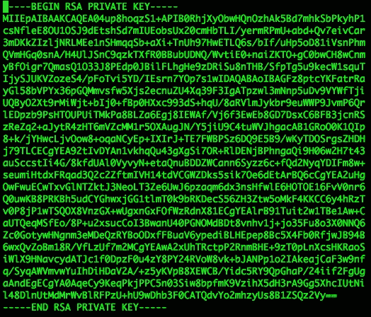
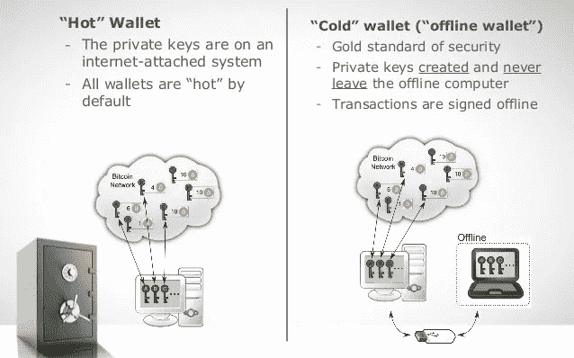
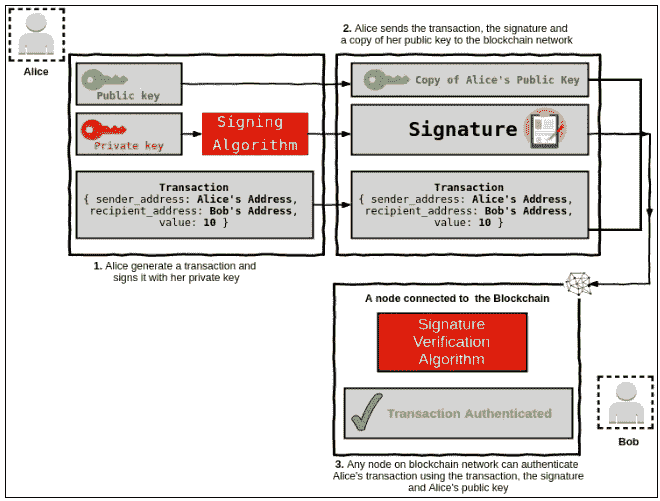
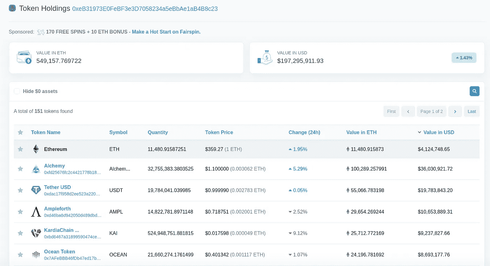
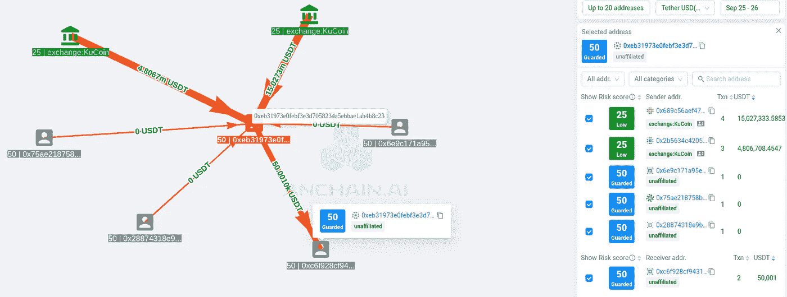

# 亚洲加密货币交易所 KuCoin 被黑了

> 原文：<https://medium.com/coinmonks/kucoin-the-asian-cryptocurrency-exchanger-has-been-hacked-6b67a2ef0e2e?source=collection_archive---------3----------------------->

攻击者如何入侵世界上最安全、最高效的加密货币交易所之一，并窃取了数百万美元的比特币和 ERC20 代币。

Private Key

新加坡交易所 [KuCoin](https://www.kucoin.com/) 在 2020 年 9 月 26 日 03:05:37 (UTC+8)的一份声明中表示，根据一份内部安全审计报告，亚洲数字资产已经发现比特币、以太坊(ERC20)和 150 多种其他代币从 KuCoin 交易所托管的不同热钱包中大量提取，并包含持有 KuCoin 代币总资产的客户的总资产。

Hot vs Cold. Image source: [https://blog.spiking.com/differences-between-a-hot-cold-wallet-544a0cc15f71](https://blog.spiking.com/differences-between-a-hot-cold-wallet-544a0cc15f71)

**什么是热门钱包？**

热门钱包是软件或桌面钱包，持有加密货币并连接到互联网，通过提供所需的文件和身份识别以供以后访问，可以更容易地设置它。钱包的私钥存储在用户本地机器上或第三方交换机数据库内以便于访问，这使得它更容易被黑客破坏。

**什么是冷钱包？**

冷钱包是一种分层确定性钱包(HD ),可容纳 2 个芯片，第一个芯片称为“安全元件”或“安全微控制器”,可安全保存加密种子或加密数据(公钥和私钥)。第二个芯片是“通用微控制器”，即第一个芯片和 USB 端口之间的接口(类似于闪存)。

虽然 KuCoin 到目前为止没有发布任何技术报告，直到本文日期及其社交工程攻击，但是，KuCoin 首席执行官 Johnny Lyu 透露的 [first analysis](https://www.kucoin.com/news/en-kucoin-security-incident-update) 称，黑客找到了一种方法，无论何时零日漏洞或社交工程方法都可以侵入 KuCoin 数据库，此外还窃取了用户的私钥，并将每个用户热钱包中的剩余内容转移到黑客控制的新热钱包中。

Public Key and Private Key.

任何交易都必须由发送方的私钥签名，并以只有接收方才能使用私钥解密消息的方式进行加密。攻击者使用用户最初使用的偷来的私钥连接到 hot wallet 并轻松劫持帐户，在将交易存储在公共区块链上之前签署交易，并通过将许多受害者帐户的所有令牌转移到所需地址来扩大攻击规模。

为此，冷钱包的用户没有受到影响，因为私钥存储在外部离线设备(高清钱包)上，该设备没有连接到互联网。

由于区块链技术使得黑客很难破坏分散的网络，利用节点执行 51%的攻击，并恢复不可变的账本来窃取金钱，这就提出了一个真正的问题，在过去的几年里， [**区块链能被黑客攻击吗？**](/ai-in-plain-english/blockchain-technology-is-robust-and-promising-technology-4df6462f3845) 。

许多攻击者转移了他们的重点，而不是入侵区块链，更多地是在前沿接口上，并以 ISP、钱包提供商和交易所为目标，或者遵循社会工程技术来获取用户的加密密钥，并以有限的资源和较低的成本完成工作。

The Tokens holding in attacker wallets — More than 150 various tokens.

**0x EB 31973 e 0 Fe BF 3 E3 d 7058234 a5 ebbae 1a B4 b 8 c 23，t** 他在[**ethers can**](https://etherscan.io/tokenholdings?a=0xeb31973e0febf3e3d7058234a5ebbae1ab4b8c23&ps=100&sort=total_price_usd&order=desc&p=1)**上的潜在黑客的未知地址现在持有超过 *1000 个比特币**【1100 万美元】*11480.915 以太*(1.54 亿美元)***

******

***The graph database shows 2 transactions (in green color) from the KuCoin exchanger to the attacker wallet.***

***26，733 立特(120 万立特)。***

***18495798 XRP(450 万美元)。***

***14713 BSV(220 万美元)。***

***9588383 XLM(705522 美元)。***

***228，952，838.064073 TRX 代币(630 万美元)。***

***EOS 和 Omni 区块链上价值 1500 万美元的系绳(USDT)。***

***Johnny Lyu 在[在线会议](https://www.kucoin.com/news/en-kucoin-ceo-livestream-recap-latest-updates-about-security-incident)中表示，受此事件影响的客户应该放心，KuCoin 和他们的应急计划-保险基金将完全恢复一切。***

## ***另外，阅读***

*   ***最好的[密码交易机器人](/coinmonks/crypto-trading-bot-c2ffce8acb2a)***
*   ***[密码本交易平台](/coinmonks/top-10-crypto-copy-trading-platforms-for-beginners-d0c37c7d698c)***
*   ***最好的[加密税务软件](/coinmonks/best-crypto-tax-tool-for-my-money-72d4b430816b)***
*   ***[最佳加密交易平台](/coinmonks/the-best-crypto-trading-platforms-in-2020-the-definitive-guide-updated-c72f8b874555)***
*   ***最佳[加密贷款平台](/coinmonks/top-5-crypto-lending-platforms-in-2020-that-you-need-to-know-a1b675cec3fa)***
*   ***[最佳区块链分析工具](https://bitquery.io/blog/best-blockchain-analysis-tools-and-software)***
*   ***[加密套利](/coinmonks/crypto-arbitrage-guide-how-to-make-money-as-a-beginner-62bfe5c868f6)指南:新手如何赚钱***
*   ***最佳[加密制图工具](/coinmonks/what-are-the-best-charting-platforms-for-cryptocurrency-trading-85aade584d80)***
*   ***[莱杰 vs 特雷佐](/coinmonks/ledger-vs-trezor-best-hardware-wallet-to-secure-cryptocurrency-22c7a3fd391e)***
*   ***了解比特币最好的[书籍有哪些？](/coinmonks/what-are-the-best-books-to-learn-bitcoin-409aeb9aff4b)***
*   ***[3 商业评论](/coinmonks/3commas-review-an-excellent-crypto-trading-bot-2020-1313a58bec92)***
*   ***[AAX 交易所评论](/coinmonks/aax-exchange-review-2021-67c5ea09330c) |推荐代码、交易费用、利弊***
*   ***[Deribit 审查](/coinmonks/deribit-review-options-fees-apis-and-testnet-2ca16c4bbdb2) |选项、费用、API 和 Testnet***
*   ***[FTX 密码交易所评论](/coinmonks/ftx-crypto-exchange-review-53664ac1198f)***
*   ***[零审核](/coinmonks/ngrave-zero-review-c465cf8307fc)***
*   ***[Bybit 交换审查](/coinmonks/bybit-exchange-review-dbd570019b71)***
*   ***[3Commas vs Cryptohopper](/coinmonks/cryptohopper-vs-3commas-vs-shrimpy-a2c16095b8fe)***
*   ***最好的比特币[硬件钱包](/coinmonks/the-best-cryptocurrency-hardware-wallets-of-2020-e28b1c124069?source=friends_link&sk=324dd9ff8556ab578d71e7ad7658ad7c)***
*   ***最佳 [monero 钱包](https://blog.coincodecap.com/best-monero-wallets)***
*   ***[莱杰 nano s vs x](https://blog.coincodecap.com/ledger-nano-s-vs-x)***
*   ***[bits gap vs 3 commas vs quad ency](https://blog.coincodecap.com/bitsgap-3commas-quadency)***
*   ***[莱杰 Nano S vs 特雷佐 one vs 特雷佐 T vs 莱杰 Nano X](https://blog.coincodecap.com/ledger-nano-s-vs-trezor-one-ledger-nano-x-trezor-t)***
*   ***[block fi vs Celsius](/coinmonks/blockfi-vs-celsius-vs-hodlnaut-8a1cc8c26630)vs Hodlnaut***
*   ***Bitsgap 评论——一个轻松赚钱的加密交易机器人***
*   ***[Quadency Review](/coinmonks/quadency-review-a-crypto-trading-automation-platform-3068eaa374e1) -为专业人士打造的加密交易机器人***
*   ***[PrimeXBT 评论](/coinmonks/primexbt-review-88e0815be858) |杠杆交易、费用和交易***
*   ***[埃利帕尔泰坦评论](/coinmonks/ellipal-titan-review-85e9071dd029)***
*   ***[SecuX Stone 评论](https://blog.coincodecap.com/secux-stone-hardware-wallet-review)***
*   ***[BlockFi 评论](/coinmonks/blockfi-review-53096053c097) |从您的密码中赚取高达 8.6%的利息***