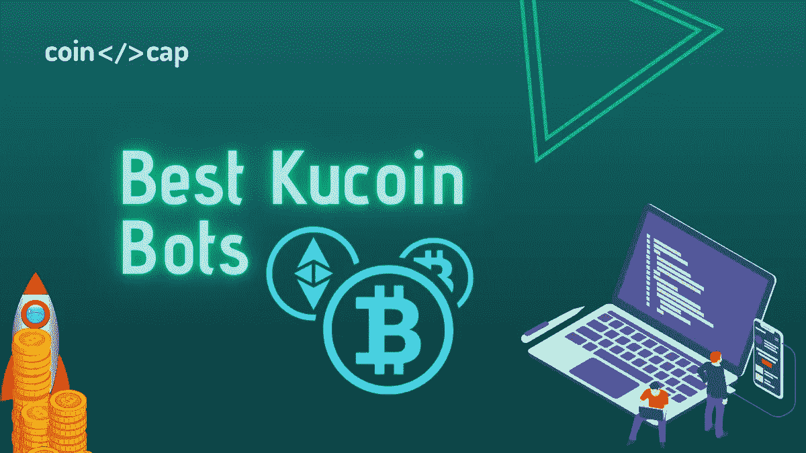

# 库币交易机器人——让你的交易自动化

> 原文：<https://medium.com/coinmonks/kucoin-trading-bot-automate-your-trades-8cf0ca2138e0?source=collection_archive---------1----------------------->

Kucoin bot

## Kucoin 团队的交易机器人和其他与 Kucoin 合作的比特币机器人解决方案

自动化你的密码交易是一件容易的事；然而，找到最好的交易机器人提供商是一项繁琐的工作。尤其是当你在寻找一个特定的交易所如 [**库币**](https://www.kucoin.com/ucenter/signup?rcode=rJ45SVB) 的时候。因此，在这篇 Kucoin 机器人的文章中，我们将向您介绍 Kucoin 交易机器人和其他五个交易机器人提供商，它们可能是可用的最佳选择。

# 总结(TL；博士)

*   [**Kucoin**](https://www.kucoin.com/ucenter/signup?rcode=rJ45SVB) 是[最好的密码交易所](https://coincodecap.com/crypto-exchange)之一；而且免费提供 Kucoin 交易机器人。
*   您还可以使用 API 密钥连接其他各种 bot，如 Bitsgap、 [**CryptoHopper**](https://www.cryptohopper.com/?atid=15596) 、3Commas、Mudrex 和 HaasOnline。
*   首先，平台 [**3Commas**](https://coincodecap.com/go/kucoin-trading-bot) 提供了复制经验丰富的交易者的交易机器人的选项。
*   其次， [**Bitsgap**](https://bitsgap.com/?ref=2cb1231&utm_source=coincodecap&utm_medium=article&utm_campaign=promo) 支持超过 25 个密码交易所，提供一种期货交易机器人。
*   CryptoHopper 附带了各种交易机器人，如做市机器人、套利工具、电报加密信号机器人等。
*   [**Mudrex**](https://mudrex.com/signup?referral_code=COIN3566) 得出其独特的业绩得分，帮助你计算更好的风险与回报。
*   最后， [**HaasOnline**](https://www.haasonline.com/?ref=11087) 交易机器人软件让你用 HaasScript 给整个机器人编码。

> 获取 [**Pionex**](https://www.pionex.com/offers/#/grid-4?r=BI2UEarX) ！只需为您的订单支付交易费，即可终身享受**免费** 交易机器人。

# 什么是加密交易机器人？

[加密交易机器人](/coinmonks/crypto-trading-bot-c2ffce8acb2a)只是一些算法，旨在帮助你实现交易方法的自动化。此外，你可以建立你的交易策略来构建你的交易机器人。然而，各种平台对此功能收费。因此，如果你没有编码方面的专业知识，但想让你的投资技术自动化，请继续阅读。

# 交易机器人是如何工作的？

专业程序员和市场专家通过编写投资策略来合作开发交易机器人。因此，如果机器人遇到潜在的市场机会，它会打开和清算你的立场。此外，情感和感觉不存在于加密交易机器人中。因此，他们只能采用预先计划好的方法。

# 什么是 Kucoin？

Michael Gan 和 Eric Don 建立了 **KuCoin** ，这是一家优秀的[加密货币交易所](https://coincodecap.com/crypto-exchange)，总部设在塞舌尔。创始成员以前拥有商业专业知识，以前曾领导过蚂蚁金服和 iBox 的薪酬计划。此外，创建 KuCoin 背后的基本目标是为全球社区提供一个安全而直接的平台来交换数字货币。

库币通常被称为“人民交易所”因为它提供了大量的交易配对和加密相关的服务。要了解更多信息，请前往[库币评论](https://coincodecap.com/kucoin-review)。

# 库币交易机器人(自己的)

交易平台 Kucoin 向投资者提供其交易机器人。此外，Kucoin 交易机器人提供免费的交易策略，让您在不监控市场的情况下获取回报。此外，您不需要使用 API 密钥将第三方僵尸工具提供商连接到 Kucoin。您可以开始使用 Kucoin 交易机器人，只需存入资金，选择您的策略，并启用机器人。

## 库币机器人:功能

**库币交易机器人**提供了六种不同的交易策略:经典网格、 [DCA](https://coincodecap.com/dca) 、期货网格、保证金网格、无限网格、动态再平衡。此外，您可以同时运行多达 10 个机器人。此外，Kucoin 交易机器人支持超过 100 个硬币/代币，并提供大量奖金和免费的基本服务。

## Kucoin Swing 交易机器人是什么？

摇摆交易包括获取短期或中期回报。您可以使用 Kucoin 保证金网格或期货[网格交易机器人](https://coincodecap.com/grid-trading)进行摇摆交易。

## 库币交易机器人定价

最精彩的部分来了，这是完全免费的 T2。因此，除了平台上的常规交易费用之外，您无需支付任何费用。

## 库币的最佳交易机器人

即使你是最有能力的交易者，也没有人能在睡觉的时候盯着东西。此外，由于加密资产如此不稳定，睡在你的杠杆投资上是不负责任的。这就是[加密货币交易机器人](/coinmonks/crypto-trading-bot-c2ffce8acb2a)的用武之地；如果市场遵循你的计划，机器人会自动获取回报。此外，如果波动超出了你的策略，他们会把你的损失降到最低。

所以这里是 Kucoin 最好的五个交易机器人。

# 1.3Commas Kucoin Bot

## 什么是 3commas？

[**3Commas**](https://coincodecap.com/go/kucoin-trading-bot) 是一个在线平台，它通过其先进的交易机器人使其用户的交易方法自动化。这是一家总部设在迈阿密的公司，允许用户利用预编程的交易方法或从头开始创建一个。此外，使用 API 密钥，您可以简单地将您的加密交换链接到 3Commas，而无需授予机器人撤回权限。

要了解更多信息，请阅读[3 商业评论](https://coincodecap.com/3commas-review-an-excellent-crypto-trading-bot)。

## 3 常见功能

平台 [**3Commas**](https://coincodecap.com/go/kucoin-trading-bot) 自带各种交易机器人，如[网格交易机器人](https://blog.coincodecap.com/grid-trading)、 [DCA](https://blog.coincodecap.com/dca) 机器人、期权机器人等。独一无二的期权交易机器人提供了极高回报的可能性。然而，期权交易同样有风险。此外，3Commas 复制交易机器人，你可以简单地复制专业交易者以前编程的机器人。要了解更多信息，请访问 3Commas。

## 3 商品定价

3Commas 为其用户提供四种订购计划:免费、初级、高级和专业。此外，通过选择更长的计划，你会节省更多。以下是这些计划的具体内容:

## 3commas 安全吗？

**3Commas** 安全措施不明确；然而，3Commas 的交易机器人无法从任何交易账户中提取资金，因为它们使用 API 密钥。此外，3Commas 还收集用户交易数据，并利用这些数据来改进其交易机器人。

## 3Commas:利弊

3Commas: Pros and Cons

# 2.比特币机器人

## 什么是 Bitsgap？

[**Bitsgap**](https://blog.coincodecap.com/go/bitsgap) 是市面上最知名的交易机器人之一。它支持 25 个以上的交易平台，如[比特币基地](https://coinbase-consumer.sjv.io/7mbkNg)、[波洛涅克斯](https://poloniex.com/signup?c=EHQ2B4GV)、[币安](https://www.binance.com/en/register?ref=UARTH1S1)、[北海巨妖](https://r.kraken.com/e44GD1)、 [Bitfinex](https://www.bitfinex.com/?refcode=7P5O4Dyt2) 等，几乎可以满足你正在使用的任何平台。在将真钱投入市场之前，您可以尝试 Bitsgap 演示交易模式中的机器人。

此外，Bitsgap 机器人附带了一个具有最低风险级别的期货交易机器人。然而，截至 2021 年 6 月，这个机器人只适用于币安，该平台很快就计划亏损和其他交流。要了解更多信息，请阅读 [Bitsgap 评论](https://coincodecap.com/bitsgap-review)。

Bitsgap — Kucoin Grid Trading Bots

## Bitsgap 功能

交易平台自带演示模式、交易终端、网格交易 bot 等一系列功能。此外，该平台最近推出了其 [Bitsgap 期货交易机器人](https://coincodecap.com/bitsgap-futures-bot)，这是一种从期货市场获取小额回报的更安全的方式。然而，截至 2021 年 6 月，Bitsgap 期货交易机器人仅适用于币安。因此，该平台正计划尽快扩展到其他密码交易所。

[**Bitsgap**](https://bitsgap.com/?ref=2cb1231&utm_source=coincodecap&utm_medium=article&utm_campaign=promo) 也向其用户提供加密交易信号。此外，该平台允许您搜索特定的加密货币，或根据您的交易或资产对其进行分类。

## Bitsgap Bot 定价

Bitsgap 主要向其消费者提供三种高级功能的计划。您可以从 14 天的试用期开始，然后选择下列选项之一:

Bitsgap Pricing

## Bitsgap 合法吗？

您的大部分资金都安全地存储在您的加密货币交易平台的账户上。因为这个 bot 使用 API 凭证将您的加密交换链接到 **Bitsgap** bot，但是没有权限在您的帐户上执行取款。此外，Bitsgap 建议使用 2FA，如果你尝试了太多的错误登录，你的帐户将被暂停。

# Bitsgap 机器人:利弊

Bitsgap Review: Pros and Cons

# 3.隐蚱蜢机器人

## 什么是隐漏斗？

**CryptoHopper 是一个一站式平台，提供交易机器人、交易所套利、复制交易、回溯测试、策略创建器和其他服务。此外，该平台还为加密信号电报通道提供交易机器人。此外，市场是 CryptoHopper 最重要的元素。**

**要了解更多，请阅读[隐跳虫评论](https://coincodecap.com/cryptohopper-review)。此外，您可以使用我们的 CryptoHopper 折扣代码来获得优惠。**

**CryptoHopper — Trading bot for Kuncoin**

## **隐漏斗特征**

**该平台具有各种交易功能，如做市机器人、套利工具、策略设计器等。此外， **CryptoHopper** 提供其一体化的第三方市场，提供诸如 CryptoHopper 信号、应用程序、交易策略和模板等服务。**

**该平台领先一步，提供了一个[电报密码漏斗信号机器人](https://coincodecap.com/cryptohopper-telegram-bot)。此外，该机器人使您能够自动完成来自加密信号的交易。CryptoHopper 还提供了一种纸质交易模式，可以测试您的交易策略和机器人，而不会将您的资金置于风险之中。**

## **密码漏斗定价**

**该平台主要通过四种订阅计划提供；见下文。此外，您可以从探索者计划开始，并利用免费试用。你也可以选择年度会员，这样可以节省月费。**

****

**CryptoHopper Pricing**

## **CryptoHopper 安全吗？**

**该平台已经运行了三年多，没有出现导致客户流失的重大问题。此外，由于 **CryptoHopper** 使用 API 密钥，并且无权处理从您的交易交易所的提款。**

**请注意，在动荡的市场环境下，使用 CryptoHopper 等自动化机器人进行交易是有风险的。因此，不要把超过你承受能力的钱投入危险之中。**

## **隐跳虫:利与弊**

****

**CryptoHopper Review: Pros and Cons**

# **4.Mudrex Kucoin 机器人**

## **什么是 Mudrex？**

**交易机器人提供商 [**Mudrex**](https://mudrex.com/signup?referral_code=COIN3566) ，拥有 10，000 多名投资者和 200 多项指标，该平台是其中最好的之一。而且，Mudrex 支持最流行的交易所，如币安、比特币基地 pro、 [Okex](https://www.okx.com/join/8432835) 、 [Bybit](https://www.bybit.com/en-US?affiliate_id=13748&group_id=0&group_type=1) 等。你甚至可以在 Mudrex 建立、测试和部署你的交易策略。再者，在平台发布捆绑包可以获得报酬；要了解更多信息，请访问 [Mudrex 捆绑包发布](https://support.mudrex.com/hc/en-us/sections/360004610551-Strategy-Publishing)。**

**要了解有关该平台的更多信息，请阅读 [Mudrex invest](https://coincodecap.com/mudrex-invest-review-the-best-way-to-invest-in-crypto) 。**

****

**Mudrex bots for Kucoin**

## **Mudrex 特征**

**交易机器人提供商 **Mudrex** 使用 0-10 之间的绩效分数，对于一个策略，分数越高，风险与回报就越好。通过 Mudrex protect，如果机器人没有为你带来利润，该平台会向你退还订阅费。再者，你不需要编码你的交易策略；相反，你可以简单地使用拖放。**

**要了解更多信息，请阅读 [Mudrex 战略构建器评论](https://coincodecap.com/mudrex-strategy-builder-review)。**

## **Mudrex 定价**

**免费计划为您提供了足够的空间来开发和测试您想要的任何东西。然而，你也可以选择每月 19 美元的保费计划。付费版前三个月免费，随时可以取消！**

****

**Mudrex pricing review**

## **穆德雷克斯安全吗？**

**是的，该平台可以安全使用，因为除了订阅费之外，它不要求您存入任何资金。据 Mudrex 称，所有重要的个人信息都通过银行级 [AES-256](https://en.wikipedia.org/wiki/Advanced_Encryption_Standard) 保护来保存。此外，所有 API 流量都受到保护，并通过 SSL 和 [TLS 1.2](https://en.wikipedia.org/wiki/Transport_Layer_Security) 来防止黑客知道您的详细信息。**

## **穆德雷克斯:利弊**

****

**Mudrex Review: Pros and Cons**

# **5.哈森林·库科恩机器人**

## **什么是哈森线？**

**[**哈森在线**](https://www.haasonline.com/?ref=11087) 是最早提供[加密货币交易机器人](/coinmonks/crypto-trading-bot-c2ffce8acb2a)的公司之一。此外，该软件使得根据你的投资策略构建交易机器人变得简单。你甚至可以对你的交易机器人进行回溯测试，只有当你对机器人的表现有信心时，才投入实际资金。**

**要了解更多信息，请阅读[哈森在线评论](https://coincodecap.com/haasonline-review)。此外，您还可以使用 HaasOnline 优惠券" **COINCODECAP** "在 HaasOnline 上获得 10%的折扣。**

**HaasOnline Trading Bots for Kucoin**

## **哈森在线交易机器人:功能**

****HaasOnline** 让你回测你的交易策略，防止不必要的损失。该平台使用桌面应用程序和 HaasScript 来创建交易机器人，从而提供服务。此外，HaasOnline 将很快推出云管理服务，让您不必担心软件更新。**

## **哈森在线交易机器人:定价**

**HaasOnline 提供三种订阅计划:初级、简单和高级。此外，您可以选择 3 个月、两年或一年的计划期限。然而，你将不得不在 BTC 支付会员费，并且你也将在年度订阅上得到折扣。有关功能的更多信息，请参考 HaasOnline 或下图:**

****

**HaasOnline Pricing**

## **哈森琳安全吗？**

**位于鹿特丹的 HaasOnline 是最早的交易机器人提供商之一。此外，该平台是乔希·贝克尔、沈煜伦·德·哈斯和拉斯蒂姆·罗达共同经验的产物。此外，他们知道他们在做什么最重要，提供最安全的交易机器人软件。此外，随着 HaasOnline 云管理的加入，该平台将变得更加安全和高效。**

## **哈森林:赞成和反对**

****

**HaasOnline Review: Pros and Cons**

# **库币交易机器人:结论**

**Kucoin 是最好的加密交易所之一。此外，该平台比其他平台更有优势，因为它向用户提供 Kucoin 交易机器人。然而，如果你想找一个替代的交易机器人，你可以使用 API 密匙将机器人连接到 Kucoin。**

**首先， [**Bitsgap**](https://bitsgap.com/?ref=2cb1231&utm_source=coincodecap&utm_medium=article&utm_campaign=promo) 自带 Bitsgap 演示交易、电网交易 bot、期货交易 bot 等诸多功能。其次， [**CryptoHopper**](https://www.cryptohopper.com/?atid=15596) 提供了一种市场，在这里你可以找到各种第三方服务，比如加密信号。再者，期权交易机器人 [**3Commas**](https://3commas.io/?c=tc252152) 尤其非常有名。如果机器人没有给你带来任何利润，Mudrex 会向你退还订阅费。最后， [**HaasOnline**](https://www.haasonline.com/?ref=11087) 是希望从头开始创建交易机器人的程序员的首选软件。**

**为了方便使用，我们建议使用 Kucoin 交易机器人或 Bitsgap 交易机器人。然而，如果你想要大量的功能，你也可以选择 CryptoHopper 或者 3Commas。**

# **常见问题**

**在哪里可以找到 Bitsgap 应用程序？**

**截至 2021 年 7 月，Bitsgap 未在 iOS 或 Android 上提供应用。然而，该平台有一个互动网站，并计划很快发布一个应用程序。**

****最佳隐料斗指示器设置？****

**最好的指标设置是相对于每个交易者的。然而，如果你希望安全交易，那么你可以选择以下设置:
**RSI:** 当它低于 25 时买入，当它高于 75 时卖出。
**威廉姆斯%R:** 在 100 附近买入，在 0 附近卖出。
**MACD 柱状图:**在最低的底部买入，在最高的顶部卖出。
然而，你必须记住，这些指标有时会给出错误的信号，**本文中没有任何内容是财务建议**。所以交易风险自担。**

****CryptoHopper bot 是基于云的吗？****

**是的，CryptoHopper 交易机器人是基于云的。因此，即使您关闭设备并进入睡眠状态，该机器人也会启动并运行。**

****最好的免费密码交易机器人是哪个？****

**Pionex 是最好的免费加密交易机器人之一。你不需要向平台支付任何形式的订阅费。你所要做的就是把资金存入你的 Pionex 账户，然后开始使用这个机器人。**

****如何将 TradingView 与 3Commas 挂钩？****

**您可以轻松地将 TradingView 中的多个指标连接到您的交易机器人，机器人将根据这些信号执行交易。按照以下步骤将两者结合起来:**

*   **首先，从 DCA bots 选项卡创建一个新的 bot。**
*   **然后转到机器人查看页面，找到“以市价关闭订单的消息”和“交易开始信号的消息”**
*   **第三，进入你的 TradingView 账户，在“提醒”标签中勾选“网页挂钩 URL”复选框。现在，粘贴网址，【https://3commas.io/trade_signal/trading_view **
*   **现在将第二步中的第二条消息粘贴到“消息字段”中，以创建交易视图通知并启动交易。**
*   **最后，重复步骤 3 和 4，并使用步骤 2 中的第一条消息。**

## **披露:附属链接包括在内**

> **加入 Coinmonks [电报频道](https://t.me/coincodecap)和 [Youtube 频道](https://www.youtube.com/c/coinmonks/videos)了解加密交易和投资**

## **另外，阅读**

*   **[火币交易机器人](https://coincodecap.com/huobi-trading-bot) | [如何购买 ADA](https://coincodecap.com/buy-ada-cardano) | [Geco。一次审查](https://coincodecap.com/geco-one-review)**
*   **[币安 vs 比特邮票](https://coincodecap.com/binance-vs-bitstamp) | [比特熊猫 vs 比特币基地 vs Coinsbit](https://coincodecap.com/bitpanda-coinbase-coinsbit)**
*   **[如何购买 Ripple (XRP)](https://coincodecap.com/buy-ripple-india) | [非洲最好的加密交易所](https://coincodecap.com/crypto-exchange-africa)**
*   **[非洲最佳加密交易所](https://coincodecap.com/crypto-exchange-africa) | [晤交易所评论](https://coincodecap.com/hoo-exchange-review)**
*   **[eToro vs robin hood](https://coincodecap.com/etoro-robinhood)|[MoonXBT vs Bybit vs Bityard](https://coincodecap.com/bybit-bityard-moonxbt)**
*   **[Stormgain 评论](https://coincodecap.com/stormgain-review) | [Probit 评论](https://coincodecap.com/probit-review) | [北海巨妖评论](/coinmonks/kraken-review-6165fc1056ac)**
*   **[如何在势不可挡的域名上购买域名？](https://coincodecap.com/buy-domain-on-unstoppable-domains)**
*   **[印度的秘密税](https://coincodecap.com/crypto-tax-india) | [altFINS 审查](https://coincodecap.com/altfins-review) | [Prokey 审查](/coinmonks/prokey-review-26611173c13c)**
*   **[Blockfi vs 比特币基地](https://coincodecap.com/blockfi-vs-coinbase) | [BitKan 评论](https://coincodecap.com/bitkan-review) | [期货交易机器人](/coinmonks/futures-trading-bots-5a282ccee3f5)**
*   **[南非的加密交易所](https://coincodecap.com/crypto-exchanges-in-south-africa) | [BitMEX 加密信号](https://coincodecap.com/bitmex-crypto-signals)**