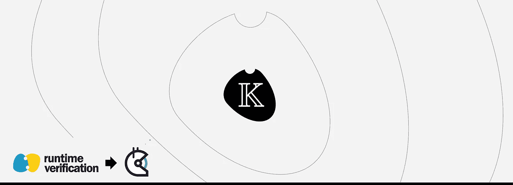

# KWasm 和 KEwasm:以太坊 2.0 的可执行语义和形式验证工具

> 原文：<https://medium.com/coinmonks/kwasm-and-kewasm-executable-semantics-and-formal-verification-tools-for-ethereum-2-0-80fa3c3c2f11?source=collection_archive---------5----------------------->

## 作者:里卡德·霍特

# 金币资助

我们推出了一个 [Gitcoin Grant](https://gitcoin.co/grants/592/kewasm-and-kwasm) 来帮助我们构建 KWasm 和 KEwasm，以太坊 2.0 的可执行语义和形式化验证工具，用 K 框架编写。

k 工具模糊了规范和实现之间的界限。该代码易于阅读，是理解 Wasm 和 Ewasm 的重要参考，但它也生成了一个构造正确的解释器。

**我们希望 Ewasm 有一个规范，你可以用它来运行你的智能合同。**我们有一个电子邮件服务的原型实现，我们已经开始使用它来验证与[的电子邮件服务合同，我们在博客中提到了](/@rv_inc/verifying-ethereum-flavored-wasm-ewasm-code-de91ab3179be)。

现在还为时过早，我们现在想让证明器更强大，让早期使用者更容易使用这些工具。

在接下来的三个月里，我们希望让 KWasm 做好战斗准备。其中包括:

*   验证原型[智能合约](https://blog.coincodecap.com/tag/smart-contact/)。
*   为了可读性和速度做了一些大的重构。
*   以博客帖子和网络广播的形式制作关于如何正式验证合同的教育材料。

如果你认为这项工作很重要，你可以通过 [Gitcoin Grant](https://gitcoin.co/grants/592/kewasm-and-kwasm) 支持我们，或者[直接联系我们](mailto:contact@runtimeverification.com)。

# 为什么我们有资格这么做？

我们是[运行时验证公司](/@rv_inc)。我们是 KEVM 背后的正式验证专家，我们曾经验证过 [Uniswap](https://github.com/runtimeverification/verified-smart-contracts/tree/master/uniswap) 、[戴](https://github.com/makerdao/mkr-mcd-spec)、[以太坊 2.0 存款合同](https://runtimeverification.com/blog/end-to-end-formal-verification-of-ethereum-2-0-deposit-smart-contract/)等等。

在与 dlab 的合作中，我们已经写了到目前为止我们在验证使用 KWasm 方面所做的工作。这些帖子涵盖了以下具体主题:

*   [介绍 KWasm，并介绍符号执行](/dlabvc/kwasm-a-new-executable-semantics-for-the-blockchain-14e1bca8a360)
*   [使用 WebAssembly (Wasm)进行形式验证的介绍](/dlabvc/verifying-wasm-functions-part-1-ea524c04c094)
*   [验证更复杂的 Wasm 功能](/dlabvc/verifying-wasm-functions-part-2-i64-reverse-bytes-3590aedaa3c0)
*   [验证以太坊风味 Wasm (Ewasm)代码](/dlabvc/verifying-ethereum-flavored-wasm-ewasm-code-de91ab3179be)

除了我们在区块链项目上的经验，我们还有超过十年的学术记录。

# 人

目前的 KWasm [团队](https://runtimeverification.com/team/)由三个人组成:

**Rikard Hjort** — KWasm 总部设在柏林。致力于加速自动验证，提高证明者能力和写作。

**Everett Hildenbrandt**——伊利诺伊州厄巴纳的正式建模工程师。Runtime Verification 的产品负责人之一，KEVM 背后的工程师。

Stephen Skeirik —伊利诺伊州厄巴纳的正式验证工程师。对区块链系统的语义感兴趣，并将形式验证带给大众。

> [直接在您的收件箱中获得最佳软件交易](https://coincodecap.com/?utm_source=coinmonks)

*运行时验证公司提供* [*区块链咨询*](https://runtimeverification.com/blockchain/advisory.php)*[*智能合约*](https://runtimeverification.com/smartcontract/) *和* [*协议形式化验证*](https://runtimeverification.com/protocol/) *服务。**

**