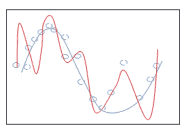

# 张量流中的 L1 正则化

> 原文：<https://medium.com/coinmonks/l1-regularization-in-tensorflow-3743e90f4c48?source=collection_archive---------3----------------------->

An overfit function in red, with the regularized one in blue

在构建模型时，您经常会发现自己在高偏差(低方差)模型和高方差(低偏差)模型的另一个极端之间移动。

高偏差模型是一种永远不会被期望的模型，因为它太简单而不能在一般情况下使用。另一方面，高方差模型可以逐渐简化以满足您的需要。简化问题称为正则化。

在本文中，我们将过度设计我们的模型，结果导致它过拟合。然后，我们将应用正则化来减少方差。

我们将利用 Kaggle 上的波士顿房价预测数据，这些数据可在此处获得。

让我们从导入数据开始，并将其分为要素和标注。然后，我们将着手设计新的功能。在这种情况下，我们将添加每列的平方作为新列。实际上，你可以做更多的事情，比如乘法运算、取对数或者使用正弦函数。

接下来，我们定义输入函数。我们需要这个将数据输入到我们的评估器中。在这个版本中，我们将使用一个输入函数，通过将数据作为参数传递来进行训练和测试。这个函数正在做很多事情，所以请通读注释。

接下来，让我们检查我们的特性，并将列名提取到特性列中。

正则化是在训练期间应用的，所以我们将使用一个优化器，让我们使用应用正则化。我们还将指定一个学习率。您可以尝试各种超级参数，看看它们如何影响模型的质量。

继续评估你的模型。

你可以继续做预测。

这就是这篇文章的全部内容。希望你跟得开心。