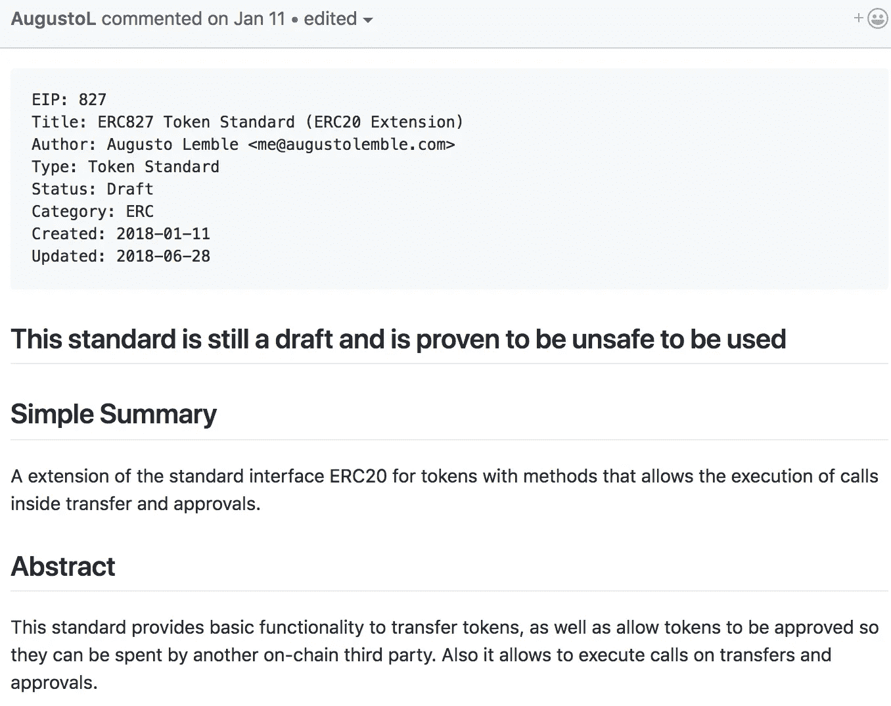

# 对 ERC223 和 ERC827 的实施缺乏洞察力

> 原文：<https://medium.com/coinmonks/lacking-insights-in-erc223-erc827-implementation-26be5e7c3cd7?source=collection_archive---------3----------------------->

## ATN 令牌自定义调用错误分析


Photo by [Michał Parzuchowski](https://unsplash.com/photos/geNNFqfvw48?utm_source=unsplash&utm_medium=referral&utm_content=creditCopyText) on [Unsplash](https://unsplash.com/search/photos/chaos?utm_source=unsplash&utm_medium=referral&utm_content=creditCopyText)

2018 年 6 月 20 日，AI 科技网(ATN)报道了一起针对 ATN 智能合约的攻击:一名黑客通过 ATN 代币合约中的 bug 将自己的地址设置为`owner`，并于 2018 年 5 月 11 日为自己发放了 1100 万 ATN 代币。ATN 团队找到了漏洞，发现了黑客方法，并立即升级了合同。黑客利用传递 **ERC223 合同**中的自定义回退函数和`ds-auth`审批支票，然后在 ERC223 合同调用该 CUSTOM_CALL 时调用该合同的函数。

Afterwards, '[隐形人真忙](https://blog.csdn.net/u011721501/article/details/80757811)' of Baidu Security also shared experience of 'call injection attack in Ethereum smart contracts' in Xianzhi Security Summit. This bug originates from a common practice: calling an arbitrary function appointed by the contract caller from another contract after invoking a function in the current one, while the bug in ATN contract reveals the danger of this approach: the contract caller could bypass authority checks or attack others with the identity of contract itself via this feature.

**目前以太坊上部署的存在类似漏洞的 ERC20 合约数量:146**

危险代码的链接:

*   [有风险的 ERC223 实现](https://github.com/Dexaran/ERC223-token-standard/blob/16d350ec85d5b14b9dc857468c8e0eb4a10572d3/ERC223_Token.sol#L70)
*   [有风险的 ERC827 实现](https://github.com/OpenZeppelin/openzeppelin-solidity/blob/dc1e352cc49565ba0a33c346006655cf63681ff5/contracts/token/ERC827/ERC827Token.sol)

更新:

*   从 open-zeppelin 中删除了 ERC827 代码[【2】](#e46e)
*   奥古斯托创建了一个 [gitter 频道](https://gitter.im/ERC827/Lobby)来讨论 ERC827 标准，并且有一个新的[提案](https://github.com/windingtree/erc827/pull/2)来改进它

# ATN 事件分析

ERC223 是 Dexaran 于 2017 年 3 月 5 日提出的令牌标准草案[【3】](#d11d)解决发送给一个 ERC20 合约的令牌的处理问题。ERC20 有两种方式转移令牌:一种是直接调用`transfer()`，另一种是调用`approve()`+`transferFrom()`——先审批，后转移。当智能协定承担接收者角色时，需要采用后一种方法，否则发送到协定地址的令牌将被永远锁定。

下面是 ERC223 draft 的**正确示例**:契约调用`transfer()`时，检查`to`地址是否为契约。如果是，它调用目标契约中的`tokenFallback()`来处理发送给契约的令牌。不存在滥用客户呼叫。

```
// Correct draft code sample
contract ERC223 {
  function transfer(address to, uint value, bytes data) {
        uint codeLength;
        assembly {
            codeLength := extcodesize(_to)
        }
        balances[msg.sender] = balances[msg.sender].sub(_value);
        balances[_to] = balances[_to].add(_value);
        if(codeLength>0) {
            // Require proper transaction handling.
            ERC223Receiver receiver = ERC223Receiver(_to);
            receiver.tokenFallback(msg.sender, _value, _data);
        }
    }
}
```

**ERC223 是 ERC20 的超集，旨在取代 ERC20 成为新的令牌合同标准**，但一年多来仍未被广泛接受。只有一小部分项目使用了它。

这是 ATN Token 不幸采用的 ERC223 的**错误实现**。允许用户通过任意的`_custom_fallback`从`_to`地址调用任何功能。

```
// CUSTOM_CALL abusing
function transferFrom(
    address _from, 
    address _to, 
    uint256 _amount, 
    bytes _data, 
    string _custom_fallback
    ) 
    public returns (bool success)
{
    ...
    ERC223ReceivingContract receiver = ERC223ReceivingContract(_to);
    receiving.call.value(0)(byte4(keccak256(_custom_fallback)), _from, amout, data);
    ...
}
```

关于 ATN 漏洞的报告称，其合同提到了 ERC 223[【4】](#1dd2)的建议实施。调查此问题后，我们发现确实与 dex aran[【5】](#a137)维护的 ERC223-token-standard repo 的推荐分支`transfer()`类似:

```
// CUSTOM_CALL abusing
function transfer(
    address _to, 
    uint _value, 
    bytes _data, 
    string _custom_fallback
    ) 
    public returns (bool success) 
{
    ...
    assert(_to.call.value(0)(bytes4(keccak256(_custom_fallback)), msg.sender, _value, _data));
    ...
}v
```

这其实是有风险的。ConsenSys 的 [*智能合约安全最佳实践指南*](https://github.com/ConsenSys/smart-contract-best-practices) 敦促开发者避免合约外部调用。黑客在这次攻击中将`setOwner(address)`伪装成`_custom_fallback`，而目标地址`_to`正是 ATN 合约本身，从而间接调用了 ATN 合约的`setOwner(address)`。`msg.sender`成为了 ATN 的令牌契约本身从而通过了`ds-auth`中的`isAuthorized()`考验。

EVM 在读取参数时不会检查参数的数量。黑客叫完`setOwner(adddress)`后，EVM 只看了左边的`_from`。因此，当应用低级`call()`进行参数传递时，参数数和函数要求的和之间的差异不会出现错误。结果，黑客毫无困难地构建了攻击参数。

# 滥用定制呼叫的危险

回到`_custom_fallback`实现。在我们看来，作为一个通用的令牌接口，设计者应该考虑尽可能多的情况，以避免引入潜在的风险和漏洞。假设上面的`_custom_fallback`接口被广泛接受，更多类似的安全问题还在后面。一个健壮的界面设计应该是简单、易操作和直接的。草案中的`tokenFallback()`接口本来可以处理 ERC20 的问题，但是引入`_custom_fallback`会扰乱开发者并被滥用。

```
function approveAndCall(
    address _spender,
    uint256 _value,
    bytes _data
  )
    public
    payable
    returns (bool)
  {
    // require(_spender != address(this));
    approve(_spender, _value);
    require(_spender.call.value(msg.value)(_data));
    return true;
  }
```

在大多数情况下，当我们将智能合同地址传递给 ERC20 `approve()`时，另一方无法获得后续步骤的相关通知，常见的解决方案是`receiverCall`。上面的代码片段是一个实现，不幸的是包含了严重的 CUSTOM_CALL 滥用。执行`approveAndCall()`后，将运行`_spender`定义的其他操作。

**注意这一条。**

**后果:**这些类型的契约旨在允许用户在任何地址上定义`call()`函数，这是高风险的。通过获取合同的身份，黑客可以很容易地进行任何操作。

这通常会导致 3 种危险的结果:

*   **第一个**:允许攻击者以一个有漏洞的契约的身份窃取其他契约中的令牌
*   **第二**:借助`ds-auth`绕过合同中的权限检查
*   **第三个**:允许攻击者用一个有漏洞的合同的身份来窃取其他账户中被批准的令牌

第一个例子:假设有问题的契约 A 有 B/C/D 令牌，黑客可以将`_spender`地址设置为目标令牌契约(例如 B 的地址)并选择`_data`来调用`transfer(address,uint256)`，黑客将 A 的令牌以契约 A 的身份转移出去将没有任何障碍。上面代码中的`_spender != address(this)`只能保护一个令牌。

如果管理各种令牌的智能合约允许自定义`call()`，那么里面的令牌都有危险。

第二个例子:ATN 事件中的黑客利用合同身份绕过`ds-auth`权限限制。

第三个例子:假设用户 X 批准了管理 10，000 个 B 令牌的错误合同 A，黑客可以通过这个错误窃取 B 调用`transferFrom`。

# ERC223 的草图和接口之间的不一致

经过进一步调查，我们发现 ERC223 接口草案中没有使用`_custom_fallback`的描述。

这是由草案定义的接口:

```
contract ERC223Interface {
    uint public totalSupply;
    function balanceOf(address who) constant returns (uint);
    function transfer(address to, uint value);
    function transfer(address to, uint value, bytes data);
    event Transfer(address indexed from, address indexed to, uint value, bytes data);
}
```

两个`transfer()`界面中没有出现名为`_custom_fallback`的参数。

让我们检查一下草案说明:

> *如果接收者是一个契约 ERC223 令牌契约将尝试在接收者契约上调用 tokenFallback 函数。如果接收方没有 tokenFallback 函数，则协定事务将失败。tokenFallback 函数类似于以太网事务的 Fallback 函数。它可以用来处理传入的事务。*

要点是，如果令牌接收者是一个 ERC223 合约，那么调用它的`tokenFallback()`。如果目标没有`tokenFallback()`，交易失败。这里`tokenFallback()`在以太坊交易中作为默认`fallback`使用。

ERC223 草案有一个明确的目标:为令牌契约定义`tokenFallback()`来处理收到的令牌。尽管 ERC223 代码的主分支中没有`_custom_fallback`，但推荐分支引入了一个带有`_custom_fallback`的`transfer()`实现，并且没有警告。

# ERC223 实现中的其他错误

其实 ERC223 推荐分支还有其他 bug。

在处理字节时，`call()`会触发 EVM 级的 bug，导致数据[【6】](#075b)不一致。

```
// ERC223_Token.sol#L70
assert(_to.call.value(0)(bytes4(keccak256(_custom_fallback)), msg.sender, _value, _data));
```

在某些情况下，事件处理索引字节变量[【7】](#090b)会出现错误。

```
// ERC223_Interface.sol#L18
event Transfer(address indexed from, address indexed to, uint value, bytes indexed data);
```

可以肯定地说，ERC223 推荐分支不可靠，请尽量不要应用该代码。

# EVM 的参数传递机制

为了更好地理解这个漏洞，我们将探究 EVM 调用函数和传递参数的机制。看看这个样本

```
contract A{
    function transfer(address to, uint256 value){
  	      return;
    }
}
```

首先来介绍一下 EVM 的参数传递:当调用一个函数时，如果它有参数，我们通常需要根据 ABI 指定的类型来构造输入。例如，如果以太坊以`transfer(address to, uint256 value)`的形式调用`transfer()`，它将函数签名哈希值的前 4 个字节作为`function selector`并计算`sha3(transfer(address,uint256))`，那么结果就是`0xA9059CBB`，加上`to`的地址，256 位就变成了

```
0x0000000000000000000000003f5ce5fbfe3e9af3971dd833d26ba9b5c936f0be
```

`value`也被插入 256 位计算

```
0x000000000000000000000000000000000000000000000000000000e8d4a51000
```

最后，我们有一个完整的呼叫数据:

```
0xa9059cbb0000000000000000000000003f5ce5fbfe3e9af3971dd833d26ba9b5c936f0be000000000000000000000000000000000000000000000000000000e8d4a51000
```

将事务和 calldata 一起发送，以太坊可以完成函数调用。当以太坊节点收到请求时，它会将呼叫数据和智能合同字节码加载到 EVM 中。字节码是在编译时生成的，这样就可以同时处理参数。字节码只检查`calldata`是否比最小要求短，而不是是否太长。编译器会生成一系列带有数学运算的`CALLDATALOAD`来提取函数所需的参数。首先，它计算调用的目标函数:

`CALLDATALOAD`指令会将交易的 calldata ( `0xa9059cbb0000000000000000000000003f5ce5fbfe3e9af3971dd833d26ba9b5c936f0be000000000000000000000000000000000000000000000000000000e8d4a51000`)加载到堆栈中，并将前 256 位除以`0x100000000000000000000000000000000000000000000000000000000`，然后得到`0xA9059CBB`。每一个其他参数将以类似的方式提取。然而，当参数太多时，字节码和 EVM 不会处理参数，而是省略这一步。总而言之，这个特性源于编译器。黑客可以很容易地在 CUSTOM_CALL 上构造攻击参数。

# 高风险的 ERC827 实施



Risk Warning on EIP827 Draft Page

类似的 ERC827 Token draft 也有这个问题[【8】](#0dc3)。下面的代码来自 **openzeppelin-solidity** 的 ERC827 buggy 实现:

```
function transferAndCall(address _to, uint256 _value,bytes _data)
    public payable returns (bool)
{
    require(_to != address(this));
    super.transfer(_to, _value);
    require(_to.call.value(msg.value)(_data));
    return true;
}
```

程序在`transferAndCall()`完成事务后，会调用`_to`地址上的函数，参数由调用者设置。由于检查`_to != address(this)`，代码无法绕过结合`ds-auth`库(`second result`)的权限检查，同时可能引入上面的`first result`和`second result`，管理 bug 契约的令牌(通过‘this’契约攻击其他契约)。

除此之外，许多 ERC20 令牌合约都实现了类似的`call()`，这是非常危险的。在某些情况下，它允许攻击者窃取合同令牌并绕过权限检查。

# 更正“receiverCall”上的 ERC20 和 ERC721 实现

正确的“receiverCall”程序应该对被调用函数的签名进行硬编码，以防止攻击者任意指定**为**。以下是两个正确的“receiverCall”示例:

(1)通过声明 Receiver 函数进行“receiverCall”

以[ethereum.org](http://ethereum.org/)维护的 ERC20 代码为例:

```
function approveAndCall(address _spender, uint256 _value, bytes _extraData)
    public returns (bool success) 
{
    tokenRecipient spender = tokenRecipient(_spender);
    if (approve(_spender, _value)) {
        spender.receiveApproval(msg.sender, _value, this, _extraData);
        return true;
    }
}
```

“receiverCall”的行为类似于普通的函数调用。

(2)通过接收函数的**签名常量**运行‘Receiver call’

这个正确的片段来自 ConsenSys 的 Token-Factory

```
/* Approves and then calls the receiving contract */
function approveAndCall(address _spender, uint256 _value, bytes _extraData) returns (bool success) {
    allowed[msg.sender][_spender] = _value;
    Approval(msg.sender, _spender, _value);

    //call the receiveApproval function on the contract you want to be notified. This crafts the function signature manually so one doesn't have to include a contract in here just for this.
    //receiveApproval(address _from, uint256 _value, address _tokenContract, bytes _extraData)
    //it is assumed that when does this that the call *should* succeed, otherwise one would use vanilla approve instead.
    if(!_spender.call(bytes4(bytes32(sha3("receiveApproval(address,uint256,address,bytes)"))), msg.sender, _value, this, _extraData)) { throw; }
    return true;
    }
```

有些存储库正确地实现了“receiverCall”

*   [https://github.com/svenstucki/ERC677](https://github.com/svenstucki/ERC677)
*   [https://github . com/open zeppelin/open zeppelin-solidity/blob/master/contracts/token/ERC 721/ERC 721 basic token . sol # L349](https://github.com/OpenZeppelin/openzeppelin-solidity/blob/master/contracts/token/ERC721/ERC721BasicToken.sol#L349)
*   [https://github . com/ConsenSys/Token-Factory/blob/master/contracts/humanstandardtoken . sol](https://github.com/ConsenSys/Token-Factory/blob/master/contracts/HumanStandardToken.sol)
*   [https://github . com/ether eum/ether eum-org/blob/b 46095815 f 52 cf 328 ECF 7676 B2 b 38284d 48 FBA 58/solidity/token-advanced . sol # L138](https://github.com/ethereum/ethereum-org/blob/b46095815f52cf328ecf7676b2b38284d48fba58/solidity/token-advanced.sol#L138)

*特别感谢清新科技的吴玉会，他与我们讨论了这个话题，并提供了反馈和意见。要了解更多信息，请查看由 SECBIT Labs 维护的* [*可怕的 Buggy ERC-20 令牌*](https://github.com/sec-bit/awesome-buggy-erc20-tokens) *开源回购。*

# 结论

*   ERC223 标准的行为与接口定义不同，官方回购中的两个分支实现不一致。谨慎使用**官方代码**
*   ERC827 也容易受到攻击
*   小心使用低级调用
*   需要很好地理解 EVM 调用合同函数的机制

# 参考

*   [1] [ATN 报道](https://atn.io/resource/aareport.pdf)
*   [2] [OpenZeppelin 移除了 ERC827](https://github.com/OpenZeppelin/openzeppelin-solidity/pull/1045)
*   [3] [ERC-223 令牌标准建议草案](https://github.com/ethereum/EIPs/issues/223)
*   [4][ATN . sol transfer from()](https://github.com/ATNIO/atn-contracts/blob/7203781ad8d106ec6d1f9ca8305e76dd1274b181/src/ATN.sol#L114)
*   [5][ERC 223 _ token . sol transfer()函数](https://github.com/Dexaran/ERC223-token-standard/blob/16d350ec85d5b14b9dc857468c8e0eb4a10572d3/ERC223_Token.sol#L70)
*   [6] [ERC223-token-standard 第 50 期](https://github.com/Dexaran/ERC223-token-standard/issues/50)
*   [7] [ERC223-token-standard 第 51 期](https://github.com/Dexaran/ERC223-token-standard/issues/51)
*   [8] [ERC827Token.sol](https://github.com/OpenZeppelin/openzeppelin-solidity/blob/f18c3bc438b366f9cb3a8613f5be160c2cbced5e/contracts/token/ERC827/ERC827Token.sol#L73)
*   [9] [在多个 ERC20 智能合同中发现新的 evilReflex 错误(CVE-2018–12702，CVE-2018–12703)](https://peckshield.com/2018/06/23/evilReflex/)
*   [10] [HADAX 暂停 18T 和 GVE 存取款](https://huobiglobal.zendesk.com/hc/en-us/articles/360000110521-HADAX-Suspends-18T-and-GVE-Deposits-and-Withdrawals)

[***sec bit***](https://secbit.io)*由一群加密货币爱好者创立。我们正在研究智能合同安全、智能合同形式验证、加密协议、编译、合同分析、博弈论和加密经济学。*