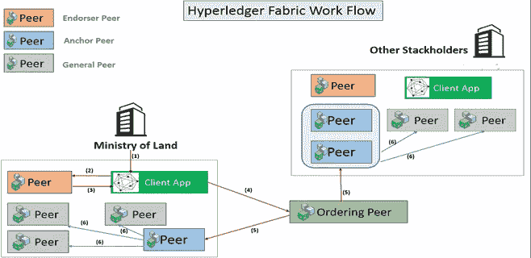
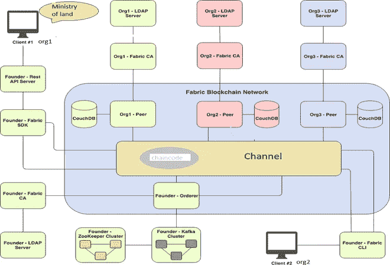

# 孟加拉使用区块链技术的土地核查系统

> 原文：<https://medium.com/coinmonks/land-verification-system-using-blockchain-technology-in-bangladesh-f718ebd39f13?source=collection_archive---------0----------------------->

Source : internet

如果说使用区块链技术的土地核查系统，那间接就是指**使用区块链技术的土地登记系统**。除非我们将土地注册信息存储在区块链系统中，否则我们无法利用区块链技术来验证这些信息。因此，在本文中，我将简要讨论当前的土地登记系统，传统系统面临的挑战，以及我们如何通过使用区块链技术来解决这些挑战。

# **土地登记系统**

土地登记一般指的是可以记录土地所有权、占有权或其他权利的制度(通常由政府机构或部门记录)，以提供所有权证据，促进交易并防止非法处置。记录的信息和提供的保护将因管辖区域而异。

它是一个通过契约或所有权证明正式和合法地记录土地或建筑物产权的过程。它公开表明，有一个正式的所有权记录，通过该所有权固有的权利。

我国的土地登记处通常负责各种事务，例如:

*   记录和保存有关不动产/财产的所有权、占有权或其他权利的事项；
*   保存有关土地和其他不动产的记录，以正确评估其价值并征收财产税；
*   人民、商业企业和政府之间的内部信任得到体现和促进(然而，情况并非总是如此。挑选一个得不到人民信任的国家太容易了)；
*   记录的文档和数据通常是显示合法所有权并为个人和企业提供保护的信息。

# **目前如何查询孟加拉房产的所有权？**

在孟加拉国，财产所有权纠纷非常普遍。与财产有关的文件很容易伪造，不可靠。如果任何人在购买物业时不谨慎，可能会面临问题，可能会在稍后阶段就物业的所有权提起诉讼。然而，在孟加拉国检查财产所有权是一项费力的工作。

要核实物业的业权，买家应做到以下几点:

1.  收集关于物业的信息
2.  建立遗产的历史链
3.  地契的真实性
4.  检查 khatian/porcha
5.  检查突变 khatian
6.  如果物业是从政府租赁的
7.  税务记录
8.  财产的实物验证

# **孟加拉国的土地登记程序**

如果有人想购买一套公寓或一块土地用于居住或商业目的，需要完成以下步骤

1.  确认土地办公室的权利记录
2.  对财产进行变异
3.  获得 RS 突变的检查
4.  从相关的分登记处获得无产权负担证明
5.  准备转让契约并支付印花税
6.  在指定银行缴纳资本利得税、注册费、增值税和其他税款
7.  在相关的分登记处申请登记
8.  在土地税收办公室登记所有权的变更

# **当前土地登记系统面临的挑战**

在我们现有的系统中有许多挑战。

*   **所有权核实** —全球土地登记机构面临的挑战之一是确保所有权核实。
*   **所有权历史** —在许多情况下，许多房产都没有记录所有权历史。在与未知方进行交易时，访问资产(例如一块土地)的完整所有权历史可以增加信任。
*   **未经授权出售土地**——财产可能未经授权就被出售，给所有者或保险公司造成经济损失。
*   **所有权转移的延迟** —基于纸张的土地登记和所有权转移需要一个多月的时间。不准确的财产估价会导致不正确的税收或保险费。
*   **无法检测骗局** —当前的纸质或数字记录无法防止欺诈和身份盗窃，从而导致非法销售。

# **在土地注册系统中使用区块链系统**

Source : internet

区块链，最初是区块链，是一个不断增长的记录列表，称为使用加密技术链接的块。每个块包含前一个块的加密散列、时间戳和交易数据**。由于区块链的特点，只有区块链能够解决这些挑战。区块链的主要特点是:-**

*   **不变性**:创建永久的数据记录(不能更改或删除)；
*   **可追溯性:**使用区块链，可以很容易地跟踪一个项目，以找到交易历史中的出处。
*   **安全**:区块链由于其数字签名和加密，被认为是一个高度安全的系统。该系统被特别设计成安全、方便和防篡改的。
*   **时间戳**:在区块链中创建的每个条目都有一个时间戳进行安全跟踪(永久性使得无法积压)；
*   **没有单点故障**:总账分布在区块链的每个节点上，每个节点都是参与者。所以，它是分布式的。
*   **欺诈预防:**由于需要各种共识协议来验证条目，因此消除了重复条目或欺诈的风险
*   **透明**:发生的交易是透明的。被授权的个人可以查看交易。
*   **智能合约(Chaincode)** :通过智能合约，商家可以在区块链上预设条件。只有满足条件时，才会触发自动交易。

# **区块链的种类**

至少有三种类型的区块链网络

1) **公共区块链** : —任何人都可以参与公共区块链，因为它是开源的，对所有人开放，没有人负责。没有对公共区块链进行访问或权限管理，任何人都可以成为共识的一部分。所有交易都是公开的，所有节点都是平等的。最著名的用于加密货币的公共区块链是**比特币**和**以太坊**

2) **私有区块链** : —私有区块链是由单个实体管理的仅限邀请的网络。网络的加入者需要获得读、写或审计区块链的许可。私有区块链允许组织在不公开数据的情况下使用分布式分类帐技术。 **Hyperledger fabric** 是私有区块链的一个例子。

3) **财团区块链** : —在一组成员公司的领导下而非单一实体下运作的混合类型。区块链财团的例子有:**法定人数**和 **Corda** 。

还有另一种类型的区块链叫做**混合区块链**，它结合了集中和分散的特点。链的确切工作方式可以根据使用集中/分散的部分而有所不同。例子:**龙链**

再次基于加入网络之前的许可，区块链可以两种类型:-

1.  **许可区块链**——只允许已知节点加入网络。示例:- **Hyperledger fabric**
2.  未经许可的区块链——任何人和任何事都可以成为未经许可的区块链的一部分。例子:- **比特币**，**以太坊**

**私人许可的**区块链比公共许可的区块链更快、更高效、更划算。

> ***基于我们土地登记和核查系统的特点，我强烈建议 Hyperledger fabric 平台是最适合解决我们问题的平台。因为我们的土地信息不应该是公开的区块链以及任何人都不应该连接到土地注册处区块链平台没有适当的授权。***

# 为什么选择 Hyperledger 面料？

选择 hyperledger fabric 作为区块链平台还有其他一些原因。他们是

1.  **内置权限** : — Hyperledger Fabric 自带完全权限系统。您可以选择谁能够访问您的区块链以及他们的访问级别
2.  **交易共识:——**Hyperledger 将在交易层面达成共识。这意味着要使一个事务被认为是有效的，不需要验证整个块，而只需要验证该事务。
3.  **链码支持:——**目前 Hyperledger fabric 支持 NodeJs、Java 或 Go 代码。
4.  **不需要加密货币** : —与 etheruem 不同，Hyperledger 可以在不实施加密货币的情况下运行。
5.  **没有工作证明/利害关系证明** : — Hyperledger 不需要计算机没日没夜地解决问题，Hyperledger 不需要人们拥有加密货币来达成共识。
6.  **IBM 支持开源** : — Hyperledger fabric 由 IBM 维护，也一直是开源的。

# **利益相关方**

到目前为止我已经确定了三个利益相关者( ***不限于*** )。

1.  国土部(**读写权限**
2.  公共行政部(**只读权限**
3.  内政部(**只读权限**

# **我们基于 Hyperledger Fabric 的系统的拟议组件**

Land document verification by scanning blockchain hash (QR code) with mobile application

在我们的实践实验中，我们需要以下面料成分

1.  **会员服务提供商(或认证机构)**-会员服务提供商(MSP)是一个组件，旨在提供会员运营架构的抽象。特别是，MSP 抽象出了颁发和验证证书以及用户身份验证背后的所有加密机制和协议。每个组织将维护自己的 MSP。
2.  **订购方** —订购方对等方被视为 Hyperledger 结构网络的中央通信渠道。订购方对等方/节点负责整个网络中一致的分类帐状态。订购方对等方创建块并将其交付给所有对等方。将有多个订购者。
3.  **对等方** —对等方从订购方以*块*的形式接收订购的分类帐状态更新，并维护分类帐的状态。对等体还可以承担签署对等体的角色。安装在对等端的 Chaincode(类似以太坊智能合约)。每个组织将有多个对等体。网络中有不同角色的不同类型的对等节点:- **a .背书者对等点 b .锚定者对等点 c .订购者对等点**
4.  **组织—** 组织在逻辑上将成员(同级)分开，成员可以共享也可以不共享 MSP。建议每个组织都有一个 MSP，我们遵循了这一建议。在我们的案例中，我们的利益相关者是组织
5.  **通道**-Hyperledger Fabric 通道是两个或更多特定网络成员之间通信的私有“子网”，用于进行私有和保密交易。加入渠道的每个组织的每个对等点都有自己的身份，该身份由成员服务提供商(MSP)提供，MSP 向其渠道对等点和服务验证每个对等点。
6.  **智能合同(chain code)——**智能合同是两个人之间以计算机代码形式达成的协议。它们在区块链上运行，因此存储在分散的数据库中，不能更改。由区块链处理的智能合约中发生的交易，这意味着它们可以在没有第三方的情况下自动发送。到目前为止，在我们的区块链系统中可能有三个智能合约(不限于此)。他们是为了:- (1) **。Mutaion(NaamJari) (2)。Khatiyan 记录③。土地税记录**
7.  **REST API 服务器** —该服务器为 web 应用在 Hyperledger 网络上进行交易提供了一个方便的 REST 接口。它使用 Node.js SDK API 调用网络成员的对等点、订购者和 CA 服务器。API 服务器应该由每个成员组织运行。它管理用户认证，与对等方交互，并将事件传递给客户端**。**
8.  **传统土地管理系统** —土地管理系统如国土部在线系统[https://minland.gov.bd/](https://minland.gov.bd/)或[https://land.gov.bd/](https://land.gov.bd/)将通过 REST API 与 Hyperledger 网络通信
9.  **移动验证应用—** 二维码将嵌入土地信息交易的文件中，并在从土地管理系统下载时打印在文件上。我们的移动应用程序将通过我们专门的移动应用程序扫描二维码来验证文件的真实性。这个移动应用程序也将与 REST API 服务器通信。
10.  **网络验证门户-** 将有一个在线门户网站，可以通过过滤不同的领域检查任何土地信息，以验证文件的真实性。该门户将通过 REST API 服务器与 Hyperledger 结构网络通信。这种过滤功能也可以添加在任何授权的网站，人们会相信，如国土资源部的网站或 http://land.gov.bd[的](http://land.gov.bd)网站。

# 【Hyperledger Fabric 是如何工作的？

***Figure: Hyperledger Fabric work flow in land registry system***

1)国土部**参与者**通过客户端应用程序调用交易请求。

2) **客户端应用**将事务调用请求广播给背书者对等体。

3)背书人对等检查证书细节和其他信息以验证交易。然后它执行链码(即。智能合同)并将背书响应返回给客户端。背书方发送交易**批准或拒绝**作为背书响应的一部分。

4)客户现在将批准的交易发送给订购方对等方，以便正确订购并包含在**块**中。

5)订购者节点将交易包括到块中，并将该块转发到超分类帐结构网络的不同成员组织的锚节点。

6)锚节点然后将该块广播给它们自己组织内的其他对等体。这些个体对等体然后用最新的块更新他们的本地分类帐。因此，所有网络都同步了分类账。

# 区块链支持的土地核查系统体系结构

**Figure: *System Architecture of Blockchain Enabled Land Verification System***

# **利用区块链进行土地登记/验证的好处**

*   土地出售/购买处理时间可以从几个月减少到几天。
*   核实土地所有权减少到一个/两个步骤，因为区块链的信息是不可改变的和可信的。
*   文书工作和邮资可以从购买过程中省去。
*   防止欺诈，因为买方收到一个待定的财产所有权，因此财产不能转售。
*   由于法律要求的所有文件都添加到了区块链中，因此无法颁发财产所有权的可能性大大降低。
*   减少人工干预，实现实时产权分配。
*   数字签名确保了财产交易过程中的高度安全性。

这只是一个如何利用技术管理土地信息的命题。根据实际情况，可以更改/更新一些内容，例如对等点/节点的数量、股东的数量、链码的数量。虽然本文主要基于孟加拉国的土地管理系统，但大部分内容也适用于其他国家的土地登记系统。

***反馈****:shariful.islam@bcc.gov.bd*

***PS:如果你喜欢这篇文章，请用掌声支持它*** 👏 ***。欢呼***

# 参考资料:

1.  [https://resource . ogrlegal . com/how-to-check-ownership-property-Bangladesh/](https://resource.ogrlegal.com/how-to-check-ownership-property-bangladesh/)
2.  [https://www . b property . com/blog/land-mutation-process-Bangladesh/](https://www.bproperty.com/blog/land-mutation-process-bangladesh/)
3.  [https://Bangladesh please . WordPress . com/2014/11/08/孟加拉国土地登记和财产转让程序/](https://bangladeshplease.wordpress.com/2014/11/08/land-registration-and-property-transfer-procedure-in-bangladesh/)
4.  [https://medium . com/coin monks/hyperledger-fabric-in-practice-part-1-main-components-and-running-them-locally-aa4b 805465 fa](/coinmonks/hyperledger-fabric-in-practice-part-1-main-components-and-running-them-locally-aa4b805465fa)

> [直接在您的收件箱中获得最佳软件交易](https://coincodecap.com/?utm_source=coinmonks)

