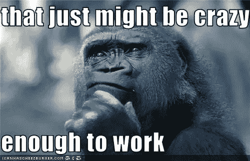
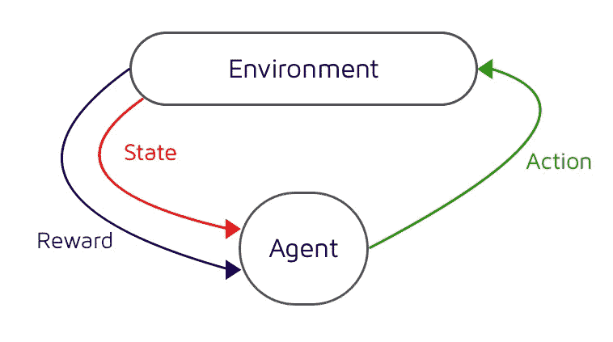
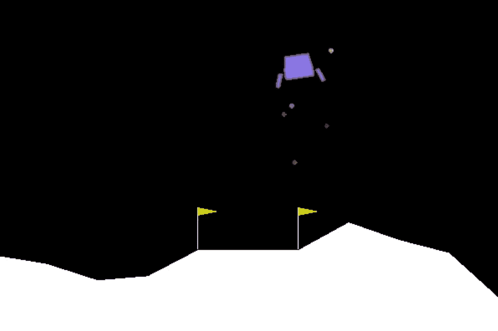
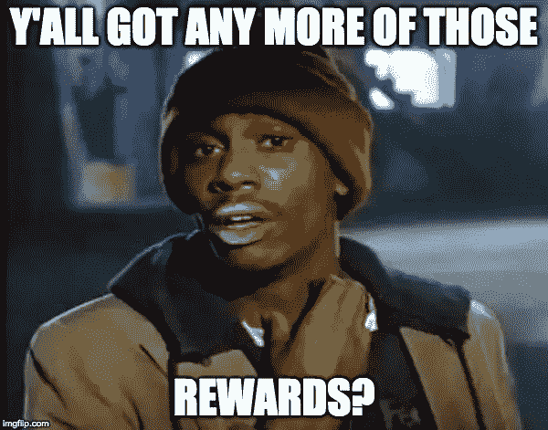
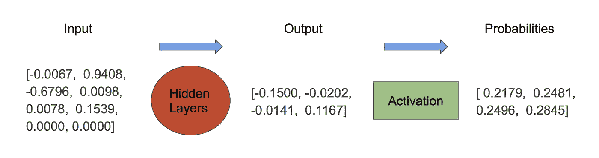
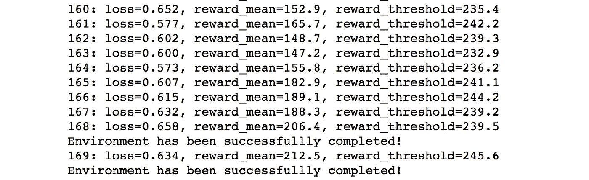
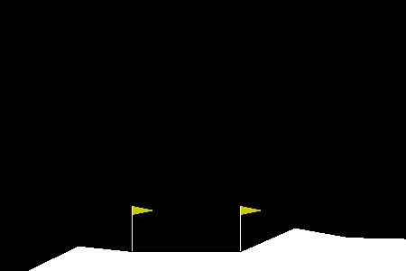

# 用简单的强化学习让火箭着陆

> 原文：<https://medium.com/coinmonks/landing-a-rocket-with-simple-reinforcement-learning-3a0265f8b58c?source=collection_archive---------0----------------------->


# 我会学到什么？

在本文中，我们将构建一个简单的强化学习(RL)代理，它可以在视频游戏月球着陆器中成功地着陆火箭。RL 是一个庞大的主题，我不打算在这里详细讨论所有内容。相反，这个项目的目的是让你的手脏一些实际的强化学习，并获得一种感觉。将来会有更多关于各种主题的深入文章。该项目将包括以下内容:

1.  **强化学习的核心原则**
2.  **用 pytorch 构建一个简单的神经网络**
3.  **使用交叉熵方法(CEM)和深度学习安全着陆 2D 火箭**
4.  **使用 OpenAi gym 训练智能代理，可以解决从机器人到视频游戏的各种环境**

完整代码可以在我的 [github](https://github.com/djbyrne/Landing-A-Rocket-With-Simple-Reinforcement-Learning) 上找到。如果您想快速了解已经设置好的所有内容，请单击下面的“在 FloydHub 上运行”按钮。这将在 FloydHub 惊人的云平台上设置一个工作区，并预先安装所有的依赖项和环境要求。

[](https://floydhub.com/run?template=https://github.com/djbyrne/Landing-A-Rocket-With-Simple-Reinforcement-Learning)

# 介绍

人工智能的进步正在飞速发展(没有双关语的意思)。研究人员每年都在开发突破性的想法，而我们仍处于这一惊人领域的起步阶段。人工智能中最令人兴奋的领域之一是强化学习。RL 已经负责了一些最酷的人工智能例子，例如 OpenAI 开发了一个代理，它在电子竞技 DOTA 2 中击败了顶级的职业人类选手！对于一个人工智能来说，能够在 DOTA 2 这样复杂的游戏中泛化和学习复杂的策略是一个巨大的成就，并将推动研究更接近实现人工通用智能(AGI)。除了在游戏中实现超人水平的性能，RL 还可以应用于广泛的领域，包括金融交易、自然语言处理、医疗保健、制造和教育。

# 什么是强化学习？

像大多数人工智能的进步一样，RL 源于对人类智能的研究。RL 的核心概念来自行为主义，它基本上是说我们在生活中所做的一切都是对我们当前环境的反射反应或我们过去行为的结果。

RL 使用试错法，通过在一段时间内获得可能的最佳回报来学习做出可能的最佳决策。一个很好的例子就是你如何训练一只狗。每当你让狗翻身的时候，它们就会得到一份奖励(奖励+1)。每次他们在地毯上撒尿，就会被吼(奖励 1)。随着时间的推移，他们学会了做那些能给他们带来最积极回报的事情，避免做那些能带来最消极回报的事情。

由于 RL 使用无监督学习，所以不需要告诉它如何实现某个东西，它只需要知道要实现什么。这意味着它可以找到人类可能从未想过的问题的解决方案。



# 强化学习的组成部分

当代理在环境中前进时，它会经历一种学习循环。如上图所示。代理识别其当前所处的状态，并根据其当前状态决定采取最佳行动。当这个动作在环境中执行时，代理观察采取那个动作后的新状态，以及在那个状态下采取一个动作所收到的奖励。通过这种方法，我们的代理学习。



The game loop of an RL environment. Image taken from [here](https://www.google.com/url?sa=i&rct=j&q=&esrc=s&source=images&cd=&cad=rja&uact=8&ved=2ahUKEwiW-4m_k7XcAhUoDMAKHZzlAYkQjRx6BAgBEAU&url=https%3A%2F%2Fai.intel.com%2Fopenai%2F&psig=AOvVaw3hv4aKWXnQaQFYLk2sUnZc&ust=1532432834203495)

# 代理人

特工就是我们的 AI，我们故事的主人公。有趣的事实是，如果你给你的代理一个名字，它将训练至少快 2 倍！让我们打电话给我们的代理蒂姆。Tim 包含 RL 算法和神经网络，允许它根据迄今为止学到的知识做出决策。在这个项目中，我们将使用交叉熵方法作为我们的 RL 算法。

公平的警告，当你的经纪人在训练时，你可能会对他产生感情上的依恋。当小提米连续第五次没有进步时，你甚至会发现自己在对着显示器上的训练日志大喊大叫。这也会给你一个很好的预览，让你知道你会成为什么样的父母(最有可能的是，住院病人和过分挑剔)。

# 环境



Lunar Lander Game

环境是我们的代理人生活和执行任务的地方。在这个项目中，环境是月球着陆器游戏。你所需要知道的是，环境给了我们作为对代理的观察的状态，以及代理在试图战胜环境时得到的回报。沿着这条路走下去，你可能想要构建你自己的环境来尝试和解决特定的任务，但是这需要大量的工作。所以现在我们将使用 OpenAI 的健身房环境。这为我们提供了大量可供选择的学习环境。如果你在本地运行这个项目，查看 OpenAI 文档，在这里设置健身房。如果你不想经历设置这个的麻烦，我建议你使用文章开头的“在 floydhub 上运行”按钮。

# 状态

状态/观察只是环境的当前状态。例如，在井字游戏中，环境的当前状态是什么棋子在什么方格上。这个简单的环境可以用一个简单的矩阵来表示它的状态，但是对于更复杂的环境，我们使用来自屏幕的像素数据作为当前状态。这使用计算机视觉来理解当前状态下正在发生的事情。这是一个更高级的特性，不在这里讨论。

# 行动

就像国家一样，这是非常不言自明的。对于环境中的每一步，代理都会根据其当前所处的状态执行一个操作。在这个项目中，月球着陆器可以采取 4 种可能的行动。什么都不做，左方位引擎点火，主引擎点火，右方位引擎点火。

# 报酬

回报只是代理人从与环境的互动中获得的反馈。这可能是积极的，也可能是消极的，是代理如何学习的一个非常重要的因素。在月球着陆器的例子中，代理人因着陆更接近目标区域而获得正奖励。代理人因远离着陆区而获得负奖励。此外，代理人每次执行一个动作都会得到一个小的负奖励。这样做是为了教会代理人尽可能快速有效地着陆火箭。如果我们只是简单地奖励它让火箭着陆，代理人将能够做到这一点，但它可能会比它应该做的时间长得多，并使用多余的燃料。这是因为这样做没有坏处。



分配正确的奖励函数是非常重要的，也是代理表现的关键因素。为一项任务决定正确的奖励并不总是容易或直接的，而且会对代理人产生巨大的影响。记住，我们要告诉代理人**做什么**，而不是**如何做**。在这个例子中，我们告诉代理尽可能高效地将火箭降落在给定的位置。代理如何做到这一点完全取决于它自己。

# 交叉熵方法

现在我们已经了解了 RL 是什么的基础知识，让我们深入研究一下我们的代理将用来学习的方法。我们的代理将播放数百集的环境，并记录所采取的行动以及代理在每一集的每一步所处的状态。还记录了该集获得的总报酬。我们将生成一批这样的剧集，每批大约 100 集。一旦我们从这一批剧集中收集了数据，我们就可以挑选出在这一批中表现最好的剧集。这类似于进化算法的工作方式，因为它执行“最适合的生存”方法。


然后我们把这些精华片段放入我们的神经网络中。状态被用作输入，而采取的行动是目标输出。通过这样做，are 网络知道在给定的状态下应该采取什么行动。

有许多不同类型的 RL 模型，它们具有不同的学习方法。目前，你需要知道的是，CEM 被定义为以下三个标签。无模型、基于策略和基于策略的学习。下面是对每个问题的快速解释

1.  **无模型与基于模型:**基于模型的方法尝试建立环境模型，并预测接下来会发生什么，以便做出最佳决策。无模型方法直接连接观察和行动，以做出最佳决策[1]
2.  **基于策略与基于价值:**基于策略的代理随着时间的推移建立一个策略，该策略确定在给定状态下采取某个动作的概率。基于价值的代理计算采取每个行动的价值，并使用该价值选择最佳行动。[1]
3.  **关闭策略与打开策略:**这决定了我们的代理如何从经验中学习。“关闭策略”从代理以前收集的旧数据中学习，使用与我们当前策略不同的策略。其中 as On 策略使用当前策略从新数据中学习[2]。

# 为什么用 CEM？

如果你对 RL 做过任何研究，你会很快发现 CEM 并没有得到太多的爱，而是被更流行的方法所掩盖，如深度 Q 学习(DQN)和有利的异步演员 Crtic (A3C)。那么我们为什么不用其中的一个呢？CEM 对于初学者来说是一个很好的方法，因为它是一个简单直观的方法，可以用大约 100 行代码编写。它不仅易于遵循，而且执行得相当好，将为将来的项目提供一个很好的比较基准。

# CEM 积木

为了实现深度交叉熵方法，我们需要遵循 4 个步骤

# 1.生成会话:

与我们当前的代理一起玩几集游戏环境，并保存每集使用的动作、状态和奖励

# 2.检索精英课程:

我们只想了解在那一批中获得高分的剧集。我们通过从该批生成的时段的所有剧集奖励中抽取一定百分比来确定我们的精英门槛。

# 3.精英课程训练

现在我们已经有了这一批中的前 X%,我们根据这些经验来训练我们的模型。我们使用记录的状态作为输入，执行的动作作为目标输出。

# 4.冲洗并重复

我们不断重复这个过程，直到我们的模型收敛到一个成功的策略

现在我们有了如何构建代理的蓝图，我们需要涵盖的最后一件事是将深度学习应用于 CEM。

# 深度学习

传统的 CEM 使用矩阵或表来保存策略。该矩阵包含环境中的所有状态，并记录在该状态下采取每个可能行动的概率。可以想象，这种方法只适用于状态空间小且有限的环境。为了构建能够学会战胜更大、更复杂环境的代理，我们不能使用矩阵来存储我们的策略。

这就是深度学习发挥作用的地方。我们将使用一个神经网络来代替一个矩阵，该网络将根据作为网络输入的状态来学习近似采取什么行动。如果你对神经网络不熟悉，可以看看我之前写的关于从头开始构建神经网络的文章[这里](/coinmonks/neural-network-from-scratch-tumour-diagnosis-354abbcb2f3b)。对于这个项目，我们不会从头开始构建整个网络，而是使用流行的深度学习库 pytorch。我们网络的完整代码可以在这里看到

```
import gym
import numpy as np
import torch
import torch.nn as nn
import torch.optim as optimclass Net(nn.Module): def __init__(self, obs_size, hidden_size, n_actions):
        super(Net, self).__init__()
        self.fc1 = nn.Linear(obs_size, hidden_size)
        self.fc2 = nn.Linear(hidden_size, n_actions)

    def forward(self, x):
        x = F.relu(self.fc1(x))
        return self.fc2(x)
```

Pytorch 有一个构建网络的标准惯例。首先，我们创建一个名为 Net 的新类，它继承了 nn。模块类。在这里，我们初始化我们的两个完全连接的层，使我们的神经网络的核心。第一个全连接层(fc1)是我们的输入层，它接收一个与状态大小相同的张量，并输出一个与隐藏节点大小相同的张量(在本例中为 200)。第二个全连接层(fc2)是我们的隐藏层，它接收前一层的输出，并输出一个张量，该张量是我们行动空间的大小(在本例中为 4)。它将为我们的代理可以采取的每个可能的行动输出一个数字。

```
def __init__(self, obs_size, hidden_size, n_actions):
        super(Net, self).__init__()
        self.fc1 = nn.Linear(obs_size, hidden_size)
        self.fc2 = nn.Linear(hidden_size, n_actions)
```

接下来我们需要写出我们的前进方法。这是 nn 所要求的。模特班。当我们将数据传入网络对象时，会自动使用这个方法。你可以在下面看到，我们取了一个张量 x，它是代理人正在观察的博弈状态。我们通过神经网络的第一层传递该状态，并对 fc1 的输出应用 ReLU 激活函数。接下来，我们将输出通过第二层。然后这个值作为整个网络的输出返回。

```
def forward(self, x):
        x = F.relu(self.fc1(x))
        return self.fc2(x)
```

通常我们会在最终输出层之后添加一个激活层，比如 softmax 函数。softmax 函数获取每个可能动作的输出数字，并对它们进行归一化处理，使它们的总和为 1。通过这样做，我们知道采取每个行动的正确概率。



example of what the state of the game looks like as it is being passed through our network. This goes from input to hidden layers and finally through our activation function to give us our probability distribution

然后我们会计算交叉熵损失，找出我们的预测有多远。相反，我们使用 pytorch 类 nn。在项目的后期。该类同时执行 softmax 激活和交叉熵损失，以便提供更稳定的功能[1]。你需要记住的唯一一件事是，当我们希望看到在给定当前状态下采取行动的可能性时，我们需要应用 softmax 激活函数。

# 生成会话

这是我们生成一批剧集的地方。代理将播放 N 集，并收集每一步的动作/状态，以便我们可以培训我们的代理。下面是该方法的完整代码

```
def generate_batch(env,batch_size, t_max=1000):

    activation = nn.Softmax(dim=1)
    batch_actions,batch_states, batch_rewards = [],[],[]

    for b in range(batch_size):
        states,actions = [],[]
        total_reward = 0
        s = env.reset()
        for t in range(t_max):
            s_v = torch.FloatTensor([s])
            act_probs_v = activation(net(s_v))
            act_probs = act_probs_v.data.numpy()[0]
            a = np.random.choice(len(act_probs), p=act_probs) new_s, r, done, info = env.step(a) states.append(s)
            actions.append(a)
            total_reward += r s = new_s
            if done:
                batch_actions.append(actions)
                batch_states.append(states)
                batch_rewards.append(total_reward)
                break
     return batch_states, batch_actions, batch_rewards
```

首先，我们创建激活函数，就像我们之前描述的那样。接下来，我们需要三个列表来存储我们的剧集数据。前两个是 batch_actions 和 batch_states。这些实际上是列表的列表。每个索引存储特定剧集的所有动作/状态。然后 batch_rewards 存储每集获得的总奖励。

```
activation = nn.Softmax(dim=1)
batch_actions,batch_states, batch_rewards = [],[],[]
```

接下来，我们迭代我们的批量大小，为每个迭代运行一集。在我们的第一个循环中，我们初始化了两个空列表来存储这一集的动作/状态。我们还创建了一个变量来计算每集的总回报。这些是我们的数据变量。最后，我们通过调用 env.reset()用一个新的插曲初始化我们的状态变量 s，这将开始一个新的游戏。

```
for b in range(batch_size):
        states,actions = [],[]
        total_reward = 0
        s = env.reset()
```

现在我们调用第二个循环，在游戏环境中执行单个步骤，直到我们达到该集的时间限制。首先，我们需要获得当前状态，并通过我们的网络传递它。为了做到这一点，我们需要把我们的状态 s 变成一个火炬浮点张量，这样我们就可以把它放到网络中。接下来我们从我们的网络中得到行动概率。记住，我们必须将激活函数应用到预测中，以使行动的概率总和为 1，并且是可用的。一旦我们得到了概率分布，我们就可以决定采取什么行动。这是通过使用 numpys random.choice 函数来完成的。它会根据给定的概率选择一个“随机”动作。因此，如果我们的策略说行动 1 的值为 0.7，而我们有三个概率为 0.1 的其他行动，那么我们的行动更有可能是行动 1。

```
for t in range(t_max):
            s_v = torch.FloatTensor([s])
            act_probs_v = activation(net(s_v))
            act_probs = act_probs_v.data.numpy()[0]
            a = np.random.choice(len(act_probs), p=act_probs)
```

一旦我们决定采取什么行动，行动就在环境中进行。这将向新状态返回采取该行动所获得的奖励，无论该集是否结束，以及环境可能提供的任何附加信息。现在我们有了更新环境的信息，我们需要将状态、动作和奖励添加到我们的数据变量中。最后，我们更新当前状态。

```
new_s, r, done, info = env.step(a)states.append(s)
actions.append(a)
total_reward += rs = new_s
```

之前我们需要做的最后一件事是，在这一步检查剧集是否已经结束。如果 done 为真，我们只需将我们的动作、状态和奖励添加到相应的批次列表中。然后打破

```
if done:
   batch_actions.append(actions)
   batch_states.append(states)
   batch_rewards.append(total_reward)
   break
```

一旦完成，只需返回我们的批处理数据

```
return batch_states, batch_actions, batch_rewards
```

# 过滤精英课程

该方法用于仅从最新批次中选择最佳剧集。找到奖励阈值，在我们的例子中，这是前 20%或第 80 个百分点，但可以随意使用这个数字，然后只需从奖励≥我们的奖励阈值的剧集中获取剧集数据。为此，我们使用简便的 numpy 百分位法。只要给它我们一批剧集的奖励列表和我们选择的百分位数，它就会为我们做所有可怕的计算！

```
def filter_batch(
states_batch,actions_batch,rewards_batch,percentile=50):

 reward_threshold = np.percentile(rewards_batch, percentile)

 elite_states = []
 elite_actions = []

 for i in range(len(rewards_batch)):
   if rewards_batch[i] > reward_threshold:
     for j in range(len(states_batch[i])):
       elite_states.append(states_batch[i][j])
       elite_actions.append(actions_batch[i][j])

 return elite_states,elite_actions
```

# 培养

所以现在我们深 CEM 的核心已经完成了。现在我们只需要利用我们目前的代码并训练代理。

```
batch_size = 100
session_size = 100
percentile = 80
hidden_size = 200
learning_rate = 0.0025
completion_score = 200env = gym.make("LunarLander-v2")
n_states = env.observation_space.shape[0]
n_actions = env.action_space.n#neural network
net = Net(n_states, hidden_size, n_actions)
#loss function
objective = nn.CrossEntropyLoss()
#optimisation function
optimizer = optim.Adam(params=net.parameters(), lr=learning_rate)for i in range(session_size):
    #generate new sessions
    batch_states,batch_actions,batch_rewards = generate_batch(env, batch_size, t_max=5000)elite_states, elite_actions = filter_batch(batch_states,batch_actions,batch_rewards,percentile)

    optimizer.zero_grad() tensor_states = torch.FloatTensor(elite_states)
    tensor_actions = torch.LongTensor(elite_actions) action_scores_v = net(tensor_states)
    loss_v = objective(action_scores_v, tensor_actions)
    loss_v.backward()
    optimizer.step() #show results
    mean_reward, threshold = np.mean(batch_rewards),
    np.percentile(batch_rewards, percentile)
    print("%d: loss=%.3f, reward_mean=%.1f, 
    reward_threshold=%.1f" 
    % (i, loss_v.item(), mean_reward, threshold))

    #check if 
    if np.mean(batch_rewards)> completion_score:
        print("Environment has been successfullly completed!")
```

这可能看起来像一段很长的代码，但实际上并没有那么可怕。首先，我们需要初始化我们的参数。

```
batch_size = 100
session_size = 500
percentile = 80
hidden_size = 200
learning_rate = 0.01
completion_score = 200
```

**batch_size** :一次运行多少集

**session_size** :多少个训练纪元。每个时期运行一批

**百分点**:用于确定我们的精英奖励阈值

**learning_rate** :表示在每个训练步骤中我们更新网络的程度(需要找到一个好的中间点)

**完成 _ 分数**:平均奖励超过 100 集视为解决

所有这些都可以拿来玩。下一部分只是初始化我们的学习环境

```
env = gym.make("LunarLander-v2")
n_states = env.observation_space.shape[0]
n_actions = env.action_space.n
```

接下来我们需要建立我们的 pytorch 神经网络。这涉及三件事。

1.  初始化我们之前建立的网络
2.  选择损失函数
3.  选择一个乐观主义者。

如您所见，我们使用了 CrossEntropyLoss 和 Adam 优化函数。

```
#neural network
net = Net(n_states, hidden_size, n_actions)#loss function
objective = nn.CrossEntropyLoss()#optimisation function
optimizer = optim.Adam(params=net.parameters(), lr=learning_rate)
```

现在我们开始我们的训练循环。我们针对给定的会话数运行一个循环。在每个时期(迭代)中，我们运行我们的 generate_batch 方法来获得我们的一批剧集数据。

```
for i in range(session_size):
    #generate new sessions
    batch_states,batch_actions,batch_rewards 
    = generate_batch(env, batch_size, t_max=5000)
```

一旦完成，我们通过调用我们的 filter batch 方法过滤掉不好的剧集，保留精华的。

```
elite_states, elite_actions = filter_batch(batch_states,batch_actions,batch_rewards,percentile)
```

一旦我们有了想要训练的精华片段，我们就通过神经网络传递数据。

```
optimizer.zero_grad()tensor_states = torch.FloatTensor(elite_states)
tensor_actions = torch.LongTensor(elite_actions)action_scores_v = net(tensor_states)
loss_v = objective(action_scores_v, tensor_actions)
loss_v.backward()
optimizer.step()
```

在每个训练步骤之前，我们需要将优化器的梯度设置回零。现在你只需要知道我们正在重置乐观者。接下来，我们将我们的精英 _ 州和精英 _ 行动列表转换为火炬张量，以便它们可以用于我们的网络。

然后，我们将所有精英剧集状态传递到我们的网络中。它遍历收集的每个状态，并预测策略分布应该是什么样子。接下来，我们将这些预测与《精英剧集》中的行动进行比较。理想情况下，我们希望我们的网络预测接近这些。

为了找出我们的网络有多远(损失)，我们使用目标函数(CrossEntropyLoss)。一旦我们计算出损失，我们就使用反向方法来计算损失的梯度(反向传播)。最后，我们的优化器通过调用 step 方法来更新我们的网络。

最后要做的是显示结果，并检查我们是否达到了高于完成分数的平均分

```
#show results
mean_reward, threshold = np.mean(batch_rewards),
np.percentile(batch_rewards, percentile)
print("%d: loss=%.3f, reward_mean=%.1f, 
reward_threshold=%.1f" 
% (i, loss_v.item(), mean_reward, threshold))

#check if 
if np.mean(batch_rewards)> completion_score:
    print("Environment has been successfullly completed!")
```

# 结果



Its taken a while but after 168 epochs Tim has successfully landed between the flags!

根据您的机器，在普通 CPU 上训练这个模型完成(得到 200 分)可能需要一些时间。如果你不想训练代理完成，你可以只训练它，直到它达到平均 50 分。这将使火箭安全着陆，尽管它可能不在目标区。如果你不想等待，你可以使用一个更简单的环境，比如 CartPole。把“LunarLander-v2”换成“CartPole-v0”就行了。



Our trained agent successfully landing !

如果您希望看到您的代理在运行，并且您正在本地机器上运行该项目，请添加这部分代码。这将生成一个单集的批次，并记录代理播放的视频。它将在您的代码所在的目录下创建一个名为“video”的新文件夹。

```
import gym.wrappers
env = gym.wrappers.Monitor(gym.make("LunarLander-v2"), directory="videos", force=True)
generate_batch(env, 1, t_max=5000)
env.close()
```

# 现在怎么办？

恭喜你构建了你的第一个深度强化学习代理！我们在这篇文章中讨论了一些复杂的事情，需要更多的时间和理解，但是我希望这是一个很好的项目，可以让你接触 RL。如果你想了解更多关于 RL 的信息，我在下面列出了几个资源，它们将为你提供继续学习所需的一切。

如果事情不清楚，我鼓励你多回顾一下这个项目。如果你觉得你在纸上已经很好的理解了，试着从头开始重新创作，这是真正理解这个主题的一个很好的练习。一旦你真正明白是怎么回事，就开始摆弄它。最初可以尝试的一些简单的事情是改变超参数或者给我们的网络增加更多的层。但是要小心，网络和参数越复杂，代理训练的时间就越长。

# 其他资源

[**深度强化学习动手**](https://www.packtpub.com/big-data-and-business-intelligence/deep-reinforcement-learning-hands) **:** 这是一本非常棒的书，我强烈推荐。Maxim 以清晰、简洁和吸引人的方式，通过伟大的示例项目，讲述了您需要了解的关于 RL 的一切。

[**实用强化学习(Coursera)**](https://www.coursera.org/learn/practical-rl) **:** 这是一门关于 RL 的很棒的课程。它涵盖了从基础到更高级的算法和概念的所有内容。这篇文章的部分灵感来自我在这里学到的东西。

[**Siraj Raval 的渠道:**](https://www.youtube.com/channel/UCWN3xxRkmTPmbKwht9FuE5A) 这家伙是我最喜欢的 ML 信息来源之一。他的频道几乎涵盖了你想知道的一切，同时非常有趣！

# 参考

[1]拉潘，马克西姆— *深度强化学习手把手*，帕克特出版社，2018

[2]萨顿 r .和巴尔托 a .——*强化学习:导论*，麻省理工学院出版社，1998 年

> 加入 Coinmonks [电报频道](https://t.me/coincodecap)和 [Youtube 频道](https://www.youtube.com/c/coinmonks/videos)获取每日[加密新闻](http://coincodecap.com/)

## 另外，阅读

*   [复制交易](/coinmonks/top-10-crypto-copy-trading-platforms-for-beginners-d0c37c7d698c) | [加密税务软件](/coinmonks/crypto-tax-software-ed4b4810e338)
*   [网格交易](https://coincodecap.com/grid-trading) | [加密硬件钱包](/coinmonks/the-best-cryptocurrency-hardware-wallets-of-2020-e28b1c124069)
*   [密码电报信号](http://Top 4 Telegram Channels for Crypto Traders) | [密码交易机器人](/coinmonks/crypto-trading-bot-c2ffce8acb2a)
*   [最佳加密交易所](/coinmonks/crypto-exchange-dd2f9d6f3769) | [印度最佳加密交易所](/coinmonks/bitcoin-exchange-in-india-7f1fe79715c9)
*   开发人员的最佳加密 API
*   [NFT 十大市场造币集锦](https://coincodecap.com/nft-marketplaces)
*   [AscendEx Staking](https://coincodecap.com/ascendex-staking)|[Bot Ocean Review](https://coincodecap.com/bot-ocean-review)|[最佳比特币钱包](https://coincodecap.com/bitcoin-wallets-india)
*   [Bitget 评论](https://coincodecap.com/bitget-review)|[Gemini vs block fi](https://coincodecap.com/gemini-vs-blockfi)|[OKEx 期货交易](https://coincodecap.com/okex-futures-trading)
*   [美国最佳加密交易机器人](https://coincodecap.com/crypto-trading-bots-in-the-us) | [经常性评论](https://coincodecap.com/changelly-review)
*   [在印度利用加密套利赚取被动收入](https://coincodecap.com/crypto-arbitrage-in-india)
*   最佳[密码借贷平台](/coinmonks/top-5-crypto-lending-platforms-in-2020-that-you-need-to-know-a1b675cec3fa)
*   [免费加密信号](/coinmonks/free-crypto-signals-48b25e61a8da) | [加密交易机器人](/coinmonks/crypto-trading-bot-c2ffce8acb2a)
*   杠杆代币的终极指南