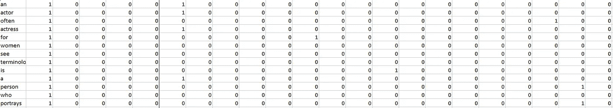
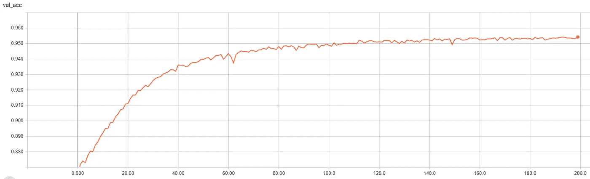

# 使用深度神经网络的语言识别

> 原文：<https://medium.com/coinmonks/language-prediction-using-deep-neural-networks-42eb131444a5?source=collection_archive---------1----------------------->


Image source: [https://www.independent.co.uk/life-style/learn-language-scientists-second-education-best-age-a8330911.html](https://www.independent.co.uk/life-style/learn-language-scientists-second-education-best-age-a8330911.html)

我觉得很有趣的是，我们如何能够仅仅通过看“gebracht”很可能是一个德语单词，而“reconstituer”看起来像一个法语单词。我们能够发现单词中的某些模式，这些模式为我们提供了单词属于哪种语言的线索。例如，单词末尾的“eux”表示该单词是法语，而以“o”结尾的单词则倾向于西班牙语(如 renacuajo、basurero 等)。这个项目的目的是教计算机做完全相同的事情；能够识别一个给定的单词来自哪种语言。

由于这项任务的复杂性，使用深度神经网络很可能是最准确的技术。这个项目是用 python 进行的，我使用 Keras 包来处理神经网络方面的事情。注意，Keras 使用 TensorFlow 后端，所以我们能够生成一些漂亮的 TensorBoard 可视化。

这个项目的计划是从头开始创建一个巨大的带标签的单词库，单词来自五种不同的语言，每种语言都标有自己的语言。实现这一点的方法是搜集大量维基百科的文章。然后，我们将这些单词转换成二进制向量，以便它们可以输入到神经网络中。该网络将在 85%的单词上被训练，并在剩余的 15%上被验证。到时候我们会(希望！)拥有一个训练有素的网络，能够准确预测一个给定单词来自五种语言中的哪一种。

让我们开始吧。我做的第一件事是选择我想在这个项目中使用的五种语言。我选择了英语、德语、捷克语、瑞典语和法语。我认为这些语言有足够多的独特模式，网络能够识别。我做的下一件事是为每种语言找到大约 15 篇左右的维基百科文章，确保主题不同，以确保选择不同范围的单词。下面显示了第一个文件“config.py”，本质上是该项目的配置设置。

我们看到它只包含两个变量:“max_letters”和“language_tags”。Max letters 是刮刀将拾取的最大单词长度，因此是可以输入到神经网络中的最大单词长度。然后我们会看到一本名为“语言标签”的词典。字典的关键字是我正在使用的五种语言的维基百科标签，值是该语言的维基百科文章名称列表。重要的是，所有这些都可以很容易地改变。如果我希望网络使用 10 种语言，我只需在字典中添加另一个条目，或者如果我希望网络能够预测 15 个字母长的单词，我只需更新 max_letters。

我们现在进入下一个文件，“函数”。这个项目包含了相当多复杂的函数，不仅可以抓取单词并将其添加到一个大的单词库中，还可以将这些单词转换成向量等。因此，我创建了一个单独的文件来存放这些函数，以保持代码整洁有序。第一个函数叫做 generate_dictionary，如下所示。

这个函数的目的是为给定的语言创建一个在所有提供的维基百科文章中找到的单词的长列表。它的参数 tag 和 max_word_length 是不言自明的。它们是语言标签和单词在列表中允许的最大字母数。注意，对于维基百科抓取，我将使用维基百科 python 包。我们在第 9 行将维基百科文章的语言设置为所需的语言，然后开始遍历该语言的文章。第 11 行收集原始 HTML，第 12 行获取文章的原始文本内容作为一个长字符串。因为我们希望文本都是 ASCII 码，所以我们使用 unidecode 函数将文本转换成 ASCII 码。然后你可能会注意到一个叫做过程的特殊功能。这是该文件中的下一个函数，如下所示。

所以 process 有两个参数，page_content(维基百科文章内容的字符串)和最大单词长度。我们首先使用正则表达式只提取单词，从文章中删除任何数字、链接、标点符号等。然后，重要的是删除任何大写字母，因此我们在这个文本中使用 lower 函数。然后，使用 split 函数从剩余的单词中创建一个列表。所以现在我们有了文章中每个单词的列表。然而，我们必须记住，我们不能包含长度超过 max_letters 的单词。我们在第 6–8 行过滤掉这些单词，并返回这个完全处理过的列表。然后 generate_dictionary(这个上面的函数)返回这个列表，我们就都完成了。

“functions.py”中的下一个重要函数是 convert_dic_to_vector。该函数获取一个单词列表(类似于使用上述函数生成的列表)，并返回一个表示每个单词的向量列表。我在这个向量中表示一个字母的方式如下:

a = 10000000000000000000000
b = 0100000000000000000000
c = 001000000000000000000000
…
z = 00000000000000000000001

然后我们把这些串在一起组成一个单词。由于所有向量的长度必须相同，所以我们必须用零填充未使用的字母(最大字母数-已用字母数)。例如，单词“hello”可以表示为。

000000100000000000000000
0000100000000000000000
000000000000000000000000000000000000000000000000000000000000000000000000000000000000000000000000000000000000000000000000000000

前 5 个字母由 h、e、l、l 和 o 填充，其余 7 个字母由零填充。此外，它将是一个没有换行符的连续数字字符串(换行符是为了视觉清晰)。这意味着每个字向量将是一个 26*12 = 312 位长的 1 和 0 的字符串。所以现在我们必须实现一个函数，将单词列表转换成如上所示形式的向量列表。

该函数接受单词列表和最大单词长度。然后，对于这个列表中的每个单词，我们创建一个名为“vec”的空字符串(第 4 行)。然后，对于单词中的每个字母(第 6 行)，我们将这个字母转换成一个数字(a 是 1，b 是 2 等等)(第 8 行)。然后我们从第 9 行开始创建向量，将 0 加到这个数字，然后是 1，然后用 0 填充剩余的空间。记住，这个过程对单词中的每个字母重复进行。然后，将该向量添加到“vec”字符串中。一旦完成，我们需要用零填充 12 个字母中未使用的字母。这在第 11–13 行非常简单。然后，我们将这个“vec”字符串附加到一个新列表中，并对所有其他单词重复这个过程。该函数然后返回这个向量列表。

“fucntions.py”中的第四个也是最后一个函数称为 create_output_vector。这个函数为给定的语言创建输出向量。(震惊，我知道！)下面我将列出我所说的‘输出向量’是什么意思。

英语= 10000
捷克语= 01000
德语= 00100
瑞典语= 00010
法语= 00001

这些将用于标记数据。即，上面显示的单词“hello”的向量将被标记为对应于英语(10000)的输出向量，而单词“typhuvud”将被标记为瑞典语输出向量(00010)，因为它是瑞典语单词。下图显示了该功能。

参数 tag_index 是语言在 language_tags 字典(来自配置文件)中的索引，number_of_languages 参数(显然)采用正在使用的语言的数量。这个一行的函数简单地创建了一个输出向量，正如我上面所描述的，并返回它。

我们现在已经准备好开始收集一些数据。我们正在转移到一个新的文件，所以第一步将是导入和相关的模块。

我们从 config 中导入 pandas 和 numpy 以及函数文件和两个变量。我们现在准备创建一些数据并对其进行标记。在展示代码之前，我将解释一下方法。我们将有两个列表，一个包含单词向量，一个包含输出向量。单词向量列表中的第 n 个元素将对应于输出向量列表中的第 n 个元素，然后我们将它存储在一个大数组中，以便稍后用于训练网络。我还将创建一个 pandas dataframe，并将其保存为 CSV 文件，这样我们就可以在 excel 中打开它，并查看该过程是否产生了预期的结果(在进行过程中检查总是好的)。

我们首先创建三个空列表。word_data 将存储 312 个字符的矢量单词，language_data 将存储 6 个字符的语言矢量，master_dic 将存储单词的实际 ASCII 表示。然后我们设置一个计数器(count ),然后开始收集数据的循环。我们遍历每个语言标签，从生成文章中所有单词的列表开始(第 9 行)。然后在这个阶段，我们将这些单词中的每一个添加到 master_dic(这个列表将存储所有的 ASCII 单词)。然后，我们将文章中的每个单词转换成向量(第 12 行)，并将每个向量添加到 word_data(第 13–14 行)。最后，我们创建输出向量，并将它们添加到 language_data 中(第 15–17 行)。

我们现在已经用相关信息填充了三个列表。我们现在将创建一个包含所有这些信息的数组。这个数组将由代表每个单词的内部数组填充，每个内部数组的结构如下:

```
[
ASCII word,
5 output characters,
312 input characters
]
```

所以每个内部数组将包含 318 个元素。这方面的代码如下所示。

我们创建了主数组，一个名为“arr”的空列表。然后，我们开始为每个单词创建内部数组。我们从添加单词的 ASCII 表示开始(第 4 行)。然后，我们逐位追加输出向量(第 5–6 行)，然后对输入向量进行同样的操作(第 7–8 行)。然后，我们将这个内部数组添加到主数组中，并对每个单词重复这个过程。数据现已完全处理完毕，现在必须保存。我们开始转换成一个 numpy 数组(第 12 行)，并将其保存到一个. npy 文件中。(这是我们以后需要训练网络时打开的文件)。我们还创建了一个 pandas 数据帧并保存它，以便检查数据是否是我们想要的格式。下面显示了这个 csv 文件的一个片段。



我们看到第一列显示了单词的 ASCII 表示，第 2–6 列是输出向量，在本例中全部表示英语。(为了清楚起见，我在输出向量的末尾添加了一条垂直线)。然后我们有输入向量的前几列(它们比这延伸得更远)。仅仅通过目测几个字母，我们就可以看到数据是我们想要的确切格式，所以是时候开始设置和训练神经网络了。

像往常一样，我们从导入必要的模块开始。

我们将使用 keras 来完成大部分工作，但 sci-kit learn 的 train_test_split 函数将有助于将我们的数据拆分为训练数据和测试数据。

然后，我们加载数据，并将其分成两个数组，输入和标签。Inputs 只包含代表所有单词的 312 元素长数组，labels 包含代表语言标签的 5 元素长数组。第 6 行显示了将这些数组分成训练和测试数据，其中 15%的数据用于测试。然后，我打印出这些数组的形状，以显示我们处理了多少数据。这显示了以下内容:

```
(73183, 312)
(73183, 5)
(414700, 312)
(414700, 5)
```

我们看到我们有超过 410，000 个训练示例和超过 73，000 个测试示例。接下来，我们设置神经网络的参数和形状。

我们将使用具有四个隐藏层的前馈网络，每个隐藏层分别具有 200、150、100、100 个节点。由于这项任务的复杂性，我选择了这么多的隐藏层，并且发现层越少，精度就不是我认为可以接受的值。除了使用 softmax 的最后一层之外，每层都使用 sigmoid 激活函数，因为该函数允许我们为每种语言分配一个概率，因为输出层值的总和将是 1。我们将使用 Adam 优化器，一种自适应学习率的梯度下降优化器，并且我们将使用二进制交叉熵损失函数。对于这个项目，我们唯一担心的指标是模型的准确性。接下来，我们将设置回调并适应模型。

我们将使用的两个回调函数是 ModelCheckpoint 和 TensorBoard。当模型的验证精度提高时，ModelCheckpoint 会保存模型的权重和偏差，以便我们可以在以后使用该模型，TensorBoard 允许我们在模型经过训练后看到模型改进的一些可视化效果。第 2 行显示了 ModelCheckpoint 回调的设置。我们将权重保存到文件“weights.hdf5”，并使用验证准确性作为成功的衡量标准。回调只会在权重提高验证准确性的情况下保存权重。接下来，第 3 行显示了 TensorBoard 回调设置。我们会将 TensorBoard 文件保存到名为“logs”的文件夹中。然后，第 6 行显示了网络的训练。我选择使用 1000 的批量大小，200 个时期。我们根据测试数据进行验证，并使用上述两个回调函数。

几个小时后，模型就完全训练好了。下面显示了在培训过程中验证准确性的 TensorBoard 可视化。



Epochs

我们可以看到，经过 200 次训练后，验证准确率达到了 95.43%的健康数字。对于如此复杂的语言预测任务来说，这是一个非常令人高兴的数字。我可能会通过使用几百个以上的时期从模型中挤出额外的百分比，但这有使模型过度拟合的风险，所以 95.5%的准确度是一个健康的折衷。我们现在可以玩玩这个模型，把我们自己的一些单词扔向它，看看它是否真的能够预测他们的语言。

我们开始一个新的文件，我们将加载神经网络，并输入我们自己的话。我首先导入模块，并按照与前一个文件完全相同的方式设置网络。

这个文件与前一个文件的唯一区别在第 13 行，这里我们从文件‘weights . HD F5’中加载已经训练好的模型的权重。我们现在将创建一个循环，允许您输入自己的单词，对于 5 种语言中的每一种，它将告诉您该单词来自该语言的可能性百分比。

整个代码块位于 while True 循环中，因此用户可以无限期地向网络发送文字。第 3–8 行检查用户输入的单词是否小于 max_letters，如果是，它将该单词的小写版本添加到一个空列表中。然后我们在这个列表中使用 convert_dic_to_vector 函数(只包含一个单词)。然后，我们创建一个由 0 组成的 numpy 数组，当向量单词中出现 1 时，在这个数组中用 1 替换 0。这给了我们一个表示单词的 numpy 数组。然后我们在第 18 行预测这个单词的语言。第 20–24 行显示了每种语言的单词属于该语言的概率。让我们测试一下网络！我将从每种语言中随机抽取几个单词开始，下面向您展示结果。

```
Enter word to predict:
speaker
en: 98.46%
cs: 0.14%
de: 0.57%
sv: 0.68%
fr: 0.15%Enter word to predict:
ferry
en: 70.92%
cs: 12.48%
de: 0.75%
sv: 0.46%
fr: 15.39%Enter word to predict:
lziku
en: 0.0%
cs: 99.99%
de: 0.0%
sv: 0.0%
fr: 0.0%Enter word to predict:
podlijeme
en: 0.0%
cs: 99.93%
de: 0.05%
sv: 0.0%
fr: 0.02%Enter word to predict:
zweiten
en: 0.0%
cs: 0.0%
de: 100.0%
sv: 0.0%
fr: 0.0%Enter word to predict:
weltweit
en: 0.01%
cs: 0.02%
de: 99.83%
sv: 0.14%
fr: 0.0%Enter word to predict:
forsandar
en: 0.0%
cs: 0.0%
de: 0.0%
sv: 99.99%
fr: 0.0%Enter word to predict:
valandet
en: 0.0%
cs: 0.0%
de: 0.01%
sv: 99.99%
fr: 0.0%Enter word to predict:
alimenter
en: 2.52%
cs: 0.73%
de: 0.09%
sv: 0.53%
fr: 96.12%Enter word to predict:
resolument
en: 9.73%
cs: 0.95%
de: 1.73%
sv: 1.46%
fr: 86.13%
```

我们看到网络自信地正确预测它以前没有见过的每个单词的语言。让我们尝试一些可以是两种语言的单词，例如,“pain”可以是法语或英语，而“adresse”可以是德语和法语。

```
Enter word to predict:
adresse
en: 12.32%
cs: 14.34%
de: 35.81%
sv: 11.39%
fr: 26.14%Enter word to predict:
pain
en: 55.05%
cs: 1.27%
de: 3.11%
sv: 4.76%
fr: 35.81%
```

我们可以看到，对于“地址”，网络的最高预测是德语和法语，这两种语言是这个词的来源。“痛苦”也是如此，英语和法语得分最高。因此，网络不仅对属于一种语言的单词有信心，它还能识别一个单词何时属于两种不同的语言。如果你想自己玩玩这个， [**这里是下载链接**](https://drive.google.com/open?id=1Xe0QDvRjnMqtLwVIUq-9zaR-QCyxbOjm) 到一个 zip 文件夹，其中包含相关的 python 文件和权重的 hdf5 文件。要使用该文件，(假设 python 和 pip 已经安装并添加到 PATH 环境变量中)，在终端中运行命令:

```
pip install keras
```

这将安装 keras 包。然后，解压缩您刚刚下载的文件夹，并在该文件夹中打开一个命令窗口。键入命令:

```
python network_test.py
```

而且你应该能把话扔到网络上，看看它能拿出什么来！

总而言之，这个项目是我第一次使用神经网络，我对结果非常满意。这种高准确度令人高兴，而且看到网络如何处理各种各样的单词也很有趣。