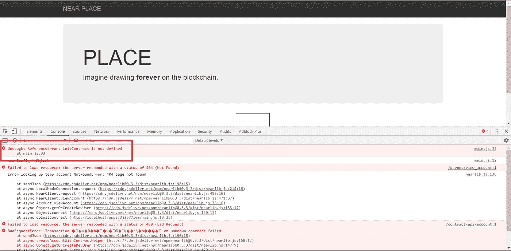

# 具有近似协议的晚期资本主义博弈

> 原文：<https://medium.com/coinmonks/late-stage-capitalism-game-with-near-protocol-8c61535bb114?source=collection_archive---------2----------------------->

今天，我们通过使用 near 协议创建一个简单的游戏来获得一些乐趣。

## 让事情运转起来

对于我们的项目，我们将使用来自**官方教程**的多人位置游戏:

情节转折:它不起作用！我们需要改变我们的计划…