# 从 A 到 Z 启动 NuCypher 节点(测试网络)

> 原文：<https://medium.com/coinmonks/launch-nucypher-nodes-from-a-to-z-test-network-7bbedd5e4f03?source=collection_archive---------1----------------------->

在这里，**从最开始启动 NuCypher 节点**的全过程会一步一步的考虑:所有必须的材料都会提供，让任何人都可以在测试网络中搞清楚并捡起来。

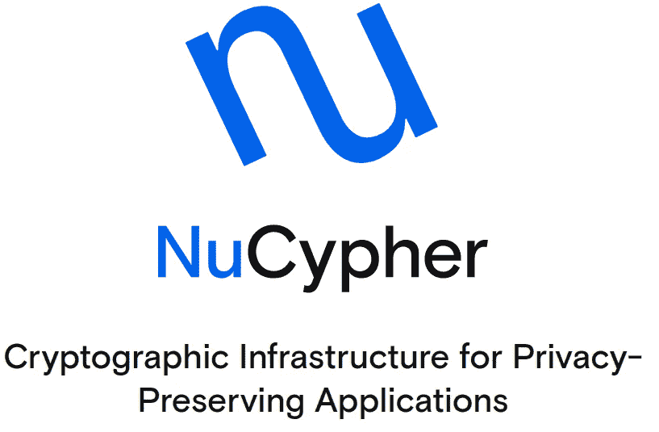 [## 网络监视器仪表板应用程序

### 编辑描述

status.nucypher.network](https://status.nucypher.network/) 

需要考虑的问题:
1 官方说明
2 服务器要求
3 服务器租用，设置 ssh 密钥登录。
4 如何将文件下载/上传到租用的服务器。
5 安装交换内存文件。
6 NuCypher 节点的安装过程。
7 奖励:
7.1 如何更新整个系统
7.2 如何更新/回滚 NuCypher 版本
7.3 分离您当前的 worker 并重新连接到不同的 worker
7.4 常用命令

# 1 官方说明

a) [NuCypher 文档](https://docs.nucypher.com/en/latest/index.html)
b) [安装 a 指南](https://docs.nucypher.com/en/latest/guides/installation_guide.html)
c) [运行网络节点](https://docs.nucypher.com/en/latest/guides/network_node/network_node.html)
— [打桩工配置指南](https://docs.nucypher.com/en/latest/guides/network_node/staking_guide.html)
— [工人(Ursula)配置指南](https://docs.nucypher.com/en/latest/guides/network_node/ursula_configuration_guide.html)
d) [工作锁](https://docs.nucypher.com/en/latest/guides/worklock_guide.html)指南

许多问题的答案都可以在这里找到。
[https://docs.nucypher.com/en/latest/support/faq.html](https://docs.nucypher.com/en/latest/support/faq.html)

以及最常见的错误
[https://docs . nucy pher . com/en/latest/support/trouble shooting . html](https://docs.nucypher.com/en/latest/support/troubleshooting.html)

# 2 服务器要求

оS:Ubuntu 18.04
硬件要求:2 个 CPU，2 GB RAM，60 GB SSD。你需要一个静态 IP 和一个开放端口 9151，所以最好租一个 VPS。

部分服务器公司名单:
[https://www.vultr.com/](https://www.vultr.com/)
[https://cloud.ibm.com/](https://cloud.ibm.com/)
[https://cloud.digitalocean.com/](https://cloud.digitalocean.com/)
[https://cloud.google.com/free](https://cloud.google.com/free)
[https://www.oracle.com/ca-en/cloud/free](https://www.oracle.com/ca-en/cloud/free)
[https://azure.microsoft.com/en-us/free](https://azure.microsoft.com/en-us/free)

# 3 服务器租赁，设置 ssh 密钥登录。

[视频](https://youtu.be/hzXNCQumuMk)。
[用 PuTTYgen](https://linuxize.com/post/generate-ssh-keys-on-windows-with-puttygen/) 在 Windows 上生成 SSH 密钥。

下载**putty.exe**远程访问客户端和**puttygen.exe**ssh 密钥生成程序

[https://www . chiark . greenend . org . uk/~ sgtatham/putty/latest . html](https://www.chiark.greenend.org.uk/~sgtatham/putty/latest.html)

## 3.1 生成 ssh 密钥:

我们输入 puttygen.exe**→“**类型的密钥生成”选择 **SSH-2 RSA** ，2048 **→** 按**生成**并移动鼠标。完成后，点击**【保存公钥】**和**【保存私钥】。**

## 3.2 服务器的公钥，putty 会话的私钥:

在这个例子中，我使用 VPS[www.vultr.com](http://www.vultr.com)。
点击创建新服务器

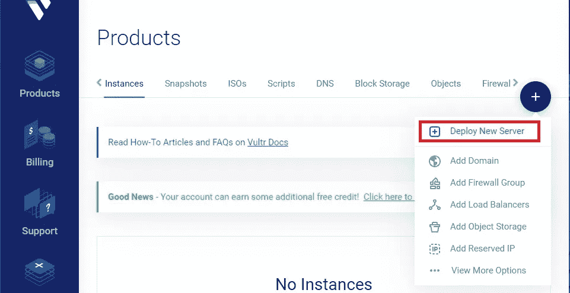

creating of new server

选择 Ubuntu 18.04 x64，选择所需的“服务器大小”并添加 SSH 密钥:

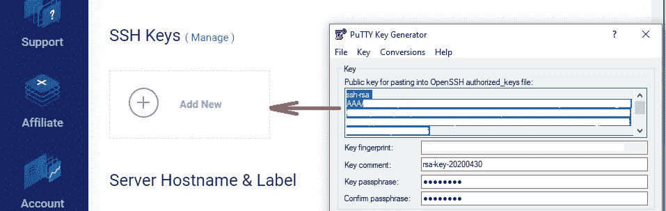

Copy the public key as shown in the video (4:50 min)

现在部署。

> **！！！** *如果你不想手动上传公钥到服务器，那么最好不要设置密钥密码。(至少我没有用密码短语成功)。*

输入 putty.exe 并用输入的 ip 服务器和 ssh privat 密钥保存会话。即我们介绍 3 件事:
主机名(或 ip 地址)→输入服务器 IP 地址。
保存的会话→输入会话名称。
在“**连接**选项卡上，然后是“ **SSH** ”，然后是“A **uth** ，我们选择私钥文件。保存会话。并进入服务器。

## 禁用密码登录

如果您已经用 ssh 密钥设置了登录，那么为了增加系统的安全性，最好禁用密码登录。但是要确保密钥被安全地存储起来，不会丢失，因为你将不再输入密码。登录到服务器，然后打开配置文件/etc/ssh/sshd_config:

```
sudo nano /etc/ssh/sshd_config
```

并在那里找到 PasswordAuthenticatin 指令。您需要将其值设置为 No:

```
PasswordAuthentication no
```

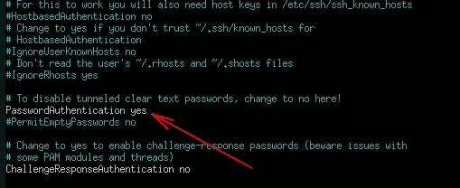

重新启动服务，您就完成了:

```
sudo systemctl restart sshd
```

**如果丢失了 ssh 密钥，或者服务器用现有密钥已经停止打开怎么办？**

在这种情况下，有一个决定。您需要进入您的提供商的个人帐户，并点击服务器页面上的控制台呼叫。在此控制台中，即使通过 ssh 连接禁用了密码登录功能，也接受密码。事实是，您直接进入租用的服务器，没有 ssh 连接。


# 4 如何将文件下载/上传到租用的服务器。

文本[说明](https://linuxize.com/post/how-to-setup-ftp-server-with-vsftpd-on-ubuntu-18-04/)。

首先，更新服务器软件包，并在将来为其安装必要的软件包:

```
sudo apt update
sudo apt-get install mc
sudo apt-get install nano
```

安装并启用 vsftpd，(最好不要添加到自动加载中):

```
sudo apt install vsftpd -y
sudo systemctl start vsftpd
```

现在输入 ftp 工作所需的防火墙权限:

```
sudo ufw allow 20/tcp
sudo ufw allow 21/tcp
sudo ufw status
```

设置前，复制原始设置文件，以便在出现问题时，恢复原样。

```
sudo cp /etc/vsftpd.conf /etc/vsftpd.conf.orig
```

在编辑器中打开设置文件进行更改:

```
sudo nano /etc/vsftpd.conf
```

现在取消注释(删除代码行前面的#号，之后它将变为活动状态)，或者如果它们不在那里，我们将编写以下代码行:

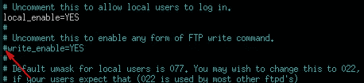

symbol # we should remove

```
write_enable=YES
local_enable=YES
dirmessage_enable=YES
xferlog_enable = YES 
xferlog_std_format=YES
connect_from_port_20=YES
listen=YES
listen_ipv6=NO
use_localtime=YES
anonymous_enable=NO
```

重新启动服务，你可以连接

```
sudo systemctl restart vsftpd
sudo systemctl status vsftpd
```

我使用了 [Filezilla](https://filezilla-project.org/) 程序。输入服务器 ip，用户名，密码和端口 22 →可以传输文件。

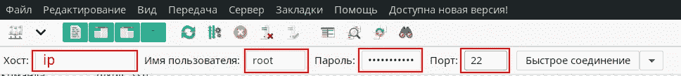

通过 ftp 工作后，关闭程序，以免危及服务器

```
sudo systemctl stop vsftpd
```

当需要连接时，你需要打开它

```
sudo systemctl start vsftpd
```

# 5 添加交换空间。

文本[说明](https://linuxize.com/post/how-to-add-swap-space-on-ubuntu-18-04/)。

因为服务器是刚刚创建的，所以您不能检查是否存在已经创建的交换文件。(但在旧服务器上，值得检查一下`sudo swapon --show`)

```
sudo apt install fallocate
sudo fallocate -l 2G /swapfilesudo chmod 600 /swapfile
sudo mkswap /swapfilesudo swapon /swapfile
```

要使更改永久生效，打开文件:
`sudo nano /etc/fstab`
并粘贴以下行:
`/swapfile swap swap defaults 0 0`

使用`swapon`或`[free](https://linuxize.com/post/free-command-in-linux/)` [命令](https://linuxize.com/post/free-command-in-linux/) :
`sudo swapon --show
sudo free -h`验证交换是否激活

# 6процесс·ноды·努西费尔。

[tmux 程序的备忘单](https://linuxize.com/post/getting-started-with-tmux/)，允许在一个屏幕上打开多个会话。

## программы·努西费尔

首先，我们将安装工作所需的一切:

```
sudo apt update
sudo apt install python3
sudo apt install libffi-dev
sudo apt install python3-dev
sudo apt install python3-virtualenv
sudo apt-get update
sudo apt-get upgrade
sudo apt-get install python3-venv
sudo apt-get install python3-devsudo apt-get install gcc -y
sudo apt install python3-pip
sudo apt install build-essential -y
sudo apt install build-essential python3-dev python3-pip
```

接下来，在工作文件夹中，安装虚拟环境:

```
python3 -m venv ./nucypher-venv
```

激活:
`source nucypher-venv/bin/activate`

安装 Nucypher:

```
pip3 install -U wheel
pip3 install -U nucypher
```

如果一切顺利，`nucypher --help`命令应该可以正常工作。

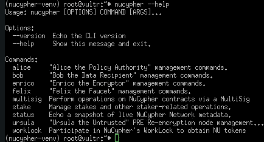

接下来，我们需要一些活动的终端，为此我使用了 tmux 实用程序:

```
sudo apt install tmux
```

启动 tmux:

```
tmux
```

> 现在简单介绍一下如何管理 tmux:
> 
> **:按下****Ctrl****+****b****松开然后****Shift****+**
> 
> ****:按****Ctrl****+****b****释放然后****Shift****+****%******
> 
> *****面板间的过渡*** *:按****Ctrl****+****b****и***стрелка******
> 
> ****关闭其中一个面板****:****Ctrl****+****b*******x*****
> 
> ***如果您关闭 putty 程序，那么在 tmux 中创建的窗口不会消失，所有活动程序都将继续在其中工作。因此:***
> 
> **`*tmux ls*`*-查看所有会话列表* `*tmux attach -t номер_сессии*`*-打开必要的会话***

## **6.2 推出以太坊节点+创建钱包**

**轻击***Ctrl****+****b****и****Shift****+**。我们有两扇温暖的窗户。在两个窗口中，我们都激活了虚拟环境*****

```
****source nucypher-venv/bin/activate****
```

****现在我们需要一个以太坊节点在[glri](https://goerli.net/)网络上，你可以使用任何[支持的客户端](https://github.com/goerli/testnet#connecting-the-clients)，我们采用 Geth。****

```
****sudo apt-get install software-properties-common
sudo add-apt-repository -y ppa:ethereum/ethereum
sudo apt-get update
sudo apt-get install ethereum -y****
```

****启动一个完整节点(也建议在主网络上运行一个完整节点):****

```
****geth --goerli --maxpeers 40****
```

> *****启动节点的额外几个标志选项:* `*geth --goerli --syncmode fast*``*geth --goerli --syncmode light*`*-不推荐*****

****我们等待它与网络中的当前块同步。这个节点必须保持同步，所以我们让它在一个单独的终端中工作。****

****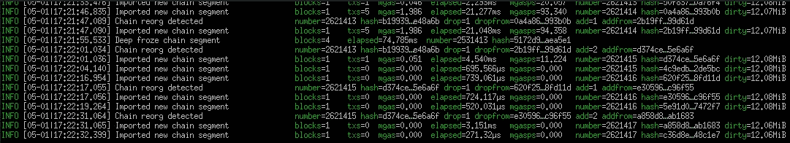****

****转到下一个窗口( **Ctrl** + **b** 和**箭头**)。并在 gorli 网络上创建两个帐户，第一个用于赌注者，第二个用于工人。
您可以导入已经创建的钱包，请参见下面的注释。****

```
****geth attach /home/<username>/.ethereum/goerli/geth.ipc****
```

****<username>替换为您的系统帐户名称，如果您是 root，那么您应该跳过 **root** ，而不是“home/ <username>。</username></username>****

```
****geth attach /root/.ethereum/goerli/geth.ipc
>personal.newAccount()
>personal.newAccount()
>eth.accounts
>web3.toChecksumAddress(eth.accounts[0])
>web3.toChecksumAddress(eth.accounts[1])
>exit****
```

****现在您已经创建了两个 json wallet 文件。来自它们的密码必须存储在一个安全的地方，当然 json 文件必须使用 ftp 连接和之前安装的 filezilla 应用程序进行备份。如果你是 root 用户，那么文件就在`/root/.ethereum/goerli/keystore`文件夹中。****

> *****如何将已经创建的钱包导入到服务器上的 geth:*****

```
****source nucypher-venv/bin/activate
geth attach /root/.ethereum/goerli/geth.ipc
personal.importRawKey(“private”,”Password”)****
```

> ****私人 *-你钱包的私人钥匙。* 密码 *-在这里你可以写任意的密码。
> ！！！如果出现错误，则尝试从私钥的开头删除 0x。*****

****对于每一个账户，我们得到一点以太交易
[https://goerli-faucet.slock.it/](https://goerli-faucet.slock.it/)
[https://faucet.goerli.mudit.blog/](https://faucet.goerli.mudit.blog/)****

****接下来，您需要在 [Discord](https://discord.gg/7rmXa3S) 中请求测试令牌，只需向# testnet-水龙头通道发送一条消息(一个请求就足够了)****

```
****.getfunded <your_eth_checksumaddress>****
```

## ****6.3 创建新的标桩器****

****去终点站。我们在 gemini 网络中创建一个新的 staker，在系统中将<your_username>改为你的帐户名，但是如果你是 root，你需要设置 root 而不是“home / <your_username>”:</your_username></your_username>****

```
****nucypher stake init-stakeholder --provider ipc:///home/<your_username>/.ethereum/goerli/geth.ipc --poa --network gemini****
```

****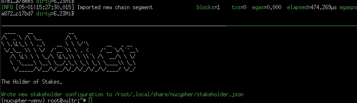****

****通过此命令，您可以开始堆叠，指示将成为堆叠器地址的地址、令牌数量和堆叠周期****

```
****nucypher stake create****
```

****激活重新堆叠并检查活动堆叠列表:****

```
****nucypher stake restake --enablenucypher stake list****
```

## ****6.4 创建一个新的 worker +启动一个节点****

****接下来，为了启动节点并创建一个 worker，在系统中将<your_username>更改为您的帐户名，如果您是 **root** 您需要删除**“home”:**</your_username>****

```
******nucypher ursula init --provider ipc:///home/<your_username>/.ethereum/goerli/geth.ipc --network gemini --poa******
```

******现在将节点连接到桩机。你需要小心帐户索引，它们有时会改变位置******

```
******nucypher stake set-worker******
```

******运行节点:******

```
******nucypher ursula run --network gemini --provider ipc:///root/.ethereum/goerli/geth.ipc --teacher discover.nucypher.network:9151 --poa --interactive******
```

******完成了。检查状态******

******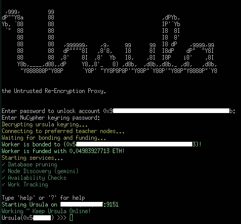******

```
******Ursula >>> status******
```

******您还可以在浏览器中查看您的节点的状态
https://<your _ node _ IP>:9151/status******

## ******6.5 使用 systemd 服务启动以太坊节点和一个 nucypher 工作器******

******如果在此之前，您启动了上述这些程序，只需停止它们并关闭 tmux 窗口。******

******[https://Linux config . org/how-to-create-systemd-service-unit-in-Linux](https://linuxconfig.org/how-to-create-systemd-service-unit-in-linux)******

******[https://docs . nucy pher . com/en/latest/guides/installation _ guide . html # systemd-service-installation](https://docs.nucypher.com/en/latest/guides/installation_guide.html#systemd-service-installation)******

******Systemd 比持有 tmux windows 方便高效得多。
通过 systemd 发布的积极方面:******

*   ******更稳定。******
*   ******自动重启。以太坊节点和乌苏拉。******

******缺点:systemd 推出的 Ursula 没有交互模式。******

********6.5.1 创建 Geth 服务********

******创建服务文件/etc/systemd/system/goer Li . service:******

```
******sudo touch /etc/systemd/system/goerli.service******
```

******访问权限的配置:******

```
******sudo chmod 664 /etc/systemd/system/goerli.service******
```

******接下来，打开 goerli.service 文件，指定允许您使用 systemctl:******

```
******sudo nano /etc/systemd/system/goerli.service******
```

******我们在里面写下了:******

```
******[Unit]
Description=”Ethereum go client. Goerli”[Service]
Type=simple
ExecStart=/usr/bin/geth --goerli --syncmode fast 
Restart=always
RestartSec=3[Install]
WantedBy=multi-user.target******
```

******！！！要找出 Geth 目录，对于 *ExecStart* 输入`sudo find / -name geth`******

*****如果没有与`geth --goerli --syncmode fast`同步，您可以尝试`geth --goerli --maxpeers 40`*****

*****创建新的服务文件后，重新启动 systemd:*****

```
*****sudo systemctl daemon-reload*****
```

*****启用 Geth 系统服务:*****

```
*****sudo systemctl enable goerli*****
```

*****现在我们可以启动、停止、重启并检查服务的状态:
`sudo systemctl start goerli
sudo systemctl stop goerli
sudo systemctl restart goerli
sudo systemctl status goerli`*****

*****如果命令`sudo systemctl status goerli`显示服务不工作，你可以重启`sudo systemctl restart goerli`*****

*****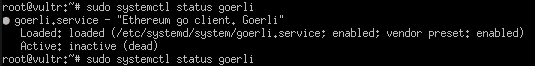**********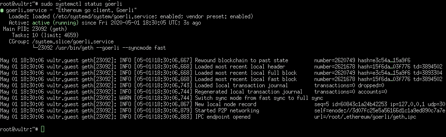*****

*****可能通过 **ctrl + c** 在`sudo systemctl status goerli`后返回命令行*****

*******6.5.2 创建 Nucypher 服务*******

*****创建服务文件/etc/systemd/system/ur Sula . service:*****

```
*****sudo touch /etc/systemd/system/ursula.service*****
```

*****访问权限的配置:*****

```
*****sudo chmod 664 /etc/systemd/system/ursula.service*****
```

*****接下来，打开 ursula.service 文件，指定允许您使用 systemctl 管理服务的最低设置:*****

```
*****sudo nano /etc/systemd/system/ursula.service*****
```

*****我们在里面写下了:*****

```
*****[Unit]
Description=”Run ‘Ursula’, a NuCypher Staking Node.”[Service]
User=root
Type=simple
Environment=”NUCYPHER_WORKER_ETH_PASSWORD=<YOUR WORKER ADDRESS PASSWORD>”
Environment=”NUCYPHER_KEYRING_PASSWORD=<YOUR PASSWORD>”
ExecStart=/root/nucypher-venv/bin/nucypher ursula run --teacher gemini.nucypher.network:9151 --network gemini --poa
Restart=always
RestartSec=3[Install]
WantedBy=multi-user.target*****
```

*****如果您有非根用户，请参见第 6.4 条了解如何更改提供商地址。*****

*****创建新的服务文件后，重新启动 systemd:*****

```
*****sudo systemctl daemon-reload*****
```

*****启用 Ursula 系统服务:*****

```
*****sudo systemctl enable ursula*****
```

*****现在我们可以启动、停止、重启并检查服务的状态:
`sudo systemctl start ursula
sudo systemctl stop ursula
sudo systemctl restart ursula
sudo systemctl status ursula`——返回命令行 **ctrl + c*******

> ******！！！ursula . service****错误****解决 ***:*********
> 
> ******unicode encode 错误:“latin-1”编解码器无法对位置 0 中的字符“\u2713”进行编码:序号不在范围(256)内******
> 
> *****实际上，我必须重启服务器，ursula.service 才能工作*****

# *****7 奖金:*****

## *****7.1 如何更新整个系统*****

```
*****sudo apt update
sudo apt-get update
sudo apt-get upgrade*****
```

*****完成上述操作后，整个系统都会更新，包括 geth，如果它发布了更新的话。因此，您应该重新启动服务器:*****

```
*****sudo reboot now*****
```

*****systemd 服务应该会自动打开(验证如上所述)，但是使用 tmux 选项卡，您必须再次工作。*****

## *****7.2 如何更新/回滚 NuCypher 版本*****

*****升级 nucypher 之前，请确保停止 nucypher ursula 运行进程:*****

*****如果 Ursula 以交互方式启动，则:*****

```
*****Ursula >>> stop*****
```

*****如果通过 systemd 运行:*****

```
*****sudo systemctl stop ursula*****
```

*******更新:*******

```
*****pip3 install -U nucypher*****
```

*******现在考虑版本**的回滚(比如更新的时候忘记停止 Ursula，那么需要回滚，之后再更新)，同时 Ursula 也必须停止:*****

```
*****pip3 uninstall nucypher
pip3 install nucypher==2.0.0-beta.8*****
```

## *****7.3 分离您当前的工作者，并重新连接到不同的工作者*****

*****#创建新的 eth 钱包:*****

```
*****geth attach /home/<username>/.ethereum/goerli/geth.ipc
>personal.newAccount()  
>eth.accounts
>web3.toChecksumAddress(eth.accounts[a digit of new address])
>exit*****
```

*****#分离:*****

```
*****nucypher stake detach-worker*****
```

*****#重新连接:*****

```
*****nucypher stake set-worker*****
```

*****#停止乌苏拉
或者`Ursula >>> stop`或者`sudo systemctl stop ursula`*****

*****#打开文件夹~/。local/share/nucypher 和 in
`ursula.json`将旧的 worker 的地址更改为新的，并且(如果您更改了服务器)将服务器 IP 更改为新的:*****

```
*****sudo nano /root/.local/share/nucypher/ursula.json*****
```

*****文件夹/root/中的#By `mc`。local/share/nucypher/keyring 在所有文件的名称中，将旧的 worker 换成新的。*****

*****#再次启动乌苏拉:*****

*   *****互动:
    *****
*   *****systemd:
    `sudo systemctl restart ursula`*****

## *****7.4 常用命令*****

```
*****source nucypher-venv/bin/activatepip3 install -U wheel
pip3 install -U nucyphernucypher --versionnucypher stake listnucypher status stakers --network gemini --provider ipc:///root/.ethereum/goerli/geth.ipc --staking-address <address> --poa**#Rewardes**nucypher stake collect-reward --staking-rewardnucypher stake collect-reward --policy-reward --withdraw-address <ETH_ADDRESS>nucypher worklock refund --network gemini --provider ipc:///root/.ethereum/goerli/geth.ipc --bidder-address <ADDRESS> --poa**#WorkLock**nucypher worklock --helpnucypher worklock bid --network cassandra --provider ipc:///root/.ethereum/goerli/geth.ipc --poanucypher worklock cancel-bid --network gemini --provider ipc:///root/.ethereum/goerli/geth.ipc --poanucypher worklock claim --network gemini --provider ipc:///root/.ethereum/goerli/geth.ipc --poanucypher worklock status --network gemini --provider ipc:///root/.ethereum/goerli/geth.ipc --poanucypher worklock status --bidder-address <YOUR BIDDER ADDRESS> --network gemini --provider ipc:///root/.ethereum/goerli/geth.ipc --poanucypher worklock refund --network cassandra --provider ipc:///root/.ethereum/goerli/geth.ipc --poa --bidder-address <YOUR BIDDER ADDRESS>*****
```

> *****[直接在您的收件箱中获得最佳软件交易](https://coincodecap.com?utm_source=coinmonks)*****

*****[](https://coincodecap.com?utm_source=coinmonks)*****