# 发射台:刀匠——我的分析与比较评价

> 原文：<https://medium.com/coinmonks/launchpad-dao-maker-my-analysis-valuation-by-comparison-fc964ac2a535?source=collection_archive---------3----------------------->

*免责声明:此处包含的信息仅供参考。本文中的任何内容都不应被解释为金融建议，仅代表作者的观点，作者不是持牌金融顾问或注册投资顾问。交易加密货币会带来相当大的损失风险。作者不保证任何特定的结果。*

**狂野的西部——投资加密货币**

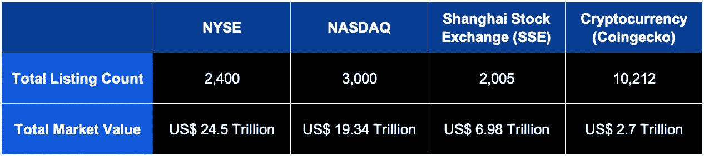

Source: [https://www.indmoney.com/articles/us-stocks/list-of-top-stock-exchanges](https://www.indmoney.com/articles/us-stocks/list-of-top-stock-exchanges)

将加密货币领域的当前市场状况与世界前三大交易所进行比较，加密货币是不受监管的，非常不成熟。与此同时，它充满了大量的增长机会。根据 Coingecko 的数据，截至今天，市场上有超过 10，000 种加密货币，总市值为 2.7 万亿美元。

作为进入加密货币市场的散户投资者，我有几个目标:

1.  投资有机会获得巨大回报的区块链企业，回报可能是 100 倍甚至更多。
2.  最大限度地降低投资诈骗风险和总体负回报的风险。
3.  了解生态系统，紧跟该领域的最新趋势。

为了更好地了解这种情况，我进行了一次回溯测试，以了解截至 2020 年 5 月 11 日按市值划分的 CoinGecko 上所有可用加密货币的回报概率。

正如许多投资加密货币的人会相信的那样，比特币减半事件标志着每个牛市周期的开始。因此，在我的分析中，我选择按照 2020 年 5 月 11 日比特币最后一次减半时的市值来划分市场。当时，总共有 2884 种加密货币。

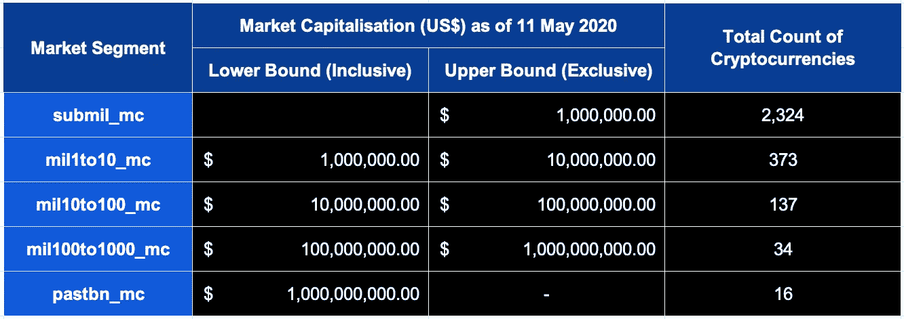

下面是截至 2021 年 11 月 12 日，在每个细分市场取得正回报的概率。

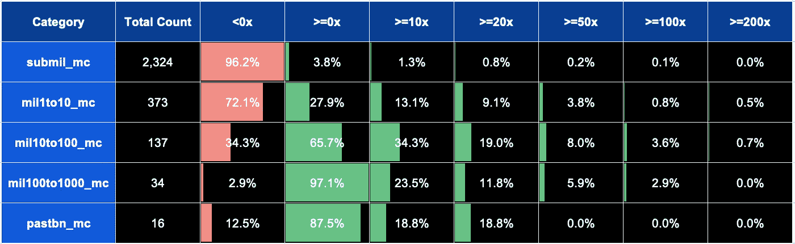

根据上表，如果我投资了前 50 种加密货币中的任何一种，我有 87.5%的概率获得正回报，18.8%的概率获得 10 倍回报。然而，要获得超过 100 倍的回报相当困难。

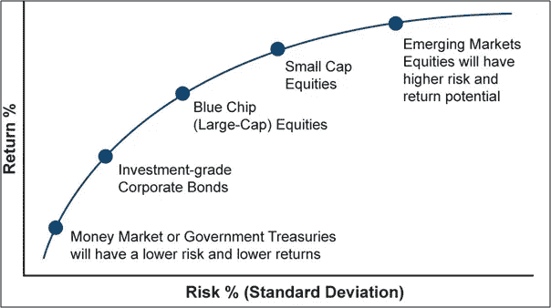

Source: [https://www.motilaloswal.com/blog-details/Understand-your-risk-return-trade-off-before-investing-in-equities../1844](https://www.motilaloswal.com/blog-details/Understand-your-risk-return-trade-off-before-investing-in-equities../1844)

有了对风险/回报比率的基本理解，上面显示的结果是非常令人期待的。为了获得更高的回报，我将不得不承担更大的风险，投资于市值较小的早期区块链企业。

**在西部荒野中航行——发射台**

如果有可能投资早期区块链风险企业以获得更高回报，同时管理与投资大市值加密货币相当的亏损风险，那会怎么样？

我提议的解决方案是通过 launchpads 投资早期区块链企业，具体来说就是 DAO Maker 的 DAOPad。

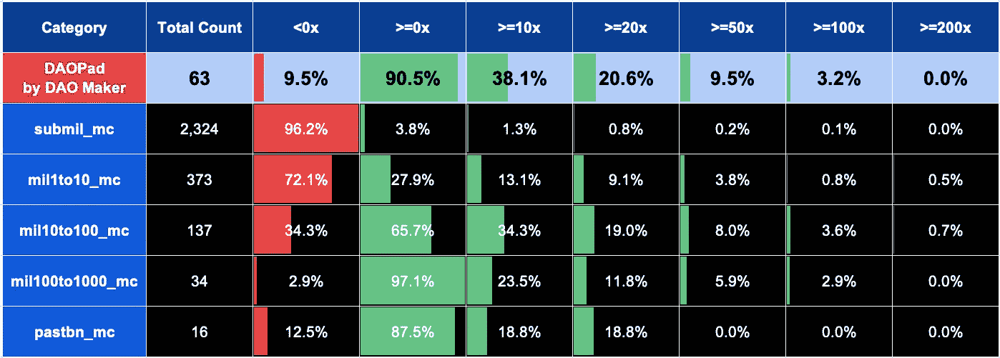

自 2021 年 2 月推出以来，DAOPad 已通过面向散户投资者的强持有发行(sho)为其平台上的 60 多家区块链风险企业筹集了超过 2100 万美元的资金。在 DAOPad 上筹集的大多数区块链风险投资的初始市场估值不到 1000 万美元，这使得散户投资者能够获得超过 100 倍的初始投资回报。

与在公开市场投资小市值的加密货币相比，如果我通过 DAOPad 投资，我亏损的可能性要小 10 倍。此外，我有更高的几率获得超过 50 倍的回报。

**DAO pad by DAO Maker——竞争优势**

DAOPad 不是一个无许可的启动平台，所有在 DAOpad 上启动的项目都经过团队严格的选择和尽职调查过程。

从本质上讲，DAOPad 不仅仅是新区块链风险投资公司从散户投资者那里筹集资金的跳板。它们是早期区块链企业的孵化器。

借鉴传统的创业生态系统，DAO Maker 是早期区块链风险投资的 Y Combinator/500 初创公司。他们提供的一些主要产品/服务包括:

1.  **社交挖掘**——这是一个 B2B2C SaaS 解决方案，使令牌化的初创公司能够启动他们的社区创建、在线曝光，并建立有组织的社区生态系统，自我调节社区对项目的支持。
2.  **dTeams** —它通过向全球大使提供用户友好的支付概览，帮助项目建立和管理分散的团队，这些全球大使作为地理分布式运营卫星的一部分运行。利益相关者可以参与其卫星运营和目标的决策，请求预算，甚至发展其本地化团队，以扩大和建立项目的国际存在。
3.  **交易所上市咨询** — DAO Maker 已经在行业的主要交易所之间建立了强大的网络，包括那些与菲亚特配对的交易所。其中包括币安、Gate、KuCoin、BitMax、火币等几大交易所。

凭借他们的增值服务和产品，他们能够为早期的区块链企业提供正确的建议、合作伙伴和社区，以最大限度地提高其成功和可持续的令牌发布的机会。

**$DAO 令牌—令牌实用程序**

美元的“道”币的主要用途是参与抽奖，赢得对早期区块链企业的投资。

在 DAOPad，SHO 参与者根据其持有的 DAO 股份分为 5 个部分，如下所示。

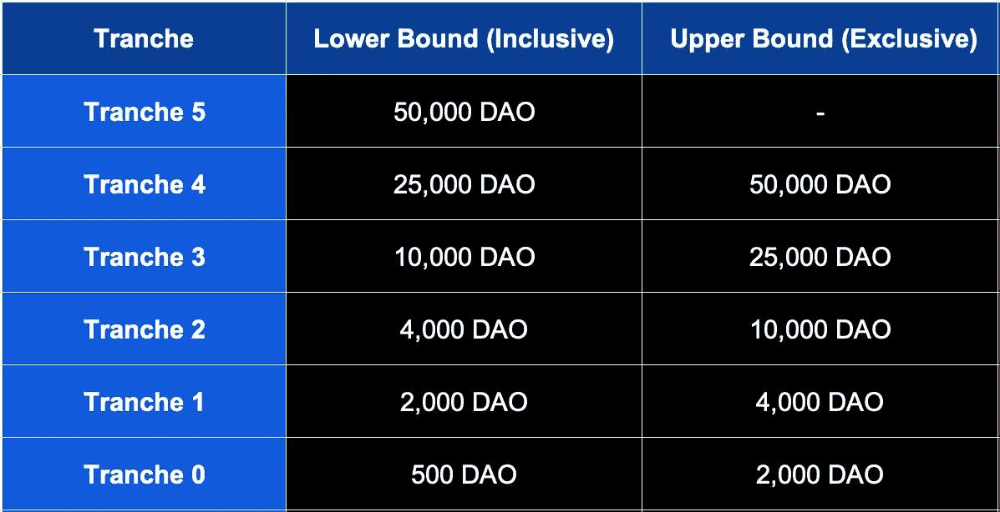

注:第 0 档仅适用于道创客的早期投资者。对于新的投资者，参与抽奖的最低份额是份额 1，要求最低持有 2000 道。

**$DAO Token —价值累积机制**

对于任何要增值的代币来说，买入压力必须大于卖出压力。由于他们最近修订了令牌组学，我预计 DAO 令牌将会升值，原因如下:

1.  如上所述，DAOPad 已经证明能够推出高质量的项目，这将成为投资者购买 DAO 代币以参与 sho 的强大拉动因素。
2.  任何 sho 的获胜者都有一个锁定期，锁定期由授权计划的总长度决定。例如，在 TGE，获胜者 SHO 的令牌发布时间表是 20%,随后每季度 20%。SHO 获胜者必须完全持有他们的 DAO 代币至少一年，才能获得所有分配的代币。如果做不到这一点，获奖者将被取消资格。因此，每次卖出后，将刀退出流通，减少卖出压力。
3.  尽管不能保证在 SHO 中获得分配，但 DAO 令牌持有者仍有动力持有其 DAO 令牌并参与后续的 SHO。在 DAOPad 上，设置了一个优先级系统，参与者在下一次 SHO 中赢得分配的机会将随着每次尝试失败而增加。只有在赢得 SHO 后，获胜的几率才会重新设置。
4.  随着最近推出 Venture Yield，所有长期 DAO token 持有者都有望从 DAOPad 上推出的所有高质量早期区块链风险投资中受益。SHO 的所有获奖者都要支付分配给他们的代币的 20%的获奖者费用，收取的费用将通过 Venture Yield 分配给所有 DAO 代币持有者，如下所示。

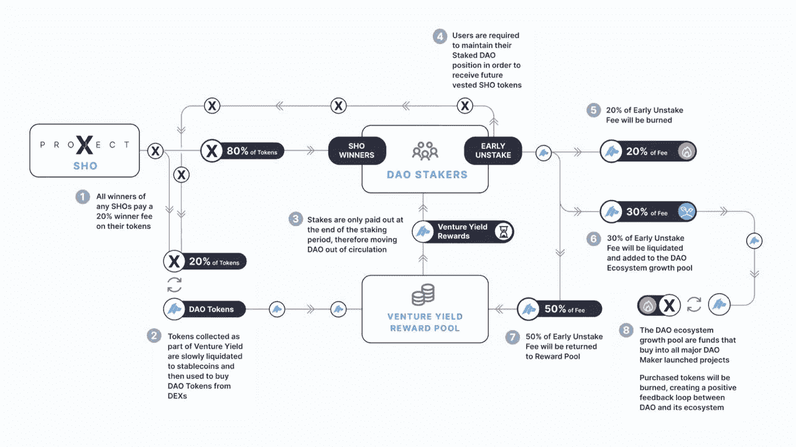

Source: [https://medium.com/daomaker/introduction-to-venture-yield-9b0926f539ab](/daomaker/introduction-to-venture-yield-9b0926f539ab)

通过在 DAOPad 上推出的 DAO token 和早期区块链风险投资的 token 增加购买压力和减少出售压力的平衡策略，我预计 DAO token 持有人将长期受益。

**令牌分发——潜在关注点**

根据最初的代币分配，代币供应总量的很大一部分(59.08%)预计将由内部人士持有，包括机构/战略投资者、当前和未来的团队、顾问和未来的战略合作伙伴。

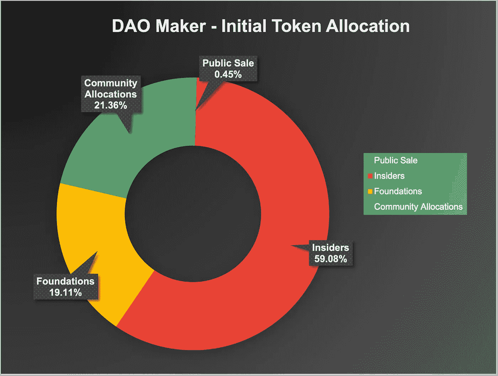

Reference Source: [https://daomaker.com/company/dao-maker/dao-data](https://daomaker.com/company/dao-maker/dao-data)

根据来自 [EthScan](https://etherscan.io/token/0x0f51bb10119727a7e5ea3538074fb341f56b09ad) 的当前令牌分布快照，约 85.09%的令牌由智能合约持有/锁定，约 2.65%的令牌由交易所持有，约 12.25%的令牌由常规地址持有。

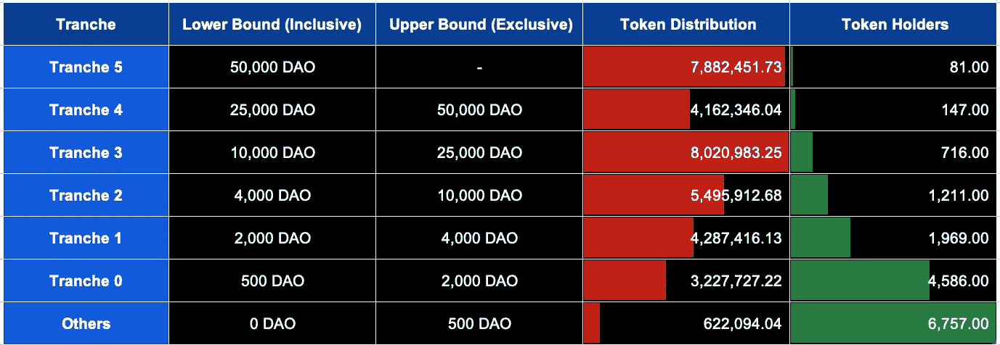

Source: [https://etherscan.io/token/0x0f51bb10119727a7e5ea3538074fb341f56b09ad](https://etherscan.io/token/0x0f51bb10119727a7e5ea3538074fb341f56b09ad)

根据仅在常规地址中的令牌供应分布，如上表所示，很明显大多数令牌由少数人持有。

**刀匠刀垫——估价**

投资加密货币领域的 launchpads 类似于作为有限合伙人投资风险投资基金，但略有不同。通常，风险投资基金的质量是通过它们的投资回报率(ROI)和管理的资产总值(AUM)来衡量的。

由于没有先例分析对风险投资基金的投资回报率和/或 AUM 进行合理的价格倍数，以确定基金的合理估值，我将尝试使用类似的指标，如加密货币领域领先的启动平台中筹集的平台总价值和当前筹集的平台总价值，以得出 DAO Maker 的合理基准。

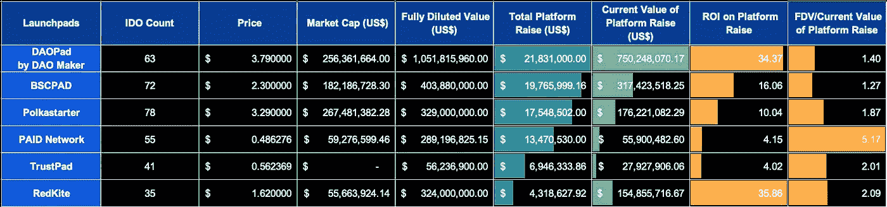

从上表可以看出，DAOPad 在平台总筹资额(2180 万美元)方面排名第一，在筹资额的投资回报率(34.37 倍)方面排名第二。这强烈表明，处于早期阶段的区块链风投公司对在 DAOPad 上发行代币充满信心，也表明参与 sho 的散户投资者有可能获得高回报。

在领先的发射台中，FDV/当前平台提升率的中值为 1.94，而 DAOPad 仅为 1.40。尽管 DAOPad 是表现最好的 launchpad，但它的 FDV/平台融资的当前价值比率低于中值，这强烈地表明，根据当前的市场地位，DAOPad 被低估了。

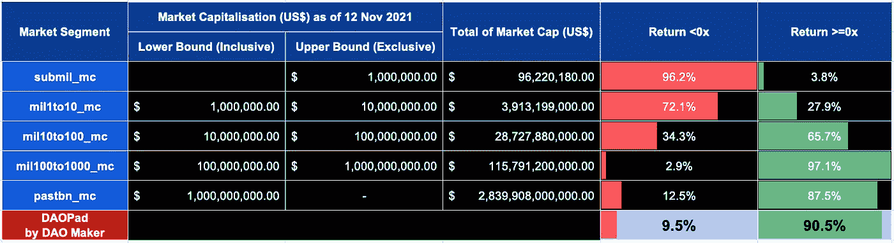

从另一个角度来看，如果我们要考察不同细分市场的风险状况，投资 DAOPad 与投资市值超过 1 亿美元的加密货币具有类似的亏损风险。简单地假设，在未来 5 年内，DAOPad 可以将这些投资者中的 1%转化为将他们投资组合的 5%投资于 DAOPad，这相当于 SHO platform 筹集了约 15 亿美元。在我看来，涉足高质量的 launchpads，比如道创客的 DAOPad，是一个非常诱人的未来。

**结论**

由于这个空间的创新性质，我无法把$道的价格。与其将$DAO 作为价格升值的投资，我更愿意将$DAO 作为获得高质量 sho 独家参与权的会员费，我认为$DAO 被低估了，作为 DAOPad 的早期参与者可能非常有利。

> 发射台就像保龄球馆的导轨。他们会给你一个更好的机会去罢工。

Photo by [Karla Rivera](https://unsplash.com/@karla_rivera?utm_source=medium&utm_medium=referral) on [Unsplash](https://unsplash.com?utm_source=medium&utm_medium=referral)

> 加入 Coinmonks [电报频道](https://t.me/coincodecap)和 [Youtube 频道](https://www.youtube.com/c/coinmonks/videos)了解加密交易和投资

## 也阅读

 [## 最佳加密交易所| 2021 年十大加密货币交易所

### 编辑描述

blog.coincodecap.com](https://blog.coincodecap.com/crypto-exchange)  [## 2021 年 10 大最佳加密贷款平台| CoinCodeCap

### 编辑描述

blog.coincodecap.com](https://blog.coincodecap.com/crypto-lending)  [## 2021 年最佳免费加密交易机器人

### 2021 年币安、比特币基地、库币和其他密码交易所的最佳密码交易机器人。四进制，位间隙…

medium.com](/coinmonks/crypto-trading-bot-c2ffce8acb2a)  [## 最佳 4 个加密交易信号电报通道

### 这是乏味的找到正确的加密交易信号提供商。因此，在本文中，我们将讨论最好的…

medium.com](/coinmonks/best-crypto-signals-telegram-5785cdbc4b2b)  [## 5 个最佳社交交易平台[2021] | CoinCodeCap

### 编辑描述

blog.coincodecap.com](https://blog.coincodecap.com/best-social-trading-platforms)  [## BlockFi 评论 2021:利弊和利率| CoinCodeCap

### 编辑描述

blog.coincodecap.com](https://blog.coincodecap.com/blockfi-review)  [## 如何在印度购买比特币？2021 年购买比特币的 7 款最佳应用[手机版]

### 如何使用移动应用程序购买比特币印度

medium.com](/coinmonks/buy-bitcoin-in-india-feb50ddfef94)  [## 加密税务软件——五大最佳比特币税务计算器[2021]

### 不管你是刚接触加密还是已经在这个领域呆了一段时间，你都需要交税。

medium.com](/coinmonks/best-crypto-tax-tool-for-my-money-72d4b430816b)  [## 存储比特币的最佳加密硬件钱包[2021] | CoinCodeCap

### 编辑描述

blog.coincodecap.com](https://blog.coincodecap.com/best-hardware-wallet-bitcoin)  [## Pionex 评论 2021 |免费加密交易机器人和交换

### Pionex 是为交易自动化提供工具的后起之秀。Pionex 上提供了 9 个加密交易机器人…

medium.com](/coinmonks/pionex-review-exchange-with-crypto-trading-bot-1e459d0191ea)