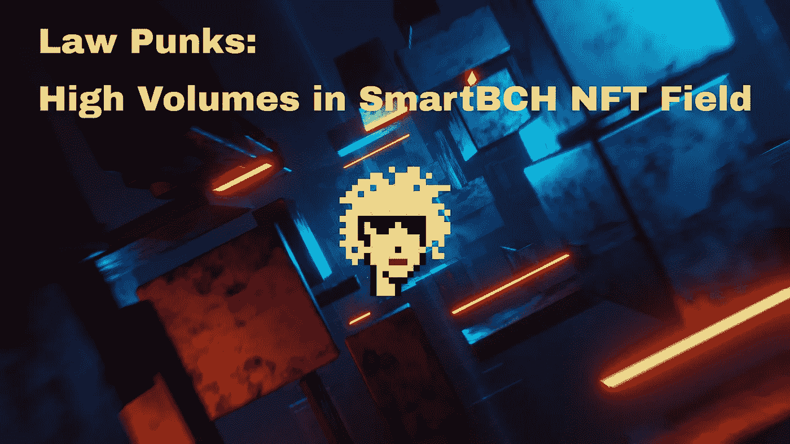
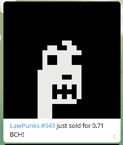
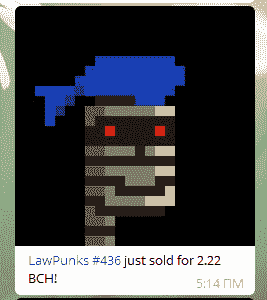
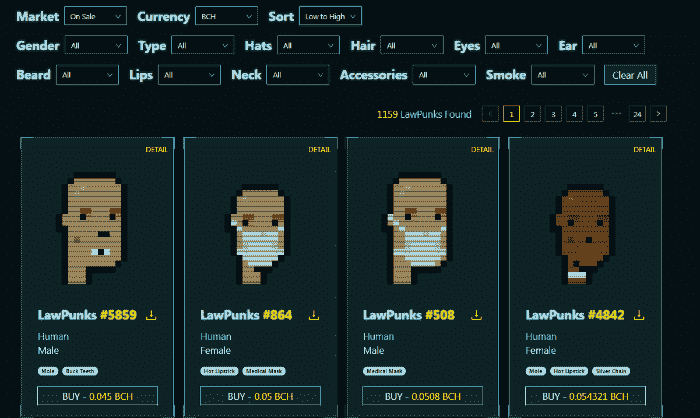
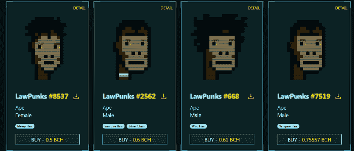
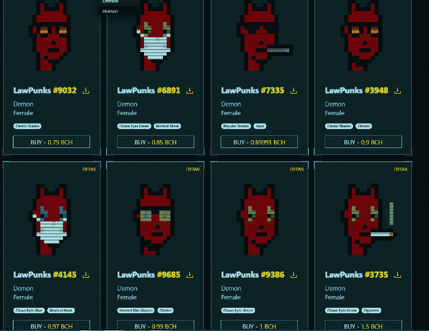
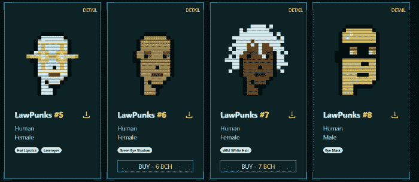
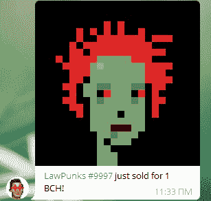

# 法律朋克:智能 NFT 领域的高容量

> 原文：<https://medium.com/coinmonks/lawpunks-high-volumes-in-the-smartbch-nft-field-140863a713be?source=collection_archive---------3----------------------->

*Image from:* [*Pixabay*](https://pixabay.com/illustrations/uhd-wallpaper-light-digital-laser-6686651/) *, by* [*tommyvideo*](https://pixabay.com/users/tommyvideo-3092371/) *(modified)*

在我们等待绿洲市场完成开发的同时，我们也见证了 NFT 交易量的激增，交易活动集中在负责释放法律朋克的 BlockNG 网站上。

两天前，最后一个法律朋克(#10，000)铸造，我们现在观察到法律朋克市场的交易加剧。

法律朋克的交易速度很快，这些非金融交易的交易量也在飙升。

最近一些顶级艺术品的拍卖引起了 NFT 收藏家的极大兴趣，最普通的法律朋克的底价现在提高到 0.05BCH(约 31 美元)。

一些罕见的具有独特特征的非功能性森林交易价格更高。粗略估计，每小时有 5 个法律小混混卖出，日销量达到 100 多。

这种日益强烈的兴趣是由顶级 NFTs Cizi 和 JustingF 的销售引起的..恩孙。之后，我们看着地板价格上涨和某些类型的朋克(外星人，恶魔，猿)的高需求。

# 一些最新的销售和底价

根据 NFT 的稀有程度，最新的销售额在 0.5 亿到 2.22 亿之间。

[Details](https://blockng.money/#/detail/543)

[Details](https://blockng.money/#/detail/436)

这只是今天最大的两笔交易。

某些类型的律师的底价也在上涨。

# 稀薄

使用[屏蔽](https://blockng.money/#/punks)市场，我们可以根据各种类型和特征对结果进行排序:

[*Source*](https://blockng.money/#/punks)

现在法律朋克的最低价格是 0.045BCH！

这是一个普通的法律朋克不包含罕见的功能。一辆 LawPunk NFT 的铸币价格是 0.01BCH，所以如果我们把这些 NFT 当作一项投资的话，它目前的投资回报率是 450%，而且还在上升。

此外，向下滚动列表，我们发现只有少数朋克以底价出售。

这里不打算进行更多的价格推测，任何感兴趣的人都可以通过这个电报频道跟踪市场并实时观察价格走势:【https://t.me/LawPunksSale

当按类型分类时，我们可以找到一些罕见的 NFT，如外星人，猿，僵尸，吸血鬼，兽人和恶魔，除了最罕见的收藏品慈子，乌吉汉姆，江泽尔和贾斯廷夫…孙是独特的。

[*Source*](https://blockng.money/#/punks)

例如，猿的底价是 0.5BCH！最常见的形式。随着越来越罕见的功能，他们的价值甚至更高。

[*Source*](https://blockng.money/#/punks)

恶魔卖的比猿还高。一个恶魔的底价是 0,79BCH！

# 对一些收藏家来说，铸币号码也很重要

通常，在所有的 NFT 收藏中，造币厂的号码是很重要的。根据薄荷糖的总数，这可能是前十枚或前一百枚，具有较高的收藏价值。

从 LawPunks 画廊的第一页就可以看出这一点，我们看到收藏家以更高的价格列出了其中一些朋克。

[*Source*](https://blockng.money/#/punks)

例如，第 6 号法律朋克并不包含独特的功能，但其所有者理解低数字的价值，并且它是出现在前 4 个独特朋克正下方的第一批法律朋克之一。

# 最后

[*Source*](https://t.me/LawPunksSale)

我对法律朋克比较晚，只是在 6BCH 第一次出售法律朋克:Cizi (#4)后才开始铸造。这是 NFT 的一个很好的广告，随着价格的不断上涨，收藏家们的兴趣也在不断增加。

比特币现金社区对 NFT 有着巨大的兴趣。前两个 NFT 系列(池畔河豚和劳朋克)采用了专业的方式。他们的网站很现代，吸引了收藏家。LawPunks 也有一个针对 NFT 的本地市场，以及更多针对其法律令牌的选项。

这两种 NFT 都受到了比特币现金社区的欢迎，这是专业 NFT 艺术家需要开始寻找和测试 SmartBCH NFT 领域的证明。

河豚、朋克和其他智能食物目前可以在 ba.net 出售，尽管这个市场有一些困难，因为它需要手动处理 NFT 出售的物品。Ba.net 是各种网络的通用 NFT 市场，但目前交易量较低，且不专门面向 SmartBCH。

人们的兴趣将在几周内转移到 OASIS，OASIS 正在做准备，将成为第一个 SmartBCH NFT 市场。

Follow me on: ● [ReadCash](https://read.cash/@Pantera) ● [NoiseCash](https://noise.cash/u/Pantera99) ● [Medium](/@panterabch) ● [Hive](https://hive.blog/@pantera1) ● [Steemit](https://steemit.com/@pantera1) ●[Vocal](https://vocal.media/authors/pantera) ● [Minds](https://www.minds.com/pantera99/) ● [Twitter](https://twitter.com/Panterabch) ● [LinkedIn](https://www.linkedin.com/in/panterabch/) ● [email](https://read.cash/@Pantera/localcryptos-p2p-exchange-is-now-offering-bitcoin-cash-trading-06637230#bad-link)

***支持内容创作者。***

***如果你喜欢这个故事就订阅吧！***

*原发布于*[*https://read . cash*](https://read.cash/@Pantera/lawpunks-high-volumes-in-the-smartbch-nft-field-fc9a622a)*。*

> 加入 Coinmonks [电报频道](https://t.me/coincodecap)和 [Youtube 频道](https://www.youtube.com/c/coinmonks/videos)了解加密交易和投资

## 也阅读

*   [比特币基地跑马圈地](https://blog.coincodecap.com/coinbase-staking) | [Hotbit 评论](/coinmonks/hotbit-review-cd5bec41dafb) | [KuCoin 评论](https://blog.coincodecap.com/kucoin-review)
*   [最佳加密交易信号电报](/coinmonks/best-crypto-signals-telegram-5785cdbc4b2b) | [MoonXBT 评论](/coinmonks/moonxbt-review-6e4ab26d037)
*   [Coinswitch 俱吠罗评论](/coinmonks/coinswitch-kuber-review-1a8dc5c7a739) | [电网交易机器人](https://blog.coincodecap.com/grid-trading) | [比特币基地收费](/coinmonks/coinbase-fees-831e77d4f2c5)
*   [Bitget 回顾](https://blog.coincodecap.com/bitget-review) | [双子 vs 区块链](https://blog.coincodecap.com/gemini-vs-blockfi) | [OKEx 期货交易](https://blog.coincodecap.com/okex-futures-trading)
*   [OKEx vs KuCoin](https://blog.coincodecap.com/okex-kucoin) | [摄氏替代品](https://blog.coincodecap.com/celsius-alternatives) | [如何购买 VeChain](https://blog.coincodecap.com/buy-vechain)
*   [币安期货交易](https://blog.coincodecap.com/binance-futures-trading)|[3 comas vs Mudrex vs eToro](https://blog.coincodecap.com/mudrex-3commas-etoro)
*   [在印度利用加密套利赚取被动收入](https://blog.coincodecap.com/crypto-arbitrage-in-india)
*   [德国最佳加密交易所](https://blog.coincodecap.com/crypto-exchanges-in-germany) | [WazirX P2P](https://blog.coincodecap.com/wazirx-p2p)
*   [如何购买 Monero](https://blog.coincodecap.com/buy-monero) | [IDEX 评论](https://blog.coincodecap.com/idex-review) | [BitKan 交易机器人](https://blog.coincodecap.com/bitkan-trading-bot)
*   如何在 Bitbns 上购买柴犬(SHIB)币？
*   [币安 vs 比特邮票](https://blog.coincodecap.com/binance-vs-bitstamp) | [比特熊猫 vs 比特币基地 vs Coinsbit](https://blog.coincodecap.com/bitpanda-coinbase-coinsbit)
*   [如何购买 Ripple (XRP)](https://blog.coincodecap.com/buy-ripple-india) | [非洲最好的加密交易所](https://blog.coincodecap.com/crypto-exchange-africa)
*   [非洲最佳加密交易所](https://blog.coincodecap.com/crypto-exchange-africa) | [胡交易所评论](https://blog.coincodecap.com/hoo-exchange-review)
*   [eToro vs robin hood](https://blog.coincodecap.com/etoro-robinhood)|[MoonXBT vs Bybit vs Bityard](https://blog.coincodecap.com/bybit-bityard-moonxbt)
*   [Stormgain 回顾](https://blog.coincodecap.com/stormgain-review) | [Bexplus 回顾](https://blog.coincodecap.com/bexplus-review) | [币安 vs Bittrex](https://blog.coincodecap.com/binance-vs-bittrex)
*   [Bookmap 评论](https://blog.coincodecap.com/bookmap-review-2021-best-trading-software) | [美国 5 大最佳加密交易所](https://blog.coincodecap.com/crypto-exchange-usa)
*   [如何在 FTX 交易所交易期货](https://blog.coincodecap.com/ftx-futures-trading) | [OKEx vs 币安](https://blog.coincodecap.com/okex-vs-binance)
*   [如何在势不可挡的域名上购买域名？](https://blog.coincodecap.com/buy-domain-on-unstoppable-domains)
*   [印度的秘密税](https://blog.coincodecap.com/crypto-tax-india) | [altFINS 审查](https://blog.coincodecap.com/altfins-review) | [Prokey 审查](/coinmonks/prokey-review-26611173c13c)
*   [Blockfi vs 比特币基地](https://blog.coincodecap.com/blockfi-vs-coinbase) | [比特坎评论](https://blog.coincodecap.com/bitkan-review) | [币安评论](/coinmonks/binance-review-ee10d3bf3b6e)