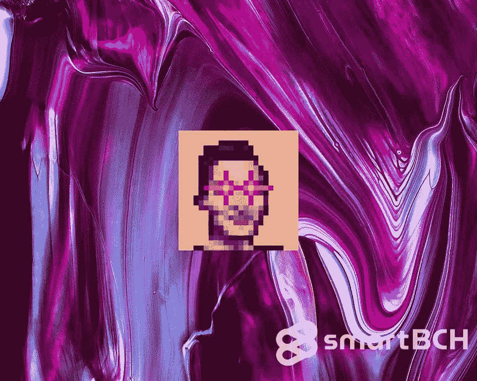
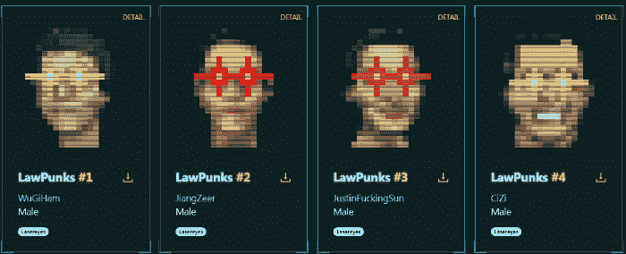
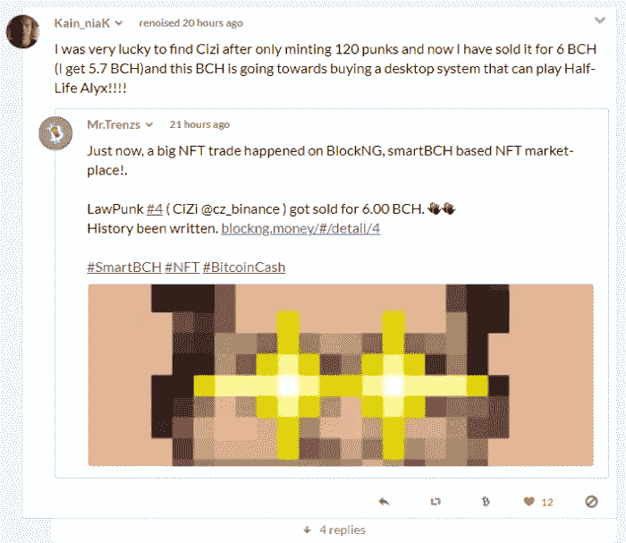
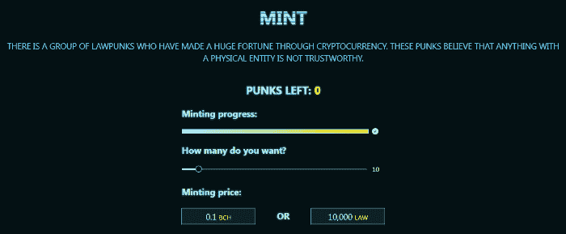
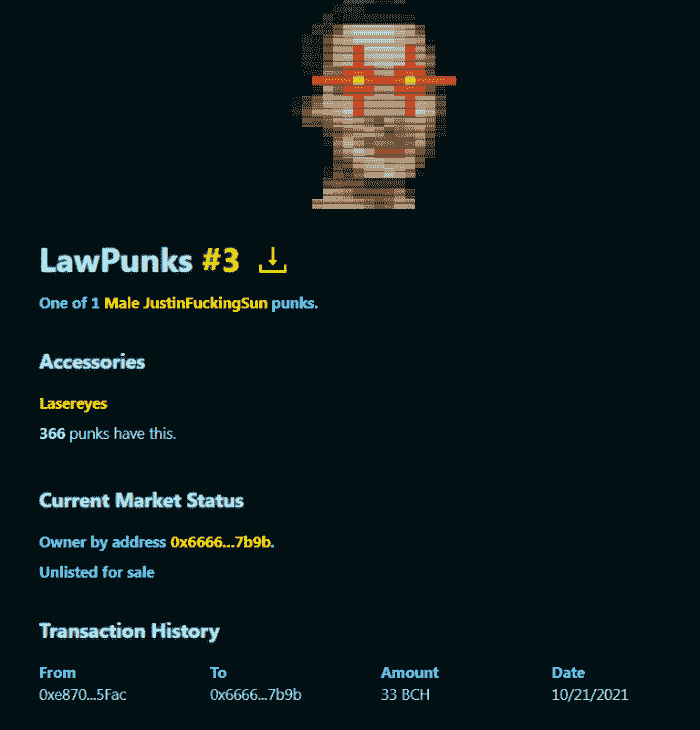
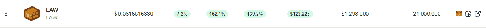
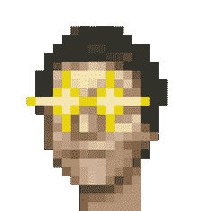

# 劳朋克 NFT 以创纪录的 33 BCH(约 21000 美元)售出！

> 原文：<https://medium.com/coinmonks/lawpunks-nft-sold-for-record-33-bch-21-000-c4ebe9020a62?source=collection_archive---------7----------------------->

*Image from:* [*Unsplash*](https://unsplash.com/photos/bU8TeXhsPcY)*, by Maria Orlova(modified)*

随着 SmartBCH 侧链的发布和智能合约的引入，新的 Defi 平台、Dapps 和 NFT 收藏品发展迅速。

继池畔河豚之后，SmartBCH 上的另一个 NFT 系列也销售一空。

LawPunks 有 10，000 个 NFT，最后一个是昨天铸造的。这是 SmartBCH 上的第一个 NFT 收藏品系列之一，也是迄今为止非常成功的一个系列。

这个集合中的前四个是独特的，包含了加密空间的流行人物，似乎它们包含了巨大的收藏价值。

[*Source*](https://blockng.money/#/punks)

有很多稀有的法律朋克，根据他们的统计数据和铸币数量，稀有度会增加。

在过去的 24 小时里，两项法律朋克交易记录被打破，因为前四名中的两项(第四名和第三名)分别以**6 BCH(～3800 美元)**和**33 BCH(～21500 美元)**的价格售出！

# 两次大的销售:#4: 6BCH，#3: 33BCH

法律朋克已经活跃了一个多月，就在几天前，50%的代币被铸造。然而，昨天发生的一件事彻底改变了人们对法律朋克的需求。

BCH 乐队出售的第四号“法律朋克” [#4](https://read.cash/search?q=%234) (CiZi)是法律朋克需求大幅增长的决定性因素。

[*Source*](https://noise.cash/post/5k90nx9dv8np)

我们在那次销售后目睹的是相当惊人的！

就在公元前 6000 年“此子”售出几个小时后，NFT 收藏家们疯狂地铸造了数以千计的法律朋克！花了大约 10 个小时，数以千计的法律朋克被买走，最终游泳池干涸。

[*Source*](https://blockng.money/#/mint)

## 新纪录:公元前 33 年

仅仅几个小时后，这个 6BCH 记录就被打破了！

今日法律朋克 [#3](https://read.cash/search?q=%233) : **JustingF..孙**被 **33 卖了！**

[*Source*](https://blockng.money/#/detail/3)

上一页包含了这次销售的细节。

对于像 SmartBCH 这样的新网络来说，这么早就看到这样的增长是相当不寻常的。就像池畔河豚卖出 2,100 NFTs 一样，劳朋克现在卖出了 1 万 NFT，交易量正在激增。

可用于购买 LawPunk NFTs 而非 BCH 的 LAW token 价格也翻了一倍多，达到 160%，目前总市值为 129 万美元。

[Source](https://www.marketcap.cash/)

法律朋克可以在 BlockNG 网站([链接](https://blockng.money/#/punks))上兑换 BCH 或法律代币。

# 最后

*Law Punk* [*#1*](https://read.cash/search?q=%231) *(WuGiHam):* [*Source*](https://blockng.money/#/punks)

有一个关于 OpenSea marketplace 引入 SmartBCH NFTs 的传闻。

我不经常关注谣言，但主要是公告，当 NFT 市场有很高的交易量和巨大的兴趣时，OpenSea 肯定会试图整合它。

添加 SmartBCH 市场很简单，因为它是 EVM 兼容的，OpenSea 只需要对市场代码进行微小的调整。

它会选择添加 SmartBCH，因为它会增加流量和费用。但是，我们也有关于即将发布的 SmartBCH 独家 NFT 市场开发的消息(例如 OASIS)。

我预计会有大量 NFT 创作者涌入 SmartBCH，或许随着收藏家(买家)的这种兴奋，这一事件可能会引发极其乐观的情况。

**相关资料(之前发布在 read.cash 上):**

*   [*NFT 宇宙的起源*](https://read.cash/@Pantera/the-genesis-of-the-smartbch-nft-universe-7cef1a9c)
*   [*SmartBCH Metamask 教程—连接网络、转移 BCH、添加代币和代币交易*](https://read.cash/@Pantera/smartbch-metamask-tutorial-connect-to-network-transfer-bch-add-tokens-and-trade-on-dexs-601f4b17)
*   [*如何设置元遮罩并添加网络:币安(BSC)、多边形(Matic)、OKEx、SmartBCH —教程*](https://read.cash/@Pantera/how-to-set-up-metamask-and-add-networks-binance-bsc-polygon-matic-okex-smartbch-tutorial-7265e1c4)
*   [*SmartBCH:这是关于什么的，为什么我们要关心？*](https://read.cash/@Pantera/smartbch-what-is-this-about-and-why-we-should-care-5688867f)
*   [*产量农业与智能农业*](https://read.cash/@Pantera/yield-farming-with-smartbch-defi-2a58beda)

Follow me on: ● [ReadCash](https://read.cash/@Pantera) ● [NoiseCash](https://noise.cash/u/Pantera99) ● [Medium](/@panterabch) ● [Hive](https://hive.blog/@pantera1) ● [Steemit](https://steemit.com/@pantera1) ●[Vocal](https://vocal.media/authors/pantera) ● [Minds](https://www.minds.com/pantera99/) ● [Twitter](https://twitter.com/Panterabch) ● [LinkedIn](https://www.linkedin.com/in/panterabch/) ● [email](https://read.cash/@Pantera/localcryptos-p2p-exchange-is-now-offering-bitcoin-cash-trading-06637230#bad-link)

***支持内容创作者。***

如果你喜欢这个故事，就订阅吧！

*原发布于*[*https://read . cash*](https://read.cash/@Pantera/lawpunks-nft-sold-for-record-33-bch-smartbch-volumes-spike-0b3ac253)*。*

> 加入 Coinmonks [电报频道](https://t.me/coincodecap)和 [Youtube 频道](https://www.youtube.com/c/coinmonks/videos)了解加密交易和投资

## 另外，阅读

*   [什么是保证金交易](https://blog.coincodecap.com/margin-trading) | [美元成本平均法](https://blog.coincodecap.com/dca)
*   [维护卡审核](https://blog.coincodecap.com/uphold-card-review) | [信任钱包 vs MetaMask](https://blog.coincodecap.com/trust-wallet-vs-metamask)
*   [Exness 点评](https://blog.coincodecap.com/exness-review)|[moon xbt Vs bit get Vs Bingbon](https://blog.coincodecap.com/bingbon-vs-bitget-vs-moonxbt)
*   [如何开始通过加密贷款赚取被动收入](https://blog.coincodecap.com/passive-income-crypto-lending)
*   [BigONE 交易所评论](/coinmonks/bigone-exchange-review-64705d85a1d4) | [电网交易机器人](https://blog.coincodecap.com/grid-trading)
*   [新加坡十大最佳加密交易所](https://blog.coincodecap.com/crypto-exchange-in-singapore) | [购买 AXS](https://blog.coincodecap.com/buy-axs-token)
*   [投资印度的最佳加密软件](https://blog.coincodecap.com/best-crypto-to-invest-in-india-in-2021) | [WazirX P2P](https://blog.coincodecap.com/wazirx-p2p)
*   [7 个最佳零费用加密交易平台](https://blog.coincodecap.com/zero-fee-crypto-exchanges)
*   [分散交易所](https://blog.coincodecap.com/what-are-decentralized-exchanges) | [比特 FIP](https://blog.coincodecap.com/bitbns-fip) | [宾邦评论](https://blog.coincodecap.com/bingbon-review)
*   [用信用卡购买密码的 10 个最佳地点](https://blog.coincodecap.com/buy-crypto-with-credit-card)
*   [加拿大最佳加密交易机器人](https://blog.coincodecap.com/5-best-crypto-trading-bots-in-canada) | [Bybit vs 币安](https://blog.coincodecap.com/bybit-binance-moonxbt)
*   [用于 Huobi 的加密交易信号](https://blog.coincodecap.com/huobi-crypto-trading-signals) | [Swapzone 审查](/coinmonks/swapzone-review-crypto-exchange-data-aggregator-e0ad78e55ed7)
*   最佳[密码交易机器人](https://blog.coincodecap.com/best-crypto-trading-bots) | [购买索拉纳](https://blog.coincodecap.com/buy-solana) | [矩阵导出审查](https://blog.coincodecap.com/matrixport-review)
*   最好的[加密税务软件](/coinmonks/best-crypto-tax-tool-for-my-money-72d4b430816b) | [硬币追踪评论](/coinmonks/cointracking-review-a-reliable-cryptocurrency-tax-software-5114e3eb5737)
*   [Stackedinvest 评论](https://blog.coincodecap.com/stackedinvest-review) | [北海巨妖评论](/coinmonks/kraken-review-6165fc1056ac) | [期货交易机器人](/coinmonks/futures-trading-bots-5a282ccee3f5)
*   最佳[加密借贷平台](/coinmonks/top-5-crypto-lending-platforms-in-2020-that-you-need-to-know-a1b675cec3fa) | [杠杆代币](/coinmonks/leveraged-token-3f5257808b22)
*   最佳[加密制图工具](/coinmonks/what-are-the-best-charting-platforms-for-cryptocurrency-trading-85aade584d80) | [最佳加密交易所](/coinmonks/crypto-exchange-dd2f9d6f3769)
*   [比特币基地僵尸程序](/coinmonks/coinbase-bots-ac6359e897f3) | [AscendEX 审查](/coinmonks/ascendex-review-53e829cf75fa) | [OKEx 交易僵尸程序](/coinmonks/okex-trading-bots-234920f61e60)
*   [如何在印度购买比特币？](/coinmonks/buy-bitcoin-in-india-feb50ddfef94) | [WazirX 评论](/coinmonks/wazirx-review-5c811b074f5b)
*   [隐料斗替代品](/coinmonks/cryptohopper-alternatives-d67287b16d27) | [HitBTC 审查](/coinmonks/hitbtc-review-c5143c5d53c2)
*   [折叠 App 审核](https://blog.coincodecap.com/fold-app-review) | [Kucoin 交易机器人](/coinmonks/kucoin-trading-bot-automate-your-trades-8cf0ca2138e0) | [Probit 审核](https://blog.coincodecap.com/probit-review)
*   [如何匿名购买比特币](https://blog.coincodecap.com/buy-bitcoin-anonymously) | [比特币现金钱包](https://blog.coincodecap.com/bitcoin-cash-wallets)
*   [币安 vs FTX](https://blog.coincodecap.com/binance-vs-ftx) | [最佳(SOL)索拉纳钱包](https://blog.coincodecap.com/solana-wallets) | [喜美元点评](https://blog.coincodecap.com/hi-dollar-review)