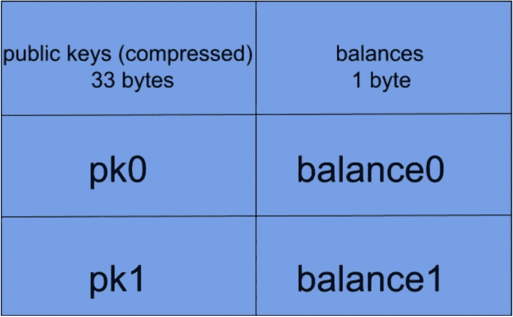
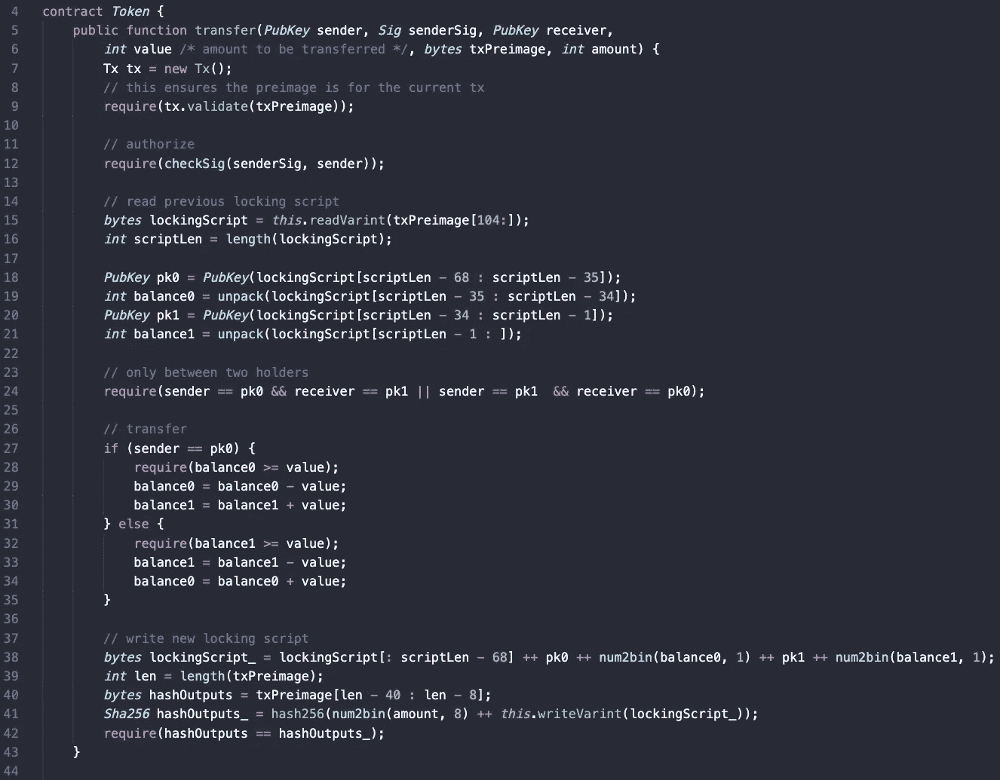
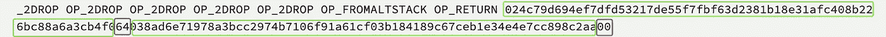
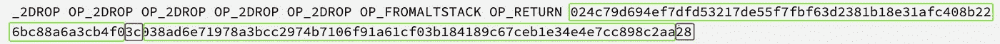
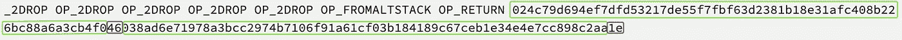

# 比特币服务上的第 1 层代币

> 原文：<https://medium.com/coinmonks/layer-1-tokens-on-bitcoin-sv-e78c8abf270d?source=collection_archive---------0----------------------->

从早期的开始，比特币就已经被用来对外部资产进行令牌化。有许多令牌化协议。一般来说，他们会在比特币上附加额外的协议元数据来代表这些资产，例如在 *OP_RETURN* 中。令牌规则在第 2 层进行验证，这意味着脱离链而不是由矿工进行验证。

与所有以前的工作不同，我们展示了一种在比特币中实现 ***第 1 层*** (又名共识层、矿工可执行性、“无信任”、“无许可”)令牌的机制。对于第 1 层令牌，验证由挖掘者完成。我们在编译成本地脚本的高级语言 [sCrypt](http://scryptdoc.readthedocs.io/) 中实现了一个两个所有者的示例令牌。

# 令牌智能合约

## 令牌表作为状态

使用[上一篇文章](/@xiaohuiliu/stateful-smart-contracts-on-bitcoin-sv-c24f83a0f783)中的技术，我们将整个令牌表作为状态存储在数据部分。该表是从每个令牌所有者(由他的公钥表示)到他的余额的映射。

Token table

令牌合同[代码](https://github.com/scrypt-sv/boilerplate/blob/master/contracts/token.scrypt)如下所示，带有内联注释。

Token contract

和上一篇文章一样，第 7 & 9 行确保原像来自当前事务。第 12 行确保只有所有者被授权转移令牌。其余部分遵循前一篇文章中解释的状态转换范式。

## 代币发行

[这里的](https://github.com/scrypt-sv/boilerplate/blob/master/tests/testnet/token.js)是部署契约和来回传输令牌的代码。合同部署到[交易 1](https://test.whatsonchain.com/tx/39b94e5f44f2c3d20db99f103fe2b4821ec373b25e3bdbb38e94577d4d2ed770) 后，我们可以看到 ***pk0*** 为*024 c 79d 694 ef 7 DFD 53217 de 55 f 7 fbf 63d 2381 b 18 e 31 AFC 408 b 226 BC 88 a 6 a 3 CB 4 f 0*和***pk1****038 ad6e 71978 a 3 bcc 297 ***pk0*** 的初始余额为 100 ( *0x64* 十六进制)， ***pk1*** *的*为 0。*

Token distribution after deployment

## 令牌传输

***pk0*** 在[交易 2](https://test.whatsonchain.com/tx/2afb7a1aa90582d9f506f7e380b37f0f2bafd41e918cbc2cf2e5acd2afde81af) 中向 ***pk1*** 转移 40 个代币。不出所料， ***pk0*** 的余额变成了 60 ( *0x3c* 十六进制)，**pk1**40(*0x 28*)。

Token distribution after first transfer

***pk1*** 在[交易 3](https://test.whatsonchain.com/tx/1127de06614c9ec8de1104562f6a2c62524ea25a7eea148607aa931ac826c6e8) 中将 10 个代币转回 ***pk0*** 。不出所料， ***pk0*** 的余额变成了 70 ( *0x46* )，**pk1**30(*0x1e*)。

Token distribution after second transfer

# 结论

我们只演示了如何发行和转让两个用户的玩具令牌。通过读取和解析区块链上的令牌表，可以轻松实现其他功能，如余额查找。不难以多种方式对其进行扩展，以支持例如多用户令牌、不可替换令牌、发行者许可令牌、合法合规令牌和 SPV 兼容令牌。

由于比特币的无限可扩展性，这种可扩展的令牌化协议允许其他区块链中的任何第 1 层令牌在比特币上运行，成本显著降低。通过补充比特币上现有的第二层令牌化协议，它还可以实现比特币与其他令牌化资产的原子交换，这开辟了一个具有无数可能性的新领域。

> [直接在您的收件箱中获得最佳软件交易](https://coincodecap.com/?utm_source=coinmonks)

[1]我们使用小写*比特币*来表示加密货币，大写*比特币*，网络和协议。

