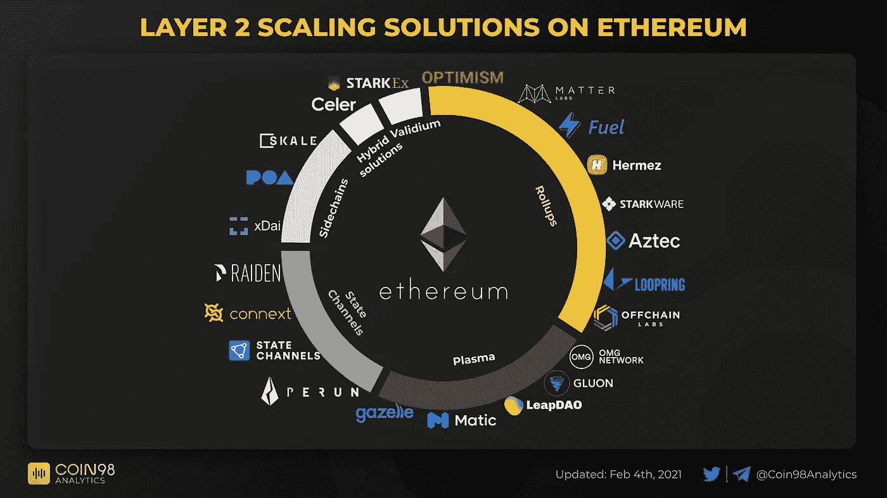

# 第二层救不了以太坊

> 原文：<https://medium.com/coinmonks/layer-2-wont-save-ethereum-a52aa2bd719b?source=collection_archive---------0----------------------->

## 没人谈论的:L2 缩放解决方案未解决的问题

Source: Coin98 Analytics

和往常一样，这篇文章是为教育目的而写的。这既不构成财务建议，也不构成交易建议。过去的表现并不代表未来的结果。

*不要投资超过你能承受的损失。这不是财务建议；总是自己做研究:)*

[前两天](https://0xjim.medium.com/the-layer-2-wars-heat-up-b8d02d3dd332)，我厚着脸皮声明“第 2s 层将拯救以太坊”。

[Source](https://0xjim.medium.com/the-layer-2-wars-heat-up-b8d02d3dd332)

由于以太坊的网络超载，以太坊一直遭受着高额的天然气费用，许多人声称第二层将是最终的一切:永远解决以太坊讨厌的天然气问题的银弹。

坦率地说，直到几周前，我还认为——一旦第二层达到以太坊交易的临界质量，以太坊将成为绝对完美的加密平台。

但是，随着我开始更深入地研究第 2 层解决方案，并开始更多地参与 Twitter 和 Discord 上围绕第 2 层的深入对话，我开始意识到，尽管第 2 层是扩展以太坊的迫切需要和合乎逻辑的解决方案，但它们也有自己的问号和潜在问题，可能会阻碍该平台实现其对世界超级计算机的真实愿景。

> 第二层有自己的问号和潜在问题，很少有人意识到或似乎在谈论这些问题

尽管如此，第二层仍然绝对是朝着正确方向迈出的一步，即使今年晚些时候 ETH2 最终合并，它们也是必要的。它们提供的吞吐量和速度不能完全在以太坊 2.0 的第 1 层网络上实现。

但它们远非完美。也许这就是为什么以太坊有这么多的解决方案:侧链、儿童链、支付渠道、易拉宝…

以下是我从当前第 2 层扩展解决方案中看到的一些潜在问题/未回答的问题。

# 有限可组合性

昨天，我谈到了分散金融的真正力量是可组合性——源于技术的开源性质。

我个人认为，可组合性是 DeFi 最强大的方面。

是的，开放金融是伟大的——允许获得前所未有的金融服务，这使得世界上近 20 亿人无法获得金融服务。

自 Web 2.0 兴起以来，个人第一次从脸书、银行等中介手中夺回了对自己财务、数据和财产的控制权，这也是一件好事。

但是对我来说，增加的可组合层真的很棒。它创造了全新的、前所未见的金融产品，改变了我们看待金融的方式。

我内心的孩子看到了 DeFi，看到了永无止境的创新网络。就像互联网如何创造了我们在 90 年代从未想过的公司:网飞、Postmates、Zoom。

**不幸的是，由于第二层的实现，可组合性可能会受到限制——或者完全消失，因为第二层目前不能相互操作。**

换句话说，一个第 2 层上的 dapp 不能容易地与另一个第 2 层上的 dapp 通信——破坏了可组合性的力量。

在 L1，单个交易可以与多个 DeFi 协议交互，从而创建一个全新的金融产品。

在 L2 上，该事务只能与存在于其自身链上的 DeFi 协议进行交互。

假设 Aave 只在 Polygon 上可用，Uniswap 只在乐观上可用(在撰写本文时事实上是正确的)。我们无法编写一个同时调用 Aave 和 Uniswap 智能合约的交易。

由于这种分裂，可组合性受到了限制，因此 DeFi 的魔力也受到了极大的限制。

**这可以通过像 Polygon 这样的互操作层来补救，Polygon 试图在一个标准框架内连接所有的 L2 解决方案。**然而，根据 Polygon 的标准和平台构建所有解决方案将是一个漫长的旅程。

# 资产流动性

不同 L2 链上 dapps 的分裂带来的另一个问题是，它们相关的流动性也被分裂了。

流动性在任何金融市场中都非常重要，因为它提供了一个健康的市场，买家和卖家可以在公开市场上相遇，并在买卖价格上妥协太多的情况下交换商品，而不会导致价格的疯狂波动。

目前，所有的流动性都存在于以太坊上——它为平台上的所有金融产品和代币提供了一个健康且高度流动的市场。

随着向 L2s 的迁移，我们将看到现有的流动性被分割到以太坊 L1 和不同的扩展解决方案中，而不是在以太坊上拥有所有可用的流动性。

Almost evenly distributed in terms of L2 interest — meaning more fragmentation of liquidity

# 上车和下车摩擦

最后，因为我们正在接近以太坊顶部的多链 L2 世界的最终状态，为了与 DeFi 相互作用，第二层之间将会有严重的摩擦。

我们可能会在 L2 之间看到很多桥梁，所以当我们试图在链之间转移资金时，预计会有很长的入职时间。

也要有多个账户——每个 L2 连锁店一个或多个。从 UX 的角度来看，跟踪这些扩展解决方案中的资金将是一件令人头疼的事情。

假设我们在多边形上有 AAVE，我们想用 Uniswap 在乐观上把它换成 UNI。

我们不仅要把我们的 AAVE 从多边形撤回到以太坊(现在——跨 L2 的桥梁应该要来了)，我们还要把我们的 AAVE 从 L1 以太坊移到乐观主义。

Polygon 的撤回时间大约需要 15 分钟(我计算了时间)，乐观假设有 1-2 周的入职时间，因为它使用了乐观汇总(回想一下，oru 有很长的入职时间，因为有“挑战期”来发现证据中的欺诈)。

# 结束语

当然，这些问题肯定是可以解决的，并且可能在所有主要的 L2 扩展解决方案公开发布后不久就会得到解决——这要归功于以太坊开发者社区的强大力量。

我确实认为，我们最终会看到 L2 领域的一些整合——根据每项技术的优势(例如，指数、支付)，少数赢家会脱颖而出。

我希望它们之间也能有一个强大的可互操作的协议，以保持可组合性和流动性——无论是通过 Polygon 框架还是通过 L2 到 L2 桥的健壮网络。

[安东尼·萨萨诺](https://twitter.com/sassal0x)说得好:

> Y 你可以把第 2 层生态系统中正在发生的事情想象成“采用和创新”阶段，在这个阶段，许多不同的解决方案同时并行地被尝试和测试。当然，从长期来看，并不是所有的人都能成功。最终，我不认为只有一种解决方案能够“赢得”可伸缩性之战。正如我所说，每个可伸缩性解决方案都有自己的权衡、信任假设和一般优势&弱点。有些非常适合支付，有些允许 EVM 兼容性，有些以分散化为代价提供了更大的可伸缩性。

*如果你认为这篇博文值得你花上 5 分钟来阅读，请在下面鼓掌(最多 50 次)或者与一个会从这篇内容中受益的朋友分享。非常感谢！*

> 加入 [Coinmonks 电报小组](https://t.me/joinchat/uiLERCQL1fQ5ZjA1)并了解加密交易和投资

## 另外，阅读

*   [密码电报信号](http://Top 4 Telegram Channels for Crypto Traders) | [密码交易机器人](/coinmonks/crypto-trading-bot-c2ffce8acb2a)
*   [复制交易](/coinmonks/top-10-crypto-copy-trading-platforms-for-beginners-d0c37c7d698c) | [加密税务软件](/coinmonks/crypto-tax-software-ed4b4810e338)
*   [网格交易](https://coincodecap.com/grid-trading) | [加密硬件钱包](/coinmonks/the-best-cryptocurrency-hardware-wallets-of-2020-e28b1c124069)
*   [加密交换](/coinmonks/crypto-exchange-dd2f9d6f3769) | [印度的加密应用](/coinmonks/buy-bitcoin-in-india-feb50ddfef94)
*   [顶级付费加密货币和区块链课程](https://blog.coincodecap.com/blockchain-courses) | [币安评论](/coinmonks/binance-review-ee10d3bf3b6e)
*   [MXC 交易所评论](/coinmonks/mxc-exchange-review-3af0ec1cba8c) | [Pionex vs 币安](https://blog.coincodecap.com/pionex-vs-binance) | [Pionex 套利机器人](https://blog.coincodecap.com/pionex-arbitrage-bot)
*   [在美国如何使用 BitMEX？](https://blog.coincodecap.com/use-bitmex-in-usa) | [BitMEX 评论](https://blog.coincodecap.com/bitmex-review)