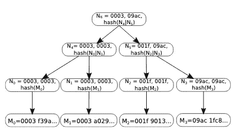

# 懒惰的账本——听起来懒惰，但太疯狂了！

> 原文：<https://medium.com/coinmonks/lazy-ledger-sounds-lazy-but-too-crazy-7c5539d65a47?source=collection_archive---------2----------------------->

区块链领域的创新从未停止。一个这样的想法是——“[*【懒帐】*](https://lazyledger.io/) ”。当我读他们的学术论文时，我觉得这是一个如此简单而美丽的想法，为什么以前没有想到这一点。这就是为什么我认为这是值得出版的东西。

让我们从这个问题开始。

***问题:*** 目前大多数区块链解决方案都在努力解决[区块链](https://blog.coincodecap.com/what-is-blockchain-a-simple-guide-for-dummies/)的不变性和透明性带来的可伸缩性问题。主要的限制包括事务吞吐量和延迟。网络中特定节点的链上工作涉及*事务验证、确认、排序和保证数据的可用性*。但是所有类型的客户端应用程序都需要这些活动吗？不要！

**解决方案— *为什么不拆分工作？分而治之！***

基本上懒人账本就是这么干的。客户端和最终用户执行交易验证和确认。执行共识过程的节点将订购并保证数据的可用性。简单，但功能强大！

## ***它是如何工作的？***

节点基本上分为一致节点、存储节点和客户端节点。

*共识节点——参与共识机制并决定将哪些模块添加到链中。*

*存储节点——节点存储区块链中的所有数据。*

*客户端节点——提交和接收与其应用程序相关的交易数据的最终用户。*

这种分类减轻了任何完整节点在区块链中的大量开销。它将处理负载转移给客户端。客户端也不必处理所有的数据。他们将只能请求特定的应用程序数据以及与其应用程序相关的任何依赖项。

每个应用都与一个 ID — ***nid*** *相关联。*任何请求应用程序的客户端都需要使用此 ID 来获取 ID。相同的 ID 也用于组织 Merkle 树中的数据。***id***的变化也将改变数据存储值。因此，使用特定应用程序的所有客户端必须同步。他们还需要维护与其他应用程序的依赖关系。

在 Lazy Ledger 中，一个名为— ***的修改后的 Merkle 树，命名空间* Merkle 树**的使用如下所示。

An example of the namespace Merkle Tree from Lazy Ledger White paper

每个节点都有一系列消息的名称空间。根据名称空间 id 排序的叶节点代表实际的消息内容。除了范围信息之外，非叶节点还附加最小值和最大值 **nid** 。当客户端节点从存储节点请求数据时，存储节点用与该应用程序相关的所有消息的证明来响应。然后，客户端将在该点验证并复制应用程序的**状态**。

每个非叶节点数据确保存储节点不会有意阻止任何数据。客户可以验证证据的有效性。

为了避免 DOS(拒绝服务)攻击，可以有提交交易费用证明的约束以及对最大块大小的规定。

Lazy Ledger 的主要目标包括:

1.  数据的全天候可用性
2.  客户端检索特定于其应用程序的数据的能力
3.  验证检索数据完整性的能力
4.  能够验证所有数据，除非需要，否则不执行来自其他应用程序的任何消息

一个主要的优点是不再需要硬分叉来改变交易规则或系统状态。这取决于客户端希望连接哪个版本的应用程序。

我建议您阅读白皮书，以了解所提出想法的详细设计和属性。

## **作出*假设*作出**

*   在对等网络中，所有节点都相互连接
*   没有层级连接，节点可以连接到任何类型的节点
*   客户端节点必须连接到至少一个存储节点
*   诚实的节点不会受到 eclipse 攻击
*   网络中至少有一个诚实的存储节点

## ***更多的工作要做？***

在他们的论文中提到的懒惰分类帐的一个限制是由于这种范式的转变而导致的轻客户端的过载。

*轻客户端如何验证消息，而不假设来自共识的诚实多数？*

*有没有一种方法可以在不下载所有消息的情况下更新应用的状态？*

## ****傅****

*这只是一个概述，下面是一些后续链接，您可以查看:*

*   *[https://lazyledger.io/](https://lazyledger.io/)*
*   *白皮书—[https://arxiv.org/pdf/1905.09274.pdf](https://arxiv.org/pdf/1905.09274.pdf)(**必读！！)***
*   *欺诈证据:最大化轻客户端安全，用不诚实的多数扩大区块链—[https://arxiv.org/abs/1809.09044](https://arxiv.org/abs/1809.09044)*

*那都是乡亲们！下次见！*

> *[在您的收件箱中直接获得最佳软件交易](https://coincodecap.com/?utm_source=coinmonks)*

**