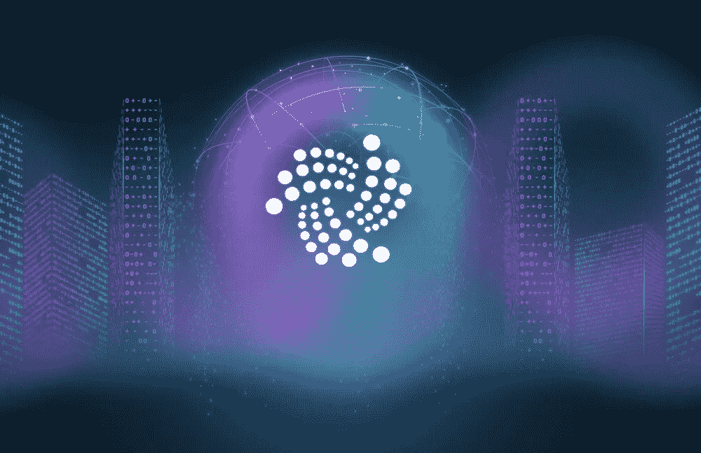

# 了解 Iota、Tangle 和 Qubic

> 原文：<https://medium.com/coinmonks/learn-about-iota-tangle-and-qubic-923f55c6277b?source=collection_archive---------5----------------------->

## Coinmonks 策划的关于 IOTA 的最佳文章，了解 Iota、Tangle 和 Iota 的智能合约平台 Qubic💻

[Source](https://modum.io/modum-token-sale-to-accept-iota-tokens/)

[***捐造僧***](/coinmonks/monks-need-your-help-7440418d67ec)

IOTA 是为互联设备世界而全新设计的。有了这项技术，Iota 开始通过以保持数据完整性的方式传输数据并提供参与免费微交易的方式来形成新的分布式经济。以前没有免费价值转移的分布式手段。(摘自 Iota 文档)。

*   [**IOTA 经历过真正的白痴**](/coinmonks/iota-experienced-as-a-real-idiot-ec72e872f753)

帕特里克·威斯👇

 [## 我经历了一个真正的白痴

### 为真正的白痴解释的 CAP 定理

medium.com](/coinmonks/iota-experienced-as-a-real-idiot-ec72e872f753) 

*   [**缩放一个区块链 vs 缩放一个纠结**](/coinmonks/scaling-a-blockchain-vs-scaling-a-tangle-8b7182eda980)

由[利奥尔·亚菲](https://medium.com/u/a412a9352e7?source=post_page-----923f55c6277b--------------------------------)👇

 [## 扩展区块链与扩展纠纷

### 指出 DAG 可扩展性中可能存在的弱点

medium.com](/coinmonks/scaling-a-blockchain-vs-scaling-a-tangle-8b7182eda980) 

*   [**什么是“问”从一个门外汉……**](/coinmonks/what-is-q-from-a-laymen-given-barney-style-6387b18267d2)

作者:詹姆斯·JD·萨顿👇

 [## 一个门外汉的“Q”是什么…

### 有点长，但我认为它可能有助于人们了解 Qubic 一点。

medium.com](/coinmonks/what-is-q-from-a-laymen-given-barney-style-6387b18267d2) 

*   [**纠结——物联网与 Web 3.0 的缺失环节**](/coinmonks/tangle-the-missing-link-for-iot-and-web-3-0-6519f22ebc81)

由[甘地](https://medium.com/u/8f4e7f7a57e3?source=post_page-----923f55c6277b--------------------------------)👇

 [## 纠结——物联网和 Web 3.0 的缺失环节

### 要理解什么是 Tangle，为什么我们需要它，我们需要事先知道两个概念。它们是分布式分类帐…

medium.com](/coinmonks/tangle-the-missing-link-for-iot-and-web-3-0-6519f22ebc81) 

*   [**IOTA:在能量转换中更全面**](/coinmonks/iota-allrounder-in-the-energy-transition-a53232e9fa55)

由[马库斯](https://medium.com/u/8c1b2d199ba1?source=post_page-----923f55c6277b--------------------------------)👇

 [## IOTA:全面的能源转换

### 2016 年 11 月生效的《巴黎气候变化协定》本质上是一个针对气候变化的协定

medium.com](/coinmonks/iota-allrounder-in-the-energy-transition-a53232e9fa55) 

*   [**Qubic:基于群体的计算——由 IOTA Part 提供支持——1**](/coinmonks/qubic-quorum-based-computations-powered-by-iota-3770fbd62341)

由 [Zass](https://medium.com/u/c5b78e27b6c8?source=post_page-----923f55c6277b--------------------------------) 👇

 [## Qubic:基于群体的计算——由 IOTA 提供支持第 1 部分

### 第一部分-导言

medium.com](/coinmonks/qubic-quorum-based-computations-powered-by-iota-3770fbd62341) 

*   [**区块链、IOTA、Tangle&DAG——围绕这些的新风口到底是什么？**](/coinmonks/blockchain-iota-tangle-dag-what-exactly-is-the-new-buzz-around-these-915e3ef9e7bb)

由 [Shefali Deshwali](https://medium.com/u/d3e28ab9b346?source=post_page-----923f55c6277b--------------------------------) 👇

 [## 区块链、IOTA、Tangle & DAG——围绕这些的新热门到底是什么？

### 区块链——比特币背后的技术对这个世界来说不再陌生。拥有制造…的品质

medium.com](/coinmonks/blockchain-iota-tangle-dag-what-exactly-is-the-new-buzz-around-these-915e3ef9e7bb) 

> *如果你喜欢这些故事，你可以给👏给这些了不起的作家、学习者和制作者，与我们分享这些教育故事，别忘了关注我们的 Coinmonks 出版物。请告诉我们您想了解区块链领域的哪些内容。😃*

**Click to read more stories on IOTA**