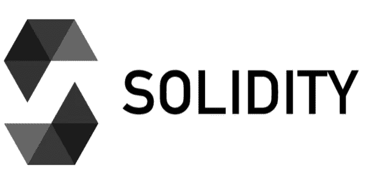

# 了解所有关于固体以太坊的信息

> 原文：<https://medium.com/coinmonks/learn-all-about-solidity-ethereum-45d709c4de77?source=collection_archive---------3----------------------->



Source : [https://en.bitcoinwiki.org/wiki/Solidity](https://en.bitcoinwiki.org/wiki/Solidity)

**什么是扎实？**

Solidity 是一种面向契约的高级编程语言，用于实现智能契约。Solidity 是针对以太坊虚拟机设计的。

稳固性===智能合约。

Solidity 的代码封装在契约中。契约是以太坊应用程序的基本构建块——所有变量和函数都属于一个契约，这将是你所有项目的起点。

```
pragma solidity >=0.5.0 <0.6.0;contract HelloWorld {}
```

在上面的代码中，我们提供的版本考虑到我们的代码兼容任何版本 b/w 0.5 到 0.6。我们还创建了一个名为“HelloWorld”的合同

在线 IDE ~混音【www.remix.ethereum.org 

**状态变量和整数**

状态变量永久存储在契约存储中。这意味着它们被写入以太坊区块链。把它们想象成给 DB 写信。

```
contract Example {// This will be stored permanently in the blockchain uint myUnsignedInteger = 100;
   string name = "vivek"}
```

Uint 数据类型是无符号整数。它应该是非负的。

**数据类型**

*值类型:*

布尔值(真/假)、整数(int / uint)、地址(以太坊地址的大小)、字符串、枚举

*参考类型:*

数组，结构，映射

**数学运算**

```
Addition: x + ySubtraction: x — y,Multiplication: x * yDivision: x / yModulus / remainder: x % y (for example, 13 % 5 is 3, because if you divide 5 into 13, 3 is the remainder)Exponential Operationuint x = 5 ** 2; // equal to 5² = 25
```

**结构**

类似于 C 编程语言中的 struct。当我们需要创建具有多个属性的复杂数据类型时，我们使用结构。

```
struct Person { uint age; string name;}
```

**数组**

数据的集合称为数组。两种类型:固定数组和动态数组。

顾名思义，固定数组有预定义的大小，而动态数组没有大小。

```
// Array with a fixed length of 2 elements:uint[2] fixedArray;// another fixed Array, can contain 5 strings:string[5] stringArray;// a dynamic Array — has no fixed size, can keep growing:uint[] dynamicArray;
```

您可以组合结构和数组。创建一个结构，然后拥有一个结构数组。就像在面向对象的范例中拥有一个对象和一个对象数组一样(比如 Java)。

```
pragma solidity >=0.5.0 <0.6.0;contract StudentFactory { struct student {
      string name;
      uint roll;
   } student[] public students; // creates an array named students of student type objects}
```

**功能声明**

```
function eatHamburgers(string memory _name, uint _amount) public {}
```

该函数的可见性是公共的。有两种方法可以将参数传递给可靠性函数:

按值和按引用

```
eatHamburgers(“vitalik”, 100);
```

**私人/公共活动**

在 Solidity 中，函数默认是公共的，所以任何人都可以在网络中调用公共函数。然而为了安全起见，我们将函数设为私有，这样只有所有者才能调用该函数。

```
function _eatHamburgers(string memory _name, uint _amount) private {}
```

按照惯例，私有函数的名字以下划线开头。

**内部/外部关键字-**

另外两种类型的*函数可见性*。Internal 类似于 private，除了它可以被继承的契约(即继承)访问。

外部类似于公共。所有的合同都可以调用这个函数，除了声明这个函数的联系人。

**返回功能**

函数声明包含返回值的类型。

```
function sayHi() public *view/pure* returns (string memory) {return “Hi”;}
```

**功能可以标记为纯/视图**。当您甚至不访问传递的数据时，您将您的函数标记为纯函数。如果函数不修改数据，只查看数据，那么它被标记为 view。

**型铸造**

数据类型之间的转换称为类型转换。

```
uint8 a = 5;uint b = 6;// line below throws an error because a*b returns a uint, not uint8:uint8 c = a * b;// we have to typecast b as a uint8 to make it work:uint8 c = a * uint8(b);
```

**事件**

事件用于向前端传达在后端区块链网络上发生了一些事情。

```
// declare the eventevent NotifyOnFrontend(uint x);function add(uint _x, uint _y) public returns (uint) { uint result = _x + _y;
//fire an event to let the frontend know the function was called
  emit NotifyOnFrontend(result);
  return result;}
```

您的前端代码应该安装了 web3，并且应该监听“NotifyOnFrontend”事件，这样才能工作。您的 JavaScript 框架或普通 JS 必须侦听该事件才能接收它:

```
YourContract.NotifyOnFrontend(function(error, result) {// do something with result})
```

**映射**

这是存储有组织数据的另一种方式，如数组和结构

```
mapping (address => uint) public accountBalance;
```

这是一个关键值商店。address 是键，accountBalance 是值。

这可用于在区块链存储多个对象(数据)。检查以下示例:

示例:

```
contract Example {
    struct UserInfo {
        unit age;
        string dob;
    }
    mapping(string => UserInfo) allusers;

    function setUserInfo(string _name, uint _age, string _dob) public {
        allusers[_name].age = _age;
        allusers[_name].dob = _dob;
    } function getUserInfo(string _name) public view returns(uint, string) {
       return (allusers[_name].age, allusers[_name].dob);
   }
}
```

现在 if 可以用不同的值多次调用 setUserInfo，比如:

```
setuserInfo("Vivek",26, 25/05/1995)
setuserInfo("Supu", 23, 01/09/1998)
```

要获得这些值，只需传递名称:

```
getUserInfo("Vivek"); // 26 25/05/1995
getuserInfo("Supu"); //  24 01/09/1998
```

**全局变量**

这些变量可用于 msg.sender 等所有函数。你写的任何一个 Solidity 程序，都应该被一个所有者调用。发件人的地址存储在 msg.sender 全局变量中。

**要求**

Requires 用于验证这两个语句，并在此基础上做出决策。如果条件为真，则代码成功运行，否则将引发错误

```
function sayHi(string memory _name) public returns (string memory) { /**Compares if _name equals “Vivek” Throws an error and exits if not true. Solidity doesn’t have native string comparison, so we
compare their keccak256 hashes to see if the strings are equaq **/ require(keccak256(abi.encodePacked(_name)) ==   keccak256(abi.encodePacked(“Vivek”))); // If it’s true, proceed with the function: return “Hi!”;}sayHi(“Vivek”) // executes successfullysayHi(“Supu”) // throws an error
```

因此，require 对于在运行函数之前验证某些条件必须为真非常有用。

**继承**

有时，将代码逻辑拆分成多个契约来组织代码是有意义的，而不是制定一个非常长的契约。

```
contract Animal { function catchphrase() public returns (string memory) { return “Animal”; }}contract Cat is Animal { function anotherCatchphrase() public returns (string memory) { return “Cat is an Animal”;}}
```

**导入**

将代码拆分成多个文件，并使用 import 来使用另一个文件中的功能。

这通常是你在 Solidity 项目中处理长代码库的方式。

**存储与内存**

存储是指永久存储在区块链上的变量。内存变量是临时的，在契约的外部函数调用之间会被擦除。把它想象成你电脑的硬盘和内存。

**与区块链网络中的其他合约交互**

我将在另一篇文章中讨论这个问题。然而现在，保持简短:

为了与其他契约交互，我们声明了一个类似 object 的接口。我们创建一个契约，并在其中声明一个函数，我们希望从另一个契约中调用/使用该函数。功能只是骨架，它不包含身体。

```
contract GetNumber { function getNum(uint _num) public returns(uint){ return _num;}
```

假设有一个合同，我们想使用上面的 getNum 函数。为此，我们将在项目中创建一个契约，并声明一个 getNum 函数框架(没有函数体)。

```
contract NumberInterface { function getNum(uint _num) public returns(uint);}
```

现在我们可以从 NumberInterface contract 调用 getNum 函数。

在您将合同部署到以太坊后，它将成为不可变的，即不能被修改。您部署到合同中的初始代码将永久地留在区块链上。这就是安全性在可靠性中如此重要的原因之一。如果你的合同代码有缺陷，你以后就没办法修补了。您必须告诉您的用户开始使用一个不同的智能合同地址，该地址具有修复功能。

**功能修饰符**

函数修饰符看起来就像一个函数，但是使用关键字修饰符而不是关键字函数。这些用于特殊情况，比如当你只希望你的主人做某件事，而不是所有人。

这有助于更新 DApp 的关键部分，同时防止其他用户干扰我们的合同。我处理过的一个用例是——当我们想在执行任何用例之前验证一个语句时。

**气**

用户支付燃气费来运行以太网上的合同。气体是以以太(以太币)为单位计算的。您的功能的总气体成本等于其所有单个操作的气体成本的总和。

**关于存储的更多信息**

存储内存被永久写入区块链。永远！世界上成千上万的节点需要将这些数据存储在它们的硬盘上，并且随着区块链的增长，这些数据量也在不断增长。所以这样做是有成本的。

为了降低成本，除非绝对必要，否则应该避免将数据写入存储。有时这涉及到看似低效的编程逻辑——比如每次调用函数时在内存中重建一个数组，而不是简单地将该数组保存在全局存储变量中以便快速查找。
因此，建议尽可能使用存储器类型，这样数据不会永久存储，从而节省成本。是的，循环在可靠性上比使用存储更便宜。因此，尽可能使用带有 for 循环的内存。这与 Java、Python 等语言完全相反，因为 for 循环的计算成本更高。

**为循环**

语法类似于 Javascript。

```
for (uint i = 1; i <= 10; i++) {
 // body
}
```

**应付款修改量**

可支付功能是使 Solidity 和 Ethereum 如此酷的一部分——它们是一种可以接收以太的特殊类型的功能。让那件事过去一分钟。当你在一个普通的 web 服务器上调用一个 API 函数时，你不能随你的函数调用发送美元——也不能发送比特币。

但是在以太坊中，因为钱(以太)、数据(交易负载)和合同代码本身都存在于以太坊中，所以你可以调用一个函数，同时向合同付款。

这考虑到了一些非常有趣的逻辑，比如为了执行一个功能，需要向合同支付一定的费用。

**注:**

在以太坊中，当你调用一个契约上的函数时，你把它作为一个事务广播给网络上的一个或多个节点。然后，网络上的节点收集一堆事务，试图成为第一个解决计算密集型数学问题的“工作证明”，然后将该组事务及其工作证明(PoW)作为一个块发布给网络的其余部分。

**代币**

因此，令牌基本上只是一个记录谁拥有多少令牌的合同，以及一些功能，以便这些用户可以将他们的令牌转移到其他地址。

**断言并要求差异**

assert 类似于 require，如果为 false，它将抛出一个错误。assert 和 require 的区别在于，require 会在某个功能失败时退还用户剩余的汽油费，而 assert 不会。

**元掩码**

这是 Chrome 和 Firefox 的浏览器扩展，允许用户安全地管理他们的以太坊帐户和私钥，并使用这些帐户与使用 Web3.js 的网站进行交互

**应用二进制接口**。

在你部署你的合同后，它会在以太坊上获得一个固定的地址，在那里它将永远存在。在以太坊网络中部署智能合约之后，还会生成一个 ABI。基本上，它是 JSON 格式的契约方法的表示，告诉 Web3.js 如何以契约可以理解的方式格式化函数调用。

**Web3Js**

以太网的 JS 前端库被称为 web3.js

[](https://github.com/ChainSafe/web3.js) [## GitHub — ChainSafe/web3.js:以太坊 JavaScript API

### 以太坊 JavaScript API。在 GitHub 上创建一个帐户，为 ChainSafe/web3.js 的开发做出贡献。

github.com](https://github.com/ChainSafe/web3.js) 

**参考文献:**

[](https://betterprogramming.pub/a-quick-guide-to-basic-solidity-for-developers-8cf17d327fe4) [## 开发人员基本可靠性快速指南

### 让我们开始了解以太坊智能合约

better 编程. pub](https://betterprogramming.pub/a-quick-guide-to-basic-solidity-for-developers-8cf17d327fe4) [](https://cryptozombies.io/en/course) [## #1 Solidity 教程&以太坊区块链编程课程| CryptoZombies

### CryptoZombies 是最受欢迎的交互式 Solidity 教程，它将帮助您学习区块链编程…

cryptozombies.io](https://cryptozombies.io/en/course) 

**结论**

希望这有助于学习 Solidity 编程的基础知识。请点击下面的按钮，所有的掌声都非常感谢。快乐学习。干杯！

> 加入 Coinmonks [电报频道](https://t.me/coincodecap)和 [Youtube 频道](https://www.youtube.com/c/coinmonks/videos)了解加密交易和投资

## 另外，阅读

*   [加拿大最好的加密交易机器人](https://blog.coincodecap.com/5-best-crypto-trading-bots-in-canada) | [赌注加密](https://blog.coincodecap.com/staking-crypto)
*   [如何在印度购买比特币？](/coinmonks/buy-bitcoin-in-india-feb50ddfef94) | [瓦济克斯评论](/coinmonks/wazirx-review-5c811b074f5b)
*   [最佳网上赌场](https://blog.coincodecap.com/best-online-casinos) | [硬件钱包](/coinmonks/hardware-wallets-dfa1211730c6)
*   [如何在 WazirX 上购买柴犬(SHIB)币？](https://blog.coincodecap.com/buy-shiba-wazirx)
*   [比特币主根](https://blog.coincodecap.com/bitcoin-taproot) | [排名前 6 的比特币信用卡](/coinmonks/bitcoin-credit-card-bc8ab6f377c6)
*   [最佳免费加密信号](https://blog.coincodecap.com/free-crypto-signals) | [YoBit 评论](/coinmonks/yobit-review-175464162c62) | [Bitbns 评论](/coinmonks/bitbns-review-38256a07e161)
*   [霍比的加密交易信号](https://blog.coincodecap.com/huobi-crypto-trading-signals) | [BitMEX 评论](https://blog.coincodecap.com/bitmex-review)
*   [7 个最佳零费用加密交易平台](https://blog.coincodecap.com/zero-fee-crypto-exchanges)
*   [分散交易所](https://blog.coincodecap.com/what-are-decentralized-exchanges) | [比特 FIP](https://blog.coincodecap.com/bitbns-fip) | [Pionex 评论](https://blog.coincodecap.com/pionex-review-exchange-with-crypto-trading-bot)
*   [用信用卡购买密码的 10 个最佳地点](https://blog.coincodecap.com/buy-crypto-with-credit-card)
*   [OKEx 审查](/coinmonks/okex-review-6b369304110f) | [Kucoin 交易机器人](/coinmonks/kucoin-trading-bot-automate-your-trades-8cf0ca2138e0) | [期货交易机器人](/coinmonks/futures-trading-bots-5a282ccee3f5)
*   [AscendEx Staking](https://blog.coincodecap.com/ascendex-staking)|[Bot Ocean Review](https://blog.coincodecap.com/bot-ocean-review)|[最佳比特币钱包](https://blog.coincodecap.com/bitcoin-wallets-india)
*   [霍比审核](https://blog.coincodecap.com/huobi-review) | [OKEx 保证金交易](https://blog.coincodecap.com/okex-margin-trading) | [期货交易](https://blog.coincodecap.com/futures-trading)
*   [Godex.io 审核](/coinmonks/godex-io-review-7366086519fb) | [邀请审核](/coinmonks/invity-review-70f3030c0502) | [BitForex 审核](https://blog.coincodecap.com/bitforex-review)
*   [Crypto.com 费用](/coinmonks/binance-fees-8588ec17965) | [僵尸加密审查](/coinmonks/botcrypto-review-2021-build-your-own-trading-bot-coincodecap-6b8332d736c7) | [替代品](https://blog.coincodecap.com/crypto-com-alternatives)
*   [有哪些交易信号？](https://blog.coincodecap.com/trading-signal) | [Bitstamp vs 比特币基地](https://blog.coincodecap.com/bitstamp-coinbase) | [买索拉纳](https://blog.coincodecap.com/buy-solana)
*   [ProfitFarmers 回顾](https://blog.coincodecap.com/profitfarmers-review) | [如何使用 Cornix Trading Bot](https://blog.coincodecap.com/cornix-trading-bot)
*   [MXC 交易所评论](/coinmonks/mxc-exchange-review-3af0ec1cba8c) | [Pionex vs 币安](https://blog.coincodecap.com/pionex-vs-binance) | [Pionex 套利机器人](https://blog.coincodecap.com/pionex-arbitrage-bot)
*   [我的密码交易经验](/coinmonks/my-experience-with-crypto-copy-trading-d6feb2ce3ac5) | [比特币基地评论](/coinmonks/coinbase-review-6ef4e0f56064)
*   [CoinFLEX 评论](https://blog.coincodecap.com/coinflex-review) | [AEX 交易所评论](https://blog.coincodecap.com/aex-exchange-review) | [UPbit 评论](https://blog.coincodecap.com/upbit-review)
*   [AscendEx 保证金交易](https://blog.coincodecap.com/ascendex-margin-trading) | [Bitfinex 赌注](https://blog.coincodecap.com/bitfinex-staking) | [bitFlyer 评论](https://blog.coincodecap.com/bitflyer-review)