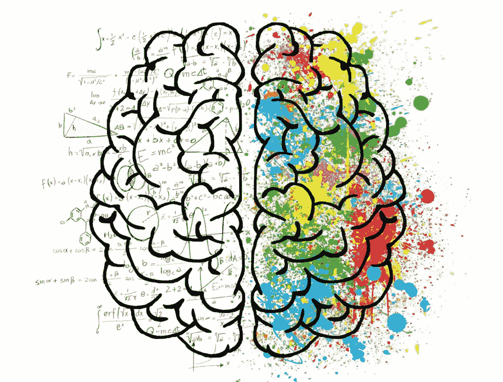
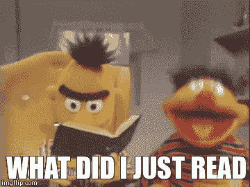
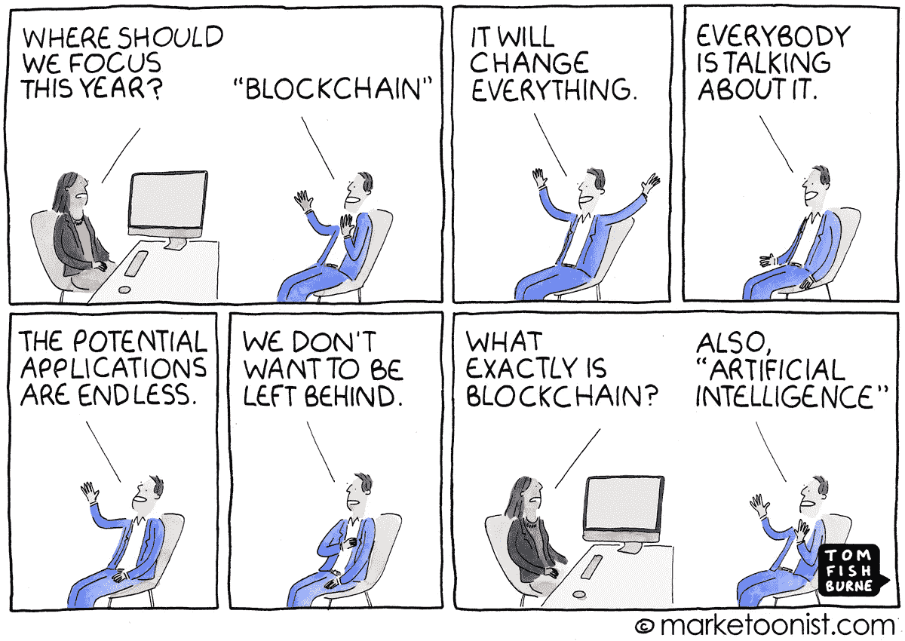
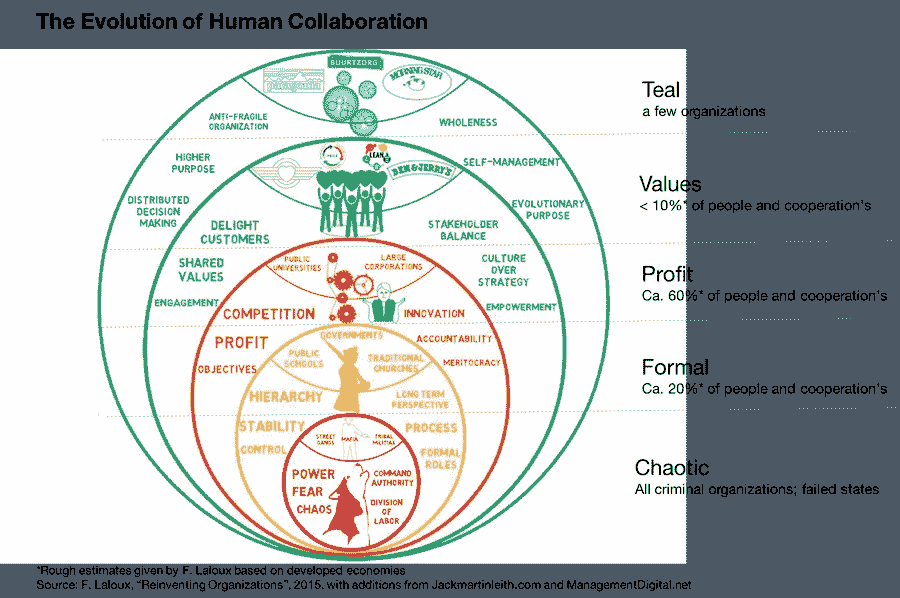

# 通过构建一个糟糕的应用来学习区块链

> 原文：<https://medium.com/coinmonks/learn-blockchain-by-building-a-bad-application-of-it-930b312d2aa8?source=collection_archive---------10----------------------->

为了了解不可替换令牌(NFT)是如何工作的，我决定为它们构建一个用例。我记录了评估区块链和使用 NFTs 是否有助于解决问题的策略和考虑事项，如果有，主要的协议和网络要求是什么。

正当我要解决一个真正的问题，并为人类的进步做出贡献时，一阵拖延症占据了我的心头，这就是我要说的:

> ExamChain:面向教育的区块链解决方案

将试卷标记以解决教育中的抄袭问题。



复制/粘贴直接抄袭很容易，但马赛克式抄袭的艺术，拼凑多个来源，用自己的话重写别人的作品，而不加参考，可能与提出原创想法一样要求严格。

> 没有激励学生为同学的考试论文投稿，也没有奖励投稿同时保护来源隐私的制度。



我提出了一个将试卷贡献标记化的解决方案，其基础是在公共区块链(一个令牌=一个字符)上拍卖不可替代的令牌(NFT ),从而创造数字稀缺性，并通过基于考试结果的智能合约回购溢价，激励同学们为起草试卷做出贡献。

这种解决方案促进了利他的利己主义和协作。懒惰的学生利用好学生的知识，不用学习就能通过考试。好学生利用他们的专业知识，并因帮助同龄人通过考试而获得奖励。

> 为了抓住区块链对人类的变革潜力，我们需要完全开放地考虑新的社会结构和价值观。

这篇文章是测试这种开放性的延伸。这个想法可能很傻，但我希望有人发现这个推理在另一种情况下是有用的。

# 区块链测试

> **我们真的需要一个区块链来解决这个问题吗？**这是第一次测试。许多区块链思想应该(但不应该)在这里消亡。

区块链不是万能的。考虑到这一点，我决定完全跳过这一步，以便利用当前的宣传和融资机会。

其他解决方案可能更好地服务于这个目的，但是如果我只是忽略它们并专注于一个区块链应用程序，我将有足够的论据来进行一场好的关于什么的辩论。



**区块链呢？**具体针对此用例:

*   **自动化**:引用原始内容是一个容易出错的手动过程。自动化原始内容下游的引用(引用和剽窃)将创建更好的知识树和全新的价值转移模型(例如，想象一下未来所有导致发明或知识产权的知识都拥有该权利主张的部分(标记化)权利)。学术论文和考试论文都是基于可预测和可重复的过程，这将从自动化中受益。
*   **正在进行的过程和循环包括** : *1)循环闭环:*写试卷的过程在一门学习课程中重复多次。 *2)参考链:*论文中表达的想法可以作为未来工作的基础(伟大的发明或白皮书导致 ICO 和原始想法的货币化)。
*   **多个利益相关者**包括 1) ***内容的作者*** (同学、领域专家)，2) ***学生*** 找人写论文，3) ***投资者*** ，可以通过购买 NFT 的作品作为作者池中的 ACSII32 空白处，甚至是代币上的 HODL(如果他们认为所产生的想法可能导致未来的发明)，来参与成功考试的好处。
*   **数据核对**:考试评分员、科学界和专利局核实提交的申请，以评估创意的原创性，并识别抄袭/先前的主张。这很难，因为作者试图隐藏它。最终，发明可能会追溯到导致它的所有原始想法，并对作者身份保密，因此每个人都有动力在项目中引用他们的原始想法。
*   **价值转移**:1 个代币的**内在价值**为= 1 个字符。数字稀缺性以期望字数为上限，**货币价值**取决于预期结果:爱因斯坦出售一个尚未写出的想法中的空白 NFT 的价格高于没有参考文献的 100% NFT 拍卖。拥有一份相对论或对相对论有贡献的证据的自我价值。
*   **审计追踪和不变性价值**:在初级水平上，原创性的证明需要一个不可变的记录来跟踪原创想法的原创性。像任何物理到数字的 DLT 应用一样，双重记账(在不同的链上为相同的资产发行令牌)的问题依赖于所提出的解决方案的广泛采用。不变性是解决重复支出问题的根本。


# 关键协议要求

该解决方案位于应用层。用例提供了关于协议和网络需求的清晰性，例如，我在什么区块链协议上构建这个应用程序。一些关键要求是:

1.  能够**生成、主持**和**交换**可替代的和**不可替代的代币**，这些代币结合了:1) **效用**(对特定字符、单词和短语的权利)，以及 2) **价值存储**(如果内容被认为是革命性的，具有潜在的未来价值或成为可收藏的，则价值可能上升)或者如果内容被认为没有价值或考试失败，则价值可能为零；
2.  **拍卖不可替代代币的能力**。每个学生可能会或可能不会透露他的身份，其他贡献者的身份，过去的记录或未来的期望，每个代币的价值可能是不同的；
3.  识别和证明**作者身份**和**所有权**同时**保护隐私**的能力；投稿人可能希望投稿，但保持匿名，获得报酬，并在将来可以选择证明作者身份。
4.  运行智能合同的能力；除了管理类似于 Cryptokitties 和 Decentraland 使用的 NFT 代币之外，还需要以下智能合约逻辑:在 genesis，每个 NFT 都被分配一个回购期权，如果(NFT 代币持有者)要求，该期权将根据考试通过/失败布尔数或与授予的分数成比例，执行 NFT 与可替换代币的交换。


# 神谕问题

所有这些都可以在公共区块链上完成，例如带有 ERC721 NFT 和 ERC20 令牌的以太坊，以便利用广泛的网络、用户和开发者基础。

然而，这就产生了预言问题:谁能给试卷打分/谁是考试成绩的权威？可能的解决方案包括对可信实体或具有权威共识机制证明的许可区块链的链外依赖。

整合要求取决于这一选择，但假设我们仍然在以太坊上，并建立一个可信的实体，该实体还将管理一个类似于维基百科的侧链或链外平台，在该平台上可以向 NFTs 支持的试卷提供文本。

# 令牌组学

NFT 最初是由希望通过下注 1xERC20 token +回购奖励来标记其试卷的学生获得的。然后拍卖。如果 NFT 持有者不行使回购期权，则押记的 ERC20 代币将被收回，或者根据智能合约逻辑进行分配。

ERC20 代币最初可能被空投到 kickstart 市场，然后可以通过以太网购买或通过 NFT 回购期权获得。

重点是保持大部分非链条交通，以最大限度地减少拥堵和降低天然气成本，主要依靠主链条来证明所有权和作者身份。

在一个分散的网络中，内容监管是困难的，如果 NFT 价值被认为太低，以至于不能激励好的作品(通过考试),嘲弄和乱码贡献是可能的，但是一个市场可能会出现一种基于声誉的方法，该方法基于同一作者所做的其他贡献的可见性，作为评估价值的度量。

NFT 的市场价格将是(a)回购回报，(b)所生产作品的感知价值的一个因素，受跟踪记录、参考资料等和稀缺性的影响。

我没有详细说明在考试提交的背景下可能不合适的许多可能性，例如，可能不喜欢提交的内容并可能倾向于给低分的评分者如何通过匿名参加 blankspace NFT 拍卖来消除这种认知偏见。这将使每个人的兴趣与学生获得证书的目标一致。

# 结论

虽然提出一个促进剽窃和腐败的应用程序似乎有些牵强，但我这样做是因为:

1.  直到你完全开放地考虑新的社会结构和价值观(我知道，我在上面说过，但我喜欢它)，你才能真正理解区块链对人类的变革潜力。即使是非常愚蠢的人也可能藏着一颗珍珠。今天抄袭是不对的，没有感恩之心的偷窃。但是，将用例转移到艺术(购买毕加索的白色画布令牌)或应用于研究，更好地参考和追溯想法的来源，以奖励所有导致突破的投入，将促进科学研究方面的更好合作；和
2.  我对区块链的潜力感到眼花缭乱，但对许多项目将良好的用例与糟糕的区块链战略相结合，或者用区块链来筹集资金的徒劳解决方案感到沮丧，所以我想采取逆向方法:将荒谬的用例与区块链战略相结合，以解决愚蠢的问题。



# 投资机会？

导致这项研究的思考并没有结束，并不是所有的问题都解决了。您可以购买 NFT，这些 NFT 允许您对该主题的白皮书做出贡献，回购和持有参数将在您的令牌允许您做出贡献的白皮书中进行很好的解释。

```
Send ETH to: 0x94153b7863a6eE2891D1c12B584840ED4D819222
```


如果你想读一篇关于使用非功能性令牌的好的概述，我建议你看一下 [@philglazer](http://twitter.com/philglazer) 的[关于不可替代令牌的概述](https://hackernoon.com/an-overview-of-non-fungible-tokens-5f140c32a70a)。

而对于更现实的区块链和教育例子，可以看看 [@heyfebin](http://twitter.com/heyfebin) 的 nice [writeup](https://hackernoon.com/what-happens-when-you-combine-blockchain-and-education-d533ef6d4862) 。

# 最重要的部分:

我的幽默感很枯燥，甚至有时我都很难弄清楚我是否是认真的。所以万一你想知道:**请不要送我 ETH** (除非是礼物，我的生日快到了)。

如果有人要寄信，那应该是我，给你，因为你已经读到这里。谢谢大家！