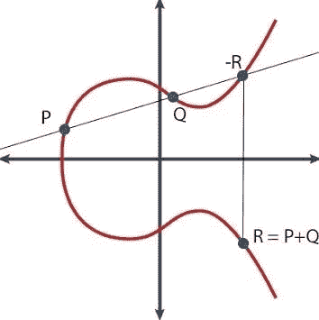

# 了解如何编写椭圆曲线密码

> 原文：<https://medium.com/coinmonks/learn-how-to-code-elliptic-curve-cryptography-a952dfdc20ab?source=collection_archive---------0----------------------->

## 本文介绍了对椭圆曲线密码的理解和编码。


[https://amyxinternetofthings.com/2017/09/14/quantum-computing-series-cryptography/](https://amyxinternetofthings.com/2017/09/14/quantum-computing-series-cryptography/)

在我上一篇关于如何[构建一个简单的区块链](/coinmonks/build-a-simple-blockchain-fe7ee48090d9)的文章中，我写了区块链技术的终极基础，并给了你一个如何在你的平台上构建一个简单区块链的逐步指南。现在我想向大家展示加密货币和区块链的密码学部分。因为你可能从上次就开始使用，我们从一点点理论开始，然后直接进入编程。我们走吧！

## 介绍

因为你们中的大多数人可能都有自己的加密资产，所以你们可能听说过“公钥”和“私钥”这两个词。在区块链网络中，公钥相当于你的地址。如果网络中的其他任何人想要向您发送一些资金，他或她会将资金发送到您的公钥。你的私钥可以被视为你的签名——每当你想进行资金交易时，你就证明你是拥有属于你的公钥的私钥的人，而无需向网络中的任何人展示。检查你的交易的网络参与者可以用你的公钥证明你是私钥的所有者，甚至不知道它是什么。相当酷！但是这在更基本的层面上是如何工作的呢？让我们稍微研究一下这个理论。

## 椭圆曲线加密

在这一部分，我将给你一个非常简短的介绍，关于所使用的加密系统背后的魔力。因为它背后的数学非常复杂，没有必要理解它的每一个方面。主要在区块链网络中使用的加密系统是基于椭圆曲线的数学。但是这样的椭圆曲线实际上是什么呢？用数学术语来写，它是满足方程的所有点(x，y)的集合

> y = x +ax + b

这样的曲线可能看起来像这样，例如:


How an elliptic curve might look like. Source: [https://www.google.de/search?q=elliptic+curve&source=lnms&tbm=isch&sa=X&ved=0ahUKEwjwzrey_NDdAhXJIsAKHRR6CiEQ_AUICigB&biw=1363&bih=601#imgrc=jFTvyQoRaPIAfM](https://www.google.de/search?q=elliptic+curve&source=lnms&tbm=isch&sa=X&ved=0ahUKEwjwzrey_NDdAhXJIsAKHRR6CiEQ_AUICigB&biw=1363&bih=601#imgrc=jFTvyQoRaPIAfM):

如果你在这条曲线上取一个任意点 P = (x，y)并把它加到曲线上的另一个点 Q 上，你将再次得到位于这条椭圆曲线上的一个点。下图显示了这一点的添加。



Visualization of points on an elliptic curve. Source: [https://www.google.de/search?q=elliptic+curve+cryptography&source=lnms&tbm=isch&sa=X&ved=0ahUKEwi2lbW9iNHdAhUM2BoKHX3bAngQ_AUICigB&biw=1363&bih=239#imgrc=NSETzS5aoM6peM](https://www.google.de/search?q=elliptic+curve+cryptography&source=lnms&tbm=isch&sa=X&ved=0ahUKEwi2lbW9iNHdAhUM2BoKHX3bAngQ_AUICigB&biw=1363&bih=239#imgrc=NSETzS5aoM6peM):

您也可以选择曲线上的某个点 P，并将其自身增加 x 倍——您仍然会得到位于椭圆曲线上的一个点。

> P+P+…+P = xP = R

在这种情况下，x 只是一个任意的自然数。在椭圆曲线加密中，人们利用这样一个事实，即仅通过已知点 P 和 r 来计算数 x 在计算上是不可行的。这通常被描述为求解离散对数的问题。对于密码学，在椭圆曲线上选择一个适当的点 P 产生一个足够大的随机自然数 x，这个数称为私钥。利用选定的点 P 和私钥，计算曲线上的点 R，然后将其定义为公钥。所以公钥和私钥是紧密相连的！没有私钥，公钥是不存在的，只有知道公钥，由于离散对数问题，几乎不可能确定私钥。

使用这种方法，可以“签名”任何想要的消息。设 *M* 为任意消息， *pub* 为公钥， *priv* 为发送方的私钥。然后根据两个参数 *M* 和 *priv* 计算签名:

> 签名=符号(M，priv)

在上式中，函数 *Sign()* 生成签名。任何收到消息 *M* 的人都可以验证签名——证明发送者的公钥确实也持有私钥:

> Verify = Ver(签名，M，发布)

为了验证，接收方只需要签名本身、消息和发送方的公钥。这就是椭圆曲线加密的基本工作原理，无需深入理论。现在让我们做一些编码！

## 编码密码术

在 python 中，上述方法可以使用库 *fastecdsa 来实现。*然而，还有更多用于椭圆曲线加密的库。首先，您需要在您的终端中使用
' *pip install'* 命令将它安装到您的计算机上。

```
pip install fastecdsa
```

安装后，我们可以打开我们的 python IDE 并开始编码。

```
from fastecdsa import keys, curve,ecdsa
priv_key, pub_key = keys.gen_keypair(curve.P256) 
print(priv_key)
print(pub_key)
```

首先我们从 *fastecdsa* 库中导入一些类。类 *keys* 包含一个使用椭圆曲线数学生成密钥对的函数。类别*曲线*包含许多不同的椭圆曲线，您可以从中选择一条来生成您的密钥。类 *ecdsa* 稍后用于生成和验证签名。在第二行中，使用曲线 P256 生成一对公钥和私钥。之后，我们打印私钥和公钥。私钥的结果应该如下所示:

> 20053020608649230331723442089943129241597707800309205888496491961204729412316

你看，私钥是一个非常大的数字，有很多位数！让我们来看看公钥是什么样子的:

> x:0 xf 8781 fc 1967637 b 0 Fe 3 e 43 CBD 750051672 fad 09d 0 FD 8 f 18d 49 ed 1 f 84 ebb 5c 9
> Y:0 x26 a 617 F3 fc 7 B1 c 34 BF 00 b 21445201299 f 9730 BC 7838994751 EAD 5 ddff 511 c 622
> (在曲线上< P256 【T30

如您所见，公钥是曲线 P256 上的点的 x 坐标和 y 坐标的组合。完美！让我们继续为一些消息生成和验证签名。只需将下面几行代码添加到上面的代码中:

```
message = ‘I am a message’
(r,s) = ecdsa.sign(message,priv_key)
print((r,s))
```

我们将一些字符串定义为消息，然后使用导入的类 *ecdsa* 生成签名 *(r，s)* 。之后，我们打印它，应该会得到类似下面的内容:

> (50517963046740693636358980032162772006533914957769092229968951281723335924730, 24429916358942402334243425477548564776488638570074379964228780478761347218109)

现在我们可以继续验证这个签名。同样，只需添加以下代码行:

```
valid = ecdsa.verify((r,s),message,pub_key)
print(valid)
```

我们再次使用 *ecdsa* 类，并从中调用函数 *verify()* ，这依赖于三个参数签名、消息和生成消息的公钥。之后，我们打印变量 *valid* ，如果一切顺利的话，它会给出如下输出:

> 真实的

恭喜你！您刚刚了解了区块链网络中使用的公钥加密的基础知识。离创建自己的加密货币又近了一步。

在这一点上，我想感谢你的阅读。如果你喜欢这篇文章，请留下一些掌声。如果你想更深入地挖掘区块链兔子洞，请随意看看加密货币实际上是如何工作的。

> [直接在您的收件箱中获得最佳软件交易](https://coincodecap.com/?utm_source=coinmonks)

[](https://coincodecap.com/?utm_source=coinmonks)