# 了解如何在区块链上创建激情经济平台

> 原文：<https://medium.com/coinmonks/learn-how-to-create-a-passion-economy-platform-on-blockchain-25ea896ae4da?source=collection_archive---------1----------------------->

## "爱好、职业和个人品牌之间的界限正在变得模糊."—《激情经济:21 世纪繁荣的新规则》一书的作者亚当·戴维森


激情经济就是将个性货币化。成功人士通常拥有一套独特的技能，这种技能不常见，在别处很难找到。当你把激情和技能结合起来，你就能在经济中开拓出一个完美的利基市场。

我们今天看到的工作性质正在迅速变化。后新冠肺炎危机，我们不知道我们是否能回到从前。谁想到他们会在宿舍里写期末考试！？我们真的需要实体办公吗？新冠肺炎让我们挑战现状。

激情经济之旅从你开始。(这通常是最难的一步。激情经济就是将你的个性货币化，所以第一步是反思，找到你真正热爱的东西。这种想法与许多宗教产生了共鸣，这些宗教的重点是寻找更大的生活目标，并带着原始的激情为之努力。

激情会带来回报。据 [a16z](https://a16z.com/2019/10/08/passion-economy/) 报道，付费时事通讯平台 Substack 上收入最高的作家每年从读者订阅中获得超过 50 万美元的收入。Podia 是一个视频课程和数字会员平台，其顶级内容创作者每月收入超过 10 万美元。美国各地的教师每月通过在校外和由尼学习网上直播虚拟课堂教学，可以获得数千美元的收入。

然而，许多平台对内容创作者来说缺乏透明度。在这篇博文中，我们将重点关注如何利用区块链为作家们创造一个激情经济平台。

# 以下是如何使用 Sia 作为分散存储平台在以太坊区块链上开发日志条目原型的分步指南。

我们将建立一个平台，用户可以创建一个日志条目，并将其推送到一个分散的存储平台。日记条目的唯一哈希将存储在区块链上。我们还将获取以前的日志条目。

Sia 是一个开源的分散式存储平台，它利用区块链技术创建了一个数据存储市场。与传统云存储提供商相比，它更强大、更经济。你不需要任何注册，服务器，也不需要信任第三方。Sia 保护您的数据隐私。你控制你的私人加密密钥，你拥有你的数据。与传统的云存储提供商不同，没有第三方可以访问您的文件。点击了解更多关于新航[的信息。](https://sia.tech/)

DappStarter 是一个全栈区块链应用生成器。我们将使用 DappStarter 在 5 分钟内旋转一个极简的区块链 dapp。DappStarter 使开发更快、更有效，因此开发人员可以专注于智能合约的业务逻辑，从而节省数周的学习和开发时间。点击了解更多关于 DappStarter [的信息。](http://trycrypto.com/)

# 开始前的清单:

*   [Visual Studio 代码](https://code.visualstudio.com/download)(或任何用于编辑 JavaScript 的 IDE)
*   [NodeJS v10.x](https://nodejs.org/en/download/)
*   [坚实度 v0.5.11](https://www.npmjs.com/package/solc)
*   [松露 v5.0.7](https://truffleframework.com/truffle)
*   [Ganache v2.0.0](https://truffleframework.com/ganache) —以太坊区块链模拟器

# 第一步:去[dappstarter.trycrypto.com](https://dappstarter.trycrypto.com/)生成你的区块链 dapp

DappStarter 支持您选择区块链和区块链语言，以及您选择的客户端框架中的集成前端用户体验。

## 步骤 1.1:选择你所选择的区块链。对于本教程，我们将使用以太坊。

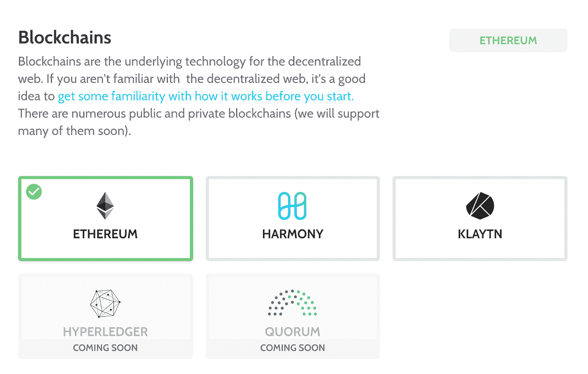

## 步骤 1.2:选择可靠性作为智能合同语言

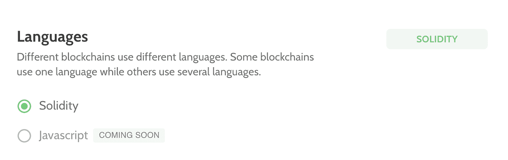

## 步骤 1.3:现在我们将使用普通的 JS


## 步骤 1.4:为您的 dapp 选择一个名称，然后单击“创建 DAPP”按钮！🎉

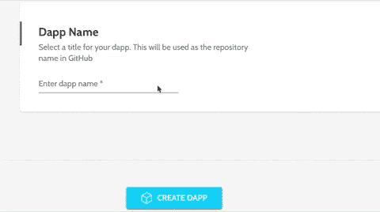

如果你成功地遵循了所有这些步骤，你应该有一个独特的 github 资源库链接，在那里你可以找到你的 dapp！

# 第 2 步:进入 GitHub 库，使用 README 启动 dapp

一旦您成功启动了 dapp，您应该会看到类似这样的内容

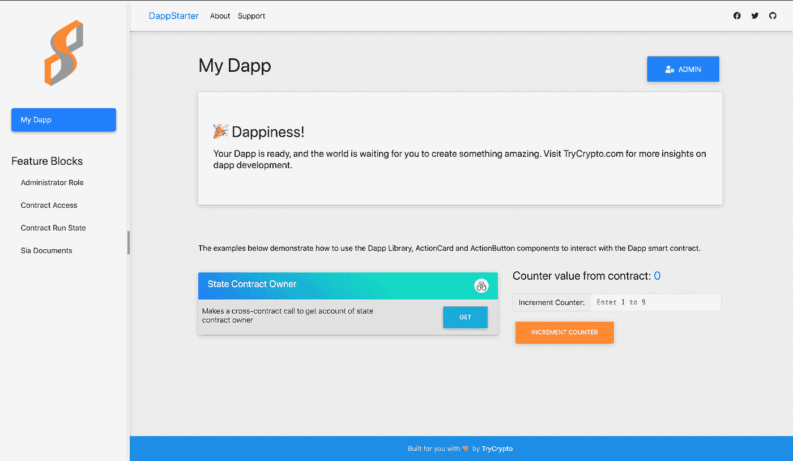

要了解 DappStarter 的概况，请访问[trycrypto.com/](https://www.trycrypto.com/blockchain-bootcamp-get-your-dapp-running-in-1-hour)。


# 第三步:定制你的 dapp

让我们看看如何修改导航窗格。转到`src/dapp/pages/components/page-navigation.js`

你可以在这里找到所有与 dapp 导航相关的代码。

```
…getPages() {let staticPages = [{name: ‘dapp’,**title: ‘Start Writing!’,**route: ‘/’}, {name: ‘admin’,title: ‘Dapp Admin’,route: ‘/admin’,hidden: true}]return staticPages.concat([{“name”:”administrator_role”,”title”:”Administrator Role”,”description”:”Define accounts that can perform certain admin functions.”,”category”:”Access Control”,”route”:”/administrator_role”},{“name”:”contract_access”,”title”:”Contract Access”,”description”:”Control which external contracts can interact with your contract.”,”category”:”Access Control”,”route”:”/contract_access”},{“name”:”contract_runstate”,”title”:”Contract Run State”,”description”:”Ability to pause operation of your smart contract.”,”category”:”Access Control”,”route”:”/contract_runstate”}]);…
```

保存文件时，dapp 会自动重新加载，因为 DappStarter 使用 webpack。现在，您应该会看到一个导航面板，并开始编写这样的页面


# 步骤 4:创建一个新的小部件，使我们的 dapp 模块化

为不同的功能创建小部件是一个很好的实践。在`src/lib/components/widgets`中创建一个名为`html-widget.js`的文件。

在该文件中插入以下代码

```
import CustomElement from ‘../shared/custom-element’;export default class HtmlWidget extends CustomElement {static get ATTRIBUTE_FIELD() {return ‘field’}static get ATTRIBUTE_LABEL() {return ‘label’}static get ATTRIBUTE_PLACEHOLDER() {return ‘placeholder’}static get observedAttributes() {return HtmlWidget.attributes;}static get attributes() {return [HtmlWidget.ATTRIBUTE_FIELD,HtmlWidget.ATTRIBUTE_LABEL,HtmlWidget.ATTRIBUTE_PLACEHOLDER];}constructor(…args) {super(HtmlWidget.attributes, …args);this.quill = null;}**get value() {****let markup = this.quill.container.querySelector(‘.ql-editor’).innerHTML;****return `<html>****<head> </head>****<body>****<div style=”font-family:lato;”>****${markup}****</div>****</body>****</html>`****}**render() {let self = this;let content = `<div class=”input-group”><div id = “editor” class = “form-control”> </div></div>`self.style.display = ‘block’;if (self.nextSibling) {self.classList.add(‘mb-3’)}self.innerHTML = content;**var toolbarOptions = [****[‘bold’, ‘italic’, ‘underline’, ‘strike’], // toggled buttons****[‘blockquote’, ‘code-block’],****[{ ‘header’: 1 }, { ‘header’: 2 }], // custom button values****[{ ‘list’: ‘ordered’}, { ‘list’: ‘bullet’ }],****[{ ‘script’: ‘sub’}, { ‘script’: ‘super’ }], // superscript/subscript****// [{ ‘indent’: ‘-1’}, { ‘indent’: ‘+1’ }], // outdent/indent****// [{ ‘direction’: ‘rtl’ }], // text direction****// [{ ‘size’: [‘small’, false, ‘large’, ‘huge’] }], // custom dropdown****[{ ‘header’: [1, 2, 3, 4, 5, 6, false] }],****[{ ‘color’: [] }, { ‘background’: [] }], // dropdown with defaults from theme****// [{ ‘font’: [] }],****// [{ ‘align’: [] }],****[‘clean’] // remove formatting button****];****self.quill = new Quill(‘#editor’, {****modules: {****toolbar: toolbarOptions****},****theme: ‘snow’****});**}}customElements.define(‘html-widget’, HtmlWidget);
```

在这个文件中，我们已经集成了 [Quill 到](https://quilljs.com/) make 富文本日志条目。Quill 是一个免费的、开源的、为现代网络构建的所见即所得编辑器。

要使用 Quill 的功能，请确保在`dapp/index.html`中添加 Quill CDNs。在`head`中增加`<link href=”[https://cdn.quilljs.com/1.3.6/quill.snow.css](https://cdn.quilljs.com/1.3.6/quill.snow.css)" rel=”stylesheet”>`，在`body`关闭前增加`<script src=”[https://cdn.quilljs.com/1.3.6/quill.js](https://cdn.quilljs.com/1.3.6/quill.js)"></script>`

要增加文本编辑器的长度，对`src/dapp/index.css`进行以下更改-

```
…#editor {height: 375px;}strong { font-weight: bold !important; }…
```

# 步骤 5:在我们的 dapp 中使用 html-widget

转到`src/dapp/pages/dapp-page.js`(这是我们所有 dapp 前端逻辑将驻留的地方)并进行以下更改。在那里导入创建的 html-widget。我们将能够像使用常规 html 标签一样使用这个小部件，在 dapp 的任何地方使用 Quill editor。

```
import DappLib from ‘../../lib/dapp-lib’;import CustomElement from ‘../../lib/components/shared/custom-element’;import DOM from ‘../../lib/components/shared/dom’;import ‘../../lib/components/shared/action-card.js’;import ‘../../lib/components/widgets/number-widget.js’;**import ‘../../lib/components/widgets/html-widget.js’;**import ActionButton from ‘../../lib/components/shared/action-button’;import canvas from ‘../assets/img/canvas.jpg’;export default class SiaPage extends CustomElement {constructor(…args) {super([], …args);this.mode = ‘multiple’;this.files = [];this.eventHandlerRegistered = false;}render() {let self = this;**self.category = “Maintain your journal on decentralized web”;****self.description = “Store your journal on decentralized file storage”;**let uiHtml = {[CustomElement.UI_READ]: ‘’,[CustomElement.UI_WRITE]: ‘’,[CustomElement.UI_ADMIN]: ‘’}uiHtml[CustomElement.UI_READ] =`<action-cardtitle=”Get Document” description=”Get Sia document using its ID”action=”getSiaDocument” method=”${CustomElement.METHOD_GET}” fields=”id”><number-widgetfield=”id” label=”Doc ID” placeholder=”Document ID”></number-widget></action-card><action-cardtitle=”Get Documents by Owner” description=”Get all Sia documents for any account”action=”getSiaDocumentsByOwner” method=”${CustomElement.METHOD_GET}” fields=”account”><account-widgetfield=”account” label=”Account” placeholder=”Account address”></account-widget></action-card>`uiHtml[CustomElement.UI_WRITE] =`<action-cardtitle=”Make a journal entry” description=”Upload entry to Sia and add hash to contract”action=”addSiaDocument” method=”${CustomElement.METHOD_POST}” fields=”myText”target=”card-body-addSiaDocument”message=”Waiting for Sia upload and smart contract transaction”>**<h2> Start Writing! </h2>****<html-widget****data-field= “myText” field=”label” label=”Label”****placeholder=”Description”>****</html-widget>****<input type=”hidden” data-field=”mode” value=”${self.mode}” style=”display:none;”></input>****</action-card>**`let content =`<page-body title=”${self.title}” category=”${self.category}” description=”${self.description}”>${uiHtml[CustomElement.UI_READ]}${uiHtml[CustomElement.UI_WRITE]}${uiHtml[CustomElement.UI_ADMIN]}</page-body><page-panel id=”resultPanel”></page-panel>`self.innerHTML = content;// self.querySelector(‘upload-widget’).addEventListener(UploadWidget.EVENT_FILES_CHANGED, (e) => {// //Could do something here// //let files = e.detail.files;// });if (!self.eventHandlerRegistered) {self.eventHandlerRegistered = true;DappLib.onAddSiaDocument((result) => {let resultPanel = self.querySelector(‘#resultPanel’);resultPanel.append(DappLib.getFormattedResultNode(result));resultPanel.open();});}}async fetchAndDisplayCounter() {let result = await DappLib[‘getStateCounter’].call();DOM.elid(‘counter’).innerHTML = result.callData;}}customElements.define(‘dapp-page’, DappPage);
```

你的 dapp 现在应该是这个样子-

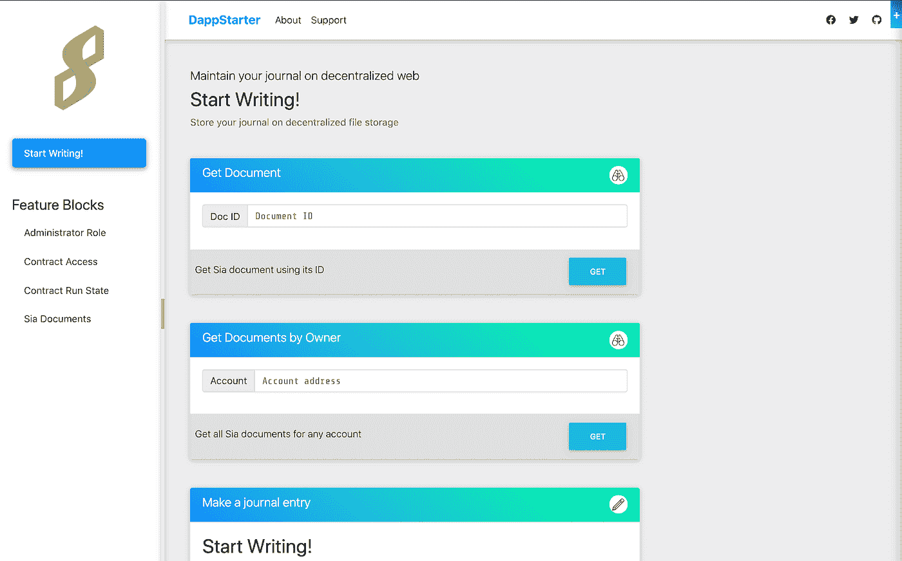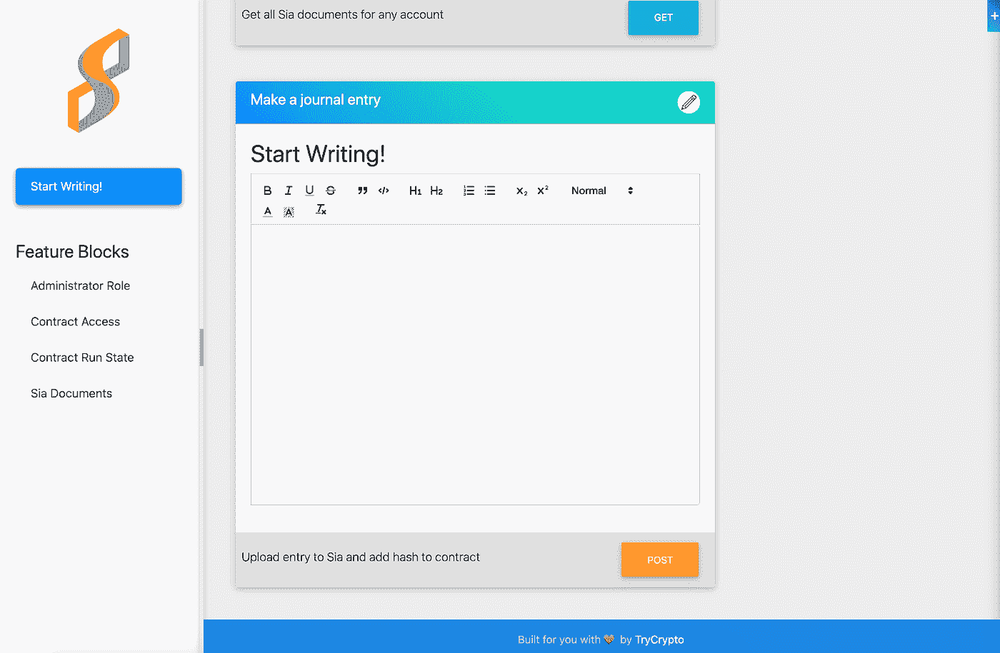

# 第六步:删除多余的块和改变标志

让我们将 dapp 的定制提升到一个新的高度。让我们看起来像这样-

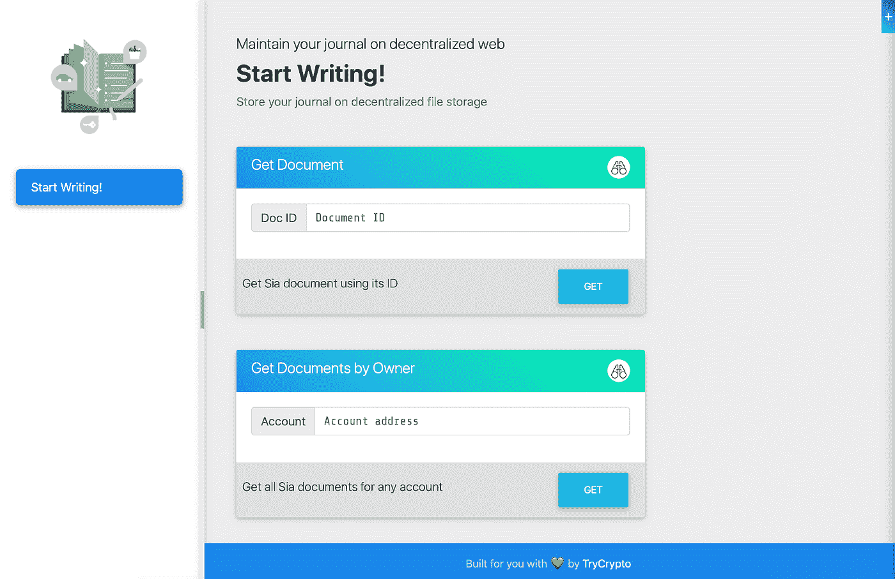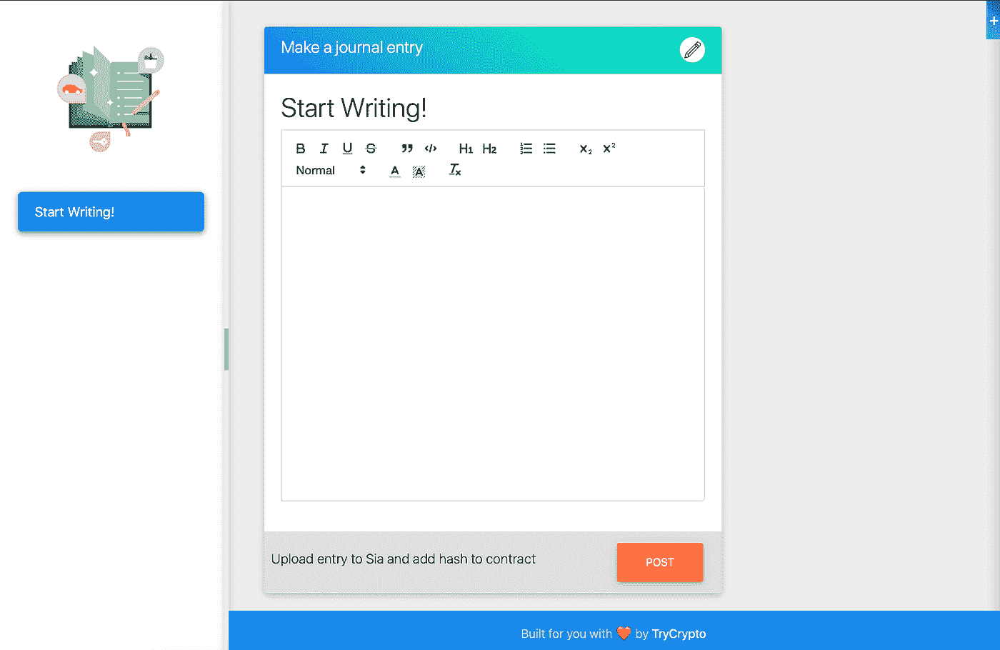

先换个 logo 吧。你可以使用任何图像。保存在`src/dapp/assets/img`中。姑且称之为`YOUR_FILE_NAME.png`。现在转到`src/dapp/pages/components/page-navigation.js`。你在代码中看到这一行-

```
import logo from “../../../dapp/assets/img/dappstarter.png”;
```

把它改成

```
**import logo from “../../../dapp/assets/img/YOUR_FILE_NAME.png”;**
```

我们还需要对`webpack.config.dapp.js`进行更改(这是在项目的根目录中)

```
…plugins: [new HtmlWebpackPlugin({template: path.join(__dirname, ‘src/dapp/index.html’)}),**new FaviconsWebpackPlugin(‘src/dapp/assets/img/YOUR_FILE_NAME.png’)**],…
```

这是你的 dapp 现在应该的样子-

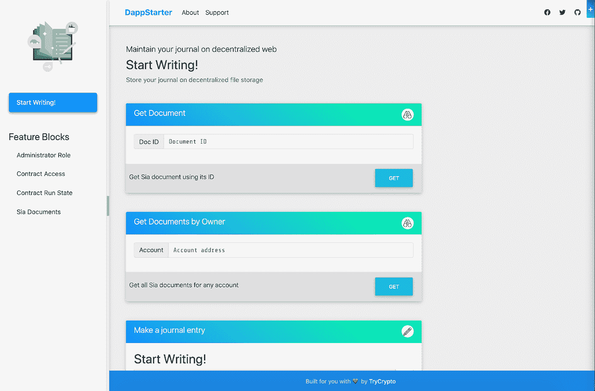

现在，让我们从左侧导航面板中删除功能块。转到`src/dapp/pages/components/page-navigation.js`。

```
…// Remove the block between //BEGIN //END below to remove feature blocks from navigation// BEGIN: Feature Blocks// DOM.h4({// className: ‘mt-5 mb-2’// },// “Feature Blocks”),// DOM.ul({// id: self.listId + ‘-blocks’,// className: ‘list-group list-group-flush’// },// listItems.slice(1)// ),// END: Feature Blocks…
```

你的 dapp 现在应该是这个样子-

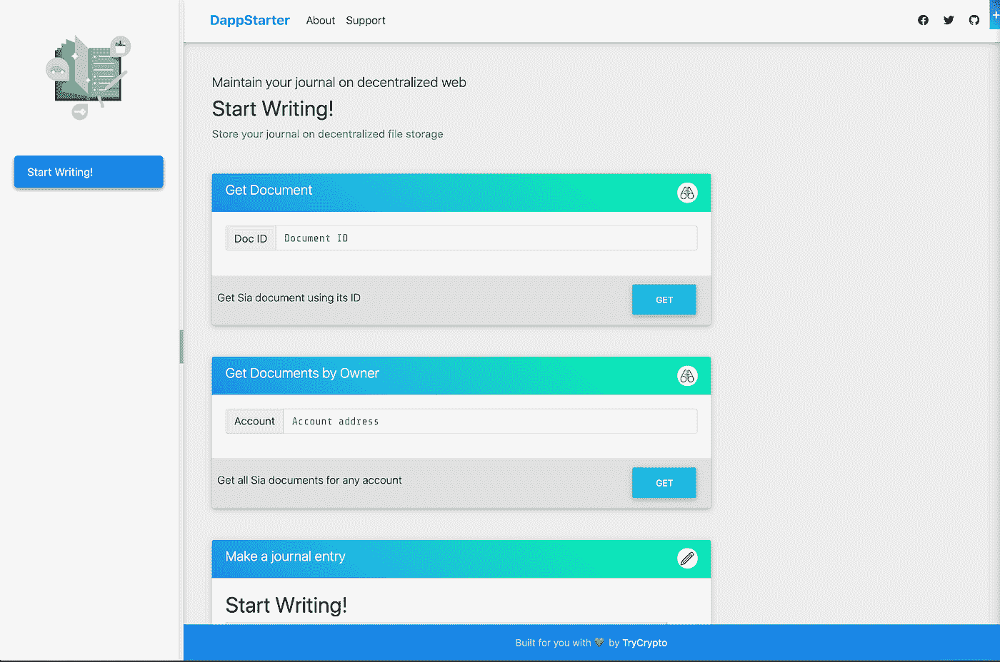

我们快到了！！最后，让我们去掉顶部的导航栏。转到`src/dapp/pages/components/top-navigation.js`并删除所有正在渲染的 html。

`src/dapp/pages/components/top-navigation.js`应该是这样的——

```
import CustomElement from ‘../../../lib/components/shared/custom-element’;export default class TopNavigation extends CustomElement {static get ATTRIBUTE_COLLAPSE() {return ‘collapse’}static get observedAttributes() {return TopNavigation.attributes;}static get attributes() {return [TopNavigation.ATTRIBUTE_COLLAPSE];}constructor(…args) {super(TopNavigation.attributes, …args);}}customElements.define(‘top-navigation’, TopNavigation);
```

这是你的 dapp 现在应该的样子-

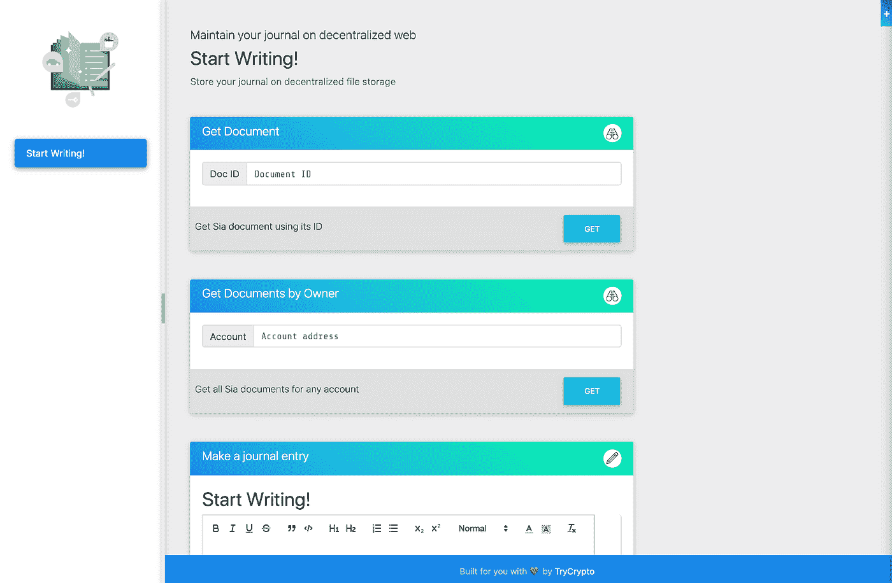

# 步骤 7:用 Sia 处理日志条目

与 Sia 文件上传相关的所有代码都存放在`src/lib/dapp-lib.js`中。转到文件存储:SIA 部分。这里唯一需要编辑的代码块是`addSiaDocument()`。

```
static async addSiaDocument(data) {let folder = data.mode === ‘folder’;let config = DappLib.getConfig();**//Name of the journal entry is the date and time when it was written****const timeStamp = new Date().toString();****// Convert data received from html-widget into a file****data.files = [new File([data.myText], `${timeStamp}.html`, {****type: “text/html”,****})];****// Push files to SIA****let siaResult = await DappLib.siaUpload(config, data.files, folder);**let results = [];for(let f=0; f<siaResult.length; f++) {let file = siaResult[f];let result = await Blockchain.post({config: config,contract: DappLib.DAPP_STATE_CONTRACT,params: {from: null,gas: 2000000}},‘addSiaDocument’,file.docId,DappLib.fromAscii(data.label || ‘’, 32));results.push({transactionHash: DappLib.getTransactionHash(result.callData),docId: file.docId});}
```

# 第八步:最后的润色

我们的 dapp 快好了。我们只需要在`src/dapp/index.css`做几个礼拜。将以下几行添加到文件中-

```
.markup {font-family:courier;}
```

# 这些都是我们必须做出的改变！现在让我们看看我们的 dapp 在行动。

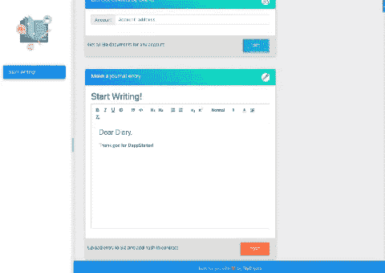

# 祝贺你，如果你坚持到了这里！🎉

你可以修改你的 dapp 来为作者开发更复杂的平台。我们所构建的仅仅是您作为开发人员可以构建的众多用例中的一个例子。

激情经济的未来取决于内容创作者的透明和公平理念。区块链提供了一种独特的基础设施，通过确保创作者的努力得到公平的补偿，鼓励他们制作精彩的内容。为激情经济建立一个 dapp 不仅仅是为了将内容货币化，而是为了提供一个透明、开放的系统，在这个系统中，创作者可以创造和分享让他们独一无二的东西。

# 使用 DappStarter 开始构建您的 dapp。

> [在您的收件箱中直接获得最佳软件交易](https://coincodecap.com/?utm_source=coinmonks)

[](https://coincodecap.com/?utm_source=coinmonks)