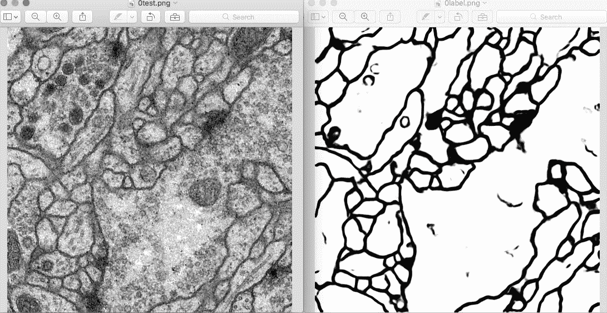
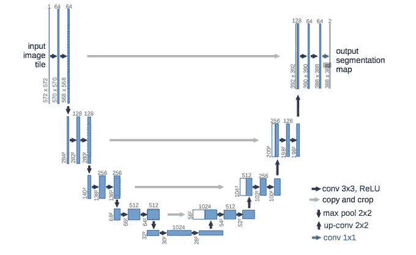
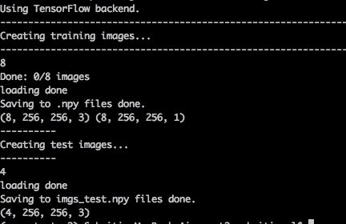
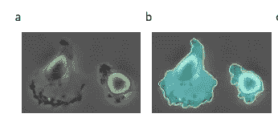

# 了解如何在数据集上训练 U-Net

> 原文：<https://medium.com/coinmonks/learn-how-to-train-u-net-on-your-dataset-8e3f89fbd623?source=collection_archive---------0----------------------->



Fig.1 : A test image along with its label (semantically segmented output)

为了在一个小的生物医学数据集上执行语义分割，我使用 Keras 坚定地尝试去揭开 U-Net 工作的神秘面纱。由于我还没有看到任何系统解释训练步骤的文章，所以我想到了为其他深度学习爱好者记录这些内容。你们中的一些人一定在想，我是否已经涵盖了这个框架的理论方面。虽然我的主要重点是阐述实现，但我也试图包括与其理解相关的细节。我的大部分参考资料包括[**智旭豪**](https://github.com/zhixuhao) **在 Github 上的 unet 知识库**和论文， **U-Net:卷积网络用于生物医学图像分割**由**[Olaf Ronneberger](https://arxiv.org/search?searchtype=author&query=Ronneberger%2C+O)等人**

# **关于优信网**

**U-net 架构与编码器-解码器架构同义。本质上是基于 [FCNs](https://people.eecs.berkeley.edu/~jonlong/long_shelhamer_fcn.pdf) 的深度学习框架；它由两部分组成:**

1.  **类似于编码器的收缩路径，通过紧凑的特征图**捕获上下文。****
2.  **类似于解码器的对称扩展路径，允许**精确定位**。尽管在编码器阶段执行了下采样和最大汇集，但完成该步骤是为了保留边界信息(空间信息)。**

****

**Fig.2: Architecture of U-Net based on the paper by [Olaf Ronneberger](https://arxiv.org/search?searchtype=author&query=Ronneberger%2C+O) et.al**

## **使用 U-Net 的优势**

1.  **计算效率高**
2.  **可用小数据集训练**
3.  **端到端培训**
4.  **更适合生物医学应用**

**等等，到底什么是语义切分和本地化？简单来说，他们指的是**像素级标签**，即图像中的每个像素都有一个类别标签。你会得到分割图，如图 1 所示。在此之前，生物医学研究人员遵循两种方法:**

1.  **将图像作为一个整体进行分类(恶性或良性)。**
2.  **将图像分成**块**并分类。**

**由于数据集大小增加，修补当然比整个图像分类更好，但是，这也有一些缺点。较小的步距或大量重叠的修补都是计算密集型的，并导致冗余(重复)信息。其次， ***上下文信息和本地化之间的良好权衡至关重要*** 。**小补丁导致上下文信息丢失，而大补丁篡改定位结果。**最后，非重叠补丁会导致上下文信息的丢失。基于先前的观察，编码器-解码器架构产生比将每个像素馈送到 CNN 进行分类高得多的交集(IoU) 值。**

# **准备数据集**

**让我们开始准备您的数据集吧！我将写一篇单独的文章，涵盖 U-Net 的本质，所以不要绞尽脑汁，陷入它的架构。**

1.  **将您的原始数据集和相应的注释分成两组，即*训练集和测试集*(验证，更精确地说)集。**原始图像为 RGB** 格式，而其**蒙版为二进制**(黑白)。**
2.  **将所有图像数据转换为 **.tif.****
3.  **您将不需要测试集的图像类标签或注释(这不是一个分类问题)。**

****注意:**选择图像尺寸，使得连续的 convs 和 max-pooling 在每个阶段 产生 x 和 y (即特征图的宽度和高度) ***的偶数值 ***。虽然我的图片是 360X360 像素，但我把它们的尺寸调整为 256X256。裁剪出边界以获得合适的图像尺寸。为此，我已经包含了代码。********

**Cropping and conversion to .tif**

**你一定在想给这些文件夹取什么名字，等等等等..再等几分钟，你就知道该把它们放在哪里了！**

# **先决条件**

*   **张量流**
*   **Keras >= 1.0**
*   **libtiff(可选)**
*   **OpenCV 3(如果你是 MAC 用户，按照[这个](https://www.codingforentrepreneurs.com/blog/install-opencv-3-for-python-on-mac/)进行安装)**

**此外，这段代码应该与 Python 版本 2.7–3.5 兼容。**

# **培训和数据扩充**

**如果需要，你可以旋转、反射和扭曲图像。[智旭豪](https://github.com/zhixuhao)使用了一种可用的变形方法[这里](https://github.com/cxcxcxcx/imgwarp-opencv)。仔细遵循下面的几个步骤；少走一步会让你发疯几个小时！为简单起见，我将培训阶段分为两部分——A 部分和 B 部分。**

## **A 部分-修改数据. py**

**1.克隆[智旭豪](https://github.com/zhixuhao)的仓库。**

```
$ git clone [https://github.com/zhixuhao/unet](https://github.com/zhixuhao/unet)
```

**2.进入 ***图像*** 文件夹，该文件夹位于列车文件夹(*内../unet/data/train/image* 。**

**3.将训练图像包含在图像文件夹中。**每个图像都应该在。tif 格式，连续命名，*从 0.tif 开始，1 . TIF…以此类推。*****

**4.进入火车文件夹(*内的 ***标签*** 文件夹../unet/data/train/label* 。包括相应的训练图像注释。**每个图像都应该在。tif 格式，连续命名，*从 0.tif 开始，1 . TIF…以此类推。标签必须对应于训练图像集*** 。**

**5.进入数据文件夹内的测试文件夹(*../unet/data/test* 。**

**6.在数据文件夹(*内创建一个名为 ***npydata*** 的文件夹../unet/data/npydata* )。让它保持空白；处理后的数据集将作为 3 保存在此。npy 文件。**

**7.打开 unet 文件夹(*中的 ***data.py*** 文件../unet/data.py* )。步骤 8、9、10 和 11 是指您必须在该文件中对 RGB 图像进行的更改。粗体区域对应于我所做的更改。**

**8.修改*def create _ train _ data(self)*如下图所示。**

```
def create_train_data(self):
...
  imgdatas = np.ndarray((len(imgs),self.out_rows,self.out_cols,**3**),     dtype=np.uint8)
  imglabels =  np.ndarray((len(imgs),self.out_rows,self.out_cols,1),   dtype=np.uint8)
...
  img = load_img(self.data_path + "/" + midname) **#Removed grayscale**
  label = load_img(self.label_path + "/" + midname,grayscale = True)
#Correspond to lines 159-164
```

**9.修改 def*create _ test _ data(self)*如下所示。**

```
def create_test_data(self):
…
 imgdatas = np.ndarray((len(imgs),self.out_rows,self.out_cols,**3**), dtype=np.uint8)
 …
 img = load_img(self.test_path + "/" + midname) **#Removed grayscale** #Correspond to lines 188 and 191
```

**10.将 ***imgnum*** 更改为您的车组尺寸。**

```
def doAugmentate(self, img, save_to_dir, save_prefix, batch_size=1, save_format='tif', **imgnum=26**): #I've considered 26 training images
```

**11.通过提供正确的路径详细信息，修改类 dataProcess(object)中的以下内容。我把 ***data_path、label_path、test_path 和 npy_path*** 改成了正确的路径(对应我系统中的目录)。你可以试着在 data.py 的第 138 行编辑这些。如果出现一些错误，请浏览我在 Github 上对[问题#40](https://github.com/zhixuhao/unet/issues/40) 的回答。请确保 npydata 文件夹的路径没有错误(这是一个常见的错误)。**

```
def __init__(self, out_rows, out_cols, **data_path** = "/Users/sukritipaul/Dev/newcvtestpy2/unet2/data/train/image", **label_path** = "/Users/sukritipaul/Dev/newcvtestpy2/unet2/data/train/label", **test_path** = "/Users/sukritipaul/Dev/newcvtestpy2/unet2/data/test", **npy_path** = "/Users/sukritipaul/Dev/newcvtestpy2/unet2/data/npydata", img_type = "tif"):
#Corresponds to line 138
```

**12.运行 data.py**

```
$python data.py
```

## **A 部分-验证**

****

**Fig 3: Output obtained on running data.py**

**您的输出应该与图 3 中的输出相匹配。我已经打印了训练图像、训练注释和测试图像的大小。如果您的终端显示了正确数量的训练和测试图像(在本例中是 8 和 4)，那么您就可以开始了！如果它显示 0，则您的文件尚未包括在中。npy 文件。检查 */unet/data/npydata* 中是否有以下文件:**

1.  **imgs_mask_train.npy**
2.  **imgs_test.npy**
3.  **imgs_train.npy**

**喔喔喔！您已经完成了数据准备部分:)**

****

**Fig4: Result on the ISBI cell tracking challenge- input and cyan mask**

# **B 部分-修改 unet.py**

1.  **在 unet 文件夹中创建一个 ***结果*** 文件夹(../unet/results)。如果你在想为什么你创造了这个-你马上就会知道为什么！**

**2.打开 ***unet.py*** (。*。/unet/unet.py***

**3.编辑下一行的行数和列数。我的图片尺寸为 256X256。**

```
def __init__(self, img_rows = 256, img_cols = 256):
 #Corresponds to line 13
```

**4.在 *get_unet(self)* 中，为 3 通道输入修改以下内容，如下所示。**

```
def get_unet(self):
 inputs = Input((self.img_rows, self.img_cols,3))
 #Corresponds to line 27
```

**5.修改*列车(自)中的以下线路。***

```
def train(self):
...
 np.save('**/Users/sukritipaul/Dev/newcvtestpy2/unet2/results/imgs_mask_test.npy**', imgs_mask_test)
...
#Note that the address to the **results** directory must be provided
##Corresponds to line 164
```

**6.修改 *def save_img(self)，*记住结果目录的 ***地址，如步骤 4 所述。*****

```
def save_img(self):
 imgs = np.load('/Users/sukritipaul/Dev/newcvtestpy2/unet2/results/imgs_mask_test.npy') **# Use the same address as above**
 img.save("/Users/sukritipaul/Dev/newcvtestpy2/unet2/results/%d.jpg"%(i)) #Saves the resulting segmented maps in /results
##Corresponds to lines 169 and 173 
```

**7.运行 ***unet.py*** 并等待几分钟(根据数据集大小和系统硬件，您的训练时间可能需要几个小时)。**

```
$python unet.py
```

## **B 部分-验证**

**访问 */unet/results* 和 viola！可以找到生成的图像蒙版或灰度分割特征图:)**

**总之，我在 65 幅训练图像和 10 幅大小为 256X256 的验证图像上获得了 90.71%的总体准确率。他们使用二元交叉熵作为损失函数。我花了大约 3 个小时在一台 8 GB 的 MacBook Air 上进行训练，它配备了 1.8 GHz 的英特尔酷睿 i5 处理器(CPU)。**

**请随意将您的疑问添加到评论中！:)**

> **加入 Coinmonks [电报频道](https://t.me/coincodecap)和 [Youtube 频道](https://www.youtube.com/c/coinmonks/videos)获取每日[加密新闻](http://coincodecap.com/)**

## **另外，阅读**

*   **[密码电报信号](http://Top 4 Telegram Channels for Crypto Traders) | [密码交易机器人](/coinmonks/crypto-trading-bot-c2ffce8acb2a)**
*   **[复制交易](/coinmonks/top-10-crypto-copy-trading-platforms-for-beginners-d0c37c7d698c) | [加密税务软件](/coinmonks/crypto-tax-software-ed4b4810e338)**
*   **[电网交易](https://coincodecap.com/grid-trading) | [加密硬件钱包](/coinmonks/the-best-cryptocurrency-hardware-wallets-of-2020-e28b1c124069)**
*   **[加密交易所](/coinmonks/crypto-exchange-dd2f9d6f3769) | [印度的加密应用](/coinmonks/buy-bitcoin-in-india-feb50ddfef94)**