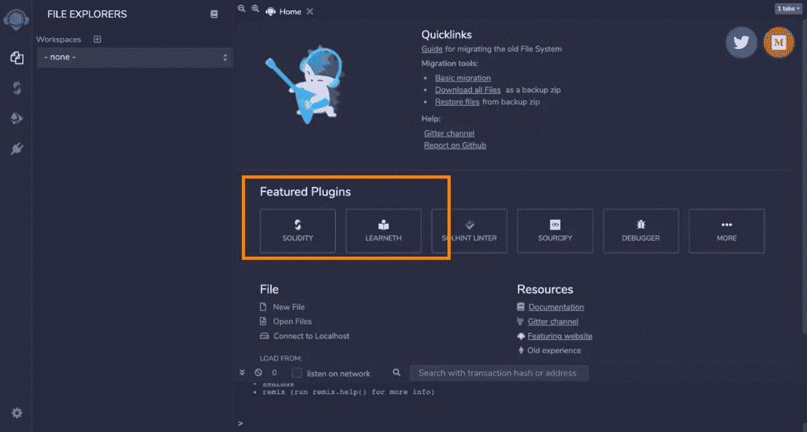
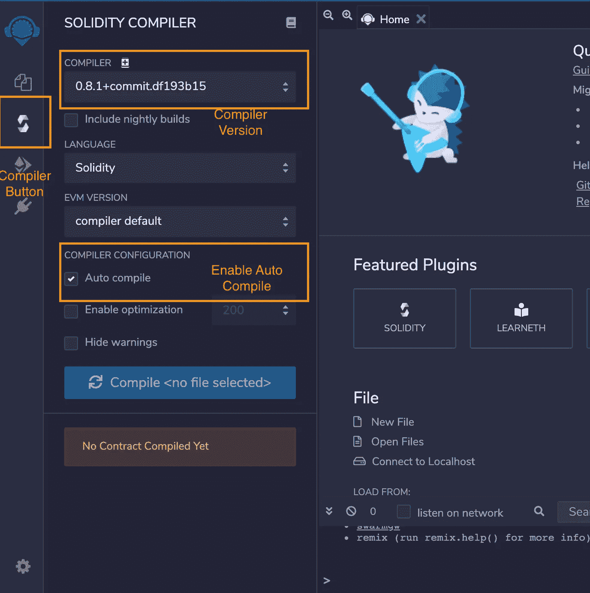
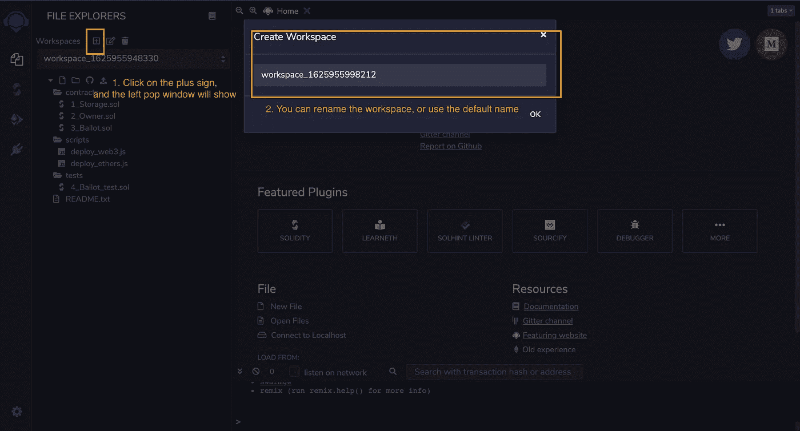
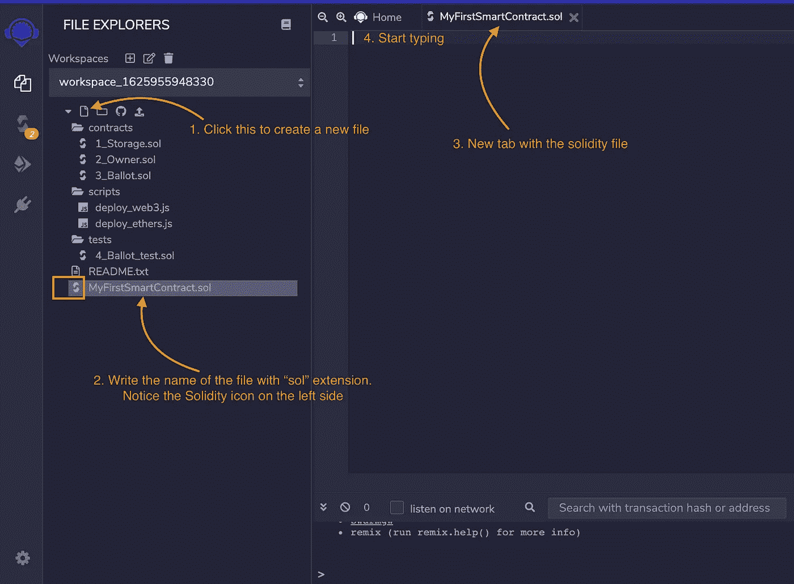
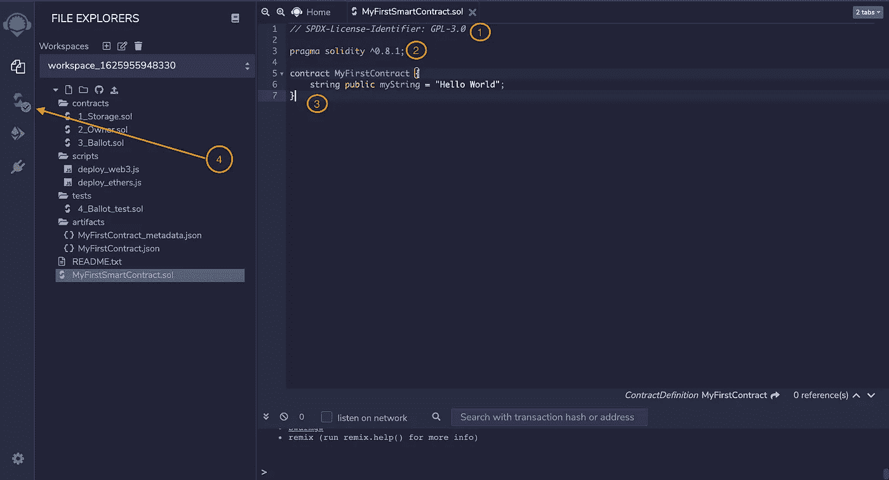

# 学习稳健 01:撰写你的第一份智能合同

> 原文：<https://medium.com/coinmonks/learn-solidity-01-writing-your-first-smart-contract-528cad29ba99?source=collection_archive---------2----------------------->


Photo by [Zoltan Tasi](https://unsplash.com/@zoltantasi?utm_source=unsplash&utm_medium=referral&utm_content=creditCopyText) on [Unsplash](https://unsplash.com/s/photos/ethereum?utm_source=unsplash&utm_medium=referral&utm_content=creditCopyText)

我对区块链技术着迷的原因太多了，我不会在本文中讨论。然而，加密货币是货币的未来并不是一个新话题，NFT 对数字艺术家来说令人难以置信。

那么我写这篇文章的目的是什么呢？我对区块链空间产生了兴趣，在做了大量研究后，我无法像你一样找到足够的学习指南，比如说，相当标准的数据科学。如果你明白这样做的原因是与其他流行的编程语言相比，缺乏可靠的程序员(世界上大约有 200，000*开发人员),这将会有所帮助。因此，没有足够的教程。因此，我将写一系列关于学习语言的文章，你可以从中学习成为一名区块链开发者。

这是这个系列的第一篇文章，它将是关于用 Solidity 写你的第一份智能合同。有许多概念你可能还不熟悉，这完全没关系。随着本系列的深入，我将尽最大努力将每个概念分解成几个部分，您可以在此基础上做更多的研究。

首先，这里有几个你应该问的问题；什么是智能合同？什么是扎实？区块链是如何工作的？

请跟随我，为下面的这些问题提供答案。

# 什么是智能合同？

“智能合约”只是一个运行在以太坊区块链上的程序。它是代码(其功能)和数据(其状态)的集合，驻留在以太坊区块链上的特定地址。把智能合约想象成以太坊网络上的一个账号，用户无法控制，作为一个程序运行。然而，用户可以通过提交执行智能合约上定义的功能的交易来与智能合约交互。

智能合约确保交易在现实生活中发生的方式要复杂得多，但这里有一个简单的解释来理解事情是如何工作的。


Photo by [Cedrik Wesche](https://unsplash.com/@cedrikwesche?utm_source=unsplash&utm_medium=referral&utm_content=creditCopyText) on [Unsplash](https://unsplash.com/s/photos/ethereum?utm_source=unsplash&utm_medium=referral&utm_content=creditCopyText)

想象一下，这篇文章是出售的，我是卖家，你读者是买家，你正在用你在网上看到的代销商链接购买这篇文章。我们可以为这个事务部署一个智能契约，下面是交换可能发生的方式。

作为读者，您创建了一个交易，将这篇文章的价格发送给卖方，以换取这篇文章的副本。就像您通常在正常的银行交易中一样，您将提供我的地址作为智能合约地址的输入。智能合同然后将通过验证您的钱包中有足够的钱以及我也有这篇文章的副本准备出售来执行该交易。然后，它从你的钱包里扣钱，发到我的钱包里，让我给你发一份文章的复印件，最后从我的钱包里扣完之后，把代销商佣金发给代销商链接的主人。

以上是智能合约如何促进互不信任的用户之间的交易，它在现实世界中用于执行复杂得多的交易。

这就引出了下面这个问题:什么是坚固性？

# 什么是扎实？

我们已经确定了智能合同是软件程序的事实。对于以太坊，你可以使用一种叫做 Solidity 的静态类型语言来编写智能合约，这是目前使用最广泛的智能合约编程语言。Solidity 是一种用于编写通用智能合同的全功能语言，它看起来像 JavaScript。

# 区块链是如何工作的？

回答最后一个问题，我认为这是一个需要了解的重要概念。我将分享一个 Anders Brownworth 的视频，它解释了这个概念:区块链是如何工作的？

看[这里](https://www.youtube.com/watch?v=_160oMzblY8)；对区块链工作原理背后概念的初步直观介绍。

现在你已经很好的理解了上面的概念，让我们看看你如何写你的第一个智能合同。

# 步骤 1 —设置 Remix IDE

1.1 —第一步是设置 Remix IDE。Remix IDE 是一个基于浏览器的智能合约开发环境。IDE 为不同的 solidity 版本提供了几个插件和编译器。

要启动 Remix IDE，请访问 http://remix.ethereum.org 的；您将看到下面的页面，它可能会因您阅读本文的时间而有所不同。



Remix Home Page

请注意，在上面的图像中，您可以看到“特色插件”，因为 Remix IDE 是用可插拔的架构构建的，这意味着所有的操作都是使用插件执行的。

1.2 —接下来要做的是启用 Solidity 编译器插件，如下所示。


Enable Plugins

1c —启用插件后，点击“Solidity 编译器”按钮，选择下图所示的编译器配置。



Compiler Configuration

值得一提的是，Solidity 中的编译器版本很难使用，建议您不要使用最新的版本。有趣的是，你会发现一些遗留项目仍然在旧的 solidity 版本上运行，这没什么。总之，如果你是初学者，试着坚持你在特定教程中看到的版本。

在上图中，你会看到我们使用的编译器版本是 0.8.1，这可能不是最新的版本。此外，您可以使用文件开头的“pragma”行在 Solidity 源文件中设置编译器版本。Pragma 行只是告诉编译器您正在使用的版本的一种方式。

现在一切都准备好了，让我们在下一步编写我们的第一个智能合同。

# 第二步——撰写你的第一份智能合同

像任何其他编程语言一样，第一步是为该语言创建一个项目文件。在这里，您将创建一个名为“MyFirstSmartContract.sol”的文件。“sol”文件扩展名代表可靠性，就像“py”代表 Python 一样。

参见下图，在 Remix IDE 中创建这个文件。

2.1 —创建工作空间



Create workspace

2.2 —创建文件；myfirstssmartcontract . sol



Create a file

2.3 —编写代码

```
// SPDX-License-Identifier: GPL-3.0pragma solidity ^0.8.1;contract MyFirstContract {
 string public myString = “Hello World”;
}
```



**第一部分**

*`//SPDX-License-Identifier:GPL-3.0 `*—是软件包数据交换(SPDX)标识，用于指定分发 Solidity 文件的许可证。建议将它包含在您的代码中，如果文件中缺少它，编译器将抛出警告消息。

**第二部**

pragma solidity ^0.8.1，^0.8.1 是指 0.8.1 到 0.9.0 之间的版本，包括 0.8.1 但不包括 0.9.0。换句话说> =0.8.1 并且<0.9.0.

The pragma keyword instructs the compiler to enable or check specific features. Finally, the version pragma is a mechanism that informs the compiler about the Solidity file’s compiler version.

**第 3 部分**

*契约 MyFirstContract* 是代码的开头，就像 Python 编程语言中的 Class 关键字一样。“myString”是一个公共存储变量，用于保存“Hello World”随着我们继续本系列的学习，您将了解到更多这方面的内容。

**第四部分**

请注意，编译器显示了一个绿色图标，这表示编译成功，因为您在上一节中启用了自动编译。

# 恭喜🎉🎉

所以你有它；恭喜你，你刚刚写了你的第一份智能合同。在下一篇文章中，我们将讨论如何将这个智能合约部署到实际的区块链中。

* —估计数字

# 接下来…

如果你不想错过下一篇文章，可以考虑注册我的[简讯](https://blessingadesiji.substack.com/p/learn-about-how-technology-is-changing?r=1mihs&utm_campaign=post&utm_medium=web&utm_source=copy)，当文章准备好的时候，你会在邮件中收到通知。记住，这些系列文章旨在分解区块链开发中的复杂概念，尤其是以太坊网络。

# 了解我

我写关于数据科学、软件开发和区块链技术的令人兴奋的话题。

在我的社交媒体上关注我，了解更多更新； [Twitter](https://twitter.com/bleso_a) 和 [LinkedIn](https://www.linkedin.com/in/bdetoye/) 。此外，不要犹豫，给我写一封电子邮件[了解更多信息。](mailto:blessingadesiji96@gmail.com)