# 用白色矩阵学习可靠性:第 1 章:可靠性入门

> 原文：<https://medium.com/coinmonks/learn-solidity-with-white-matrix-chapter-1-getting-started-with-solidity-6defa007a010?source=collection_archive---------5----------------------->

olidity 是一种面向对象的高级编程语言，用于实现智能合约。2014 年推出。智能合约是在以太坊状态下**控制账户**行为的程序。Solidity 受 C++、Python 和 JavaScript 的影响，旨在针对以太坊虚拟机(EVM)。

Solidity 是静态类型的，支持继承、库和复杂的用户定义类型以及其他特性。使用 Solidity，您可以创建用于投票、众筹、盲目拍卖和多签名钱包等用途的合同。

Learn Solidity with White Matrix (World’s First Cloud-based Blockchain IDE provider)

有不同的工具可用于实现 solidity 语言，但 [**ChainIDE**](https://www.chainide.com/) 是基于以太坊的应用程序开发中最有用和最常用的工具。它还支持其他区块链平台(如 Fiscobcos、Libra、Ant 等)。更多详情可以访问这里[**chain ide**](https://www.chainide.com/)**。**

# 环境设置:

头转向**。这将作为编写您的第一个智能合同的开发平台。您的屏幕应该看起来像这样或类似:**

# **链条:**

**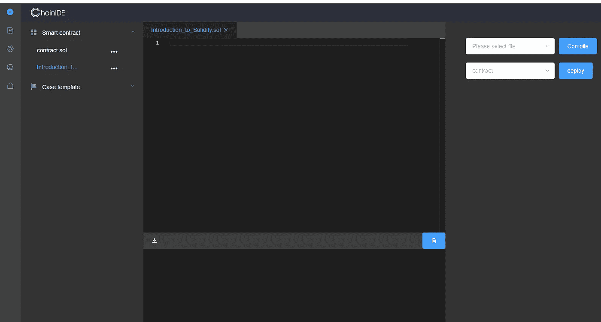**

**ChianIDE for the Blockchain Applications development using Solidity and Ethereum**

**ChainIDE 是一个跨平台的智能合约基于云的 IDE，它非常容易使用。它是为了方便区块链领域的研究人员和从业人员而开发的。在最左侧，您可以选择创建新的智能合同，如下图所示，并开始写下您的第一个程序。**

**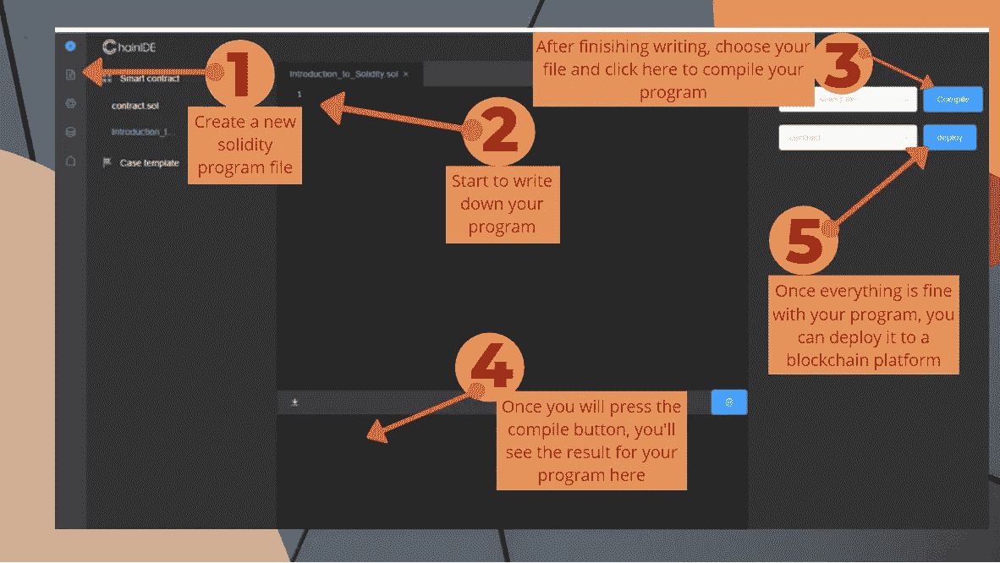**

**在编写任何 solidity 程序之前，您需要做的第一件事是声明将用于编译您的 solidity 程序的编译器版本。 *pragma* 用于声明编译器版本的可靠性。我们可以使用 *pragma solidity 0.4.25 通过 pragma solidity 来选择编译器的确切版本；或者我们可以使用*pragma solidity>= 0 . 4 . 0<0 . 7 . 0 让程序为我们选择一个合适的版本；****

**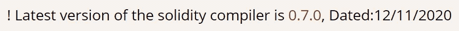**

**在这里，我们为基本任务(如加法、乘法等)编写一个非常简单的程序，测试、编译和部署它。**

**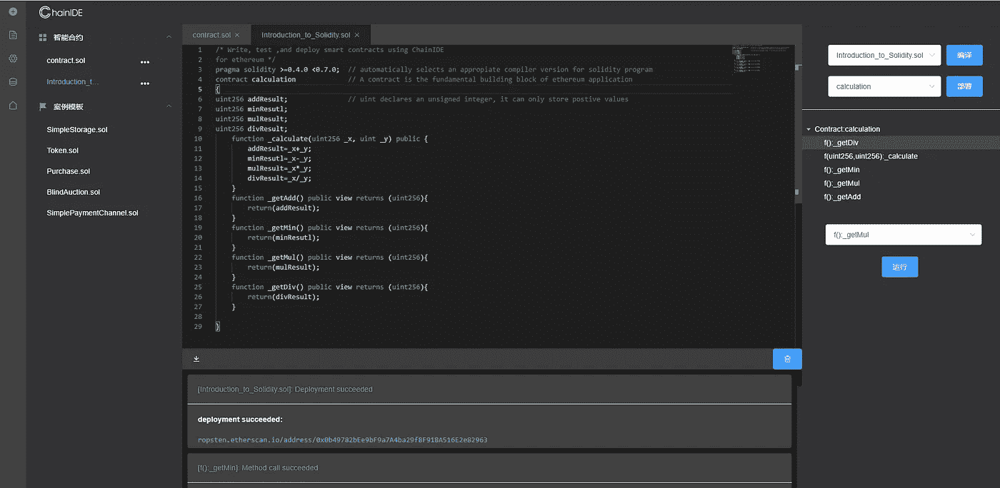**

**一旦你成功地编译了你的合同，是时候使用 MetaMask 在以太坊区块链上部署它了。部署成功后，您可以在以太坊区块链上进行交易。**

****元蒙版****

**MetaMask 既可以充当以太坊浏览器，也可以充当钱包。它允许你在网上与智能合同和 dApps 进行交互，而无需下载区块链或安装任何软件。你只需要添加 MetaMask 作为 Chrome 扩展，创建一个 wallet，提交 Ether。您的以太坊钱包中必须有一定数量的以太，才能在网络上部署以太坊智能合约。**

**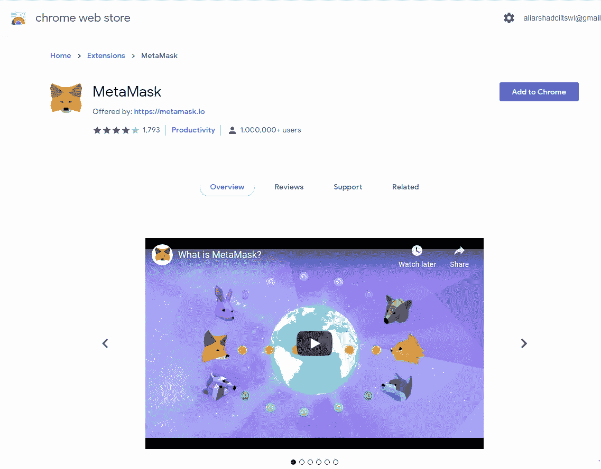**

**为了安装 MetaMask，我们将去 chrome 商店。或者你可以[点击](https://chrome.google.com/webstore/detail/metamask/nkbihfbeogaeaoehlefnkodbefgpgknn?utm_source=chrome-ntp-icon)这里安装元掩码。一旦它被安装，它将要求帐户，如果你已经有一个元掩码帐户，可以登录到一个已经存在的帐户，否则你可以创建一个新的帐户。**

**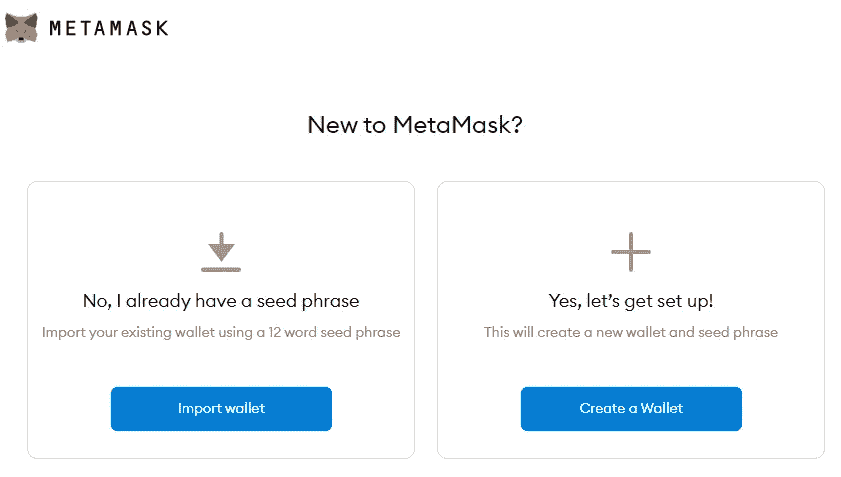**

**一旦您建立了您的帐户，您将选择 *Ropsten 测试网络。*因为你将测试你的合同。为了成功地将您的合同部署到以太坊区块链，您需要在您的帐户中拥有虚拟以太。这些以太将被用作以太坊区块链上存储和计算的交易费。**

**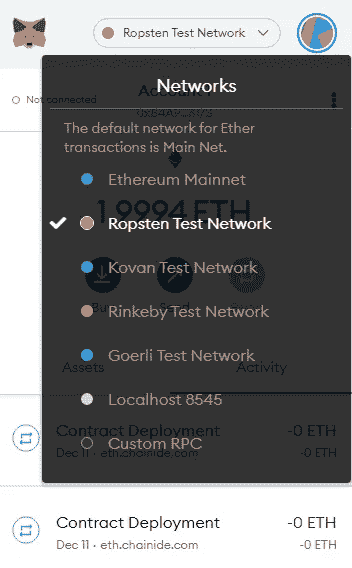**

**这里是我们如何将虚拟以太添加到 MetaMask。一旦你的钱包里有了乙醚，你可以简单地去 ChainIDE 并成功地部署它。**

**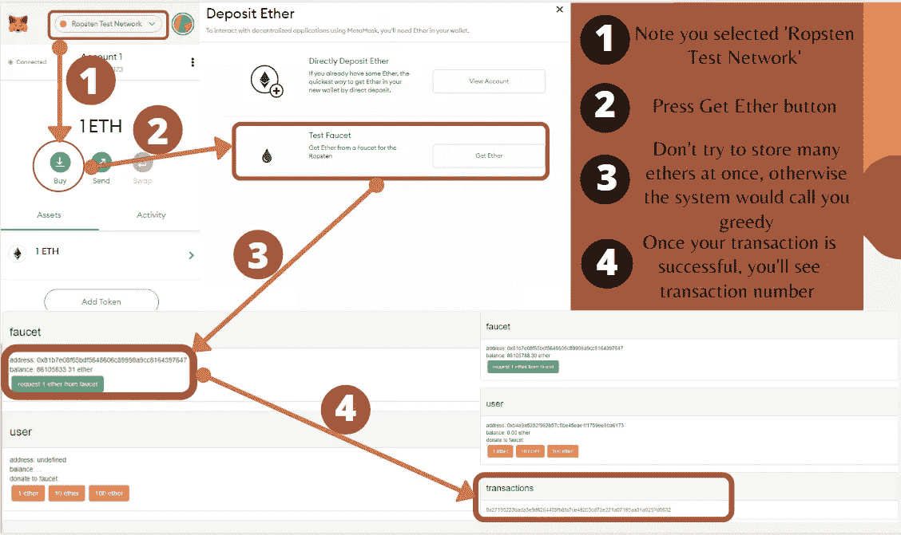**

**一旦你的钱包里有了乙醚，选择较高的费用，以加快处理您的交易。通过使用更高的费用来加速交易增加了他们被网络更快处理的机会，但是这总是不能保证。估计的加工费将完全取决于你的合同。交易越复杂，运行智能合约所需的汽油就越多。**

**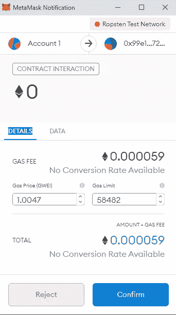****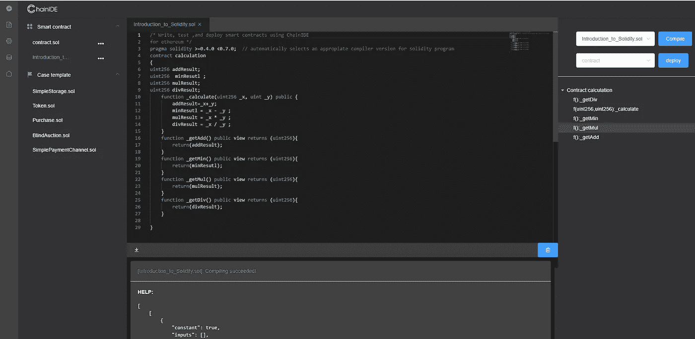**

**部署成功后，您会得到如上图所示的“部署成功”的通知。现在，你可以通过支付虚拟以太来使用以太坊区块链资源进行安全交易。**

**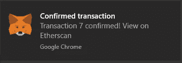**

**谢谢你的时间。希望这篇帖子能帮助你了解区块链 dapp 开发。**