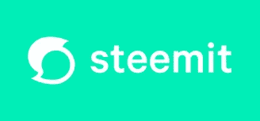
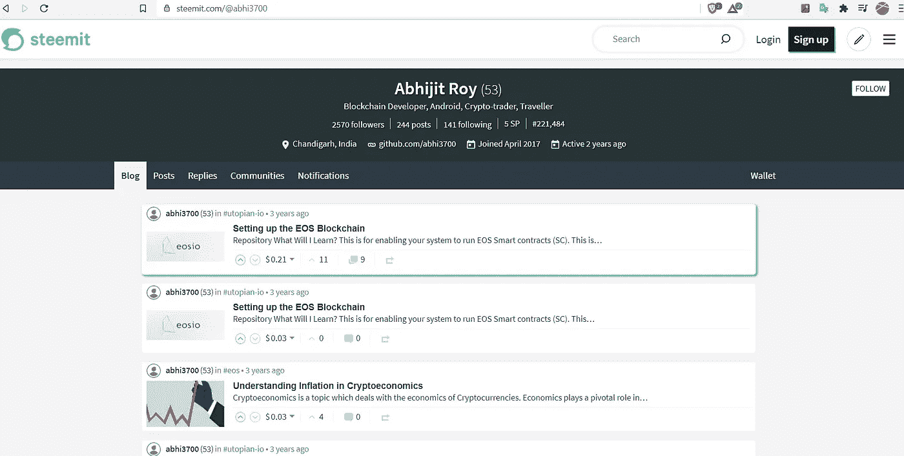
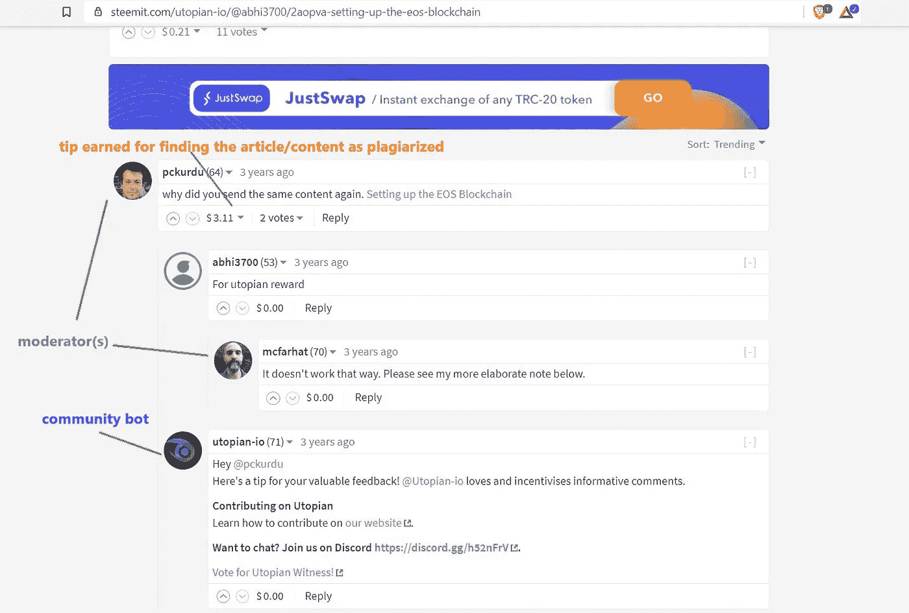

# 使用 Python 学习 Steem 区块链|第 1 部分

> 原文：<https://medium.com/coinmonks/learn-steem-blockchain-using-python-part-1-c35c1f3034c7?source=collection_archive---------1----------------------->

在这个区块链时代，任何新手都可能会迷失在[加密货币的价格](https://coinmarketcap.com/)中。但是有一些真正的区块链应用有足够的潜力，如 [Steem](https://steem.com/) 。

## 关于

Steem 带来了一个全新的应用程序，这与区块链世界不同，在区块链世界中，几乎每个人都从金融用例的角度来考虑问题。Steem 于 2016 年推出平台— [Steemit](https://steemit.com/) :一个为内容创作者&策展人提供激励的社交平台。

Steemit

## 我的故事

嗯，我发现这个潜在的区块链相当晚，大约一年后。

My account: abhi3700 in Steemit platform

这个平台向当时的世界展示了(甚至是现在)，一个真正的社交平台可以无广告运行，内容创作者和策展人可以通过创作原创内容赚很多钱。

对我来说，达到 53 的声誉是一次过山车，并且随着基于对数标度的难度水平的不断增加而完成。这里有多个社区，涉及健康、旅游、美食等。所以，这个平台迎合任何话题。我也给我的一个朋友看了，他真的不相信一个人可以像脸书、Instagram、YouTube 等其他平台那样赚钱，在这些平台上，基于创作者的内容，平台可以赚到数百万、数十亿美元，但内容创作者仅仅通过广告程序就可以赚到几分钱。

作为一名开发者，我沉迷于一个名为[utopia . io](https://steemit.com/utopian-io/@sajanbasnet75/what-is-utopian-io-and-how-to-contribute-on-open-source-project-to-earn-sbd-as-rewards)的社区。在这里，任何程序员都可以根据剽窃规则，为他们选择的任何项目编写独特的代码。收入来自机器人通过小费。基本上，如果违反了任何规则，社区机器人会在下面发表评论，给出进一步工作的指示。还有，版主是来查文章/内容是否抄袭的。*然后社区机器人这样提示版主*:

A plagiarized content in Utopian community in Steemit platform

就创作原创内容而言，这是一次完全改变游戏规则的体验。显然，金钱是任何内容创作者和管理者的最终动机。

我最后一次在 Steemit 上发表文章是在 3 年前。我又回到了将内容放在与 Steemit 相关的媒体上(以及我在这方面的经验)，但是是在使用 Python 和现代工具进行数据分析方面。

暂时就这样了…

敬请关注更多…

如果你对此有什么建议，请告诉我。

谢谢你的时间。

# 跟我来:

电子邮件 电子邮件 电子邮件 电子邮件 电子邮件 电子邮件 电子邮件 电子邮件 电子邮件 电子邮件 电子邮件 电子邮件 电子邮件 电子邮件 电子邮件 电子邮件 电子邮件 电子邮件 电子邮件 电子邮件 电子邮件 电子邮件 电子邮件 电子邮件 电子邮件 电子邮件 电子邮件 电子邮件 电子邮件 电子邮件 电子邮件 电子邮件 电子邮件 电子邮件 电子邮件 电子邮件 电子邮件 电子邮件 电子邮件 电子邮件 电子邮件 电子邮件 电子邮件 电子邮件 电子邮件 电子邮件 电子邮件 电子邮件 电子邮件 电子邮件