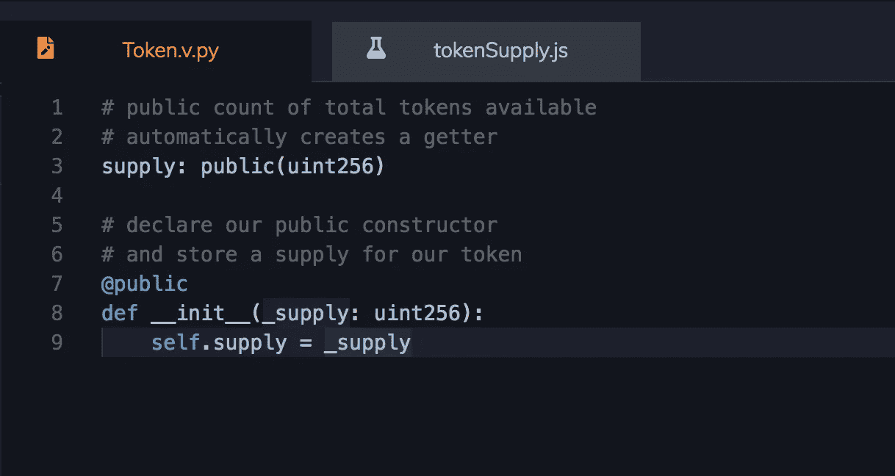
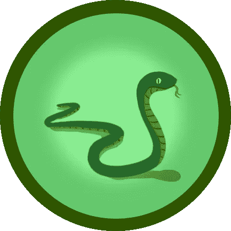

# 从浏览器中学习以太坊语言 Vyper！

> 原文：<https://medium.com/coinmonks/learn-the-ethereum-language-vyper-from-within-your-browser-b084ec51302?source=collection_archive---------4----------------------->

Intro To Vyper Lesson in ChainShot

我们很高兴向大家介绍 [ChainShot 的](https://www.chainshot.com/)首堂针对 [Vyper](https://vyper.readthedocs.io/en/latest/) 语言的互动课。如果你想知道所有的嗡嗡声是关于什么的，这是一个很好的模块让你接触这种语言！

除了介绍课，从现在开始，我们还将发布我们的[每周挑战](/@cody_93216/earn-cash-with-chainshot-challenges-1bd6ecafc1f)在可靠性和 Vyper 两方面！竞争排行榜，在有限的时间内，[赢取奖品](/@cody_93216/earn-cash-with-chainshot-challenges-1bd6ecafc1f)！

**感谢 ETH 奖**

我们想对 ETH Prize[发出欢呼，它的奖金让我们能够追随我们的雄心，为社区创造这种竞争内容。](https://twitter.com/ethprize)

Earn your SNAKE badge!

激动吗？我当然希望如此！

请务必查看[Vyper 简介](https://www.chainshot.com/lessons/5bb2c8ded9f99705a60c62d3/)并在 [Twitter](https://twitter.com/TeamChainShot) 上关注我们，了解更多 Vyper 动态！

> [直接在您的收件箱中获得最佳软件交易](https://coincodecap.com/?utm_source=coinmonks)

