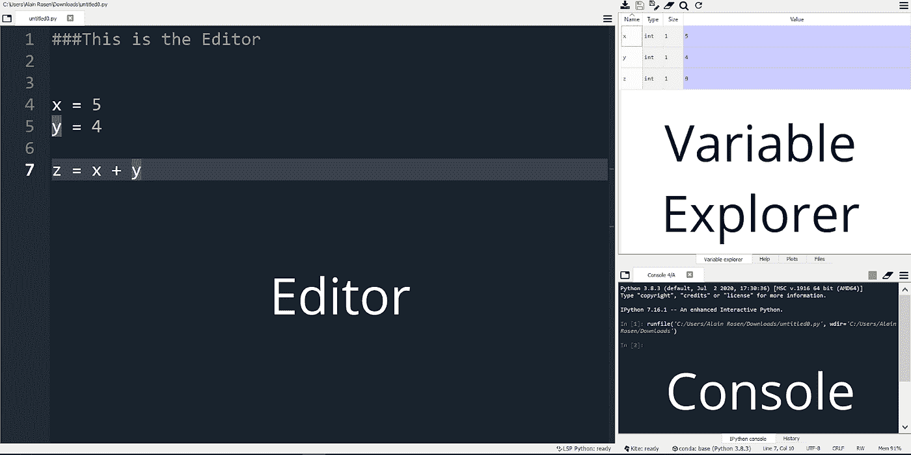
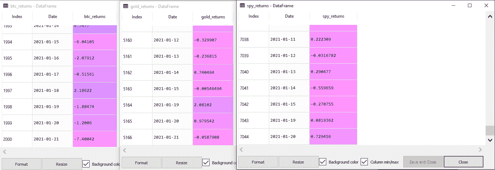

# 通过计算比特币与股票和黄金的相关性来学习编码

> 原文：<https://medium.com/coinmonks/learn-to-code-by-calculating-bitcoins-correlation-to-stocks-gold-be1cdecc3dfd?source=collection_archive---------2----------------------->

## 开始使用 Python——最容易学习和最强大的编程语言之一。

如果你和我一样，你可能会坐在寒冷的家中，思考在日冕出现之前，你是否真的有过社交生活，或者这一切都是幻觉。与其看《网飞》和烘焙另一个酸面团面包，为什么不利用这个机会学习有用的技能，来加速你的职业生涯呢？

学习如何编写代码是一项在许多学科中都非常有用的技能。写代码不仅仅是软件工程师的事情。无论你是从事市场营销、销售、分析还是其他任何工作，知道如何编写代码都可以让你在拥挤的市场中获得急需的优势。它改变了我的生活，希望它也能改变你的生活。

在本文中，我们将通过计算比特币与股市和黄金的相关性来学习 Python 的基础知识。对于那些活了一个 TL 的人；种博士的生活，头到文章的结尾说明如何运行脚本直上。

继续我们的代码。

## 完成本文后，您应该能够:

1.  [**安装**，设置好你的 **Python 工作环境。**](#715b)
2.  [**理解**两项资产之间的**相关性**对你的投资组合意味着什么。](#570d)
3.  [**下载历史数据**为**比特币、**S**S&P500**和**黄金。**](#96bc)
4.  [**使用 **Pandas** 准备数据**进行分析，Pandas 是一个强大的数据包。](#0e10)
5.  [**最后，计算 S & P500 与比特币的相关性，并解读结果。**](#a2d9)

**本教程介绍的基本编程技巧包括:**

*   使用 **pip** 安装软件包并将它们导入到您的程序中
*   编写和使用函数
*   使用各种数据类型(普通变量、列表、字典、熊猫数据框架)
*   使用 API

# 安装并设置 Python 工作环境

有许多方法可以下载和安装 Python，但是最用户友好的方法是使用 Anaconda。通过安装 Anaconda，您可以获得 Python 以及大量有用的包和程序。

你可以在[这里](https://www.anaconda.com/products/individual)找到你的操作系统的 Anaconda 安装程序。

当你等待 Anaconda 下载的时候，享受一些来自 Sassy Justice 的令人捧腹的深度虚假戏谑。

软件包:让你用几个简单的命令完成大量复杂的任务，让你的生活变得更简单。

*IDE 或集成开发环境。这是我们将用来编写代码的编辑器。*

一旦 Anaconda 完成下载，打开 Spyder。这就是奇迹发生的地方。Spyder 的特别之处在于右上角的**变量浏览器**，尤其对于初学者而言。这使得跟踪您的代码并查看每一行如何改变您正在使用的变量变得很容易。

接下来，是时候再安装一个我们在本教程中需要的包了。我们将使用的大多数软件包都预先打包了 anconda，只有一个例外— [yfinance](https://pypi.org/project/yfinance/) 。稍后我们将使用 yfinance 下载股票数据，但现在我们只需要安装它。

我们通过命令行或终端(如果你是 Mac 用户)来实现。如果您不熟悉命令行，可以把它想象成一种在电脑上移动的方式，用文本代替鼠标来做事情。在我们的例子中，我们将只输入一个命令。

句子中的第一个单词“pip”被称为“command ”,它后面是一些论元和子论元。Pip 是 Pythonic 安装软件包的方式。任何时候你在编写 Python 代码并且你需要一个你的计算机上没有安装的包，使用 pip。(还有其他的安装包的方式，比如 conda，但是涵盖了 ins 和 out of conda vs pip 不在我们的讨论范围之内。)

要了解更多关于命令行的内容，请点击这里的阅读 codeacademy 的优秀[教程。](https://www.codecademy.com/learn/learn-the-command-line)

# **了解比特币和股票/黄金的相关性意味着什么**

我们打断你的节目(有意双关),给你带来一些关于你将要做的事情的金融背景。

如果说大多数人对投资有一点了解的话，那就是你不应该把所有的鸡蛋放在一个篮子里。通过分散资产类别，你可以降低整个投资组合的风险。甚至还有一个关于这个的理论，叫做现代投资组合理论。然而，根据 MPT 的观点，多样化只有在一个重要的条件下才能降低风险。

这些资产必须彼此不相关。两种资产之间的相关性是指资产 A 的变动对资产 b 价格的影响程度。为了收获多样化的成果，投资组合中各种资产之间的相关性需要非常低，以便资产 A 价格的变动不会对资产 b 产生太大影响。

当谈到比特币时，它是否与股票和黄金等传统资产无关，将决定它是否成为任何基于 MPT 的投资组合中有吸引力的组成部分。

相关值介于-1 和 1 之间。两项资产之间的相关系数为 1 意味着它们完全同步，而相关系数为-1 意味着两项资产负相关。介于-0.2 和 0.2 之间的任何数字都意味着这两种资产之间的相关性非常小

那么比特币和股票、黄金有关联吗？坚持这个项目，为自己解决问题！

# **下载比特币、S & P500 和黄金**的历史数据

在我们进入脚本的实质内容之前，让我们首先为 Cryptocompare 准备一个 API 键。

目前，这里提供的免费版本[已经足够了。继续注册并激活您的帐户。一旦你激活了你的账户，点击“创建 API 密匙”，选择任何一个选项，给你的密匙起一个名字。](https://min-api.cryptocompare.com/pricing)

维奥拉，你是 API 密匙的骄傲拥有者。我们稍后将回到这一点

事不宜迟，我们去拿数据吧。这是我们编写一些实际 Python 代码的部分。兴奋起来！

首先，我们需要**导入**我们将要使用的包。

> 在整个课程和你的生活中，当你想实际运行代码时，你所要做的就是点击 F5

让我们来看看我们在这里使用的一些小技巧。

1.  创建别名 ***例如 Import pandas as pd*** :在我们的代码中，每当我们需要使用一个包时，我们都显式地调用它。别名为包提供了更容易调用的第二个名称。特别是，在蟒蛇中，将熊猫别名为“pd”是一种常见的做法。
2.  从一个较大的包中导入一个模块、子包或函数，例如 f***rom urllib . request import URL open***:当我们只需要一个函数时，有时我们不想导入整个包。urlopen 就是这种情况——我们用来从互联网上阅读的功能。我们将它从 ***请求*** 子包中导入到更大的 ***urllib*** 包中。

注意代码是如何在每个标签符号后改变颜色的？这是因为，在 Python 中，标签是用来在代码中写注释的。注释有助于向自己和其他程序员解释代码的作用。当程序运行时，注释代码被跳过。

接下来，我们将提取比特币、股票和黄金的历史价格数据。对于前者，我们将使用之前创建的键进行 API 调用。至于股票和黄金， ***yfinance*** 套餐让我们的生活变得简单多了。

让我们先讨论一下 API 请求。

看一看 ***btc_url*** 变量。我们将把它分解成组件，并把它们推广到几乎所有的 API。

1.  **根端点，“**[**https://min-api.cryptocompare.com/data/**](https://min-api.cryptocompare.com/data/v2)**”**:这是您将要请求数据的域。
2.  **Path，" v2/histoday"** :大多数 API 都有不止一种类型的数据可以访问。为了得到你想要的，你需要指定一个路径。把一个路径想象成一个自动应答机，要求你按 1 代表英语，按 2 代表法语，按 3 代表西班牙语等等。在我们的例子中，我们指定我们正在寻找每日历史数据。 ***v2*** 表示这是 Cryptocompare 第二个 API 版本的一部分。路径和根端点统称为“API 端点”
3.  **查询参数，一切结束后？sign:** 因此，我们已经进入端点来搜索每日历史数据。但是我们如何指定我们想要搜索什么资产，以及搜索的其他条件呢？为此，我们使用查询参数。在我们的例子中，我们指定要查找以美元标价的比特币***(fsym = BTC)******(tsym =美元)*** 的历史价格，并将我们的搜索限制在前 2000 个条目 ***(limit=2000。)*** 我们用 ***&*** 符号将我们的查询参数连接在一起。

数据和带宽是稀缺资源，因此大多数 API 不允许你获取信息，除非你注册并验证自己。在我们的例子中，我们在 API 调用中使用查询参数来验证自己。其他 API 可能有其他身份验证方法。

# **使用 Pandas** 准备分析数据

在上一节中，我们使用 *Cryptocompare API* 下载比特币的历史价格数据，使用 *yfinance* 包获得关于 S & P500 的数据。然而，在我们可以计算它们之间的相关性之前，我们需要将数据从我们接收的格式转换成一种易于分析的格式。

这是我们拿出大枪，或大熊猫的时候。Pandas 是一个数据科学库，在进行分析时，它为您提供了比 Python 本身更广泛的选择。在本节的课程中，我们将使用 Pandas 数据框架，这是一种独特的数据结构，可为您的数据提供最大的灵活性。我喜欢把它看作是大男孩和女孩的微软 Excel。

虽然本节中的大部分代码都很简单，但是让我们看看第 16 行。在这一行中，我们希望将每行的时间戳从 UTC 格式转换为人类可读的日期。我们使用 ***strftime*** 函数来实现。但是我们如何将这个函数应用到数据帧中的每一天。为此，我们使用了 [***lambda 函数***](https://realpython.com/python-lambda/) ，这些匿名函数在与 ***apply*** 函数一起使用时，可以对整个数据帧进行计算和转换。

在这一部分的最后，我们有 3 个相同格式的熊猫数据框架，分别用于比特币、S&P500 和股票。每个数据帧有两列，日期(格式为 2021–01–20)和价格。在下一节中，我们将编写一个函数来将数据帧组合在一起，并计算不同资产之间的相关性。

*请注意，变量资源管理器为我们的每项资产显示了一个 2 列数据框架。此外，请注意，P500 和黄金不像比特币那样在周末交易，我们在下一步中必须考虑到这一点。*

我们就快到了，让我们强有力地结束。

# **计算比特币、S & P500 &黄金的相关性，并解读结果**

是时候长大了。到目前为止，我们一直在编写功能性的代码，但并不完全有效。想想我们不得不分别格式化每个数据帧的日期。

避免重复和提高代码水平的一种方法是通过函数。把函数想象成一个迷你程序，它接受一些输入，通过计算运行它，最后返回一些输出。我们的***calculate _ correlation***函数将两个数据帧作为输入，每个数据帧对应一个我们想要比较的资产，并计算它们之间的相关性。

第 3 行发生了一些有趣的事情。

*   我们用了 ***。iloc[]*** 功能用于选择 joint_df 数据帧中的第二列和第三列。选择是在 Pandas 中处理数据的一个至关重要的部分，而 ***iloc*** 函数是最重要的。
*   我们使用 ***计算相关性。corr()*** 连续 30 天的函数

好吧，好吧，我们这里有什么？

2021 年 1 月 21 日，这篇文章的首次出版日期:

比特币和股票的相关性为 0.23
比特币和黄金的相关性为-0.25
股票和黄金的相关性为-0.13

因此，比特币和股票(正)以及比特币和黄金(负)之间似乎存在轻微的相关性。)请记住，这一价值往往会随着市场的波动而起伏。事实上，就在一个月前，比特币和黄金之间的相关性只有区区 0.04。

可怜的金子。它经历了一个月的下跌，而比特币和股票继续攀升，这可以从它与比特币和股票的负相关性看出。

*学习编码的注意事项:这绝不是为了成为一个全面的 Python 资源。更确切地说，对于任何对编码感兴趣的人来说，它是一个有用的起点。边做边学是学习如何编码的最有效的方法，在本教程结束时，您将拥有一个有价值的工具，可以帮助您进行投资。*

*如果你想更进一步掌握 Python，我推荐你从* [*codeacademy 开始。*](https://www.codecademy.com/)

# TL；但是我想运行代码部分

所以你是即时满足型的，你现在需要你的剧本？我也是！

下面是您自己运行脚本并立即计算资产之间的相关性所要做的事情。

1.  下载 Anaconda——Python 套件被称为“雷神之锤”,适用于所有数据。
2.  打开你的命令行/终端，输入***pip install y finance***
3.  在这里下载脚本的完整代码。
4.  使用 Spyder 打开脚本，Spyder 是 Anaconda 附带的 Python IDE(集成开发环境)。
5.  单击 F5 运行脚本。
6.  进入变量浏览器，点击***correlation _ BTC _ spy***变量。这会给你一段时间内比特币&股票之间的相关性。然后点击***correlation _ BTC _ gold***变量得到比特币&黄金之间的相关性。
7.  回过头来阅读整个教程，这样您就能够修改代码并找到任意两个资产之间的相关性。
8.  喝啤酒，你值得一杯。

# 摧毁你对开发者的嫉妒

我不是开发商。在我的科技职业生涯中，这一点对我来说很明显。开发人员，尤其是能够同时掌握众多编码学科的“忍者开发人员”，通常在任何科技公司都处于最高位置。此外，每当我去找工作时，似乎每 1 个非技术职位就有 5 个与开发人员相关的职位。

你可以看到为什么我对开发人员的嫉妒曾经是如此强烈，我相信你们中的许多人在各自的领域对作为二等公民的挫败感有共鸣。

正是通过这样的项目，我才能够克服对开发人员的嫉妒，并在当今饱和的就业市场中更有竞争力地定位自己。

我仍然不是开发人员，也不可能成为开发人员。我的技能和热情不在这里。

但通过学习编码，我能够将自己的内容写作、商业分析和研究能力融入到许多其他人可能不具备的优势中。通过代码实现过程的自动化将使你获得更多的价值，并对你一天中的时间产生更大的影响。

我希望继续这个教育系列，以此来增强我自己和下一波懂技术的专业人士的能力。