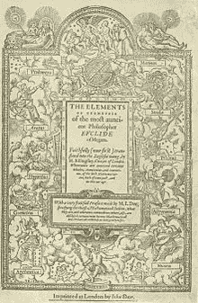
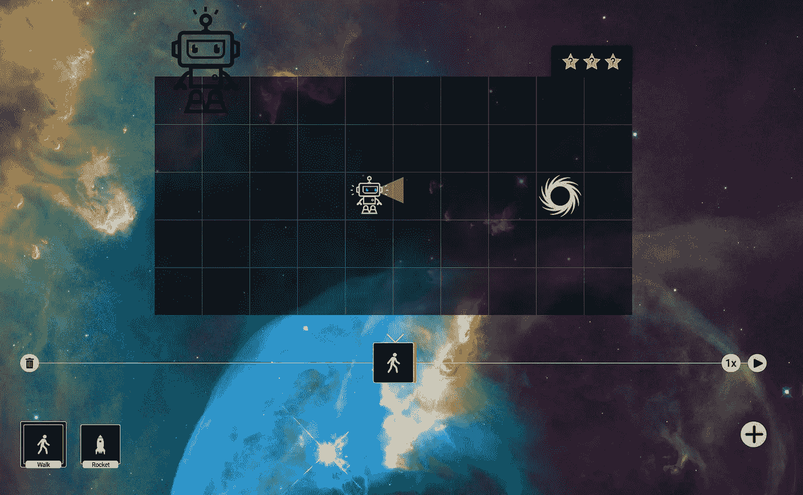

# 使用 Mathbot.com 学习数学和编程:一个有趣、强大的教育工具，适合几乎任何年龄的用户

> 原文：<https://medium.com/coinmonks/learning-math-and-programming-with-mathbot-com-f94819772364?source=collection_archive---------3----------------------->

这篇博客是关于我最近[在播客](https://soundcloud.com/breakingmathpodcast/34-an-interview-with-mathbotcoms-jw-weatherman-1)上听到的一个项目的细节:

# mathbot.com

我在这里分享这一点，作为一个互动益智游戏方法的粉丝，来学习当今如此高需求的棘手的技术主题。我认为它可能是一个非常强大的工具，以一种易于扩展、易于使用且高效的方式将难以学习的技能传授给许多人。我用 mathbot.com 的[玩得很开心。](http://mathbot.com)

为什么数学和编程似乎是当今许多人最害怕的科目？很少听到朋友说类似“你知道，我真的不喜欢高中的那些英语课。”人们总是谈论他们有多讨厌学校的数学课。许多人对数学又爱又恨。

亚伯拉罕·林肯曾经描述他对数学的研究对他的法律实践和理解是绝对必要的。他使用一种数学框架来更好地构建他的论点，清楚地展示证据，并证明证据超越合理怀疑。这怎么可能呢？证明为什么 2 + 2 = 4 的能力实际上与超越合理怀疑证明客户清白的能力增加相关吗？

分类理论提出了一个令人信服的论点，这可能是事实。它假设说，也许逻辑、推理、代数、几何、集合数学和编程在本质上只是大脑感知和处理的更单一形式的语言的不同翻译。

安倍可能比今天的普通律师对数学更感兴趣的原因也可能是他在这个问题上采用了更传统的欧几里得方法。

Euclid’s Elements

这种方法包括*以一种更基本的自下而上的方式进行**数学运算。学生不仅仅是以一种预先格式化的和非常可预测的方式写数学概念。欧几里得的数学方法包括较少的无意识的重复抄写一个人假定知道但很可能*实际上没有以有意义的方式理解的符号*。*

*欧几里得方法起初看起来更令人生畏。然而，如果有足够的时间，一步一步地理解会更容易。每一个陈述或断言都有一个原因或理由。公理、规则和语言都是预先明确列出和定义的。欧几里德对一般几何证明的一般方法通常是这样的。*

**

*这需要以更有意义和更合理的第一手方式理解内容。*

*我一直是 khanacademy.com 的粉丝，并且一直使用到今天。它在帮助我通过大学微积分的大部分考试中发挥了明显的作用。我现在对这个相对较新的开源项目更感兴趣。互动网站是一个游戏，其最终目标是获得当今最强大但难以获得的技能。它以一种不痛苦和乏味的方式做到了这一点！*

**

*从表面上看，这个界面似乎是小孩子的游戏。在实践中，它可能是任何事情，但不是。这款游戏通过真正具有美感的图片和动画积极吸引用户。它不仅仅是一个可以观看的视频或一张需要填写的无聊表格。*

*这是一个你可以玩的在线游戏。在它的基础上，这是一个伟大的，直接的方式与材料和需要解决的问题。*

*mathbot.com 最酷的地方之一是你可以在游戏中用金钱来奖励获胜的等级。可能没有比这更好的方式让这个主题更容易接近，更值得花时间去做。这段摘录来自对该项目的创始人 J.W. Weatherman 的采访:*

> ***要花钱吗？***
> 
> *没有。它是完全免费的，并将永远免费。我们确实计划很快接受捐款，并有一个额外的体验，祖父母或父母可以支付比特币来奖励掌握主题的孩子——我们计划保留 10%给项目贡献者，但你永远可以免费玩所有的关卡。*

*在这个过程中，用户也在进行[功能编程](https://en.wikipedia.org/wiki/Functional_programming)。许多人发现这是一种更难学会使用的编程语言。也许不一定要这样。通过不直接看到语法，任务可能看起来更可行，不那么吓人。*

*作为一个数学和编程经验稍高于平均水平的人，我发现这是一个非常好的时机！我希望我年轻的时候也能拥有它。到今天为止，我在 40 级中的第 6 级。*

*我欣赏 mathbot.com 的最后一点是它的开源性。我过去有过一些使用开源产品的经验。我的经验主要是微软 Office 替代品， [LibreOffice](https://www.libreoffice.org/) 和开放操作系统， [Linux](https://www.linux.org/) 。长期以来，我一直是 Word 和 Mac 的忠实粉丝，我一直认为 UX 物有所值。毫无疑问，Word 和 Mac 是更好看的产品。然而，作为一名工程师，我看重的是[以更加](https://opensource.com/article/17/10/6-reasons-choose-open-source-software)[严肃和透明的方式](https://dwheeler.com/oss_fs_why.html)学习和理解产品的能力。这并不完美，但我认为开源社区培养了更多健康的志愿精神和对最终消费者智力的尊重。*

*知道我可以打败游戏，然后帮助构建游戏，这很酷。我打算这样做，并期待着许多预期的个人挑战。*

*毕竟，你可能也会发现这是一件有趣且值得努力的事情。在机器人*试图给你*编程之前，尝试给机器人编程可能是值得的。今天，你可以通过给机器人@[mathbot.com](http://mathbot.com)编程，找到更多信息，注册，并开始掌握你从来不知道自己能掌握的复杂的数学概念！你也可以在 [twitter @MathBot_dotcom](https://twitter.com/MathBot_dotcom) 上关注这个项目。*

> *[直接在您的收件箱中获得最佳软件交易](https://coincodecap.com/?utm_source=coinmonks)*

**