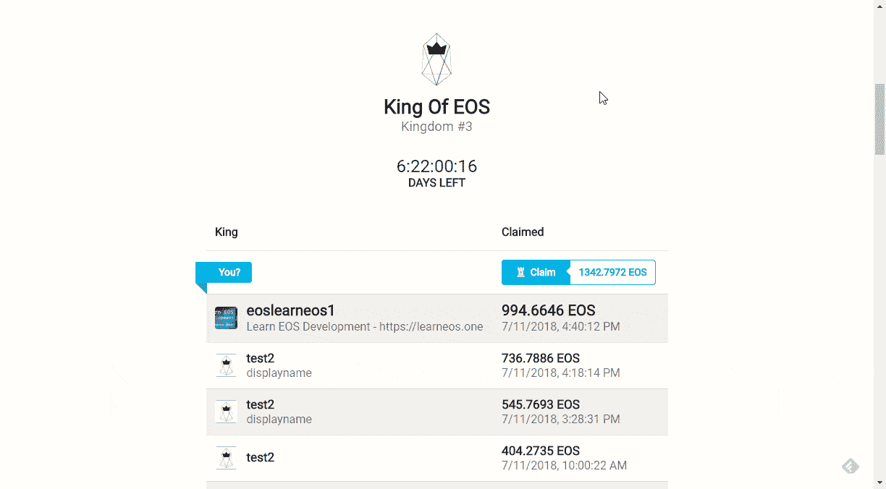

# 在 EOS 区块链上构建我的第一个 dapp 的经验

> 原文：<https://medium.com/coinmonks/learnings-from-building-my-first-dapp-on-eos-blockchain-4ae046c09b78?source=collection_archive---------4----------------------->

最近我在 EOS 区块链上发布了[我的第一个去中心化应用](https://cmichel.io/releasing-my-first-eos-dapp/introducing-king-of-eos)，EOS 之王。

这是一个游戏，玩家通过支付比前一个竞争者更多的钱来争夺王位，并通过这种方式获得 EOS。👑

这篇文章将会谈到开发方面的事情，去[这里](https://cmichel.io/releasing-my-first-eos-dapp/introducing-king-of-eos)了解更多关于游戏的信息。

它由一个简单的智能合约组成，约 200 行代码和一个用 React(带 next)编写的前端。

## 前端

前端我就不多说了，因为这是一个用 React 写的标准静态站点，用 [next](https://github.com/zeit/next.js/) 。想想看，它并不是那么标准——它使用 WebGL 和 **Three.js** 通过渲染带有自定义旗帜和随机生成的 3D 地形的城堡来真正可视化王国。


## 与区块链的沟通

为了与区块链沟通，我使用了 eosjs。我将状态保存在区块链上智能合约的数据库中，我的前端使用`eosjs`读取国王表和*名人堂*。

```
import Eos from 'eosjs'

const host = process.env.EOS_NETWORK_HOST
const port = process.env.EOS_NETWORK_PORT
const chainId = process.env.EOS_NETWORK_CHAINID

const network = {
    blockchain: `eos`,
    protocol: `https`,
    host,
    port,
    chainId,
}

const eos = Eos({ httpEndpoint: `${network.protocol}://${network.host}:${network.port}` })

const ROWS_LIMIT = 99999

const getKings = () => eos
        .getTableRows({
            json: true,
            code: `kingofeos`,
            scope: `kingofeos`,
            table: `claims`,
            table_key: `kingdomKingIndex`,
            lower_bound: 0,
            upper_bound: -1,
            limit: ROWS_LIMIT,
        })
        .catch(console.err)

export { network, getKings }
```

## 用户与区块链的交互

更有趣的是如何让用户使用前端作为区块链的接口与我的智能合同进行交互。现在最好的方法是使用[散布](https://get-scatter.com/)。这是一个安全的 Chrome 扩展，可以充当钱包。用户导入他们的私钥，扩展注入一个 API，允许从我的前端代码中请求事务签名。当然，Chrome 扩展运行在自己的沙箱中，私钥永远不会泄露给网站。与 Scatter 通信的唯一方式是通过其注入的 API。

比方说，一个用户想成为 EOS 之王，并要求王位:他会点击`Claim`，在一个模态中填写他的信息，然后我的前端代码使用`eosjs`构建事务，然后请求 Scatter 签署事务。将向用户显示一个弹出窗口，用户可以在其中查看交易并接受交易。



下面是这样做的`redux`动作:

```
export const scatterClaim = ({
    displayName,
    imageId,
    claimPrice,
}) => (dispatch, getState) => {
    const { scatter, network, scateos } = getState().scatter
    let accountName
    const memo = `${displayName};${imageId};`

    // if there is no identity but forgetIdentity is called
    // scatter will throw "There is no identity with an account set on your Scatter instance."
    const clearIdentityPromise = scatter.identity
        ? () => scatter.forgetIdentity()
        : () => Promise.resolve()
    return clearIdentityPromise()
        .then(() => scatter.getIdentity({ accounts: [network] }))
        .then(identity => {
            if (!Array.isArray(identity.accounts) || identity.accounts.length < 1)
                throw new Error(`No identity`)
            accountName = identity.accounts[0].name
        })
        // get the eosio.token contract and call its `transfer` action
        .then(() => scateos.contract(`eosio.token`))
        .then(contract =>
            contract.transfer(
                accountName, `eoskingofeos`, `${claimPrice} EOS`, memo,
            )
        )
        .then(resolve => {
            console.log(`success`)
            dispatch({ type: `CLOSE_MODAL` })
            // wait 2 seconds to make block irreversible
            setTimeout(resolve, 2000)
        })
        .then(() => {
            // and then fetch new kings
            fetchCurrentKingdom()(dispatch)
        })
        .catch(err =>
            // logout on error and re-throw the error to the UI
            scatter.forgetIdentity().then(() => {
                throw err
            }),
        )
}
```

## 后端

## 工作流程

后端是用`C++`编写的智能合约，编译成 WebAssembly，然后部署到 EOS 区块链。与任何 EOS 代码交互的通常方式是使用 nodeos 运行您自己的本地**节点，该节点生成包含区块链事务的块，并使用`cleos` CLI 对您的节点运行所有命令。这包括在区块链上创建帐户、解锁钱包、编译合同、部署合同、调用已部署合同上的操作等。**

我在开发时通过 Windows 的 Linux 子系统在 Windows 上运行节点(`nodeos`)，有时它变得没有响应，我必须杀死它，然后重新做整个过程。

因此，我为我的工作流程构建了许多工具。我建立了一个 NPM 项目，并使用 Node with [eosjs](https://github.com/EOSIO/eosjs) 代替了所有的`cleos` CLI。最后，我只是再次运行 NPM 脚本，我和大多数 web 开发人员都觉得这非常方便。

我只需运行`npm run deploy`将我的智能合约部署到我的本地节点，然后运行`npm run @transfer`对我部署的智能合约执行转移操作。如果有兴趣，我可以创建一个脚手架工具`create-eos-app`，它已经建立了一个这样的 EOS 项目，类似于`create-react-app`。

## 智能合同

智能合约只有大约 200 行 C++代码。关于 EOS 开发的教程并不多，但是一旦你弄清楚它是如何工作的，并且阅读了其他契约的代码，编写起来就相当容易了。我正在写一本关于 EOS 全栈开发的书，让人们更容易入门。

智能合约的代码[可以在 GitHub](https://github.com/MrToph/KingOfEos/blob/master/contract/contract/KingOfEOS.cpp) 上找到，如果你想看看的话。

## 优化 RAM 的使用

每个智能合同都与部署智能合同的相应 EOS 帐户相关联。该 EOS 帐户需要特定数量的 RAM 来保存智能合约(webassembly)代码和存储数据库条目。只有有限的内存可用(64GB ),这是一个自由市场。也就是说，价格是由供求关系决定的，最近投机者对价格上涨很感兴趣。

那时候买 1 KB 内存要 0.32 EOS。最新价格可以在 eos.feexplorer.io 上查询[。这意味着**契约及其数据库**的大小将直接决定开发者需要为智能契约支付多少费用。](https://eos.feexplorer.io/)

**一个 EOS 智能合约需要多少 RAM？**

估计数据库所需的**内存量非常简单。它与序列化数据条目的字节数成比例，这很容易计算。在我的例子中，这是我为每个新的王座声明存储的 C++结构:**

```
struct claim_record
{
    // upper 56 bits contain kingdom order, lower 8 bits contain kingOrder
    uint64_t kingdomKingIndex; // this also acts as key of the table
    time claimTime; // is 64 bit
    account_name name; // typedef for uint64_t
    std::string displayName; // restricted in my code to max 100 chars
    std::string image; // restricted in my code to 32 chars

    uint64_t primary_key() const { return kingdomKingIndex; }
    EOSLIB_SERIALIZE(claim_record, ...)
};
```

我们只需合计每个字段所需的字节数:

```
8bytes + 8bytes + 8bytes + 100bytes + 32bytes (+114 bytes unknown overhead) = 270bytes
```

优化`struct` s 很难，但我做的一件事是在单个`uint64_t`的高位和低位编码游戏的当前回合和国王指数。

估计 EOS smart 合同需要的内存数量要困难得多，我只能在将它部署到区块链后检查它。

以下是我注意到的一些情况，它们将帮助您减少 EOS 合同所需的内存数量:

*   web 程序集编译器足够智能，可以排除您在合同中不使用的头文件和函数定义。于是就有了[死码消除](https://en.wikipedia.org/wiki/Dead_code_elimination)。没有必要注释掉未使用的头文件。
*   **不使用** `**std::to_string**` **为你节省 188.3 KiB** (当时 71 EOS / 500 美元)。最初，我用它在一条`assert`消息中打印一个数字。删除它节省了我很多内存。
*   将函数标记为`inline`通常也会减少你的契约的大小。
*   我检查了其他一些我可以优化的第三方函数，最终用我自己的实现替换了`boost::split`的字符串分割函数。它将 RAM 需求又降低了 20 KiB。

导致**智能契约需要部署 200 个 KiB** (不包括存储条目所需的动态 RAM 量)。使用 [EOS 资源规划器](https://www.eosrp.io/#calc)我计算出我需要为 220 KiB 的内存支付 70 EOS。对于一份真正简单、优化的智能合同来说，这大约是 500 美元。如果我不做优化，我会付双倍的钱。

> 更新:上个月内存价格减半。所以现在大约是 250 美元——但是 RAM 价格的高波动性使它很难计划。

与以太坊相比，开发者需要支付很多费用，这可能会阻碍新开发者在 EOS 上开发。对于独立开发者来说，制作有趣的小项目来开始，这太多了。

## 结论

我希望这篇文章能让你对我如何开发我的第一个 EOS dapp 有所了解，并提供一些简单的技巧来减少你的 EOS 智能合约所需的内存量。

从开发人员的角度来看，很高兴看到 RAM 已经下降到 0.17 EOS / KB，尽管这对非营利项目来说仍然太多。肯定需要更多的工具，运行`cleos`变得很烦人。但是 EOS 只有 2 个月大，所以我期待更多。

最初发布于 [cmichel.io](https://cmichel.io/releasing-my-first-eos-dapp/)

