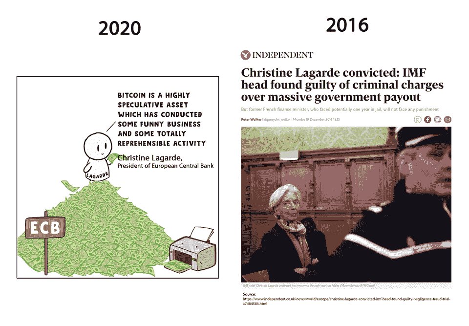
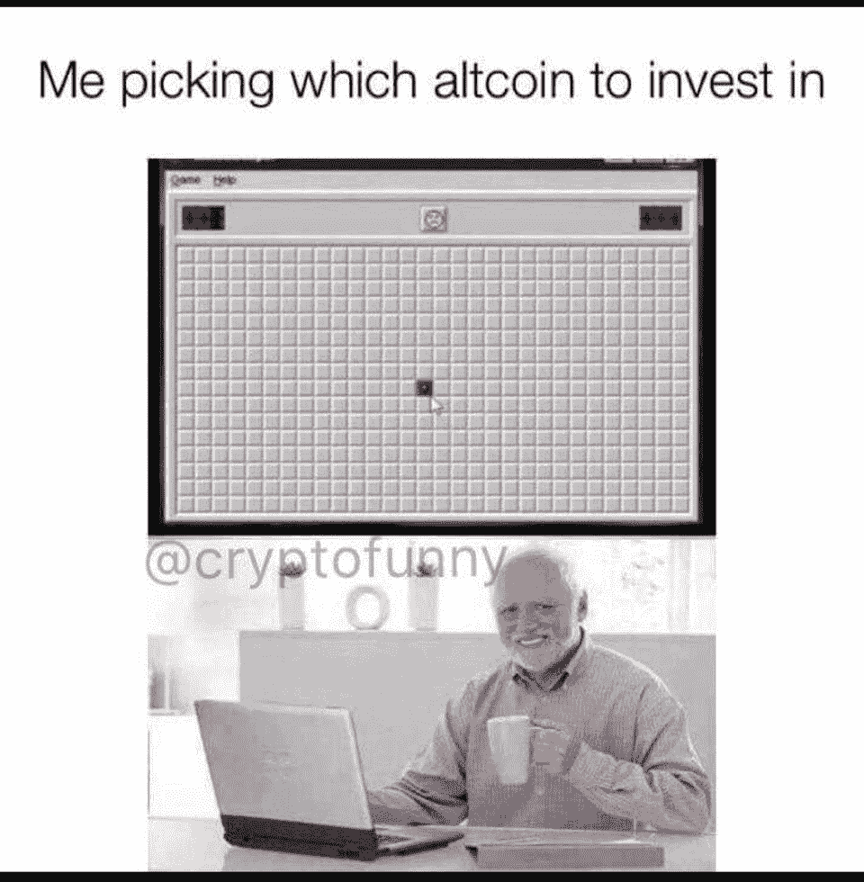
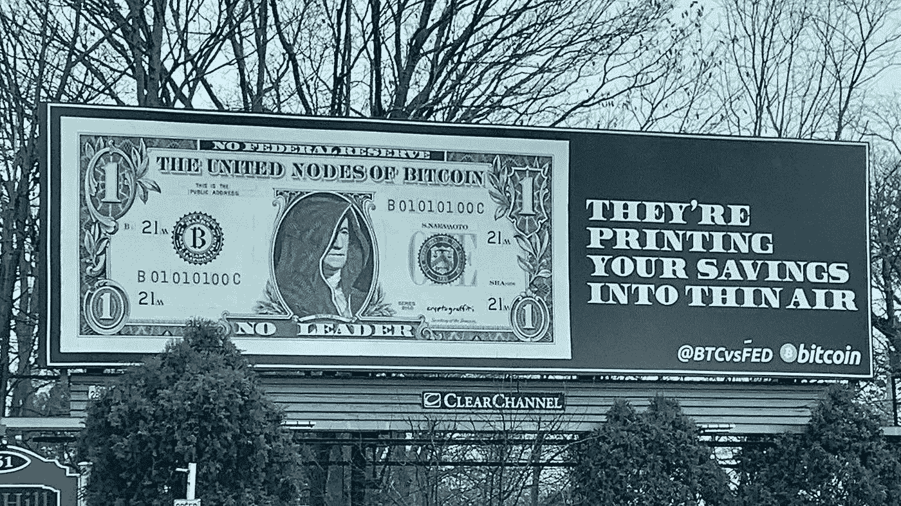

# 分类账数据泄露|安克雷奇，第一家联邦特许的数字资产银行

> 原文：<https://medium.com/coinmonks/ledger-data-leak-anchorage-first-federally-chartered-digital-asset-bank-747fffe9d1d6?source=collection_archive---------4----------------------->

[Source](https://www.reddit.com/r/Bitcoin/comments/kwu5ds/la_pot_kettle/)

## 灰度转储 XRP |前 CFTC 主席 Gary Gensler 被任命为 SEC 负责人

*   在出售其数字大盘股基金中的所有 XRP 一周后，加密资产管理公司 gray Investments 将终止其 XRP 信托。
*   货币监理署(OCC)已有条件批准安克雷奇申请国家信托特许，这使得安克雷奇数字银行国家协会成为历史上第一家联邦特许的数字资产银行。

## [Pionex](http://blog.coincodecap.com/go/pionex)

试试 [Pionex](http://blog.coincodecap.com/go/pionex) ，一个专业的加密交易所，有免费的加密交易机器人来自动化你的交易。阅读我们的 [Pionex 评论](/coinmonks/pionex-review-exchange-with-crypto-trading-bot-1e459d0191ea)，查看我们的[最佳加密交易机器人](/coinmonks/crypto-trading-bot-c2ffce8acb2a)列表。

> 如何[在牛市中赚更多的利润](/coinmonks/how-to-make-more-profits-in-the-bull-market-with-leveraged-token-f0e6328dab04)

## 最新消息📰

*   另一个[总账数据通过 Shopify 泄露](https://twitter.com/Ledger/status/1349375083891011591)
*   FinCEN [延长针对旨在填补某些可兑换虚拟货币和数字资产交易的反洗钱监管空白的规则的意见征询期](https://www.fincen.gov/news/news-releases/fincen-extends-comment-period-rule-aimed-closing-anti-money-laundering)
*   前 CFTC 主席加里·詹斯勒被乔·拜登任命为证券交易委员会主席
*   灰度到[解散 XRP](https://decrypt.co/54088/grayscale-to-dissolve-xrp-trust-due-to-secs-ripple-lawsuit) 信托由于 SEC 的涟漪诉讼
*   [安克雷奇数字银行](/anchorage/introducing-anchorage-digital-bank-the-first-federally-chartered-digital-asset-bank-7f9b9b4e0fd5)，第一家联邦特许的数字资产银行
*   据说高盛、摩根大通和花旗都在关注加密托管
*   迈阿密市长[考虑比特币投资](https://www.foxbusiness.com/technology/miami-mayor-bitcoin-invest-cryptocurrency)创造加密温床
*   NYDIG 首席执行官表示，大型机构只对比特币感兴趣
*   AC 米兰[雇佣区块链](https://cointelegraph.com/news/ac-milan-employs-blockchain-to-reach-450-million-fans-amid-covid-lockdowns)在 COVID 封锁期间接触 4 . 5 亿球迷
*   总部位于 T4 的 Nexus Mutual 将其分散的“保险”业务扩展到集中的交易所
*   乐观的[基于以太坊的扩展](https://www.theblockcrypto.com/linked/91524/optimisms-ethereum-based-scaling-solution-has-soft-launched-on-mainnet)解决方案已经在 mainnet 上试运行

> *报税季即将来临，使用最好的* [***加密报税软件***](/coinmonks/best-crypto-tax-tool-for-my-money-72d4b430816b) *来申报你的加密报税吧。*

[Source](https://www.reddit.com/r/CryptoCurrency/comments/ky95i9/picking_for_alt_season/)

> BlockFi 首次推出加密奖励信用卡。在日常购物中获得 1.5%的比特币奖励。[现在加入等候名单](http://blog.coincodecap.com/go/blockfi)。

## 好的读物📑

*   比特币[挖掘报告](https://coinshares.com/research/bitcoin-mining-network-december-2019)
*   矿工们喜欢 1559
*   比特币[不浪费](https://unchained-capital.com/blog/bitcoin-does-not-waste-energy/)能量
*   如何在 iphone 上使用[全节点比特币钱包](https://www.keepitsimplebitcoin.com/fully-noded-bitcoin)
*   以太坊的经济分析
*   早先的 [MtGox 支出](https://blog.wizsec.jp/2021/01/earlier-mtgox-payouts-coinlab.html)？没有感谢 coinlab
*   关于 [SNX、ESD、BNT 和寿司](https://ournetwork.substack.com/p/our-network-issue-54)和[1 英寸令牌](https://ournetwork.substack.com/p/our-network-deep-dive-1)分析的报道
*   [比特短路](https://crypto-anonymous-2021.medium.com/the-bit-short-inside-cryptos-doomsday-machine-f8dcf78a64d3):密码末日机器内部
*   [如何解释](https://nymag.com/intelligencer/2021/01/why-is-bitcoin-making-new-all-time-highs.html)比特币的死灰复燃？
*   [灰度信任](/coinmonks/grayscale-trust-and-the-effect-on-crypto-prices-3bbd49d6fcb7)和对加密价格的“影响”
*   什么时候[尾巴摇狗](https://www.placeholder.vc/blog/2021/1/13/when-does-the-tail-wag-the-dog-curvature-and-market-making)？曲率和做市
*   视频直播，[审查阻力](https://petkanics.medium.com/live-video-censorship-resistance-and-responsibility-c6bc772db6d3)，责任
*   政府支持的比特币矿工时代已经到来
*   为什么比特币不是庞氏骗局:一点一点
*   2021 年需要注意的 5 个比特币指标
*   通货膨胀、国债、激励调整和公平发行
*   AMM LPs 和[层 2 在次](https://doseofdefi.substack.com/p/amm-lps-and-layer-2-in-times-of-market)的市场波动

> *买一个* [***硬件钱包***](/coinmonks/the-best-cryptocurrency-hardware-wallets-of-2020-e28b1c124069)*[*保护你的加密货币*](/coinmonks/how-to-prevent-cryptocurrency-hacking-and-theft-from-your-wallet-65c8ff767766) *。**

**

*[Source](https://www.reddit.com/r/Bitcoin/comments/kmof53/the_8_laws_of_bitcoin_updated/)*

## *开发商*

*   *[元掩码提供程序的重大变更](/metamask/breaking-changes-to-the-metamask-provider-are-here-7b11c9388be9)正在进行*
*   *用于分布式 Web 的名称解析器*
*   *比特币[核心 0.21.0](https://bitcoinmagazine.com/articles/bitcoin-core-0-21-0-released-whats-new) 发布:有什么新内容？*
*   *Eth2 中的[新功能](https://hackmd.io/@benjaminion/eth2_news/https%3A%2F%2Fhackmd.io%2F%40benjaminion%2Fwnie2_210115)*
*   *[罩衫](https://soliditydeveloper.com/smock):安全帽强大的嘲讽工具*
*   *如何[监控你的 eth2 验证器](https://consensys.net/blog/developers/how-to-monitor-your-eth2-validator-and-analyze-your-pl/)并分析你的 p & l*
*   *可读[以太坊交易](https://blog.gridplus.io/readable-ethereum-transactions-a-new-standard-945c5e9ef2c7):新标准*
*   *通往[功能轻客户端的曲折道路](https://snakecharmers.ethereum.org/the-winding-road-to-functional-light-clients/)*
*   *[介绍不宁](/ethworks/introducing-restless-validations-for-ts-ethereum-and-express-js-ec2ef55b0005):TS、以太坊、Express.js 的验证*

> *想成为一名以太网和 **Web3 开发者**？[从这里开始](http://blog.coincodecap.com/go/learn)。*

## *多方面的*

*   *[ethers . RS](https://github.com/gakonst/ethers-rs/)—rust 中完整的以太坊和 Celo 钱包实现和实用程序*
*   *比特币[内存池](https://mempool.emzy.de/de/tx/057954bb28527ff9c7701c6fd2b7f770163718ded09745da56cc95e7606afe99)浏览器*
*   *[调查比特币](https://www.lookintobitcoin.com/)*
*   *[配合](https://github.com/withtally)——利用安全帽部署复合型治理体系*

## *播客和视频💽*

*   *Vijay Boyapati 的终极比特币 101*
*   *第四个密码周期 |克里斯·狄克逊*
*   *白帽面板 : DeFi 漏洞*
*   *[神秘资产](https://epicenter.tv/episodes/373)——数字投资的未来*
*   *DeFi 贷款平台如何[清算](https://www.youtube.com/watch?v=ieQwjhIm4Lk&feature=youtu.be)*

**

*[source](https://www.reddit.com/r/CryptoCurrency/comments/kyfuuj/my_struggle_during_this_bull_run/)*

## *加密交易和折扣🔖*

*   *注册参加 [**Bybit**](/coinmonks/bybit-exchange-review-dbd570019b71) 兑换，赢取高达 625 美元的奖金。*
*   *在 [**Bityard**](https://blog.coincodecap.com/go/bityard) 获得 258 美元的交易费折扣*
*   *试用 [**Coinrule**](https://webapp.coinrule.io/coupon/coinmonks-7-25-3-e2bf6c60e795407381edf98d1a174ac2?fp_ref=coincodecap) ，使用 [**此链接**](https://webapp.coinrule.io/coupon/coinmonks-7-25-3-e2bf6c60e795407381edf98d1a174ac2?fp_ref=coincodecap) 可获得 7 天免费试用和 3 个月 25%优惠。*

## *产品评论和其他加密软件📙*

*   *[Bityard 审查](https://blog.coincodecap.com/bityard-reivew)*
*   *[Vauld 审查](https://blog.coincodecap.com/vauld-review)*
*   *莱杰 vs 特雷佐*
*   *[区块链审查](/coinmonks/blockfi-review-53096053c097)*
*   *[AAX 交易所评论](/coinmonks/aax-exchange-review-2021-67c5ea09330c)*
*   *[bits gap vs 3 commas vs quad ency](/coinmonks/bitsgap-vs-3commas-vs-quadency-must-read-2021-cdc1a40cf31d)*
*   *[Cryptohopper vs HaasBot](https://blog.coincodecap.com/cryptohopper-vs-haasbot)*
*   *密码复制交易机器人*
*   *[总账与 n 平均](https://blog.coincodecap.com/ngrave-vs-ledger)*
*   *你的密码可以获得 12%的利息*

*想让我们展示你的产品吗？请通过 [Twitter @coinmonks](https://twitter.com/coinmonks) 联系我们*

**

*[Source](https://www.reddit.com/r/Bitcoin/comments/kxfg63/more_bitcoin_billboards_are_up_new_contests_to/)*

## *乔布斯👷*

*   *[开发工程师](https://remoteok.io/remote-jobs/100451-remote-devops-engineer-district0x)，0x 区，远程*
*   *[生态系统开发者](https://jobs.lever.co/3box/ec1093c5-ed31-483c-b1b3-49b07bd0bd2e)，3 盒，远程*
*   *[位于 mStable 的 BD](https://angel.co/company/mstable/jobs/1096364-business-development-manager)*
*   *动作设计师 —北海巨妖*
*   *[全栈工程师](https://cryptocurrencyjobs.co/engineering/zapper-full-stack-engineer/) —扎珀*
*   *[高级前端工程师](https://cryptocurrencyjobs.co/engineering/uma-senior-front-end-engineer/) —乌玛*
*   *SigmaPrime，[区块链安全工程师](https://blog.sigmaprime.io/blockchain-security-engineer.html)*
*   *0x 寻找各种类型的[开发人员](https://0x.org/about/jobs)和一名[抹茶营销经理](https://boards.greenhouse.io/0x/jobs/4923909002)*
*   *Nexus Mutual: [在欧洲时区经历了稳健发展](https://angel.co/company/nexus-mutual-1/jobs/967538-smart-contract-engineer)*

## *在 Coinmonks 上发布*

*如果你喜欢在 crypto/区块链空间上写教育文章，并且想在 Coinmonks 出版物上发表。只需在***【gaurav@coincodecap.com】****或者 DM 我**[***推特***](https://twitter.com/coinmonks)**