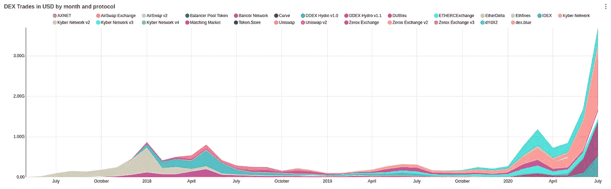

# 账本黑客，比特币和黄金价格上涨和 DeFi 繁荣

> 原文：<https://medium.com/coinmonks/ledger-hack-bitcoin-and-gold-price-rises-and-defi-boom-9668f766af06?source=collection_archive---------3----------------------->

## 各国政府都在认真考虑在全球发行以区块链为基础的本国货币

嘿，

我希望你是安全的。让我们开始本周的更新。

热爱区块链和数据？ [Bitquery](https://bitquery.io/) 正在寻找远程前端开发者，把你的简历发到 [hello@bitquery.io](mailto:hello@bitquery.io) 。

DEX volume reached $3.7 billion in July — [Bloxy](https://stat.bloxy.info/superset/dashboard/dex/?standalone=true)

## 秘密交易🆓

想在收件箱中直接收到最新的加密交易吗？报名 [***这里***](https://coincodecap.com/)

*   [Holderlab](https://coincodecap.com/product/holderlab-0?scroll=deal) —自动化您的加密产品组合
*   [CoinTracking](https://coincodecap.com/product/cointracking-8?scroll=deal) —加密税务解决方案九折优惠

对密码交易机器人感兴趣的加入本 [**电报频道**](https://t.me/mocbchat) 。

## 最新消息📰

*   [Ledger wallet 商店数据泄露，约 100 万封电子邮件受损](https://cointelegraph.com/news/data-breach-at-crypto-wallet-firm-ledger-exposes-users-personal-info)
*   [Synthetix 推出多个 Dao 以加强分权治理](https://blog.synthetix.io/synthetix-foundation-decommissioned/)
*   [DeFi 快速贷款飙升至每天超过 1.3 亿美元](https://decrypt.co/37038/defi-flash-loans-skyrocket-100-million-per-day)
*   [平衡器——没有那么多审查阻力](https://twitter.com/intocryptoast/status/1288406418375073792)
*   [SEC 批准以太坊区块链本土投资基金](https://www.coindesk.com/arcoins-blockchain-traded-fund-arca-tokensoft)
*   [比特币挖矿在印度合法吗？矿工还不知道](https://www.coindesk.com/is-bitcoin-mining-legal-in-india-miners-still-dont-know)
*   [日本高级官员表示，数字日元现在是日本央行的“首要任务”](https://www.coindesk.com/digital-yen-now-top-priority-for-japan-central-bank-says-senior-official)
*   [瑞士交易所列出全球首个活跃比特币 ETP](https://www.coindesk.com/actively-managed-bitcoin-etp)
*   [以色列证券交易所称将推出证券借贷区块链平台](https://www.coindesk.com/israels-stock-exchange-blockchain-platform-securities-lending)
*   [随着比特币突破 11000 美元，黄金价格创下历史新高](https://www.coindesk.com/gold-reaches-all-time-high-as-bitcoin-breaks-above-11k)
*   [85%的意大利银行正在 Corda 上交换银行间转账数据](https://www.coindesk.com/85-of-italian-banks-are-exchanging-interbank-transfer-data-on-corda)
*   菲律宾中央银行正在考虑发行自己的数字货币

## ☺️的好作品

*   [YFI，由网络解释](/@Weeb_Mcgee/yfi-explained-by-weeb-90a4e545aa3e)
*   [DeFi 覆盖—我们的网络](https://ournetwork.substack.com/p/our-network-issue-31)
*   [我投资比特币的 3 个理由](https://www.lynalden.com/invest-in-bitcoin/)
*   [Gitcoin 赠款第 6 轮回顾](https://vitalik.ca/general/2020/07/21/round6.html)
*   [黑色星期四内存池操纵的证据:Hammerbots、内存池压缩和自发阻塞事务](https://blog.blocknative.com/blog/mempool-forensics)
*   [YFI 公平上市、治理和价值的故事](https://insights.deribit.com/market-research/yfi-a-tale-of-fair-launch-governance-and-value/)
*   [关于以太坊 2.0 你需要知道的一切](https://www.coindesk.com/everything-you-need-to-know-about-ethereum-2-0)
*   [迈克尔逊形式化验证框架](/coinmonks/formal-verification-framework-for-michelson-9057202095a4)
*   [编码可升级智能合约](/coinmonks/coding-upgradeable-smart-contracts-fadf808cc7ee?source=friends_link&sk=09ce145ce3379c4975554798cd0c21f4)
*   [如何制作加密货币交易机器人](/coinmonks/how-to-make-a-cryptocurrency-trading-bot-f94172e0c7bd)
*   [在 10 分钟内创建一个类似鲸鱼警报的服务](https://blog.bitquery.io/crypto-alert-service-like-whale-alert)

## 多方面的

*   [链分析新市场英特尔仪表板](https://markets.chainalysis.com/)
*   稳定的增长
*   [Eth2.0 testnet Medalla 将于 2020 年 8 月 4 日启动](https://blog.ethereum.org/2020/07/23/eth2-quick-update-no-13/)
*   [Hashrate Index，一个比特币挖矿透明度的在线工具](https://hashrateindex.com/coin/bitcoin)
*   使用 N.exchange 在一小时内建立一个加密交换

> *加入我们的* [***电报频道***](https://t.me/joinchat/FyuZERD5oyp6LWbwLASOKQ)**来谈谈新的加密产品和区块链生态系统。**

# *在 Coinmonks 上发布*

*如果你喜欢在 crypto/区块链空间上写教育文章，并且想在 Coinmonks 出版物上发表。只需在**发邮件给我或者 DM 我**[***推特***](https://twitter.com/coinmonks)***

> ****“我们是一个非宣传性和非营利性的教育出版物，如果你喜欢阅读***[*你也可以捐助我们*](/coinmonks/monks-need-your-help-7440418d67ec) *。******

> ***[*在您的收件箱中直接获得最佳软件交易*](https://coincodecap.com/?utm_source=coinmonks)***

******

******暂时就这样，送我❤️，下次再说。******