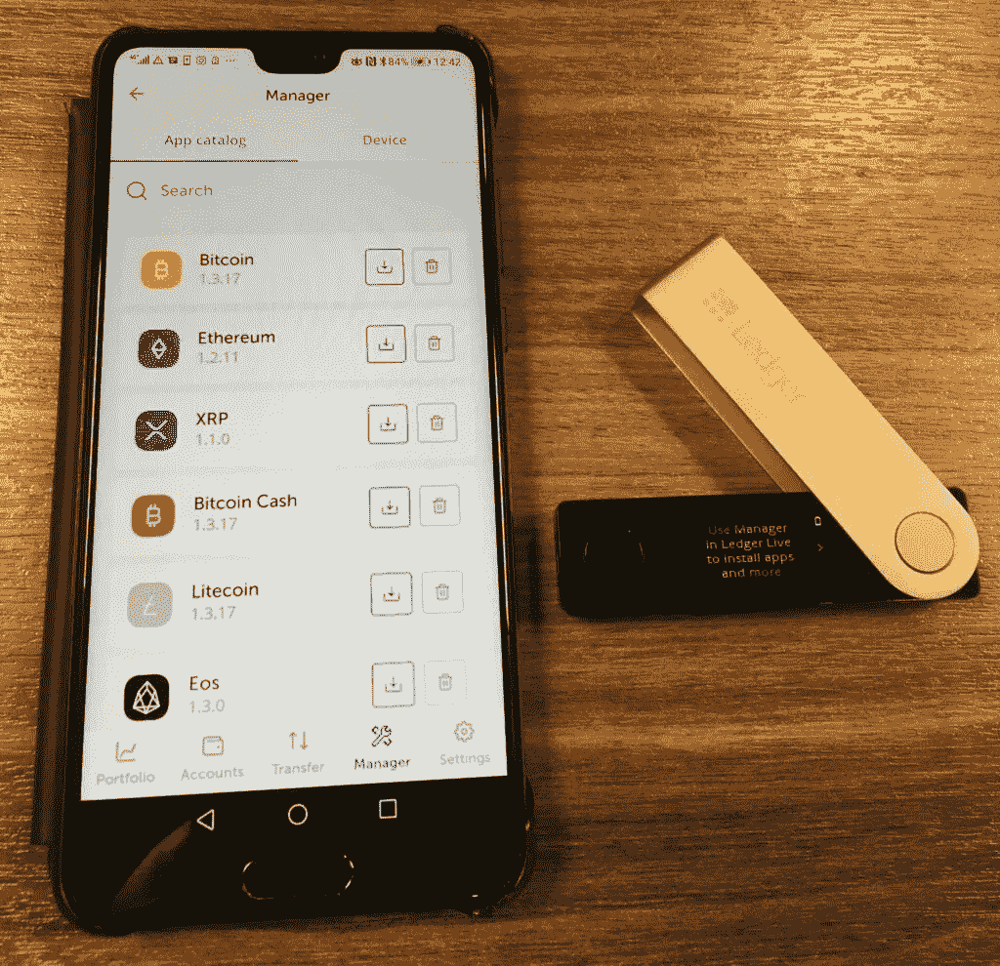

# Ledger Nano S vs X |电池、硬件、价格、存储

> 原文：<https://medium.com/coinmonks/ledger-nano-s-vs-x-battery-hardware-price-storage-59a6663fe3b0?source=collection_archive---------0----------------------->

[硬件钱包](/coinmonks/the-best-cryptocurrency-hardware-wallets-of-2020-e28b1c124069)是存储加密货币的物理设备。它们在离线模式下包含私钥，既不能连接到互联网，也不能运行复杂的应用程序。因此被认为是不受攻击的。

在比较各种质量上乘的硬件钱包时，[莱杰](https://blog.coincodecap.com/go/5491-2)当然占了上风。它是全球最大的[五金钱包制造商](/coinmonks/the-best-cryptocurrency-hardware-wallets-of-2020-e28b1c124069)之一。莱杰成立于 2014 年。该公司已经销售了 200 多万台设备，现在是用户资金安全的首选。

莱杰提供的有两款，分别是[莱杰 Nano S](https://shop.ledger.com/products/ledger-nano-s?r=da6d9b98e517) 和[莱杰 Nano X](https://blog.coincodecap.com/go/5491-2) 。在本文中，我们将比较 Ledger Nano S 与 Ledger Nano X。

# 莱杰纳米 vs X:在盒子里

## 莱杰纳米 S

莱杰 Nano S 于 2016 年 6 月发布。当您选择 ledger Nano S 时，它会附带-

*   微型 USB 电缆
*   将设备挂在脖子上的挂绳
*   钥匙链
*   一个钥匙圈
*   写下你的种子短语的恢复页。

## 莱杰纳米 X

莱杰 Nano X 于 2019 年发布。当你订购 Ledger Nano X 时，它会附带-

*   Ledger Nano X 硬件钱包
*   USB -C 电缆
*   入门手册。
*   三张恢复表
*   钥匙扣带。

它为用户提供 14 天的免费退货政策。

# Ledger Nano S 与 Ledger Nano X:摘要

Ledger Nano S vs X: Summary

# 物理性质

Ledger Nano S v/s Ledger Nano X: Physical Appearance

根据屏幕大小，您将能够查看正在发送的所有交易或您希望接收资金的地址。

屏幕尺寸越大越好。这也让用户更容易浏览应用程序。

您需要确保钱包中的交易地址和支持互联网的设备上的交易地址相匹配。然后按下两个按钮在钱包上签名以授权交易。

[Ledger Nano S](https://shop.ledger.com/products/ledger-nano-s?r=da6d9b98e517) 的屏幕对比度为黑色背景上的蓝色，而 [Nano X](https://blog.coincodecap.com/go/5491-2) 的屏幕对比度为黑色背景上的白色。

它们都有相似的设计。使用的材料是拉丝不锈钢和塑料。它使分类账钱包更加耐用和便于携带，同时给它一个时尚的外观。

Ledger Nano S 在设备顶部有两个按钮用于导航，而 ledger Nano X 在屏幕两侧有两个前置按钮。它更容易使用，因为它类似于使用智能手机。如果您长按这两个按钮，您可以直接返回到 Ledger Nano X 的主屏幕。对于 Nano S，您需要导航到设置，然后向下退出，然后双击返回到主屏幕。

Ledger wallet buttons

# 加密货币支持

总账钱包支持 1000+ [币](https://www.ledger.com/supported-crypto-assets/)。它支持以太坊网络上的所有 ERC20 令牌。比较流行的有[比特币](https://blog.coincodecap.com/a-candid-explanation-of-bitcoin)，以太坊，Ripple，Polkadot，EOS，莱特币等等。

Ledger wallet cryptocurrency support

# 莱杰纳米与 X:与其他设备的兼容性

莱杰兼容电脑和智能手机**。**支持 Windows 8+，macOS 10.10+，Linux 不含 ARM 处理器。与此同时，Ledger 还兼容 Android 7+智能手机。

此外，Ledger Nano X 还兼容 iOS 9+智能手机。

# 支持的应用程序

拥有超过 1100 个兼容的应用程序， [Ledger Nano X](https://blog.coincodecap.com/go/5491-2) 拥有安装 3 到 20 个应用程序的存储空间，而 Nano X 最多可以安装 100 个应用程序。这也取决于应用程序的大小。Ledger Nano X 的存储空间更大。这是一个巨大的差异，也是人们更喜欢莱杰 Nano X 的原因之一。

如果你用的是 Ledger Nano S，想用更多的 app，可以设置好之后卸载。私钥在您的设备中仍然是安全的。无论何时你需要这些应用，你都可以重新安装它们。这将帮助您节省额外的存储容量。

# 与其他钱包的兼容性

Ledger Live 应用程序可以从您的桌面和移动设备管理 27 项资产和 ERC20 令牌。

[莱杰 Nano S](https://shop.ledger.com/products/ledger-nano-s?r=da6d9b98e517) 只支持 Android 设备，而莱杰 Nano X 可以同时支持 Android 和 iOS。

它们兼容 50 多个应用程序。

# 莱杰纳米与 X:硬件

账本钱包拥有非常与众不同的硬件架构，由非常安全的操作系统 BOLOS(区块链开放账本操作系统)和被称为[安全元素](https://www.ledger.com/academy/security/the-secure-element-whistanding-security-attacks)的专用芯片组成。

为了使用户能够利用安全元件的独特和卓越的安全能力以及能够管理各种外围设备，安全元件配备了 STM32 微控制器(MCU ),该微控制器充当外围设备和安全元件之间的路由器，并在将要接收新数据时向其发送通知。

您可能还会对以下内容感兴趣:

*   [莱杰 vs 特雷佐](/coinmonks/ledger-vs-trezor-best-hardware-wallet-to-secure-cryptocurrency-22c7a3fd391e)
*   [5 款最佳加密货币硬件钱包](/coinmonks/the-best-cryptocurrency-hardware-wallets-of-2020-e28b1c124069)

# 连通性

[硬件钱包](/coinmonks/the-best-cryptocurrency-hardware-wallets-of-2020-e28b1c124069)必须连接到支持互联网的设备才能完成交易。

只有某些与交易相关的数据可以通过钱包传递到支持互联网的设备，从而使其免受任何攻击。您可以连接到桌面和智能手机上的 Ledger Live 应用程序。

[莱杰 Nano S](https://shop.ledger.com/products/ledger-nano-s?r=da6d9b98e517) 通过 USB 线连接。它使用 USB 类型的 Micro-B。

Ledger Nano X 可以通过 USB 电缆连接，也可以通过蓝牙连接。它使用 USB Type-C。通过使用 Ledger Live 移动应用程序，它可以通过蓝牙连接到智能手机和平板电脑。 [Ledger Nano X](https://blog.coincodecap.com/go/5491-2) 确保即使蓝牙被攻破，攻击者也无法获得用户的私钥。

Ledger connectivity

# 电池

[莱杰 Nano S](https://shop.ledger.com/products/ledger-nano-s?r=da6d9b98e517) 不需要电池。

[莱杰 Nano X](https://blog.coincodecap.com/go/5491-2) 电池 100 mAh。它可以通过连接 USB 电缆到 PC 或笔记本电脑来充电。当设备连续使用时，它提供 8 小时的电池寿命。另一方面，如果保持空闲，电池寿命可延长至 3 个月。

由于 Ledger Nano X 也可以在没有电缆的情况下使用，因此应该考虑电池寿命。

# 安全性

当您第一次启动设备时，它会帮助您设置 pin 码。您可以通过在两个按钮之间切换来选择 pin。然后你可以同时按下这两个按钮来确认。通过使用此功能，只有知道 pin 的人才能访问该设备。

然后，在设备初始化期间，您将收到一个 24 个单词的种子短语。无论何时您的设备丢失或被盗，您都可以使用此功能找回所有资金。种子短语仅在硬件钱包屏幕中可见。因此，种子短语必须离线存储在安全的地方。

Ledger Recovery Phrase

Ledger Nano S 和 Nano X 都具有 CC EAL5+认证级别。

Ledger Nano S 使用安全元件芯片 ST31H320(安全)+ STM32F042，而 Nano X 使用 ST33J2M0(安全)+ STM32WB55。

Ledger 使用可信的计算基础，并通过加密证据进行验证。用户可以通过执行证明检查来验证设备的完整性。他们还防止[邪恶女仆攻击](https://en.wikipedia.org/wiki/Evil_maid_attack)。

# 莱杰纳米与 X:价格

Ledger Nano S v/s X: Cost

这些价格不包括增值税。

根据上述信息和比较，现在很明显，如果你正在寻找一个高预算的安全硬件设备，那么莱杰纳米 X 抢镜。但另一方面，如果你愿意选择一个预算友好的，那么莱杰纳米 S 可以做必要的。

## 另外，阅读

*   [n 零审核](/coinmonks/ngrave-zero-review-c465cf8307fc)
*   [莱杰 vs 特雷佐](/coinmonks/ledger-vs-trezor-best-hardware-wallet-to-secure-cryptocurrency-22c7a3fd391e)
*   最好的比特币[硬件钱包](/coinmonks/the-best-cryptocurrency-hardware-wallets-of-2020-e28b1c124069?source=friends_link&sk=324dd9ff8556ab578d71e7ad7658ad7c)
*   最好的[密码交易机器人](/coinmonks/crypto-trading-bot-c2ffce8acb2a)
*   [密码本交易平台](/coinmonks/top-10-crypto-copy-trading-platforms-for-beginners-d0c37c7d698c)
*   最好的[加密税务软件](/coinmonks/best-crypto-tax-tool-for-my-money-72d4b430816b)
*   [最佳加密交易平台](/coinmonks/the-best-crypto-trading-platforms-in-2020-the-definitive-guide-updated-c72f8b874555)
*   最佳[加密借贷平台](/coinmonks/top-5-crypto-lending-platforms-in-2020-that-you-need-to-know-a1b675cec3fa)
*   [最佳区块链分析工具](https://bitquery.io/blog/best-blockchain-analysis-tools-and-software)
*   加密套利指南:新手如何赚钱
*   最佳[加密制图工具](/coinmonks/what-are-the-best-charting-platforms-for-cryptocurrency-trading-85aade584d80)
*   了解比特币的[最佳书籍有哪些？](/coinmonks/what-are-the-best-books-to-learn-bitcoin-409aeb9aff4b)
*   [3 商业评论](/coinmonks/3commas-review-an-excellent-crypto-trading-bot-2020-1313a58bec92)
*   [AAX 交易所评论](/coinmonks/aax-exchange-review-2021-67c5ea09330c) |推荐代码、交易费用、利弊
*   [Deribit 审查](/coinmonks/deribit-review-options-fees-apis-and-testnet-2ca16c4bbdb2) |选项、费用、API 和 Testnet
*   [FTX 密码交易所评论](/coinmonks/ftx-crypto-exchange-review-53664ac1198f)
*   [n 零审核](/coinmonks/ngrave-zero-review-c465cf8307fc)
*   [Bybit 交换审查](/coinmonks/bybit-exchange-review-dbd570019b71)
*   [3Commas vs Cryptohopper](/coinmonks/cryptohopper-vs-3commas-vs-shrimpy-a2c16095b8fe)
*   最好的比特币[硬件钱包](/coinmonks/the-best-cryptocurrency-hardware-wallets-of-2020-e28b1c124069?source=friends_link&sk=324dd9ff8556ab578d71e7ad7658ad7c)
*   最佳 [monero 钱包](https://blog.coincodecap.com/best-monero-wallets)
*   [Bitsgap vs 3 commas vs quad ency](https://blog.coincodecap.com/bitsgap-3commas-quadency)
*   [莱杰纳米 S vs 特雷佐 one vs 特雷佐 T vs 莱杰纳米 X](https://blog.coincodecap.com/ledger-nano-s-vs-trezor-one-ledger-nano-x-trezor-t)
*   [block fi vs Celsius](/coinmonks/blockfi-vs-celsius-vs-hodlnaut-8a1cc8c26630)vs Hodlnaut
*   Bitsgap 评论——一个轻松赚钱的加密交易机器人
*   为专业人士设计的加密交易机器人
*   [PrimeXBT 审查](/coinmonks/primexbt-review-88e0815be858) |杠杆交易、费用和交易
*   [埃利帕尔泰坦评论](/coinmonks/ellipal-titan-review-85e9071dd029)
*   [SecuX Stone 评论](https://blog.coincodecap.com/secux-stone-hardware-wallet-review)
*   [BlockFi 评论](/coinmonks/blockfi-review-53096053c097) |从您的密码中赚取高达 8.6%的利息

*原载于 2020 年 10 月 26 日*[*【https://blog.coincodecap.com】*](https://blog.coincodecap.com/ledger-nano-s-vs-x)*。*