# Ledger vs Ngrave ZERO 2021 |哪个最好？

> 原文：<https://medium.com/coinmonks/ledger-vs-ngrave-zero-7e40f0c1d694?source=collection_archive---------1----------------------->

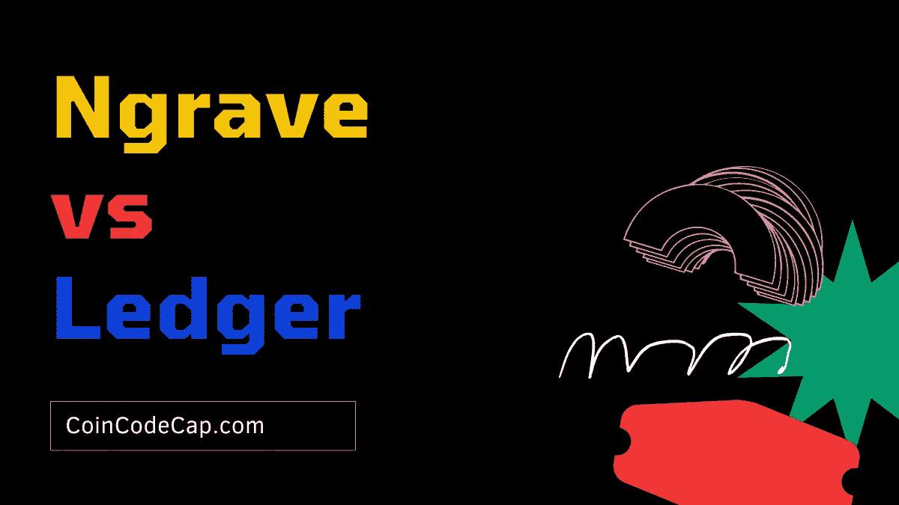

[硬件钱包](/coinmonks/the-best-cryptocurrency-hardware-wallets-of-2020-e28b1c124069)是存储加密货币的物理设备。它们在脱机模式下存储私钥。他们既不能连接互联网，也不能运行复杂的应用程序。因此，它们被认为不会受到攻击。

[莱杰](https://blog.coincodecap.com/go/5491-2)成立于 2014 年，是全球最大的硬件钱包制造商之一。他们已经卖出了 200 多万台设备。

[Ngrave](https://blog.coincodecap.com/go/ngrave) 是一家数字资产安全公司，专注于消除加密货币的丢失和恶意黑客攻击。主要目标是为每个人提供一个安全可靠的钱包。他们认为这是我们对他们；黑客，被黑了，丢了你的钥匙。它为用户提供了各种解决“私钥悖论”的方法。他们提供了一个产品套件，由 Ngrave ZERO wallet、Ngrave LIQUID app 和 GRAPHENE 组成。

[n rave](https://blog.coincodecap.com/go/ngrave)和 [Ledger](https://blog.coincodecap.com/go/5491-2) 都是知名的硬件钱包厂商。Ngrave 钱包相对来说比较新，但是有[校际微电子中心(IMEC)](https://www.imec-int.com/en) 和[计算机安全和工业加密(COSIC)](https://www.esat.kuleuven.be/cosic/) 的支持。Ngrave 在外观、安全性和连接性方面领先于 Ledger，但价格昂贵。因此，如果你正在寻找一个高预算的安全硬件钱包，Ngrave 抢尽了风头。另一方面，如果你想选择一个预算友好的，分类账钱包可以做到这一点。

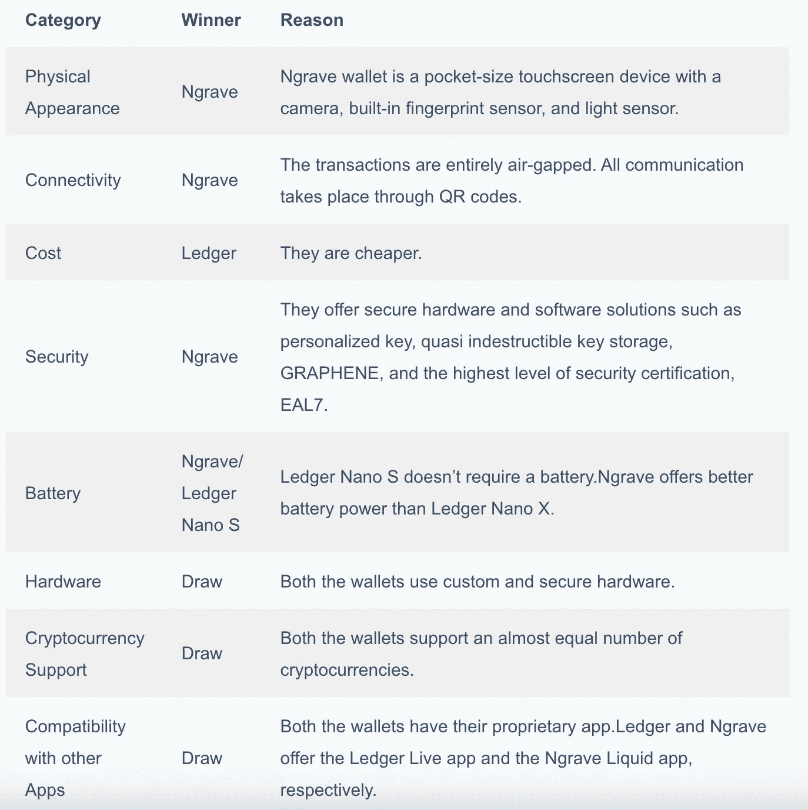

# 物理性质

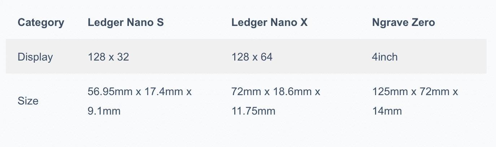

**按钮**:[n rave](https://blog.coincodecap.com/go/ngrave)钱包在设备侧面有一个按钮，用于打开/关闭设备。Ledger Nano S 在设备顶部提供了两个导航按钮，而 Ledger Nano X 在屏幕两侧各有两个前置按钮。它更容易使用，因为它类似于使用智能手机。如果您长按这两个按钮，您将直接返回到 Ledger Nano X 的主屏幕。您必须导航到 Nano S 的设置，然后退出以返回到主屏幕。

**屏幕尺寸:**[n rave](https://blog.coincodecap.com/go/ngrave)提供比 [Ledger](https://blog.coincodecap.com/go/5491-2) 更大的屏幕尺寸。您可以轻松查看发送的所有交易或您希望接收资金的地址。屏幕越大，用户浏览应用程序就越容易。您应该确保钱包中的交易地址与支持互联网的设备上的交易地址相匹配。

[账本](https://blog.coincodecap.com/go/5491-2)采用拉丝不锈钢和塑料，使得账本钱包更加便携耐用。

Ngrave 防水防尘。为了防止篡改，它有一个内壳，外壳和 PCB。此外，它还有一个 640 x 480 的内置摄像头，一个 12 x 12 毫米的指纹传感器和一个内置的光线传感器。

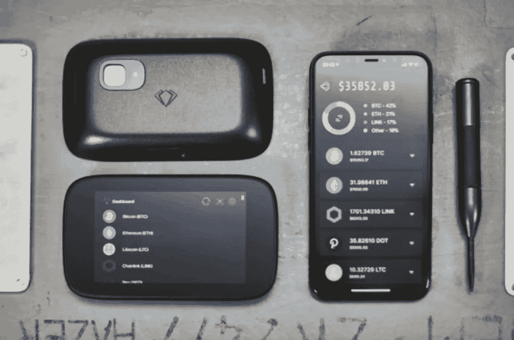

Physical Appearance: Ngrave

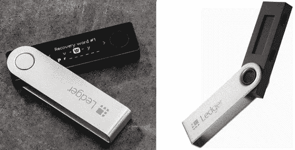

Physical Appearance: Ledger

# 分类帐与 n 平均:连接性

由于硬件钱包无法连接到互联网，因此需要连接到支持互联网的设备才能完成交易

n rave 是一个完全“气隙”的独立设备它不需要任何连接，如蓝牙、USB、NFC 或 Wi-Fi，将数字攻击面降至最低。

Ngrave 提供了一个 USB-C 端口，用于墙壁充电。所有固件更新都通过 USB 安全传输。所有更新都在与操作系统其余部分完全隔离的隔离分区中进行验证。更新发生在不负责安全性的操作系统部分。Ngrave 不涉及重写整个固件。它们只添加和删除某些特定的功能。所有的更新都将被签名，其中一些也将是开源的。更新前必须重新启动设备。

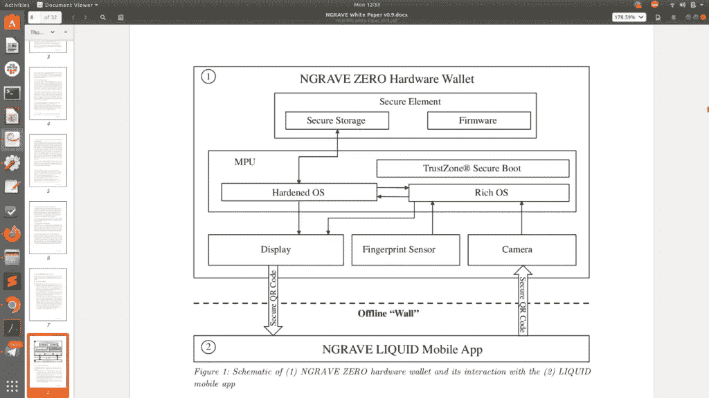

The connection between ZERO(offline) and LIQUID(online)

NGRAVE LIQUID 应用程序连接到区块链，后者使用二维码与硬件钱包进行通信。私人钥匙从不离开钱包。

Ledger Live 应用程序可以连接到智能手机和台式机。

Ledger Nano S 使用 USB 型 Micro-B 进行连接。

Ledger Nano X 可以使用蓝牙和 USB 电缆连接。它使用 USB Type-C。它们确保即使蓝牙遭到破坏，攻击者也不会得到用户的私钥。

# n 储蓄与分类帐:电池

[n rave](https://blog.coincodecap.com/go/ngrave)消耗 1200 mAH(超高效低功耗)电池。它使用 USB 兼容的电池充电器。

莱杰 Nano S 不需要电池。

Ledger Nano X 使用 100 mAh 的电池，可以通过将 USB 电缆连接到笔记本电脑或 PC 来充电。如果设备连续使用，它提供 8 小时的电池寿命，但如果保持闲置，它可以延长到三个月。

# n 储蓄与分类帐:硬件

[Ngrave](https://blog.coincodecap.com/go/ngrave) 提供一种多层防回火硬件设备，采用高端材料。金属外壳在进行暴力攻击时减少了私钥的范围，并保护了可能被攻击者窃取的无线电频率。它使用定制固件，已经过安全专家验证。他们计划开源固件以供社区审查。

[账本](https://blog.coincodecap.com/go/5491-2)使用一种真正独特的硬件架构，称为 [BOLOS(区块链开放账本操作系统)](https://www.ledger.com/introducing-bolos-blockchain-open-ledger-operating-system)和专门的芯片，称为[安全元件](https://www.ledger.com/academy/security/the-secure-element-whistanding-security-attacks)。安全元件有一个 STM32 微控制器(MCU)，用作外设和安全元件之间的路由器。每当要接收新数据时，它都会发送一个通知。

您可能会对以下内容感兴趣:

*   [n rave ZERO review |保护您的比特币的最佳硬件钱包](https://blog.coincodecap.com/ngrave-zero-review)
*   [Ledger Nano S vs X 2020 |电池、硬件、价格、存储](https://blog.coincodecap.com/ledger-nano-s-vs-x)
*   [莱杰纳米 S vs 特雷佐 one vs 特雷佐 T vs 莱杰纳米 X](https://blog.coincodecap.com/ledger-nano-s-vs-trezor-one-ledger-nano-x-trezor-t)

# n 储蓄与分类帐:安全性

## 证书

n rave 通过了 EAL7、CE 和 ROHS 认证。EAL7 是世界上最高的安全保证和认证。采用 STM32MP157C (2019) MCU/MPU。

[台账](https://blog.coincodecap.com/go/5491-2)认证等级 CC EAL5+。莱杰 Nano S 采用安全元件芯片 ST31H320(安全)+ STM32F042，而 Nano X 采用 ST33J2M0(安全)+ STM32WB55。

## 供应链攻击

[Ngrave](https://blog.coincodecap.com/go/ngrave) 提供加密证明，通过扫描二维码来确保您的设备没有被物理篡改。

[Ledger](https://www.ledger.com/) 使用贴纸来确保钱包出厂后没有人动过它。他们还使用可信的计算基础，该计算基础通过加密证据进行验证。您可以通过执行证明检查来验证设备的完整性。T

## 恢复种子短语的存储

[分类帐](https://blog.coincodecap.com/go/5491-2)允许您通过在两个按钮之间切换来设置 pin 码。为了确认，你必须同时按下两个按钮。现在，你的设备有密码保护。

初始化您的设备时，您将收到一个 24 个单词的种子短语。无论何时您的设备丢失或被盗，您都可以使用此功能恢复您的所有资金。种子短语必须离线存储在安全的地方。

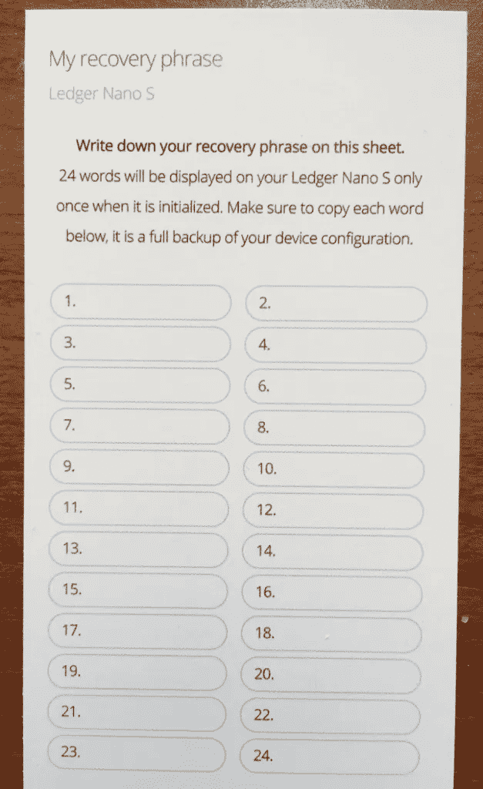

[Ngrave](https://blog.coincodecap.com/go/ngrave) 提供了两种保护你钱包的方法。主要的方法是选择 12、18 或 24 个单词的恢复种子短语。第二种方法是创建一个定制的密钥，也称为“NGRAVE Perfect 密钥”。该密钥是 256 位主种子的 64 字符十六进制等价物。该过程包括以下步骤-

1.  选择一个四位数的 pin 码。
2.  Ngrave 使用生物识别数据来保护您的私钥。
3.  相机从内置的光传感器获取光线。要增强随机性和关键光子的强度，请测量环境光。内部芯片处理所有这些信息，形成一个实时变化的密钥。你将与密钥互动，使它甚至不可能被 Ngrave 知道。从而消除了硬件钱包制造商或芯片制造商对密钥的任何可能的后门。

您可以选择“解冻”和“冻结”来停止和开始实时更换密钥。此外，您还可以高亮显示、选择和随机播放按键的特定部分，使体验变得直观和快速。

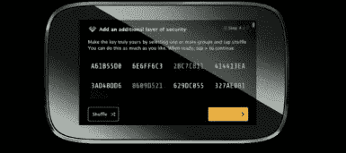

Ngrave Perfect Key

[n rave](https://blog.coincodecap.com/go/ngrave)提供了一种高质量的不锈钢解决方案，称为 n rave 石墨烯，用于备份。这是一个非常耐用的密码难题，能够承受房屋火灾(1660 C / 3020 F)，冲击，水，腐蚀，或任何极端情况。这是一个加密的非电子解决方案。它由两个盘子组成，建议你把它们放在不同的地方。只要两个盘子在一起，你就能找到钥匙。

需要使用自动压花笔在石墨烯上为每个字符打一个孔。第一个标牌上的字符对每个顾客都有不同的排列。第一板上有 1024 个孔，有 1078 种可能的配置。这个键被分成两块板，消除了单点故障。只有两个盘子在一起，你才能知道钥匙。

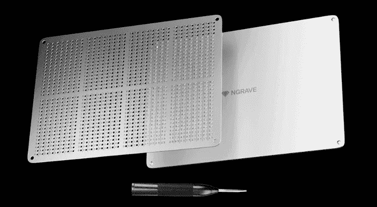

Ngrave GRAPHENE

如果你失去了上盘。你有以下选择-

1.  Ngrave 会在交付给客户的每个包裹上附加一个订单号。通过使用订单号，可以了解上板配置。
2.  客户支持部门会保存所有订单的离线记录，并在使用 KYC 数据识别您的身份后共享有关配置的信息。

Ngrave 团队只会在您需要时存储订单详细信息。如果不选择此选项，您将永远无法恢复上板配置。你千万不要把这些盘子拍下来，或者存到网上。

这些板块具有死后的连续性。地点可以由传统的公证人、遗嘱或区块链公证人来规定。如果您在指定时间内未在应用程序上活动，将会发送通知。如果您不回复这些通知，它可能会触发额外的智能合约逻辑，给出车牌的位置，但对此有一些附加条件。

它在 ARM TrustZone 模块中使用完整性验证器。如果钱包检测到有人试图访问硬件，它会擦除所有信息。

# Ngrave vs Ledger:加密货币支持

[总账](https://blog.coincodecap.com/go/5491-2)支持 1000+ [币](https://www.ledger.com/supported-crypto-assets/)。它们支持以太坊网络上的所有 ERC20 令牌。比较流行的有[比特币](https://blog.coincodecap.com/a-candid-explanation-of-bitcoin)，以太坊，Ripple，Polkadot，EOS，莱特币。

[n rave](https://blog.coincodecap.com/go/ngrave)支持 1000+ ERC20 代币。流行的有比特币、以太坊、EOS、莱特币和 Neo。

# n 储蓄与分类帐:与其他应用程序的兼容性

n rave 提供了自己的名为 NGRAVE LIQUID 的应用。可以扫描钱包里的二维码下载 Ngrave 手机钱包。您可以进一步扫描后续的二维码，将设备上的所有帐户同步到您的应用程序。

液体和 Ngrave ZERO 之间的所有通信都将通过 QR 码进行。钱包与液体连通，然后液体与区块链连通。它无法访问您的私钥，也无法获取所有交易的实时数据。它为我们提供了强大的移动应用体验。

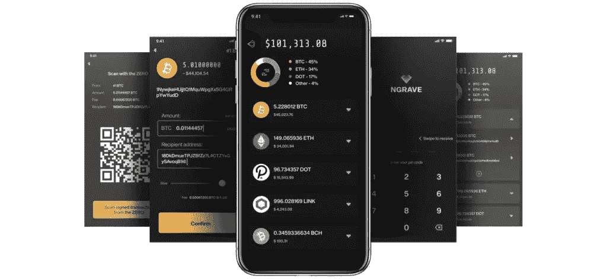

Ngrave LIQUID

Ledger Live 应用程序可以从您的桌面和移动设备管理 27 项资产和 ERC20 令牌。

Ledger Nano S 支持 Android 设备，而 Ledger Nano X 可以同时支持 Android 和 iOS。它们兼容 1100 个应用。，Ledger Nano X 的存储空间可以安装 3 到 20 个应用程序，而 Nano X 最多可以安装 100 个应用程序。

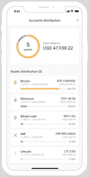

Ledger Live App

# n 平均与分类帐:价格

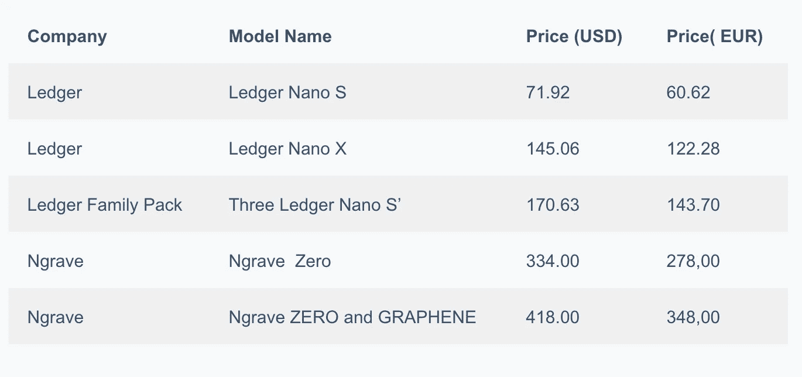

您可以[预订](https://blog.coincodecap.com/go/ngrave)n 保留钱包，预计发货时间为 2021 年 1 月。

# 分类帐与 n 平均:结论

综上所述， [Ngrave](https://blog.coincodecap.com/go/ngrave) 和 [Ledger](https://blog.coincodecap.com/go/5491-2) 都是知名的硬件钱包厂商。Ngrave 钱包相对较新，但有[校际微电子中心(IMEC)](https://www.imec-int.com/en) 和[计算机安全和工业加密(COSIC)](https://www.esat.kuleuven.be/cosic/) 的支持。Ngrave 在外观、安全性和连接性方面领先于 Ledger，但价格昂贵。因此，如果你正在寻找一个高预算的安全硬件钱包，Ngrave 抢尽了风头。另一方面，如果你想选择一个预算友好的，分类账钱包可以做到这一点。

> 加入 coin monks[Telegram group](https://t.me/joinchat/EPmjKpNYwRMsBI4p)学习加密交易和投资

## 另外，阅读

*   [学习以太坊和 Web3 开发](http://blog.coincodecap.com/go/learn)
*   最好的[密码交易机器人](/coinmonks/crypto-trading-bot-c2ffce8acb2a)
*   [3 商业评论](/coinmonks/3commas-review-an-excellent-crypto-trading-bot-2020-1313a58bec92) | [Pionex 评论](/coinmonks/pionex-review-exchange-with-crypto-trading-bot-1e459d0191ea) | [Coinrule 评论](https://blog.coincodecap.com/coinrule-review-a-perfect-trading-bot)
*   [AAX 交易所评论](/coinmonks/aax-exchange-review-2021-67c5ea09330c) | [德里比特评论](/coinmonks/deribit-review-options-fees-apis-and-testnet-2ca16c4bbdb2) | [FTX 密码交易所评论](/coinmonks/ftx-crypto-exchange-review-53664ac1198f)
*   [n 零审核](/coinmonks/ngrave-zero-review-c465cf8307fc)
*   [Bybit Exchange 审查](/coinmonks/bybit-exchange-review-dbd570019b71) | [Bityard 审查](https://blog.coincodecap.com/bityard-reivew)
*   [3Commas vs Cryptohopper](/coinmonks/3commas-vs-pionex-vs-cryptohopper-best-crypto-bot-6a98d2baa203)
*   最好的比特币[硬件钱包](/coinmonks/the-best-cryptocurrency-hardware-wallets-of-2020-e28b1c124069?source=friends_link&sk=324dd9ff8556ab578d71e7ad7658ad7c)
*   [加密复制交易平台](/coinmonks/top-10-crypto-copy-trading-platforms-for-beginners-d0c37c7d698c)
*   [莱杰 nano s vs x](https://blog.coincodecap.com/ledger-nano-s-vs-x)
*   [Vauld Review](https://blog.coincodecap.com/vauld-review)|[you hodler Review](/coinmonks/youhodler-4-easy-ways-to-make-money-98969b9689f2)
*   最好的[加密税务软件](/coinmonks/best-crypto-tax-tool-for-my-money-72d4b430816b) | [CoinTracking 评论](/coinmonks/cointracking-review-a-reliable-cryptocurrency-tax-software-5114e3eb5737)
*   最佳加密贷款平台
*   [莱杰纳米 S vs 特雷佐 one vs 特雷佐 T vs 莱杰纳米 X](https://blog.coincodecap.com/ledger-nano-s-vs-trezor-one-ledger-nano-x-trezor-t)
*   [block fi vs Celsius](/coinmonks/blockfi-vs-celsius-vs-hodlnaut-8a1cc8c26630)vs Hodlnaut
*   [Bitsgap 审查](/coinmonks/bitsgap-review-a-crypto-trading-bot-that-makes-easy-money-a5d88a336df2) | [Quadency 审查](/coinmonks/quadency-review-a-crypto-trading-automation-platform-3068eaa374e1)
*   [埃利帕尔泰坦评论](/coinmonks/ellipal-titan-review-85e9071dd029) | [赛克斯斯通评论](https://blog.coincodecap.com/secux-stone-hardware-wallet-review)
*   [BlockFi 评论](/coinmonks/blockfi-review-53096053c097) |在您的加密中赚取高达 8.6%的利息
*   [DEX Explorer](https://explorer.bitquery.io/ethereum/dex) 和[区块链 API](https://explorer.bitquery.io/graphql)
*   [加密套利](/coinmonks/crypto-arbitrage-guide-how-to-make-money-as-a-beginner-62bfe5c868f6)指南:新手如何赚钱
*   最佳[加密制图工具](/coinmonks/what-are-the-best-charting-platforms-for-cryptocurrency-trading-85aade584d80)
*   了解比特币的[最佳书籍有哪些？](/coinmonks/what-are-the-best-books-to-learn-bitcoin-409aeb9aff4b)

> [直接在您的收件箱中获得最佳软件交易](/coinmonks/newsletters/coinmonks)

*原载于 2020 年 12 月 23 日 https://blog.coincodecap.com**的* [*。*](https://blog.coincodecap.com/ngrave-vs-ledger)